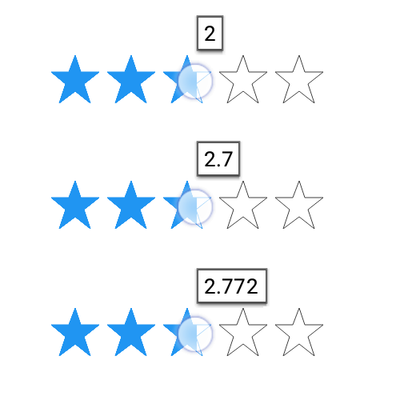
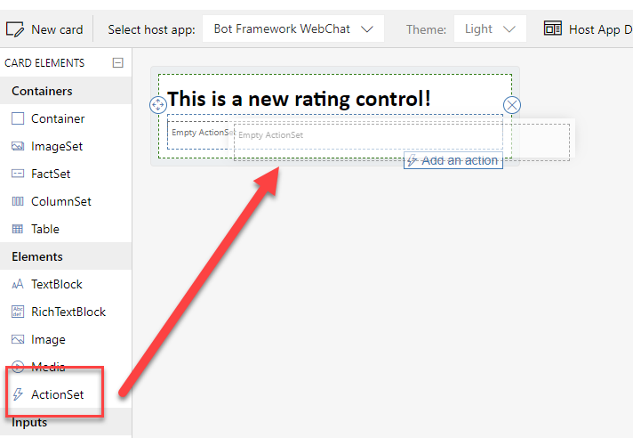
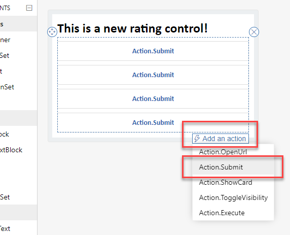
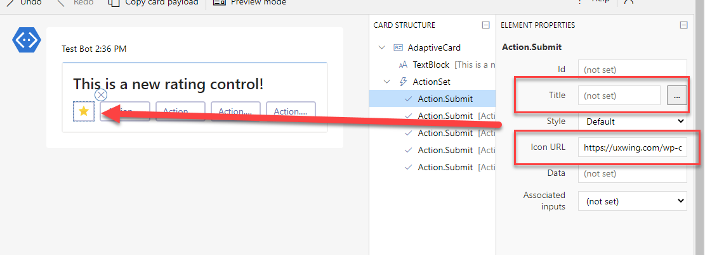
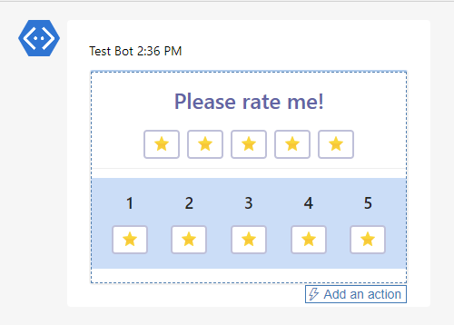
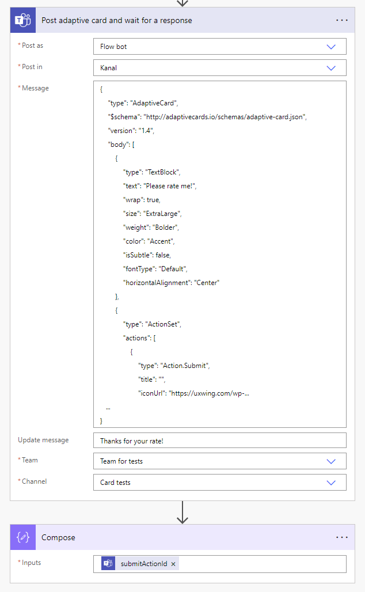
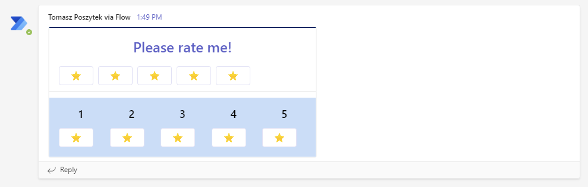
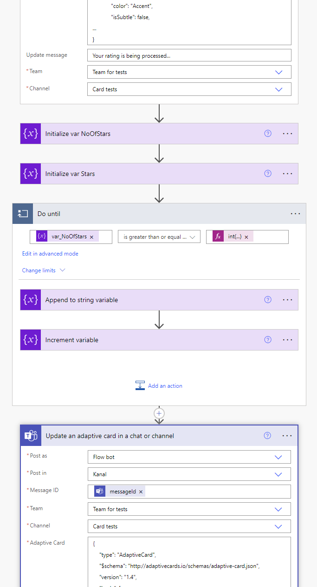
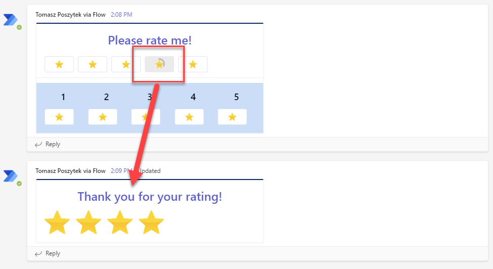

The rating control in Adaptive Cards was on a roadmap. Long time ago. However, no updates were published and still no such control is available oob. Despite that, it is still possible to build a star rating, maybe not the perfect one, but working one for sure.

Possibly the star rating control you are thinking of displays eg. 5 starts in a row and has filled stars from the left side until the one that is being hovered. And also, returns a precise value of the selected star. Like this one:

Well... This is not possible in Adaptive Cards ;) As a compensation I can propose you the solution I am using, that utilizes buttons. Follow after me, step by step, as always!

# Step 1 - design card

First design the card and drag&drop ActionSet element in the place, where you want to create star rating control:

Next add 5 Action.Submit actions:

After you did that, configure them the following way: remove the **Titles' values** and instead populate **Icon URL properties** with a link to your favorite star icon:

What is extremely important, because when you send the card to Microsoft Teams, what will be returned is the Id of the clicked element, therefore be sure to populate Id properties of each button. They must be unique!

You can later play a little with layout if you need, but basically the general idea is done! Rating control is in place:

# Step 2 - copy cards JSON and send to Teams

Next and basically the final step is to copy your authored card's JSON code and paste it inside the "Post adaptive card and wait for a response" action in a cloud flow, together with a logic to handle the selected star and its value:

After you run the flow, you'll be able to find your card in the selected Channel or conversation:

After you press any star, you'll notice, that the action in cloud flow is resumed and the Id of the pressed button is returned.

# Step 3 - enhance user experience

You can later use the "Update an adaptive card in a chat or channel" action to replace the existing card with your fancy confirmation:

So that user will see the selected rate by their own:

And that's it! I hope you like it and find it useful.