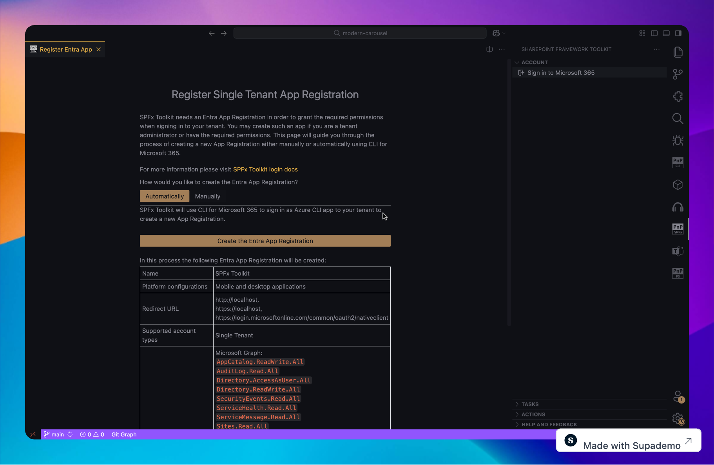
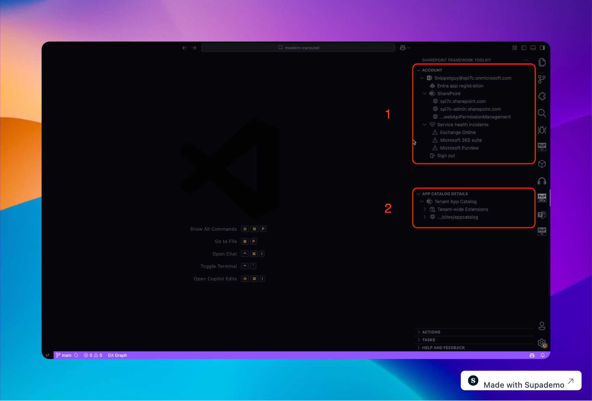
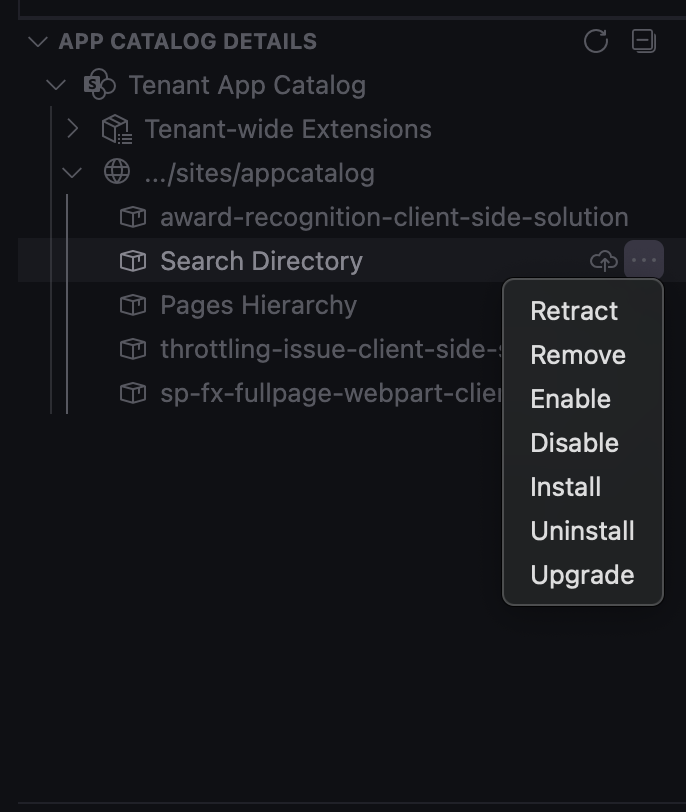
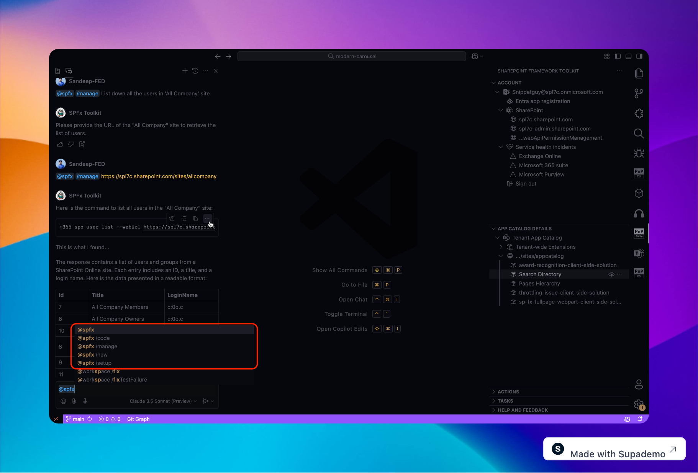
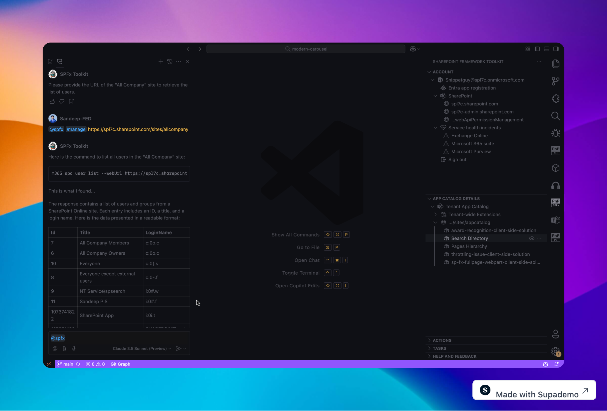

## Intro

The SharePoint Framework (SPFx) Toolkit for Visual Studio Code (VSCode) has become an essential extension, equipping developers with a powerful suite of tools to enhance productivity, simplify workflows, and streamline development.

This blog explores the SPFx Toolkit's robust capabilities, including:

- its login experience 🔑,
- environment management 🌍,
- app catalog functionalities 📂,
- AI-powered GitHub Copilot Chat Participant 🤖. Whether you're an experienced developer or just starting with SharePoint, this toolkit has everything you need to optimize your workflow.

> Note: This blog is based on the SPFx Toolkit version 4.4.0

## 🎯 Why Choose the SharePoint Framework VSCode Toolkit?

The SPFx Toolkit provides a host of advantages, making SharePoint development smoother and more efficient:

✅ Seamless Integration – Work within the familiar VSCode environment, reducing unnecessary context switching.

⚡ Automated Processes – Save valuable time with tools that automate app registration, authentication, and environment setup.

🛠️ Enhanced Management – Directly access and manage SharePoint tenant environments and app catalogs within VSCode.

🤖 AI-Powered Assistance – Utilize GitHub Copilot Chat Participant for AI-driven guidance tailored to SPFx development.

**Let's dive deeper into these features.**

---

## 🔐 Simplified Login Experience

Efficient authentication is crucial for a smooth development process. The SPFx Toolkit simplifies Microsoft 365 tenant authentication with:

🔹 **Integrated Sign-In**

Authenticate directly within VSCode with a single click using the “Sign in to Microsoft 365” button or by executing the command:

```
SharePoint Framework Toolkit: Sign in to Microsoft 365
```

This eliminates the hassle of frequent sign-ins, ensuring a frictionless experience.

🔹 **App Registration Options**

The toolkit requires an Entra App Registration to authenticate your tenant, offering two setup options:



🚀 Automated Setup – Create a new app registration effortlessly through an intuitive guided form.

⚙️ Manual Setup – Follow a step-by-step guide to register an app manually (only required once per tenant).

By streamlining authentication, the SPFx Toolkit allows developers to focus on building solutions rather than dealing with sign-in hurdles.

---

## 🌍 Comprehensive Environment Management

Once you sign into M365 and scaffold your project, you gain access to powerful environment management features.



Managing a SharePoint Online environment can be complex, but the SPFx Toolkit simplifies it by providing quick access to essential links:

🔗 **Currently Available Quick Links:**

- Azure Portal app registration
- SharePoint main site
- SharePoint admin site
- SharePoint web API permission management page

🏢 **M365 Suite Services Monitored:**

Service health incidents (only visible if issues occur with M365 services)

- SharePoint Online

- Microsoft Intune

- OneDrive for Business

- Exchange Online
- Microsoft Purview
- Microsoft Viva
- Microsoft Defender for Cloud Apps

Stay informed about potential incidents affecting your development environment.

## 📂 App Catalog Management



The SPFx Toolkit provides direct management of SharePoint App Catalogs inside VSCode.

Developers can:

✅ View all apps in the SharePoint App Catalog
✅ Enable, disable, upgrade, or remove apps
✅ Manage permissions and deployments effortlessly

🚀 Available Actions:

1. Deploy – Makes the solution available for installation in sites.

2) Retract – Reverses deployment, preventing installation in sites.

3) Remove – Deletes the app from the catalog.

4) Enable – Allows users to add the solution to SharePoint sites.

5) Disable – Hides the solution from users.

6) Install – Installs the solution from tenant/site collection app catalog to a site.

7) Uninstall – Removes the solution from a site.

8) Upgrade – Updates the solution to the latest version.

## 🤖 AI-Driven Development with GitHub Copilot Chat Participant

The SPFx Toolkit enhances AI-powered development using GitHub Copilot Chat Participant.



🔹 **Supported Commands:**

1. /setup – Provides guidance on setting up a SharePoint Framework development workspace.

2. /new – Helps create new solutions or locate PnP SPFx samples.

3. /code (beta) – Assists with coding, project validation, CI/CD workflow scaffolding, and project renaming.

4. /manage – The game-changer for managing SharePoint!

## ⚡ Introducing the /manage Command

This feature enhances efficiency by providing quick access to tenant data without manually running CLI commands.

The /manage command provides real-time insights with:

🔹 Natural Language Queries – Example: "List all users in 'All Company' site" 🔄 Structured Responses



🔹 Integrated CLI for Microsoft 365 – Executes real-time CLI commands for tenant data retrieval

📌 Learn more about the /manage command: [SPFx Toolkit GitHub Chat Participant](https://github.com/pnp/vscode-viva/wiki/8.-SPFx-Toolkit-GitHub-Chat-Participant#manage)

## 🎯 Summary

The SPFx Toolkit for VSCode is an indispensable extension for SharePoint developers, offering:

✅ Streamlined authentication 🔑

✅ Robust environment management tools 🌍

✅ Advanced app catalog functionalities 📂

✅ AI-powered responses grounded in SharePoint and your tenant 🤖

These features create a truly integrated and efficient development experience. With GitHub Copilot Chat Participant and Microsoft 365 integration, the toolkit helps developers save time, reduce complexity, and enhance productivity.

If you haven’t explored the SPFx Toolkit, now is the perfect time to supercharge your SharePoint development workflow! 🚀

## Resources

- [SharePoint Framework Toolkit](https://marketplace.visualstudio.com/items?itemName=m365pnp.viva-connections-toolkit)
- [Join the Microsoft 365 Developer Program](https://developer.microsoft.com/en-us/microsoft-365/dev-program)
