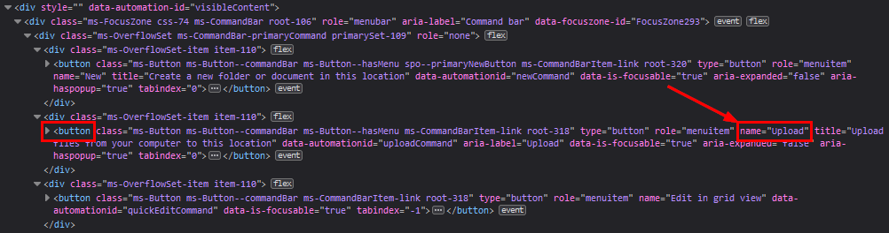
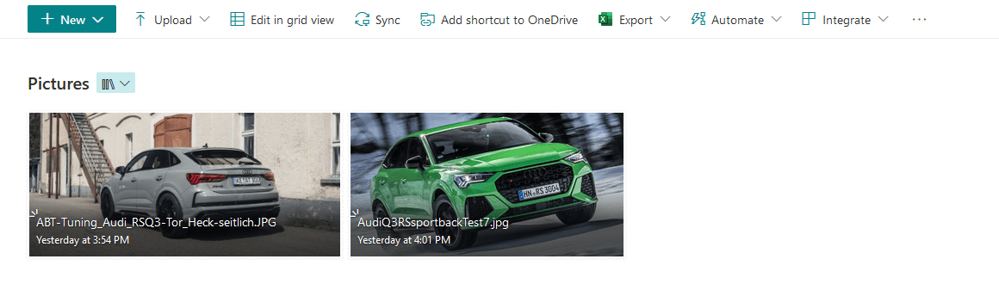
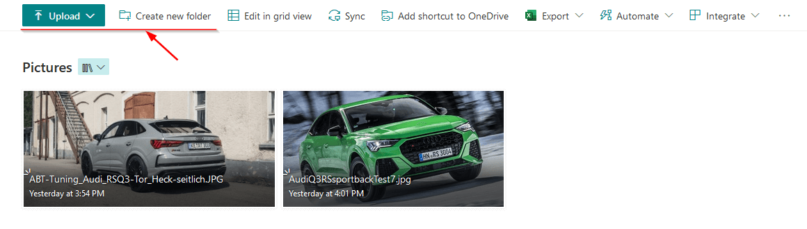
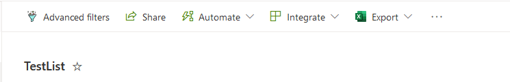

A little background story about this article. For a customer, I was working on a `ListView Command Set` extension. Then came the question of whether the action button could be the first button and if we could remove a whole bunch of buttons out of the command bar. This is where I then started brainstorming different approaches.

## The original approaches

### Using CSS

The way I usually apply this is to implement some CSS logic. Here you can already start applying a lot of logic within the command bar but you also run into a whole bunch of limitations. Within SPFx, I personally use Sass. This makes it a bit easier to write CSS but that aside. 

```css 
:global {
  button[name='Upload'], 
  button[name='Share'] {
    display: none;
  }
}
```

If we look at the example above, you can see that I start with a global operator. After this, we check each button available and look at the name attribute to see if it is the same value as our variable. If this is the case we will simply remove this from our display.



This is easy to use for basic scenarios. To adjust some styling slightly or to hide the button. But you can hear it coming. There are a number of problems associated with this. Should Microsoft suddenly decide to remove all name attributes within buttons you may start updating your code again to accommodate this change. With this, it is not recommended that you go through CSS styling to override components that you don't own yourself.

Now if your site suddenly appears in a **different language** the names are no longer correct and the buttons are visible again. You can start catching all these variants but then you're going to have to apply a lot of extra logic.

These are a few scenarios where things can go wrong but in summary, CSS is easy to quickly add styling to a button but can't add much value for the rest.

### Using JavaScript or jQuery

This will give you more ability to start editing your DOM. With this, you will be able to apply more elaborate scenarios such as moving a button or making adjustments to the parent of the button. But this runs into the same problem as the CSS approach. Take a look at the code below. 

``` javascript 
let uploadbutton = document.getElementsByName("Upload")[0] || document.documentElement;  

uploadbutton.style.display = "none";  
```

As you'll see in this snippet, we're using the name attribute again. This, in turn, causes us to modify elements that are not anticipated to be modified. 

## View formatting magic

Now we get to the juicy content. `View formatting` magic. Through view formatting, we have recently been given the ability to start adjusting a whole bunch of variables in the command bar. I discovered this myself when I went to check out some of [Chris Kent's](https://github.com/thechriskent) new list formatting samples. Here he had created a sample in which the Automate button was removed when a list item was selected. 
 
With this new knowledge, I started testing the possibilities and a lot of new use cases became possible. For example, take a look at the following JSON.

``` json
{
  "commandBarProps": {
    "commands": [
      {
        "key": "upload",
        "primary": true
      },
      {
        "key": "newFolder",
        "text": "Create new folder",
        "iconName": "FabricNewFolder",
        "selectionModes": [
          "NoSelection"
        ],
        "position": 1
      },
      {
        "key": "new",
        "hide": true
      }
    ]
  }
}
```

Here you will notice a lot of new information but it's pretty straightforward. Within view formatting, we have now been given the ability to start customizing the `commandBarProps`. Here you start by selecting a key. This then refers to one of the action buttons you want to change the properties of. 

> To make a quick comparison with the other approaches we discussed. If your site suddenly changes to another language, this key will still relate to the correct button.

In the JSON segment above, we have done the following:

- Change the upload button styling to the primary style.
- Modified the name of the new folder button to `Create new folder`. We change the icon into `FabricNewFolder`. Then we make sure that this button is only available if no item is selected. Finally, we make sure that it is first in the row.
- Hide the new button.

By applying this JSON sample, we get the following result.

### Without the view formatting sample



### With the view formatting sample



## View formatting with a custom extension

This is where the power of view formatting comes full circle. With the position parameter we can now make sure that our custom extension will be placed at a certain spot within the command bar. This is where I do need to touch on this, it is not possible (or at least not directly that I know of) to use view formatting to start modifying your custom extension. What we can do is change the actions around the custom extension so that it can get more attention.

Now if we apply this in practice we get the following.

``` json
{
  "commandBarProps": {    
    "commands": [
      {
        "key": "share",
        "position": 1
      },
      {
        "key": "automate",
        "position": 2
      },
      {
        "key": "integrate",
        "position": 3
      },
      {
        "key": "export",
        "position": 4
      },
      {
        "key": "new",
        "hide": true
      },
      {
        "key": "editInGridView",
        "hide": true
      }
    ]
  }
}
```

Here we hide some elements and move a few. if we then apply this JSON sample we get following result. Note here that the custom extension I use is named `Advanced filters`.



## Some concluding words

For myself, this opens a lot of new doors with possibilities towards the formatting world. This is itself a useful technique to know exists. There are a whole bunch of scenarios where it can be useful to start redesigning the default command bar. Hopefully this information will help you too!

## Resources

Some useful additional resources:

- [Use view formatting to customize SharePoint](https://docs.microsoft.com/sharepoint/dev/declarative-customization/view-formatting)
- [Command bar customization syntax reference](https://docs.microsoft.com/sharepoint/dev/declarative-customization/view-commandbar-formatting)
