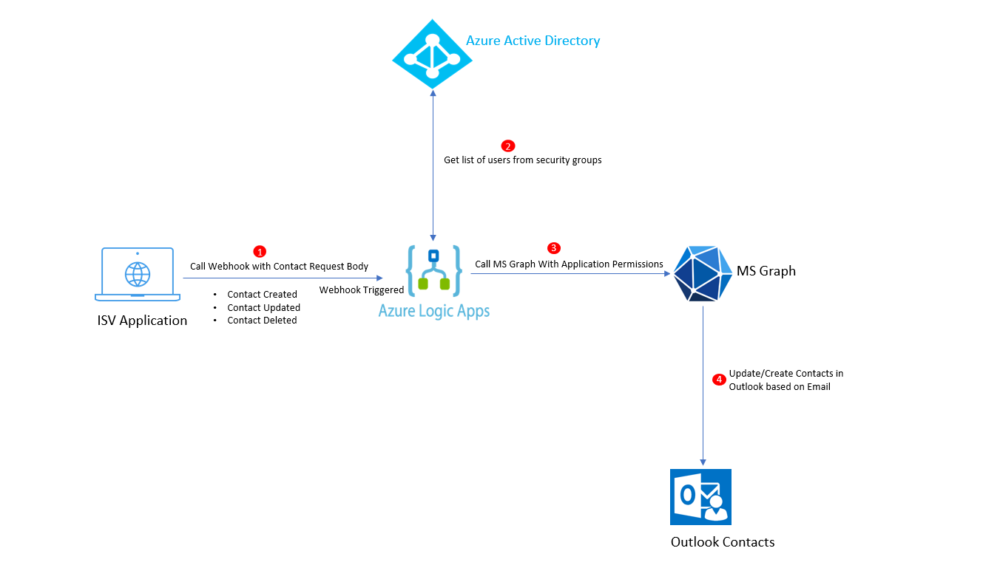
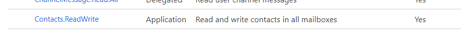
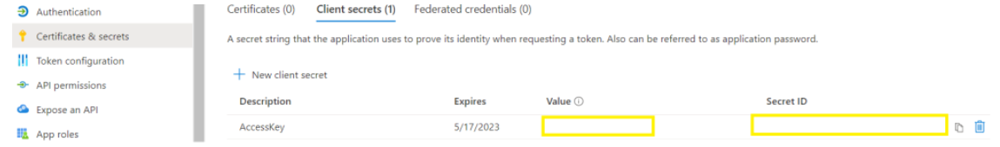
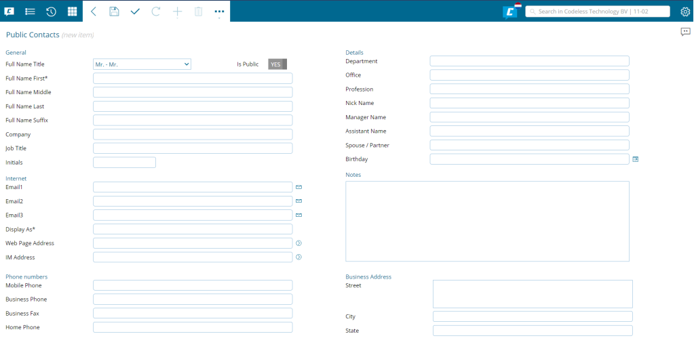
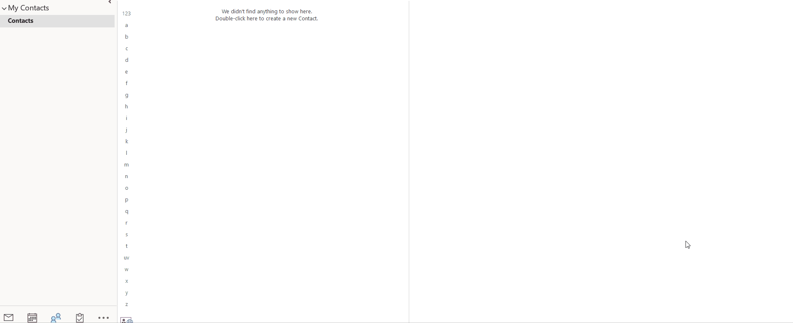

---
# this is the title
title: "Sync Contacts to Outlook using Logic App and Graph extended property"
# this is the publishing date of your article, usually this should match "now"
date: 2022-09-02T06:00:00-04:00
# This is your name
author: "Sohil Bhalla"
# This is your GitHub name
githubname: sohilbhalla
# Don't change
categories: ["Community post"]
# Link to the thumbnail image for the post
images:
- images/Contacts with Outlook.png
# don't change
tags: ["Outlook","Graph"]
# don't change
type: "regular"
---

## Business Case

Maintaining contacts of the people whether internal or external with whom you'd want to connect frequently in a single place is always a good idea. Outlook Contacts is the directory that helps maintain contacts with all their details and gives flexibility to search contacts and intellisense to pick the email addresses for drafting emails.

If you are an ISV, you can give the option to your users to sync contacts created in your application directly into Outlook for easy access. The advantage is that the users don't need to navigate away from your application and can create contacts in the application that get synced to outlook.

## List of Components

1. Azure AD
2. Azure Logic App
3. Microsoft Graph Single Value extended property
4. Webhook

## Architecture

## Azure AD App Setup

In order to call Microsoft Graph for Outlook, we need a valid bearer token, that is acquired with the scopes needed to create, update or delete contacts from user’s mailbox. In this demo, I am using a daemon application (Application permissions) to access user’s mailbox for contacts. The calls to the Graph API will happen from a background step using Azure Logic App.

Create a new Azure AD app and add the following scope. Make sure the scope added is granted Admin Consent.

Once the scopes are added, generate the secret for the app. We will use Azure AD Client ID and secret to generate the access token to call the Graph API for contacts. Copy the secret value and keep it for later use.

## Build a form in custom application

You can build a simple form in your custom application that captures the contact details to be synced in Outlook. This form can be built using any technology or framework and should have a capability of sending a POST request to a webhook, having body as the content of the form. In this case, I have a simple form setup as below.

## Azure Logic App

We will use webhook triggered Azure Logic App to call the graph APIs to access user’s mailbox for contacts. Based on the user’s action on external application (ISV application), the contact will be created, edited or deleted.

Create a webhook triggered logic app in azure portal and save it. Copy the HTTP post URL. The post URL will be used later to call the azure logic app from your custom application.

### Obtain bearer token

We now need to obtain the bearer token in order to make the call to Graph API for contacts. We will use the Azure AD app created earlier to generate the bearer token.

Add a HTTP step in the Azure Logic App to make a call to token endpoint and fetch bearer token as shown below.

**client_id** = Azure AD App client ID

**scope** = https://graph.microsoft.com/.default

**client_secret** = Azure AD app secret obtained earlier

Parse the output of the access token call and store the bearer token in a variable which will used later to make graph calls.

### Initialize the Request Body for Graph

As part of the webhook call from the application, we will receive the request body containing the data entered by the user while filling the form. The data received has to be mapped with the graph attributes for the contacts as shown below.

### Create Contact

Once we have the request body parsed, we are ready to call the Graph API and create the contact in the user’s mailbox.

I am using custom Outlook contact folders, so I’ll pass Outlook Contact Folder ID. You can also have the contacts created in the default folder.

My contact is now created in Outlook. Post this, I’d need to establish a connection between contact created in my custom application and contact created in Outlook to be able to update or delete the contact later. The answer to this is **Graph Extended Property**.

### Microsoft Graph Single Value extended property for Outlook

Extended properties allow storing custom data and specifically serve as a fallback mechanism for apps to access custom data for Outlook MAPI properties when these properties are not already exposed in the Microsoft Graph API metadata. You can use extended properties REST API to store or get such custom data.

I am using extended properties to store my custom application contact ID inside the contact resource created using Graph API in Outlook. This helps as I don’t have to maintain separate datastore to keep the mapping between my application contact ID and outlook contact ID.

These extended properties can then be used to filter the contacts in Outlook and perform update or delete.

Each of these types identifies the property by its id and stores data in value.

You can use id to get a specific resource instance together with that extended property, or filter on a single-value extended property to get all the instances that have that property.

More details on Outlook extended properties can be found [here](https://docs.microsoft.com/en-us/graph/api/resources/extended-properties-overview?view=graph-rest-1.0).

Lets update the newly created contact in outlook with my application contact id.

**EmailAddress** – Email for the user where contact is created

**Outlook Contact Folder ID** – ID of the folder, can keep it default as well

**ID** – ID of the contact, we can retrieve the ID from the previous step when contact is created, parse the response to get the ID

**ExtensionCodeXOutlookContactID** – This is the ID which identifies your extended property. The format for the ID should be as below . eg **String {66f5a359-4659-4830-9070-00040ec6ac6e} Name ApplicationContactID**

### Valid id formats for single-value extended properties

| Format      |  Example    | Description      |
| ----------- | ----------- | ----------- |
| “{type} {guid} Name {name}”      | "String {8ECCC264-6880-4EBE-992F-8888D2EEAA1D} Name TestProperty"       | Identifies a property by the namespace (the GUID) it belongs to, and a string name. |
| “{type} {guid} Id {id}”   | "Integer {8ECCC264-6880-4EBE-992F-8888D2EEAA1D} Id 0x8012"        | Identifies a property by the namespace (the GUID) it belongs to, and a numeric identifier. |
| “{type} {proptag}”   | "String 0x4001"        | Identifies a pre-defined property by its property tag. |

**value** – This holds the value of the extended property which in my case if the ID of the contact generated in my custom application.

### Update Contact

When the contact is updated in my custom application, the same webhook call is made to the Azure Logic App with the update action. The application contact ID is then passed with the updated data to the Logic App.

First step is to get the contact from Outlook that needs to be updated. For this, we will use the Graph extended property and filter the contact. My Outlook contact already holds my application contact id as a custom data.

Once we get the contact from the above step, we can parse the response and extract the contact ID from it. We can use the latter in the next step to update the contact with new data.

The same approach can be used to delete contact.

Let’s see how this works!

Currently my Outlook does not have any contact or any custom contact folder.

I will create a contact in my custom application under Demo Folder

Once the contact is saved in my application, Logic App is triggered, It will create a contact folder in Outlook and then create a contact inside this folder as shown below.

THANK YOU for giving a read to my blog.

Please let me know your feedback and comments. Please feel free to reach out to me if you need any clarification.

I can be reached at: https://www.linkedin.com/in/sohil-bhalla-46121434/