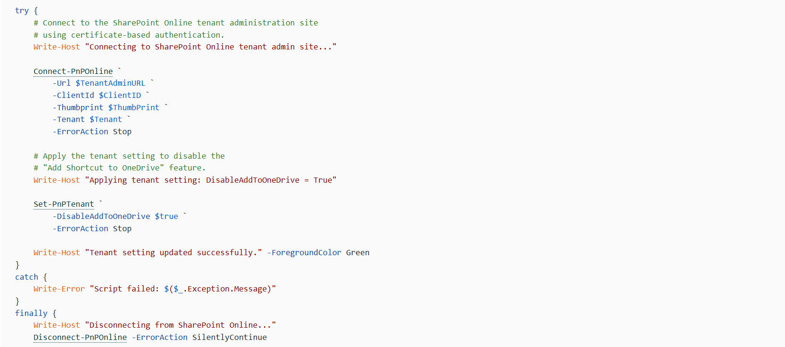

## Introduction

One of the recurring challenges with Microsoft 365 administration is that a feature can be useful for some users while creating governance or support problems for an organisation.

That was the case with SharePoint Online's Add Shortcut to OneDrive capability. Rather than allowing users to create shortcuts from SharePoint folders into OneDrive, I needed a reliable way to disable the feature across the tenant.

The result was a small PowerShell script that does one job: connects securely to SharePoint Online and applies the tenant-level setting to disable the feature.

## The Problem

"Add Shortcut to OneDrive" allows users to add a shortcut to a SharePoint folder within their OneDrive environment. While that can be convenient, there are circumstances where an organisation may not want users creating these shortcuts.

The important point was that this wasn't something I wanted to manage manually or on an individual site basis. The requirement was a tenant-level configuration change.

Using the Microsoft 365 interface also wasn't ideal for something that needed to be repeatable and potentially incorporated into an administrative process. There was also a requirement to authenticate without relying on an interactive administrator sign-in.

## How the Solution Came About

The first step was identifying the SharePoint Online tenant setting responsible for the feature. Once that was established, the solution became much simpler.

Rather than building something complicated, I kept the script focused. It connects to the SharePoint Online administration endpoint using PnP PowerShell, authenticates with an Azure AD app registration and certificate, and then applies the required tenant setting.

The important setting is:

> DisableAddToOneDrive = True

The script has since been structured with basic configuration, execution logging, error handling and clean disconnection so that it can be used consistently rather than treated as a one-off command.

## What the Script Does

The script provides a straightforward administrative workflow:

- Connects to the SharePoint Online tenant administration site.
- Uses certificate-based authentication through an Azure AD app registration.
- Records when the script started and who executed it.
- Disables "Add Shortcut to OneDrive" at tenant level.
- Reports success or failure.
- Disconnects from SharePoint Online when processing is complete.

## Technical Highlights

The authentication approach is deliberately non-interactive. The script uses an application registration, client ID, certificate thumbprint and tenant identifier when calling Connect-PnPOnline.

The configuration is kept at the top of the script, making the operational values easy to identify without having to search through the code.

The try/catch/finally structure is also useful here. A failed connection or tenant update produces an error, while the finally block attempts to disconnect from SharePoint Online regardless of the outcome.

## Business Impact

The main benefit is control and consistency. A tenant-wide SharePoint configuration change can be applied using a repeatable script rather than relying on manual administration.

It also provides a foundation for automation, particularly where certificate-based authentication is already being used for Microsoft 365 administration.

## Resources

- The full script is available on GitHub here: **[https://pnp.github.io/script-samples/disable-the-sharepoint-online-add-shortcut-to-onedrive-feature/README.html?tabs=pnpps](https://pnp.github.io/script-samples/disable-the-sharepoint-online-add-shortcut-to-onedrive-feature/README.html?tabs=pnpps)**

## Future Improvements

Possible enhancements include more detailed logging, configuration validation, structured output for automation platforms, and reporting the current tenant setting before making any change.

## Community Discussion

> How are you managing SharePoint Online tenant-level settings in your environments?
> Do you prefer small, focused PowerShell scripts like this, or have you incorporated these settings into a broader Microsoft 365 automation framework?
