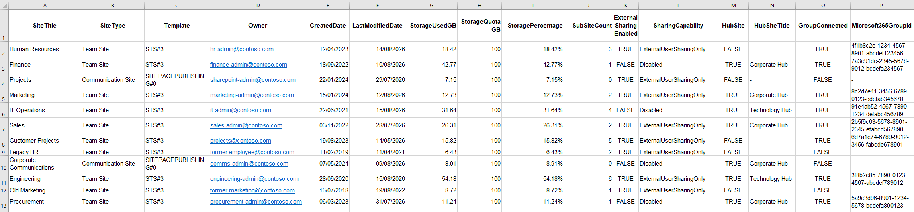
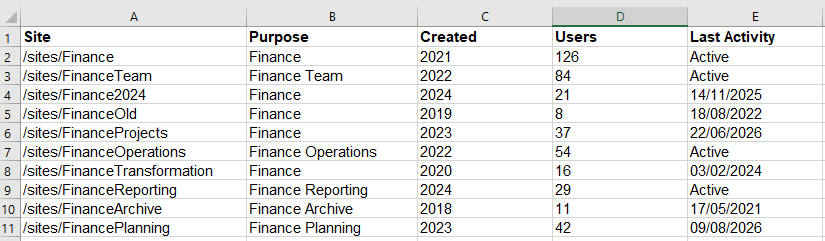
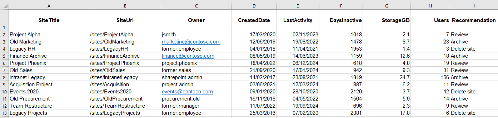
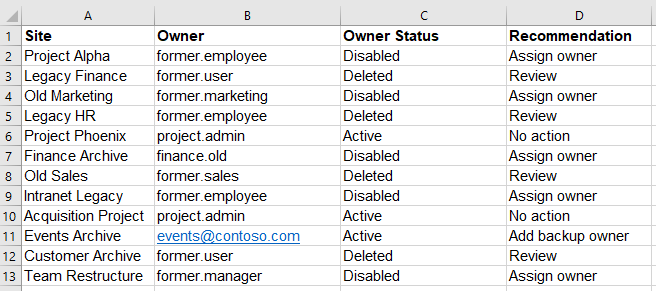
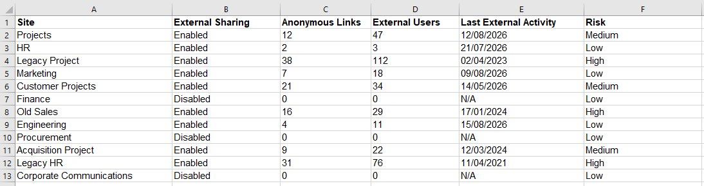

## Introduction

The more I work with SharePoint, the more I see site creation as a governance question rather than simply a productivity feature. Giving people the ability to create sites is easy, and often useful. The interesting part comes later, when nobody is quite sure which sites matter, who owns them, what they contain, or whether they should still exist.

## The Problem

Site sprawl is not simply having lots of sites. The bigger problem is uncertainty. Which site is the correct one? Who is responsible for it? Is the information still relevant? Who has access? Are there duplicate spaces serving the same purpose?

A simple site inventory can quickly expose the scale of the problem:

You may also discover several sites apparently serving the same purpose:

Once those questions become difficult to answer, administration becomes harder and governance becomes increasingly reactive.

## How We Got Here

The problem usually starts with a reasonable decision: give users self-service access so they do not need to raise a ticket for every collaboration requirement. That makes sense. IT becomes a bottleneck if every new site requires manual intervention.

The trade-off is that creation becomes easy while retirement remains difficult. A stale-site report might reveal sites that have not seen meaningful activity for years:

Microsoft also makes this broader than SharePoint alone. Teams and Microsoft 365 Groups are closely connected to SharePoint, so simply restricting one creation route does not necessarily address every route through which new sites can appear.

## What I've Learned

One thing I have learned is that site creation and site governance should be considered together. If an organisation allows self-service, it needs to think about what happens immediately afterwards.

Ownership is one obvious example. A report can identify sites where the owner has left or their account is no longer active:

Naming, purpose, sensitivity, membership, permissions, and lifecycle expectations are also worth considering before the environment becomes difficult to manage.

I also think it is important to avoid treating every site as a problem. A large number of sites does not automatically mean poor governance. The real question is whether the organisation understands what it has and can make sensible decisions about it.

## Approaches to Consider

There is no single answer. Some organisations may choose to keep self-service creation open, but introduce clearer guidance, ownership expectations, lifecycle reviews, and reporting. Others may decide that certain types of creation require approval.

The important point is understanding the trade-off. Restricting creation can reduce uncontrolled growth, but it can also encourage users to find alternative ways of working. Excessive control may simply move collaboration elsewhere.

Microsoft now provides site lifecycle management capabilities covering ownership, inactivity, and attestation, giving administrators additional ways to review sites rather than relying entirely on manual checks.

## Microsoft 365 Considerations

From a Microsoft 365 administration perspective, this is where the wider platform matters. SharePoint, Teams, Microsoft 365 Groups, permissions, and identity all overlap.

PowerShell can help administrators inventory and report on an environment, while the SharePoint admin centre provides administrative controls and reporting. Microsoft also provides site ownership policies that can identify sites failing defined ownership requirements.

## Business Impact

The impact is rarely just administrative effort. Sprawl can make information harder to find, complicate ownership, increase uncertainty around permissions, and make reporting less useful.

External sharing is another useful area to report on:

For administrators, the challenge becomes knowing where attention is actually needed. Good governance should help answer that question rather than simply producing another large list of sites.

## Future Considerations

The next question for me is how much governance should happen at creation time, and how much should happen throughout a site's lifecycle. There is probably a balance between sensible guardrails and allowing teams to work without unnecessary friction.

## Community Discussion

How do you approach SharePoint site creation in your organisation? Do you allow everyone to create sites, require approval, or use a mixture of both? More importantly, how do you decide when a site has reached the end of its useful life?
