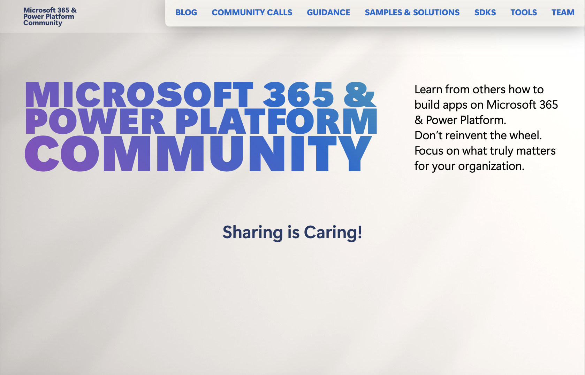
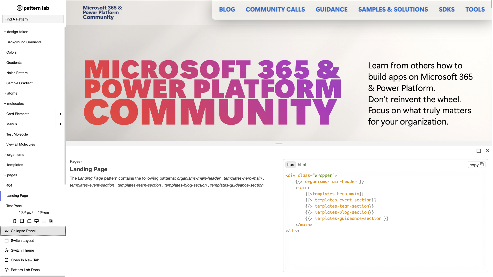
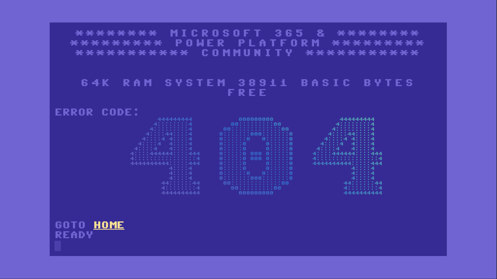
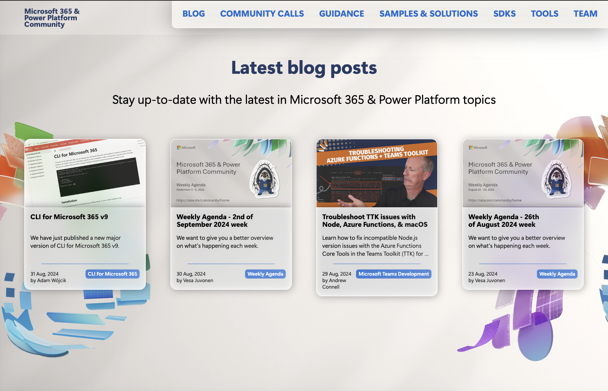
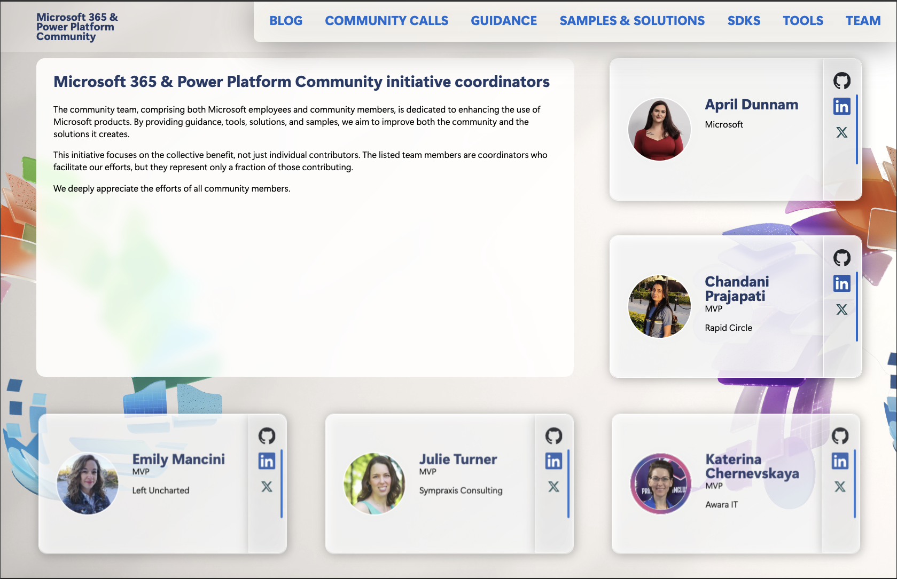
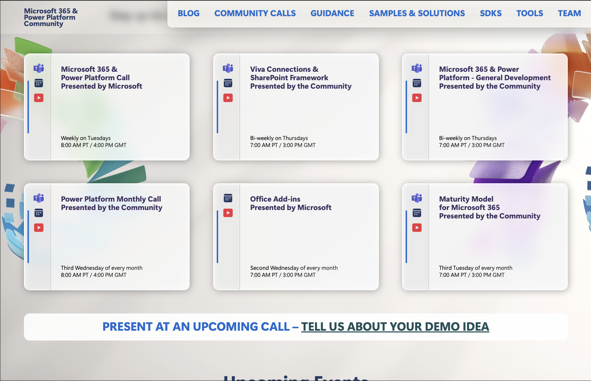

> This article originally appeared on Stefan Bauer's blog, **[The story of pnp.github.io redesign - how we did it](https://n8d.at/the-story-of-pnp-github-io-redesign-how-we-did-it?utm_source=PnP&utm_medium=website&utm_campaign=blog)**.

I always loved to give the community, something back that gave me so much over the years. I created strong friendships bounds with many people. Growing up with the web and particularly Microsoft 365, I would have never imagined when I was just a curious hacker who wanted to know how the web works back in 1996.

Fast forward all those years, I had the opportunity to join forces with the great [Hugo Bernier](https://tahoeninja.blog/) to redesign [pnp.github.io](https://pnp.github.io).

He was responsible for implementing my design using [Hugo](https://gohugo.io) (what else). The key to success is always not to provide only a Figma file or any other design file but instead build a properly crafted HTML Style Guide.

## Start with a style guide

A style guide is not something static; instead, it provides small, low-level code building blocks that can mature and get adjusted in future.

The style guide I built for this redesign can be found on [https://pnp.github.io/styleguide/](https://pnp.github.io/styleguide/) and was the base to that Hugo Bernier used to craft the website theme.

Not only does a style guide give a perfect reference implementation for any current and future developer, but it also serves as a playground for any current and future web designer.

Right before the launch, we also crafted a very unique 404 page not found page you might never see.

The style guide follows the pattern introduced by Brad Frost in June 2013 called [Atomic Design](https://bradfrost.com/blog/post/atomic-web-design/) and is used by many companies.

## The benefit for developers

There are many technologies for web developers available nowadays, but it will always come down to the core fundamentals. 

HTML, CSS and a bit of JavaScript. Mastering those three core technologies is nowadays easier than in the old days. Browser evolved quicker and gave HTML and CSS abilities that required complex frameworks.

The Hugo Web Site Framework, on the other hand, has its specialities. I am writing the themes in a language that is not related to web technologies and using a language named [Go](https://en.wikipedia.org/wiki/Go_(programming_language)).

This separation of concern, Hugo Bernier, the theme developer, and me as a designer, as well as front-end developer, allowed us to implement the new Microsoft 365 & Power Platform Community to implement in a couple of days rather than weeks. 

While the Hugo theme was ongoing, I was able to tweak the card layouts to give them the perfect glass look and make the overall HTML as modular as it can be. If they look different in many ways, the fundamental HTML structure needed for the theme is the same.

## The base is there

Now that we have implemented the base system, new journeys await us to find the right design and technological implementation.

By setting up the groundwork in the way we did, it enables us to redesign, update and fine-tune the design in future. On top of that, we can add new components to this system, too.

The power of the web is in the cooperation between different disciplines and a respectful exchange to create amazing projects for the web.

I have followed the described developer/designer approach for a long time and in my daily work, too. This is the only approach to creating versatile and sustainable solutions for the web.

This sustainability is also why I created [HTWOO](https://lab.n8d.studio/htwoo/) - a more sustainable Fluent Design implementation.

Finally a special thanks to [Hugo Bernier](https://tahoeninja.blog/) – It was great working with you.
