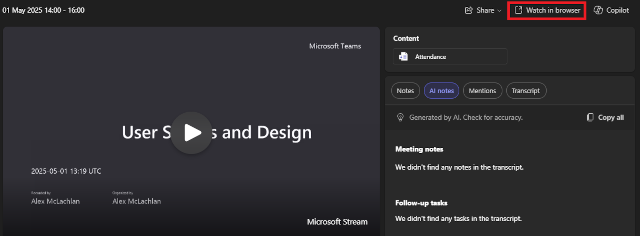
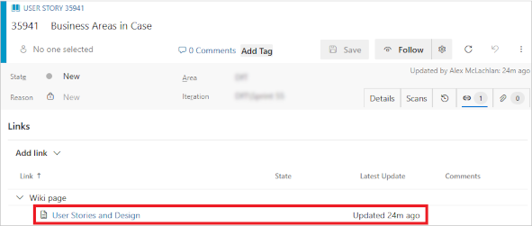

## TL;DR

Link workshop transcripts to User Stories by:

    1. Adding chapters to your Teams recording in Stream with # references to User Stories
    2. Exporting the chapters
    3. Pasting into an Azure DevOps Wiki page
    4. Linking the User Stories to the Wiki page

---

## Contents

- [TL;DR](#tldr)
- [Contents](#contents)
- [Introduction](#introduction)
- [Step 1: Record the Workshop, then Annotate in Stream](#step-1-record-the-workshop-then-annotate-in-stream)
- [Step 2: Add New User Stories in DevOps](#step-2-add-new-user-stories-in-devops)
- [Step 3: Create DevOps Wiki Page](#step-3-create-devops-wiki-page)
- [Tracing from the User Story to the Recording](#tracing-from-the-user-story-to-the-recording)
- [Postscript](#postscript)

---

## Introduction

This post provides guidance on how to achieve effective traceability between workshop recordings and the corresponding Azure DevOps User Stories. This approach enables users to reference the exact part of a workshop where a user story was discussed, facilitating clarification if needed at a later time.

This post assumes Teams is used for workshops and Azure DevOps for backlog management.

---

## Step 1: Record the Workshop, then Annotate in Stream

Record the workshop (preferably with transcription turned on, even better with access to Copilot).

Once the recording has been saved, move from Teams to Stream using the 'Watch in browser' button.

Then move the recording from OneDrive to the project SharePoint site for better access. You can adjust how long the recording is stored if needed.

In Stream, if the recording opens as read-only, change this to edit. In 'Video settings', turn on Chapters, and if the meeting wasn't transcribed live, transcription can be started at this point (although the transcription generated in Stream won’t be able to distinguish between the speakers).

Next, review the recording (the speed can be increased).

As you review the recording, add notes as new chapters. Where new User Stories are needed, mark as #****. Where existing User Stories are mentioned they can be included with theirs numbers as #{_work item number_}.

---

## Step 2: Add New User Stories in DevOps

Create the new User Stories in DevOps.

Change the ****s in the Stream chapters to the User Story numbers.

Then copy the chapters.

---

## Step 3: Create DevOps Wiki Page

In DevOps, create a Wiki page with recording name and other details.

Then paste the chapters into the page and save. The chapters with # references will show as links to User Stories.

The next step is to link the Wiki page to those User Stories (it would be nice if this happened automatically for DevOps work item links).

---

## Tracing from the User Story to the Recording

This then allows you to trace back from the User Story, via the Wiki page, to the exact segment of the recording where this was discussed. Additionally, multiple workshops may discuss the same User Story. Implementing this process provides links to all relevant occurrences.

NOTE: if you have Copilot available in Teams or Stream, the reviewed and edited version of the summary can be used as well.

---

## Postscript

Following the initial posting of this, I had the following conversation on LinkedIn with Microsoft MVP [Hamish Shield](https://www.linkedin.com/in/hamishsheild/):

Hamish:

    Alex McLachlan nice one. I don’t do this as it seems like a lot of work! But I can see how it would be super helpful. I often refer back to workshop recordings. One thing I have been thinking about is how might an AI agent do something like this for us…

Alex:

    Hamish Sheild that's a very valid point / comment about agents. There are three level to consider here.

    Firstly, your comment about it being a lot of work is very true, but I find I get 2-3 times more value from listening to the workshop recording than just going on memory / notes / Miro board. This enables the resulting user stories to be more complete and more accurate, reducing bugs and re-work. To some extent whether this is appropriate on a project depends on the availability of the SMEs (but have you ever worked on a project where they are as available as you'd like?)

    Secondly, you could use Copilot's summary, together with a prompt along the lines of "extract the requirements from this workshop and express them in the form AS A ... giving links to the start of where they are mentioned". This could be added as wiki content and (after careful review) add them to DevOps.

    Lastly, it would be possible to write an agent to do the second option and add the user stories to DevOps for review there. Personally, I wouldn't currently go for this option at the moment given the level of hallucination in gen AI and the lack of it's ability to have a memory model of what the system is needing to do and context of the rest of the backlog.
