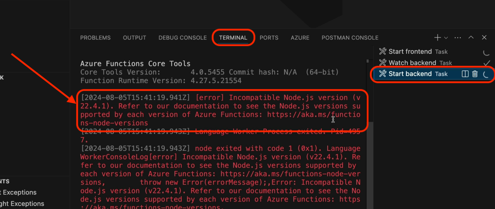
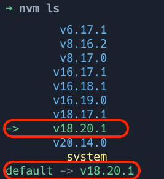
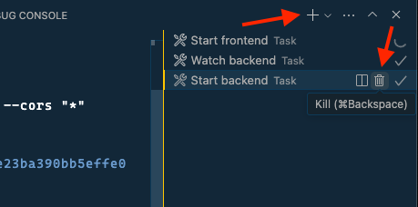
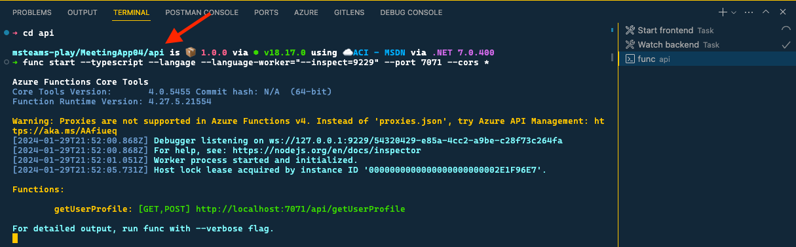
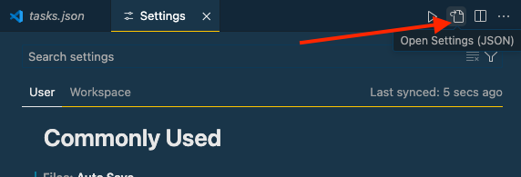

> This article originally appeared on Andrew Connell's site, **[Troubleshoot TTK issues with Node, Azure Functions, & macOS](https://www.voitanos.io/blog/troubleshoot-teams-toolkit-azure-functions-node-macos/?utm_medium=website&utm_source=pnpblog&utm_campaign=blog&utm_content=Troubleshoot%20TTK%20issues%20with%20Node%2C%20Azure%20Functions%2C%20%26%20macOS)**.

I recently ran into an issue related to a node version manager (NVM) when working on a Microsoft Teams app using the Visual Studio Code (VSC) Teams Toolkit (TTK) using macOS that wasn't easy to figure out.

It was a tricky thing to resolve as the root cause was quite buried. It ended up being an issue with the Azure Functions Core Tools and how VS Code works on macOS, but it isn't obvious and takes some time to peel back the onion to get to the root cause.

**If you're creating Azure Functions using the Azure Functions Core Tools on macOS and you use an NVM, this might affect you too.**

After seeing a few of my students from my Microsoft Teams AppDev Accelerator also run into this, [while I've bugged & resolved it with Microsoft](https://github.com/OfficeDev/teams-toolkit/issues/10785), I wanted to share additional context on the issue, how I was able to debug it, and ultimately resolve it.

Let's start by explaining what happened to kick this story off.

## What happened?

The actual problem an issue I ran into wasn't immediately obvious. When creating a new project using the TTK project template for a tab using React + Fluent UI, you get two projects in one:

- the primary project is the Teams app project that includes a client-side React app for the user experience
- a nested Azure Functions project is added to the **api** subfolder within the Teams project to implement server-side calls to Microsoft Graph

I had been running into an issue with two other projects that leveraged SSO that were giving me fits, so I decided to create a new project to run it with zero edits to see if something else was going on with the SDK, Microsoft Teams, or my development environments.

After creating the project, I fired it up with zero changes. While it seemed to work as the tabs loaded just fine, the tab in the personal app implementation called the Azure Function would never work.

## How to debug & identify the issue?

While I saw some errors in the browser's JavaScript Console, they didn't help pinpoint the problem.

So, the next step is to go into VS Code where I ran the project to inspect the processes that were running. To do this, open the Terminal (**View > Terminal**). On the right-hand side, notice three processes are running:

- **Start frontend**: This is running a local web server to host the React client-side application.
- **Watch backend**: This task uses the popular [**nodemon**](https://www.npmjs.com/package/nodemon) utility that watches for code files to change in the Azure Function project located in the **api** subfolder in our project. If any files change, it rebuilds the project, transpiling the TypeScript to JavaScript.
- **Start Backend**: This is the console that's running the Azure Functions Core Tools.

I looked at each of these to see if there were any errors that stood out.

Sure enough, there it was... the Azure Functions Core Tools weren't starting up. It was throwing the error: **Incompatible Node.js version (v22.4.1).**



That's strange because I'm certain that I didn't install Node.js v22, but that my default Node.js version is v18. I use a Node version manager, specifically NVM, so I quickly opened a console and checked what version I was using.



Modern Node.js developers frequently use an NVM to manage multiple node environments on their workstations. [I've written about NVMs multiple times on this site](https://www.voitanos.io/blog/better-node-js-install-management-with-node-version-manager/?utm_medium=website&utm_source=pnpblog&utm_campaign=blog&utm_content=Troubleshoot%20TTK%20issues%20with%20Node%2C%20Azure%20Functions%2C%20%26%20macOS) so I'll spare you from repeating why I think they're so great.

Confirmed... it's Node.js v18.

So why do the Azure Functions Core Tools think I have Node.js v22 installed?

## What's the problem?

I checked the **system** installed version and that was Node.js v22.4.1!

Ah-ha - now we're making progress!

So... it seems the Azure Functions Core Tools, or VS Code more specifically, isn't respecting my NVM setup, rather it's defaulting to the **system** installed version of Node.js.

But why?

## Why is VS Code using the wrong version?

Apparently VS Code when launching a new terminal window from its [tasks feature](https://code.visualstudio.com/docs/editor/tasks), which the Teams Toolkit for VS Code uses, defaults to Bash on macOS.

That's a little strange to me because [Apple switched the default shell in macOS v13 from bash to zsh](https://support.apple.com/lv-lv/guide/terminal/trml113/2.13/mac/13.0)... that was released in October 2022, nearly two (2) years ago. So, it's a little odd the VS Code still defaults to it.

On my macOS environments I use zsh, like most if not all, macOS customers who have a modern machine. My shell configuration is set up using the zsh configuration file **.zshrc** in the root of my profile. Within that file, I have a few things, but the important parts are as follows:

```console
## NVM directory
export NVM_DIR="$HOME/.nvm"

## console setup... NVM, OMZ [shell] & Spaceship [prompt]
[[ -f ~/.zsh/nvm.zsh ]] && source ~/.zsh/nvm.zsh
```

The **nvm.zsh** file contains the code that initializes my NVM configuration that sets the initial version of Node:

```console
## load nvm
[ -s "/opt/homebrew/opt/nvm/nvm.sh" ] && \. "/opt/homebrew/opt/nvm/nvm.sh"

## load nvm bash_completion
[ -s "/opt/homebrew/opt/nvm/etc/bash_completion.d/nvm" ] && \. "/opt/homebrew/opt/nvm/etc/bash_completion.d/nvm"
```

This explains why VS Code is picking up the **system** installed version of Node.js: because that's the default version when I'm not using NVM and NVM isn't loaded under a bash shell - it's loaded under a zsh shell.

## Validating the issue by manually fixing

Let's test this hypothesis out to see if I'm correct.

I started the TTK launch task again and saw the same error. But this time, I killed the **Start backend** task after I started up since it was going to error out again.

Then, I clicked the + icon at the top to open a new shell, but this time it defaulted to ZSH because I manually opened it up.



In the shell, I manually started the Azure Functions Core Tools using the same command the TTK uses. Specifically:

- The **Start backend** task (defined in the **./.vscode/tasks.json** file) runs the NPM command `npm run dev:teamsfx` defined in the project's root **package.json** file:

    ```json
    {
      "version": "2.0.0",
      "tasks": [
        .. omitted for brevity
        {
          "label": "Start backend",
          "type": "shell",
          "command": "npm run dev:teamsfx",
          "isBackground": true,
          "options": {
            "cwd": "${workspaceFolder}/api",
            "env": { "PATH": "${workspaceFolder}/devTools/func:${env:PATH}" }
          }
        }
        .. omitted for brevity
      }
      .. omitted for brevity
    }
    ```

- The NPM script `dev:teamsfx` loads the environment variables into the current process and then runs `npm run dev` which in turn runs the Azure Functions Core Tools from the command line:

    ```json
    {
      .. omitted for brevity
      "scripts": {
        "dev:teamsfx": "env-cmd --silent -f .localConfigs npm run dev",
        "dev": "func start --typescript --language-worker=\"--inspect=9229\" --port \"7071\" --cors \"*\"",\
        .. omitted for brevity
      },
      .. omitted for brevity
    }
    ```

This time, the Azure Functions Core Tools started up as expected!



So, we figured out the problem, but this is kind of a pain to do every time I want to start debugging a new TTK project that includes an Azure Functions project within it. Let's improve this with a more permanent fix...

## Applying a permanent fix

After a bit of digging, I found a property your can set in your VS Code user settings to force the default shell on your machine.

- Open your user settings (**Code > Settings > Settings**).
- Switch to the code view to edit the JSON.

    

- Add (or update if it's already there) the following two settings. This will define a new profile under macOS named "zsh", then it will set it to the default profile under macOS:

```json
{
  .. omitted for brevity
  "terminal.integrated.profiles.osx": {
    "zsh": {
      "path": "zsh",
      "args": []
    },
  },
  "terminal.integrated.defaultProfile.osx": "zsh",
}
```

Now, when the VS Code TTK launches the **Start backend** task, the Azure Functions Core Tools will start up under your NVM environment which, is ideally set to a supported version of Node.js!
