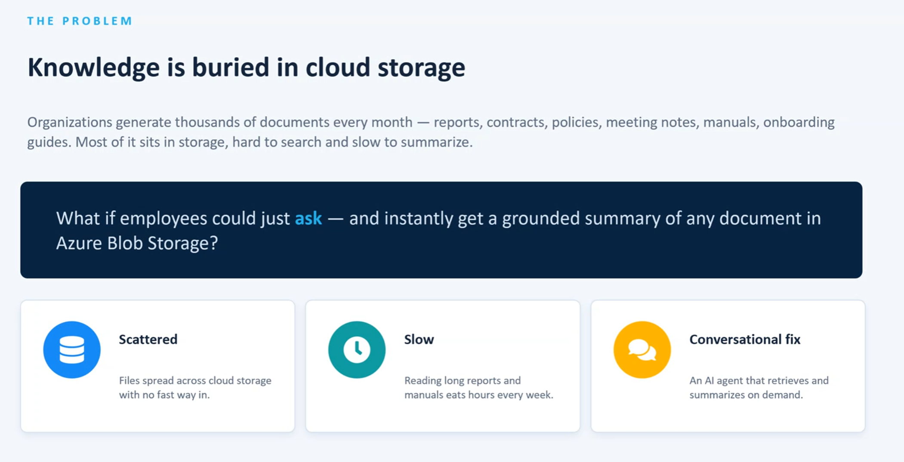
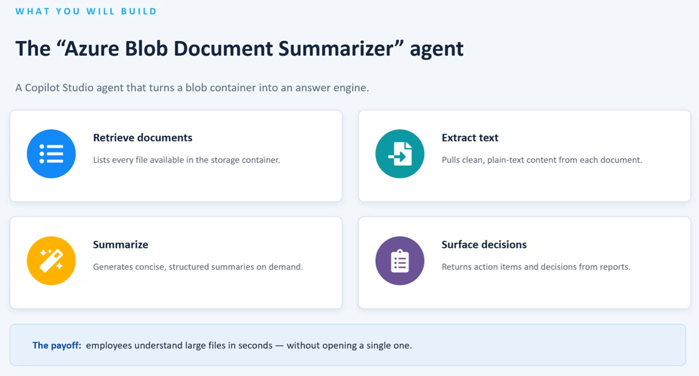
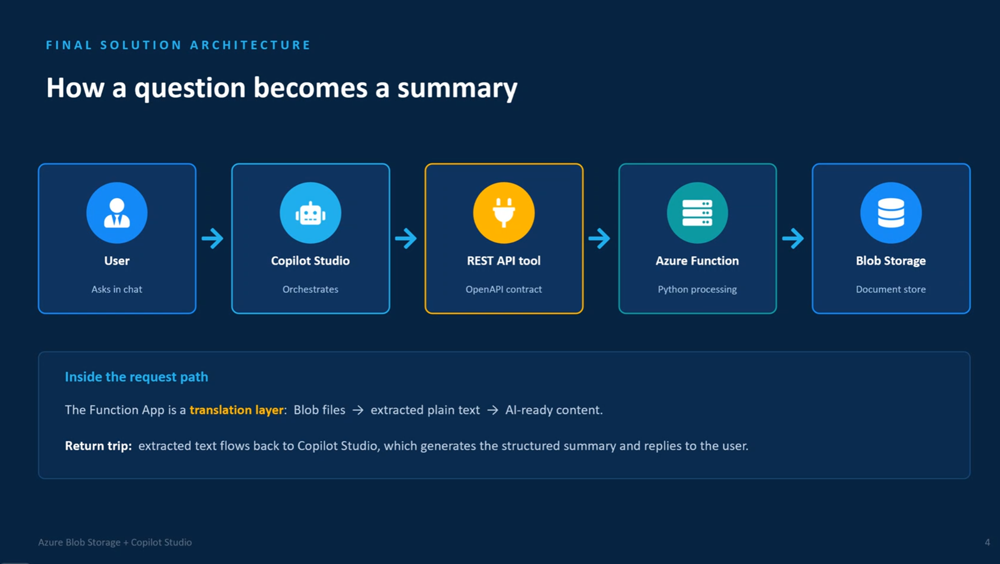
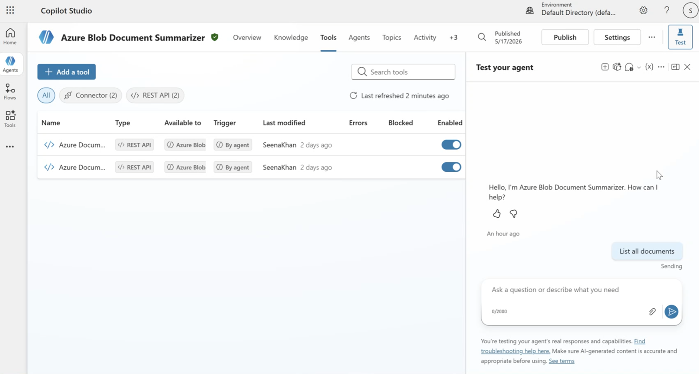
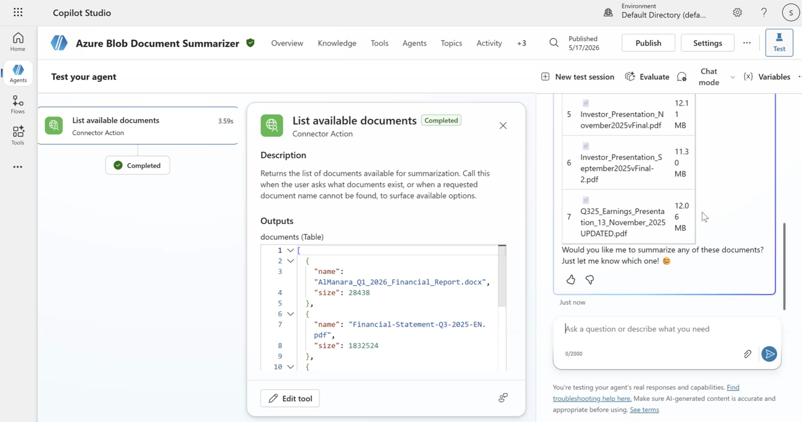

## The problem

One of the things I enjoy about community calls is seeing a familiar Microsoft service used in a slightly different way. In this presentation, **Building an Enterprise AI Document Summarizer with Azure Blob Storage +  Copilot Studio by Seena Khan** the problem was straightforward: organisations create large amounts of information, but much of it ends up sitting in cloud storage, difficult to search and slow to summarise.

The challenge is not necessarily a lack of information. It is access to information at the moment someone needs it. If an employee has to open several long documents, scan them and piece together the important points, the value of that knowledge is harder to realise.

This is also why I would encourage more technical people to join community calls. You do not need to agree with every approach presented, or be an expert in the technology being demonstrated. Sometimes the most useful part is seeing how someone else has approached a problem you have been thinking about.

## The solution

What caught my attention was the proposed conversational approach. Rather than expecting someone to navigate storage first, the idea was to let a user ask a question and receive a grounded summary of a document held in Azure Blob Storage.

The proposed solution was an "Azure Blob Document Summarizer" agent built with Copilot Studio. Its role is to turn a blob container into an answer engine: retrieve available documents, extract plain-text content, summarise that content, and surface decisions or action items where they are present.

The architecture shown was particularly interesting. A user asks in chat, Copilot Studio orchestrates the request, and a REST API tool passes it to an Azure Function. The Function acts as a translation layer between Blob Storage and the agent, turning blob files into extracted plain text that can be returned for summarisation.

That separation of responsibilities is worth discussing. Copilot Studio handles the conversational experience, while the supporting services focus on accessing and processing the documents. The Function is not trying to become the conversational interface; it has a focused job and exposes the document content in a form the agent can work with.

*Below are screenshots taken during the presentation:*

## Why it matters

The attraction is not simply that an AI agent can summarise a document. It is the idea of making information already sitting in storage easier to interact with.

For an organisation, that could reduce some of the friction between knowing that information exists and actually getting useful information from it. The presentation did not claim a particular business outcome, so I would be cautious about going further than that.

And this is where community discussion becomes valuable. Someone looking at the architecture from a security, governance, development or operational perspective may immediately spot questions that someone else has not considered. That does not weaken the solution presented. It makes the conversation around it stronger.

## Future considerations

If I were taking this beyond the demonstrated approach, I would want to explore document permissions, sensitive content, monitoring, licensing, failure handling and maintainability. I would also want to understand how the approach behaves as the number and variety of documents increases.

Those are not criticisms of the solution. They are the questions that naturally follow when moving from an interesting demonstration towards something an organisation might trust with real business information.

## Community discussion

This is exactly why I value these calls. Someone shares an approach, others challenge it, build on it, adapt it or take a completely different direction. Everyone learns something.

So, if you work with Azure Blob Storage, Copilot Studio or similar document challenges, how would you approach this? What would you change or investigate first? How are you making knowledge easier to discover in your own organisation?

And if you have a solution worth sharing, consider joining a community call and presenting it. The value is not only in the solution itself; it is in giving other technical people something to question, improve and learn from.
