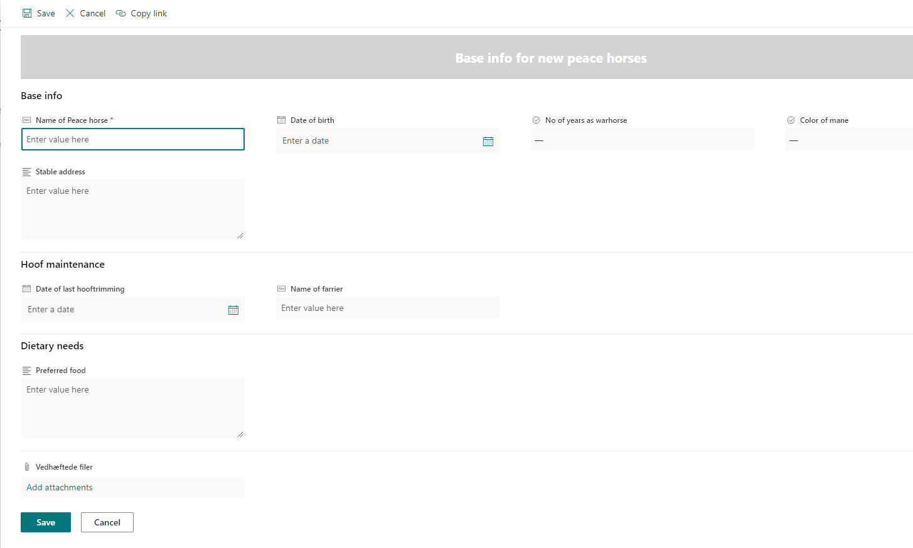

Updating your list forms using your provision tool of choice

One of the “sub-species” of list formatting is [form formatting](https://learn.microsoft.com/en-us/sharepoint/dev/declarative-customization/list-form-configuration) which makes it possible for you to update the display of a list form ( Edit/Update form).

Rather than having all the columns displayed as one column in the right hand side of the screen we would like to use the entire screen real estate and group the fields as well.

Below is the updated entry form for former warhorses that have seen the light and now wishes the join the Corps of Peacehorses.



Using form formatting on a single list is easy however once you get a requirement to deploy those form formatting settings across multiple sites or as a part of a template in your provisioning tool things get a little tricky.

As far as I know the [PnP provisioning engine](https://learn.microsoft.com/en-us/sharepoint/dev/solution-guidance/introducing-the-pnp-provisioning-engine) does not yet handles form formatting so in the meantime we have to do it ourselves, luckily this is not to hard.

In order to extract the JSON you can use this:

``` PowerShell
################## ClientFormCustomFormatter extractor

$templateUrl = "https://tenantonline.sharepoint.com/sites/testing"
$clientId = ""
$clientSecret = ""

$targetConn = Connect-PnPOnline -Url $templateUrl -ClientId $clientId -ClientSecret $clientSecret -ReturnConnection
$clientContext = Get-PnPContext

$listName = "Name of list"

$list = Get-PnPList $listName -Includes SchemaXml
$contentType = Get-PnPContentType -List $listName | Where-Object { $_.Name -eq "Name of the content type"}

$clientContext.Load(\$list.Views)
$clientContext.Load(\$contentType)
$clientContext.Load(\$contentType.FieldLinks)
$clientContext.ExecuteQuery()

$contentType.ClientFormCustomFormatter | Out-File "c:\\temp\\test.json"
```

So you basically just have to connect to the site that contains the updated list and extract the JSON to a file.

The provisioning tool I was using in this case is based on Microsoft Azure so in order to apply the form formatting to a new site I decided to use an Azure Function with a HTTP trigger:

The URL for the site to update is provided in the RequestURL and the URL for the site where the extracted JSON file is store could likewise be provided in a similar fashion. In this case I have hardcoded it.
There is a good reason why I don't upload the JSON file to the Azure storage but rather store it in SharePoint as this enables the customer to update the form formatting and upload a new version to the SharePoint site without having any access the the Azure setup.

The only issue I have with this code was that I had to remember to open the content type if it was set as read only.

``` PowerShell
$targetURL = $Request.Query.TargetURL

if (-not $targetURL) {
  Write-Host " no targeturl received, aborting"

  $body = "No TargetUrl received"
  $HttpStatusCode = [HttpStatusCode]::BadRequest
} else {
  Write-Host " Targeturl received: $targetURL"

  $clientId = $env:ClientId
  $clientSecret = $env:clientSecret

  Connect-PnPOnline -Url "https://[SiteWhereTheJSONIsStored]" -ClientId $clientId -ClientSecret $clientSecret

  $ClientFormCustomFormatter = Get-PnPFile -Url "/sites/[SiteWhereTheJSONIsStored]/exportedtemplates/formatting.json" -AsString
  $listName = "[ListName]"

  Connect-PnPOnline -Url $targetURL -ClientId $clientId -ClientSecret $clientSecret

  $clientContext = Get-PnPContext
  $list = Get-PnPList $listName -ErrorAction Stop

  #Get Content Type

  $contentType = Get-PnPContentType -List $listName \| Where-Object { $_.Name -eq "[NameOfContentType]" -or $_.Name -eq "Element" }

  $clientContext.Load($contentType)
  $clientContext.Load($contentType.FieldLinks)
  $clientContext.ExecuteQuery()

  #open the ct if it is read only

  if($contentType.ReadOnly) {
    $contentType.ReadOnly = $false
    $contentType.Update(0)
    $clientContext.ExecuteQuery()
  }

  $contentType.ClientFormCustomFormatter = $ClientFormCustomFormatter
  $contentType.Update(0)
  $clientContext.ExecuteQuery()

  if($false -eq $contentType.ReadOnly) {
    $contentType.ReadOnly = $true
    $contentType.Update(0)
    $clientContext.ExecuteQuery()
  }

  $body = "ClientFormCustomFormatter updated for $listName on $targetURL"

  $HttpStatusCode = [HttpStatusCode]::OK
}

# Associate values to output bindings by calling 'Push-OutputBinding'.

Push-OutputBinding -Name Response -Value ([HttpResponseContext]@{
  StatusCode = $HttpStatusCode
  Body = $body
})
```

And there you go, the form formatting has now been applied to the list as requested
