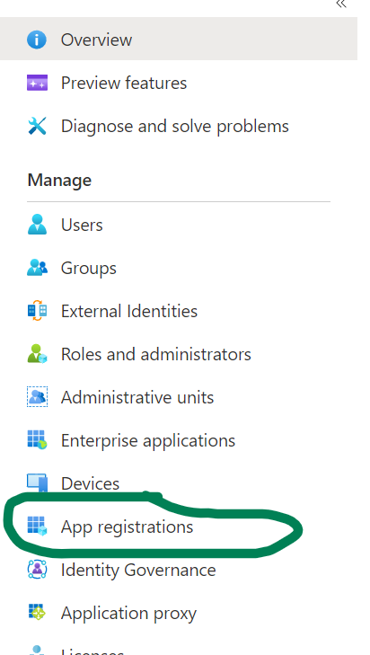
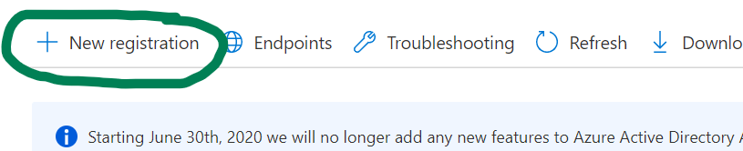
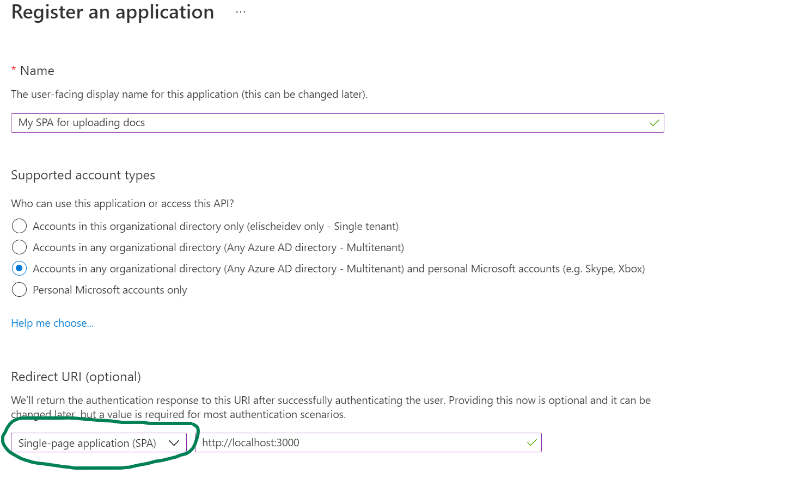
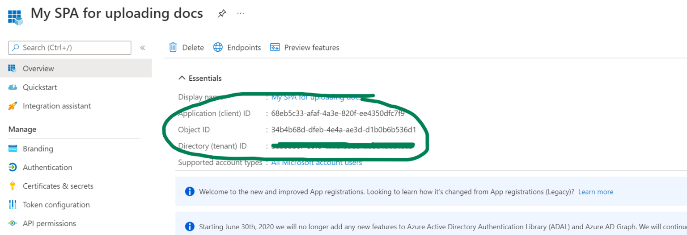
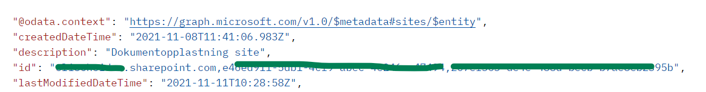

Phu, thats a long title – but I wanted to make it really clear what this blog post is about. So as you might have guessed, in this blog post I will cover how to upload files to SharePoint with JavaScript using Microsoft Graph for the request, and Microsoft Authentication Library for authentication.

I recently had to solve this for a client, and I used a lot of time banging my head against the wall looking for resources. It was not really the lack of resources that was the issue – but that every example was either to big – or it took for granted that I had some sort of understanding that I was obviously lacking. So when I finally figured out how to do it – and how little code it actually requires – I decided that I needed to blog about it. Hopefully this blog post will save you some time!

I also made a small vuejs app so you can get up and running quickly. My goal was to present you with the bare minimum amount of code that you need – and hopefully you can build on top of that.

> **Prerequisites:** You should know basic programming, and have an understanding of working against an API – and different authentication flows.

>**Source code:** You can [find the full source code for this example on my github](https://github.com/Eli-Schei/upload-files-to-sp-using-graph). Note, this is a stripped down example to show you the minimum of what you need to upload a file. Its a good baseline/starting point to build on.

## Table of contents

- [Table of contents](#table-of-contents)
- [Introduction](#introduction)
- [Creating an app registration for a single page application in Azure AD](#creating-an-app-registration-for-a-single-page-application-in-azure-ad)
- [Authenticating with Microsoft Authentication Library](#authenticating-with-microsoft-authentication-library)
  - [MSAL Configuration](#msal-configuration)
  - [MSAL Code](#msal-code)
- [Handling the selected file](#handling-the-selected-file)
- [Making a request to graph](#making-a-request-to-graph)
  - [Building the graph url to use](#building-the-graph-url-to-use)
  - [Making the request](#making-the-request)
  - [Working with large files](#working-with-large-files)
- [Resources](#resources)

## Introduction

There are four steps you need to complete when uploading files from a javascript app with graph. Lets have a quick look at each of them before we go into the details.

1. You need to register a single page application (SPA) in Azure Active Directory (AAD).
You will use this to authenticate your users.
2. You need to use Microsoft Authentication library (msal) to authenticate against the SPA you create in the first step.
So you know who wants to upload a file – and that they have permission to do so.
3. You need to handle the file the user has selected.
Microsoft Graph accepts ArrayBuffer, Buffer or Blob objects.
4. You need to make a request to Microsoft Graph with an Authentication Token from msal, and the file your user has selected.

Maybe you already know how to do some of these steps, or maybe you are new to all of them. In the rest of this blog post I will cover every step in detail. I also provide you with a list of resources.

## Creating an app registration for a single page application in Azure AD

_Since you are reading this blog post I’ll assume that you allready have a Microsoft 365 tenant where you would like to upload the documents. If not you can [register for a free dev tenant here](https://developer.microsoft.com/microsoft-365/dev-program)._

If you don’t have admin privileges to Azure AD you need to get someone who does to register the app for you.

1. Log in to [Azure Active Directory](https://portal.azure.com/#blade/Microsoft_AAD_IAM/ActiveDirectoryMenuBlade/Overview).

1.  In the menu on the left select App registrations



1. Select “New registration



1. Fill in the name, select the account types you would like to support. And set the Redirect URI type to **Single-page application (SPA)**. 

_Note, the URI you fill in must match the url where your app is running. In my example code that is localhost:3000. You can change this URI later when the code is running from somewhere else._



1.  Click **Register**. On the app info page copy down the Application (client) ID, and the Directory (tenant) ID.



## Authenticating with Microsoft Authentication Library

> **Example code**
I have made a small vue app to give you an example that you can actually run right away. But all the logic is written in vanilla javascript so you don’t need to know vuejs to use the example. [You can find the source code here](https://github.com/Eli-Schei/upload-files-to-sp-using-graph).
Information on how to get the example code up and running is documentet in the repos readme file so I will not cover that in this blogpost.

To be able to upload a document we first need to authenticate the user against the SPA you have registered in Azure AD.

### MSAL Configuration

```javascript
const msalConfig = {
  auth: {
    clientId: "YOUR APP ID FROM AZURE REGISTRATION",
    authority:
      "https://login.microsoftonline.com/YOUR_TENANT_ID",
    //This URL must match the one set in azure app reg
    redirectUri: "http://localhost:3000/"
  },
};

const msalRequest = {
  scopes: ["User.Read", "Files.ReadWrite", "Files.ReadWrite.All"] 
};

```

### MSAL Code

First we create and initialize an msal-client. This is what we’ll use to communicate with the Azure SPA and authenticate the user.

```javascript
const msalClient = new msal.PublicClientApplication(msalConfig);

```

Then we write a function to handle the login. This is done by using the msal-client and calling the loginPopup function with the scopes we created in the configuration.

You can also add functionality to get the token silently first if the user is already logged in – so the user is not prompted to log in every time. But since I wanted to keep this code sample as small as possible I left this out here, but you can see an example in the next code snippet.

```javascript
export async function signInWithMsal() {
  const authResponse = await msalClient.loginPopup(msalRequest);
  sessionStorage.setItem("msalAuthName", authResponse.account.username);
}
```

We also have a function to get the msal token. This function is used in the next step when we call Graph. Here you can also see an example of obtaining the token silently.

```javascript
export async function getMsalToken() {
  let username = sessionStorage.getItem("msalAuthName");
  try {
    const silentRequest = {
      scopes: msalRequest.scopes,
      account: msalClient.getAccountByUsername(username),
    };
    const silentResult = await msalClient.acquireTokenSilent(silentRequest);
    return silentResult.accessToken;
  } catch (error) {
      //Add handling for new login promt here - if the silent request should fail
    console.error(error);
  }
}

```

## Handling the selected file

Graph will accept the file as an ArrayBuffer, a Buffer or a Blob. In my example we use a file reader object to read the file as an ArrayBuffer and send it to the uploadDocument function.

Obtain the filename and the file itself from the input field.

```javascript
const filename = 
          document.getElementById("selectedFile").files[0].name;
const fileToUplode = 
          document.getElementById("selectedFile").files[0];
```

Create a FileReader and a function that will run when the FileReader is loading. Then call the `readFileAsArrayBuffer` function passing in the file. The `onload` function has an event parameter `event.target.result` will contain the ArrayBuffer version of the selected file.

```javascript
filereader.onload = async (event) => {
  await uploadDocument(filename, event.target.result);
};
//This will trigger the onload function above.
filereader.readAsArrayBuffer(fileToUplode);
```

Complete code for handling the file and calling `uploadDocument()`

```javascript
const onSubmit = async (event) => {
      //prevents the site from reloading
      event.preventDefault();
      // sign the user in
      await signInWithMsal();
      //obtain the filename from the file
      const filename = document.getElementById("selectedFile").files[0].name;
      //obtain the file itself
      const fileToUplode = 
          document.getElementById("selectedFile").files[0];
      //create filereader
      const filereader = new FileReader();
      //create function that will run when filereader is loading
      filereader.onload = async (event) => {
        //call uploadDocument function and pass in filename and file as ArrayBuffer
        await uploadDocument(filename, event.target.result);
      };
      //call the readAsArrayBuffer on fileReader and pass inn file.
      //This will trigger the onload function above.
      filereader.readAsArrayBuffer(fileToUplode);
    };
```

## Making a request to graph

Now that the authentication is handled we can go ahead an make a request to Microsoft Graph. First we need to build the url to use with the request. Then we need to handle the file so it can be sent with the request, and lastly we need to send the request to graph.

### Building the graph url to use

I decided to write a section on how to build your graph-url since I thought it was difficult to figure out exactly what it should contain.

This is how the url should look:

```javascript
  const uploadURL = "https://graph.microsoft.com/v1.0/sites/<YOUR DOMAIN, SOME_ID, SOME_OTHER_ID>/drive/root:/"
 + filename + ":/content";

```

I think “SOME_ID” should be the Site-id, and the “SOME_OTHER_ID” should be the web-id. But instead of looking these up I found a graph request that will return the complete id including domain.

To attain it just run the below request in Graph Explorer (or Postman).

_Note, to run this request you need to include a bearer token. If you do it from graph explorer it does this for you when you log in. If you do it from postman you need to get the access token first – and then run the below request._

```
https://graph.microsoft.com/v1.0/sites/YOUR_DOMAIN.sharepoint.com:/sites/NAME_OF_SITE_YOU_WANT_TO_UPLOAD_TO/

```

This will give you a response that contains an id like this:



Copy the whole “id” and put it in your uploadURL

```javascript
"https://graph.microsoft.com/v1.0/sites/PUT_THE_ID_FROM_PREVIOUS_STEP_HERE/drive/root:/"
 + filename + ":/content"

```

### Making the request

There is a Microsoft Graph SDK for javascript, but for this example I’m using a regular window.fetch request instead of creating a graphClient. To learn more about the Graph SDK see links listed in Resources.

We pass our uploadURL as the first parameter to fetch. The secod parameter is an object that contains the header with the authorization Bearer token, and a body that contains the file.

```javascript
export async function uploadDocument(filename, fileToUpload){
  const uploadURL = "https://graph.microsoft.com/v1.0/sites/<YOUR DOMAIN, SITE, AND WEB ID HERE >/drive/root:/" + filename + ":/content";
    await window
    .fetch(uploadURL, {
      method: "PUT",
      headers: {
        Authorization: `Bearer ${await getMsalToken()}`,
      },
      body: fileToUpload,
    })
    .then((response) => {
        // Here you can implement some user feedback. "File uploaded" etc.. 
    })
    .catch((error) => {
      console.error("ERROR UPLOADING");
      console.error(error);
    });
}

```

And thats it. You have now uploaded a file to SharePoint!

### Working with large files

If you are working with larger files (4MB+) you could use an upload session to handle the request. See links in Resources below for more information about that.

## Resources

* [Microsoft Graph JavaScript Client Library](https://www.npmjs.com/package/@microsoft/microsoft-graph-client) – npm site.
* [Make API calls using the Microsoft Graph SDK](https://docs.microsoft.com/en-us/graph/sdks/create-requests?tabs=TypeScript) – Microsoft docs
* [Upload a large file with a upload session](https://docs.microsoft.com/en-us/graph/api/driveitem-createuploadsession?view=graph-rest-1.0&preserve-view=true) – Microsoft docs
* [Upload small or large files using Graph](https://www.youtube.com/watch?v=YYMFP8xcNOQ) – YouTube, Microsoft 365 Developer channel
* [Microsoft Graph JavaScript Client Library](https://github.com/microsoftgraph/msgraph-sdk-javascript) – GitHub, Microsoft Graph repo
* [Build JavaScript single page apps with Graph](https://docs.microsoft.com/en-us/graph/tutorials/javascript) – Tutorial – Microsoft docs
