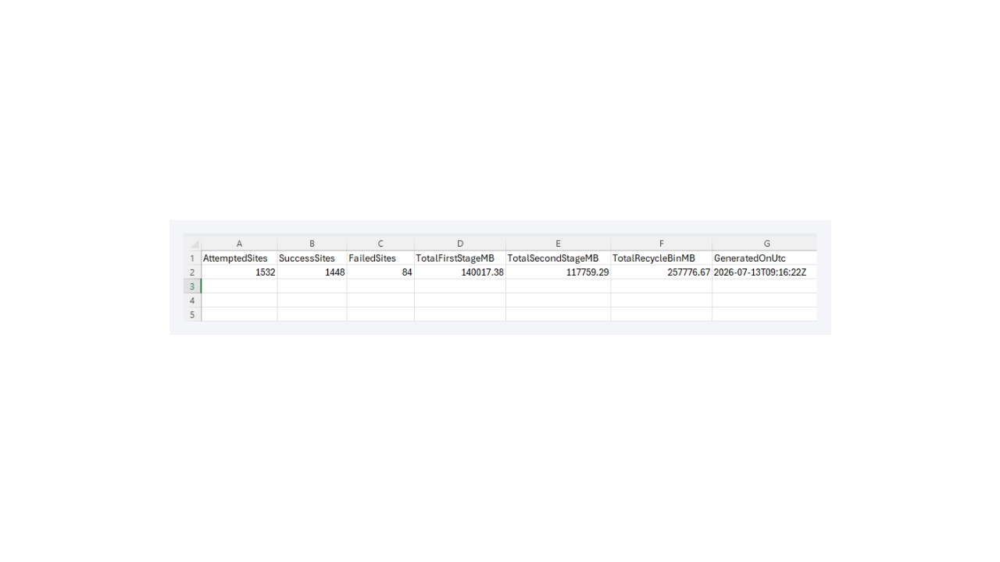
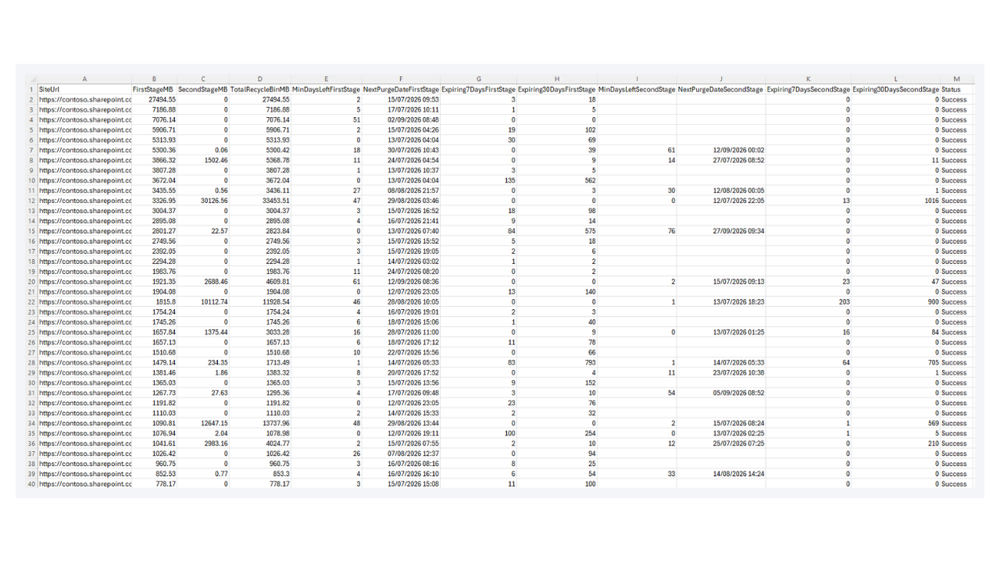

One of the things I've learned working with Microsoft 365 is that storage issues are rarely as straightforward as they first appear.

More than once, I've been asked why a SharePoint site was approaching its storage limit after users had already *"cleaned everything up."* We'd look through the document libraries and the numbers simply didn't add up. Eventually, the answer was almost always the same: the files had been deleted, but they were still sitting in the SharePoint recycle bins, continuing to consume storage.

That's exactly how SharePoint is designed to work. Deleted content remains recoverable for a period before it's permanently removed. The problem wasn't SharePoint, it was the lack of visibility.

While Microsoft provides excellent reporting around overall storage and site usage, I found it surprisingly difficult to answer some fairly simple operational questions across an entire tenant. *Which sites have the largest recycle bins? How much storage is sitting in the First-stage versus the Second-stage recycle bin? When will that storage actually be released?*

After finding myself piecing together the same information repeatedly, I decided to build a PowerShell PnP reporting script that answered those questions in a single report.

The script scans SharePoint Online sites and reports recycle bin storage for both the First-stage and Second-stage recycle bins, calculates the next scheduled purge dates, highlights items approaching permanent deletion, and produces a tenant-wide summary of recycle bin consumption. The idea wasn't simply to collect more data, it was to provide information that could support better operational decisions.

What surprised me wasn't the storage figures themselves. It was how often they explained other problems.

During migration projects, for example, it is common to delete large volumes of test data or restructure document libraries before going live. On more than one occasion, I've seen organisations question why storage hadn't reduced after a migration, only to discover that hundreds of gigabytes - or more were quietly waiting in recycle bins across multiple sites.

The report also became useful when discussing storage planning with customers. Instead of saying, *"You're running out of SharePoint storage,"* I could have a much more informed conversation. If several hundred gigabytes were due to be permanently purged over the next few weeks, it often made sense to wait before purchasing additional storage. Having those purge dates available changed the discussion from reacting to storage issues to planning around them.

That's where I think the real value of this reporting lies.

For technical teams, it provides a clearer picture of how storage is likely to change over time rather than simply showing where things stand today. Understanding upcoming purge dates makes capacity forecasting more accurate and helps identify sites where unusually large recycle bins may warrant further investigation.

For IT managers and decision-makers, the report provides useful context when planning future storage requirements. Rather than relying solely on current consumption figures, they can see how much storage is temporarily tied up in deleted content and how much is expected to be recovered naturally. That leads to better and informed decisions around budgeting and SharePoint storage expansion.

From a governance perspective, I have also found it useful as another health indicator for the tenant. Large recycle bins can sometimes point to migration activity, high document churn, or opportunities to improve lifecycle management. They don't necessarily indicate a problem, but they often start useful conversations.

This isn't intended to replace Microsoft's reporting. Instead, it complements the tools already available by providing operational insight that isn't immediately visible through the SharePoint Admin Center.

Since building the script, it has become one of the reports I regularly include as part of tenant health checks. It gives me a better understanding of storage behaviour, helps answer questions before they become support calls, and provides evidence to support discussions around governance and capacity planning.

Sometimes the most useful reports aren't the ones that tell you what's happening today, they are the ones that help you understand what's going to happen next.

If you'd like to use the script in your own SharePoint Online environment, it's available on GitHub here:

**[https://pnp.github.io/script-samples/spo-recycle-bin-capacity-and-retention-report/README.html?tabs=pnpps](https://pnp.github.io/script-samples/spo-recycle-bin-capacity-and-retention-report/README.html?tabs=pnpps)**

The report produces two outputs. The first is a high-level summary that provides an at-a-glance view of recycle bin usage across the tenant.

The second is a detailed report for each SharePoint site, including recycle bin storage by stage, upcoming purge dates, and other metrics that help identify sites requiring further attention.

I'd be interested to hear how others are approaching recycle bin reporting and storage governance. It's one of those areas that's easy to overlook, but once you start measuring it, you quickly realise how much operational insight has been hiding there all along.
