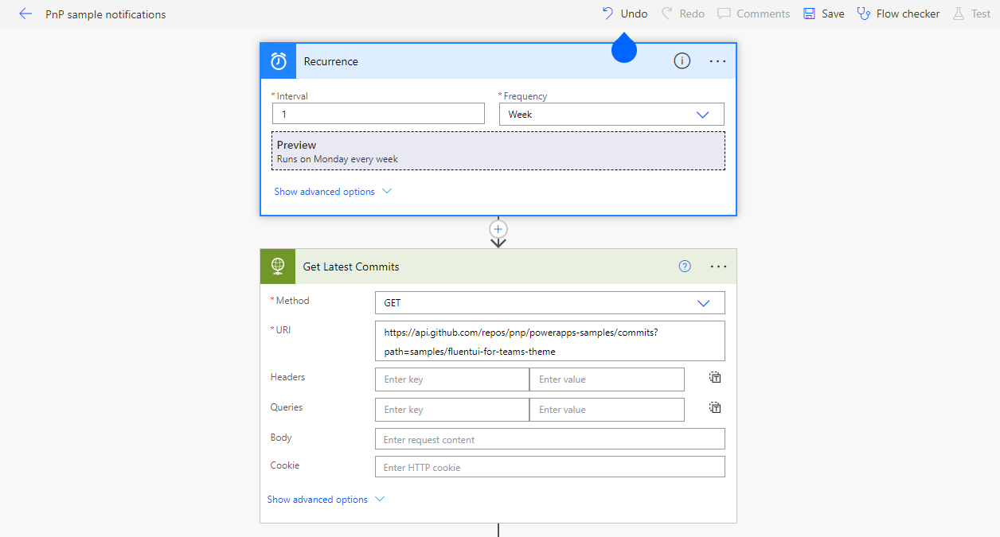
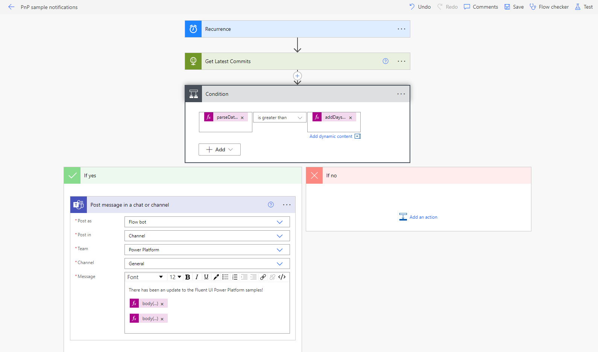
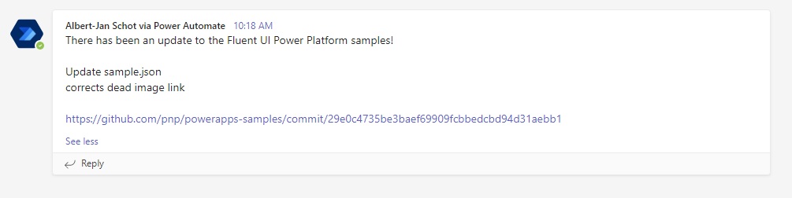

## How to get notifications on PnP samples shared on GitHub

Power Automate can be used to get notifications for PnP samples shared on GitHub or to get reminded on any commits and pull requests in any of your favorite GitHub repos. How does it work? Let’s take a look at how to get notifications on PnP samples shared on GitHub, something that is not possible with GitHub notifications themselves as all PnP samples are shared in the same repository.

## PnP GitHub samples

PnP Samples contain a lot of value but most of them are grouped in the same repository. As a result keeping track of changes becomes a bit harder. This post will show how you can use Power Automate to receive notifications when new samples are added, or existing samples are updated and share those with your team. You can find [Script Samples](https://pnp.github.io/script-samples/) or [PowerApps Samples](https://github.com/pnp/powerapps-samples) as well as many other repositories. They all however live in a sample folder, and while some of those samples are just for inspiration others are 'products' you could use in your own environment. If you are running those samples in your environment the following steps can help you stay up to date and be aware of improvements and changes to the samples you use.

## Working with the GitHub REST API

GitHub has an API that you can use to search for any public GitHub repository, as well as retrieving information like issues, releases and commits. But it does require some understanding on how REST API's work. The simplest way to get started with the is by using a REST client such as Postman, but once you know the REST URL you need you can run them in Power Automate as well. If you find yourself not a developer and API's sound scary do not worry, it is [documented well on GitHub](https://docs.github.com/en/rest/overview/resources-in-the-rest-api), and this blog walks through all the steps. A few remarks up front:

- PnP is an open-source repository, so authentication is not required
- Commits, issues, and releases can be queried using the API
- You can apply additional filters to scope your results

Our goal is to be updated on changes in samples and we can track those with through commits made, so we will be working with the [Commits endpoint](https://docs.github.com/en/rest/commits/commits).

## Building your Power Automate Flow

As we do want to get notifications, we need to figure out a timeframe. For demo purposes you can scan per week, but you can also run things on a daily basis if you require changes as soon as possible. Create a new Flow in an environment of your choosing and select a Timer Trigger. We will be using a HTTP action so you need a Developer or Premium license to build the solution.

Next up adding an HTTP action must that points URL we need:

[screenshot]

## Get updates for existing samples

Any change in the repository is done through a commit, but commits are tracked on the repository level. Since we know the URL for our samples, we can deduct what the API URL to call is. If we want to be updated for changes on the [FluentUI for Teams sample by Luise Freese](https://github.com/pnp/powerapps-samples/tree/main/samples/fluentui-for-teams-theme) the URL `https://github.com/pnp/powerapps-samples/tree/main/samples/fluentui-for-teams-theme` translates to `https://api.github.com/repos/pnp/powerapps-samples/commits`. The next step is to filter our result to only retrieve the commits for a specific sample. Each sample lives in their own `path` so we can use the `path` filter and pass along the sample we are looking for with the following URL `https://api.github.com/repos/pnp/powerapps-samples/commits?path=samples/fluentui-for-teams-theme`. Adding this URL to our HTTP action will give us the commits for the sample we are looking for.

## Get updates for new samples

New samples are tagged with a message New Sample, but there is no way in the API to filter on that. So we need to do so in our Flow ourselves, using the URL `https://api.github.com/repos/pnp/powerapps-samples/commits` we can select the latest commits. Within our Flow we can then filter on the message and only select the ones that contain the text New Sample. This will give us the latest commits that contain the text New Sample. We then can use the output of this action to send a notification to our team, but keep in mind that it might be different per repository. Some repositories might use a different message or tag for new samples, or might not use a message or tag at all. So you might need to adjust the Flow to your needs.

To make sure we only send notifications for new samples we need to validate the date of the commit against our preferred time frame. To get the date of the last commit we can use the `commit.author.date` from our JSON output and parse it as a date time using the following expression: `parseDateTime(body('Get_Latest_Commits')?[0]?['commit']?['author']?['date'])` using the `Greater then` and `addDays(utcNow(), -7)` we can validate if the commit is within the timeframe we are looking for. If it is we can send a notification to our team.

## Building the notification

With the Flow in place to retrieve the results, you can now start thinking about the way you want your notification coming in? Do you want an e-mail or a Teams Notification with adaptive card? For demo purposes let's say we have a team of consultants all using the sample. Posting to a channel that you all can use makes the most sense. Building the adaptive card will provide the best UI experience, but for speed a simple chat message will suffice. In the notification we want to show two things:

- The message of the commit, something we can retrieve using: `body('Get_Latest_Commits')?[0]?['commit']?['message']`
- The URL of the commit, retrievable with: `body('Get_Latest_Commits')?[0]?['html_url']`

With those two things we can build a custom message with the appropriate information. If you want to build an adaptive card you can use the [Adaptive Card Designer](https://adaptivecards.io/designer/) to build the card and then use the JSON output in your Flow. If you expect a lot of commits you might want to consider using a table that contains the date, message and URL single message.

## Run your solution

With the Flow in place, you can expect results, and based on the schedule notifications will pop in. By using this approach, you can stay in the know about any sample you like! A great way to make sure you are tapping into the combined knowledge available for all PnP Samples.

You can of course also use the GitHub REST API for other results, if you are looking for updates for releases you can read more on [Get notified for PnP updates from GitHub](https://www.cloudappie.nl/notified-pnp-updates-github/) or go through all available [API endpoints](https://docs.github.com/en/rest/overview/resources-in-the-rest-api) and build your own custom notification center for anything related to the PnP Samples that are out there 🦾.
