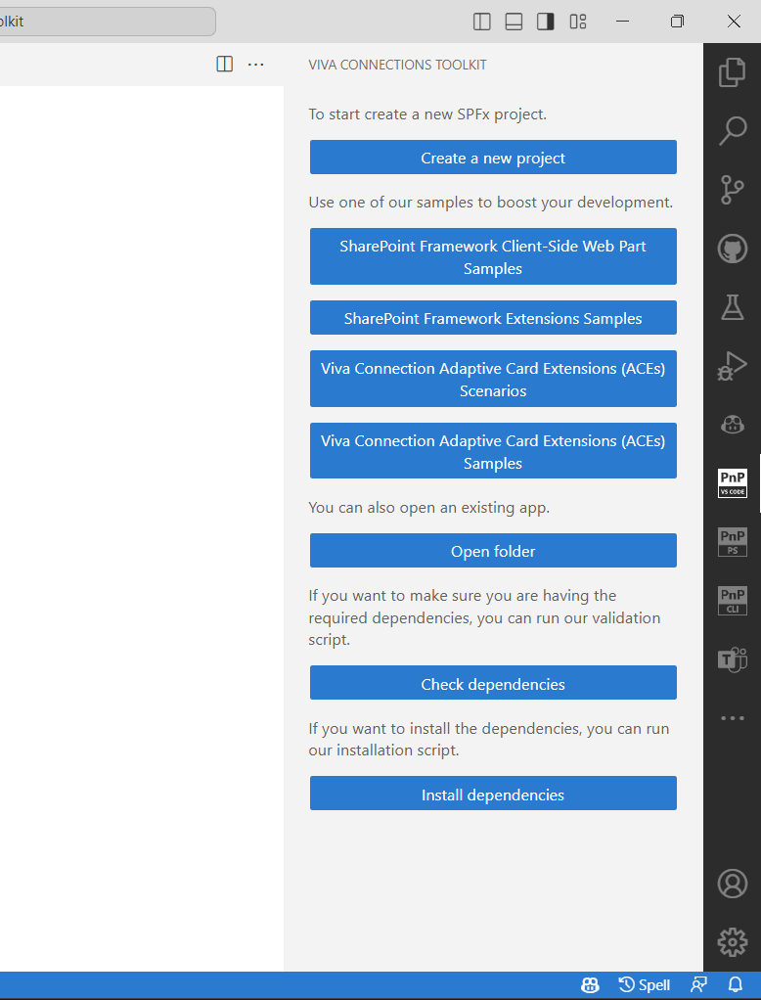
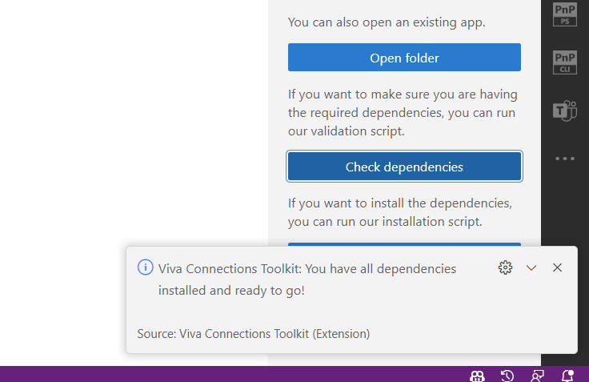
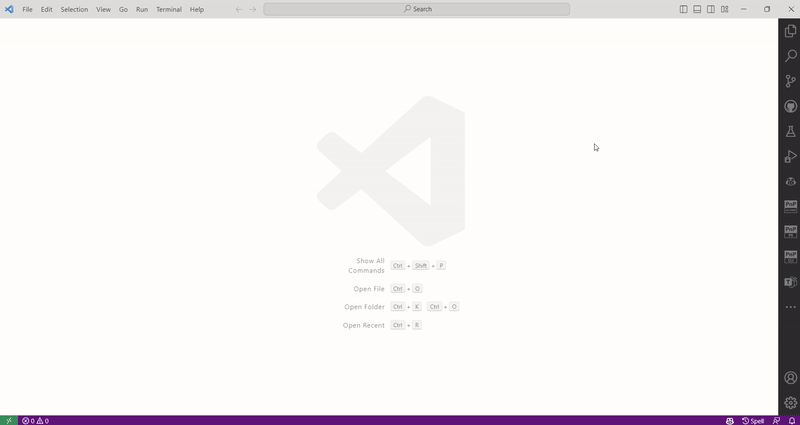
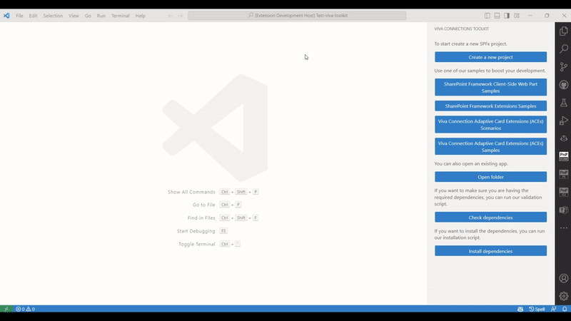
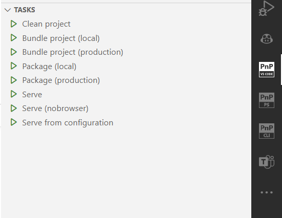
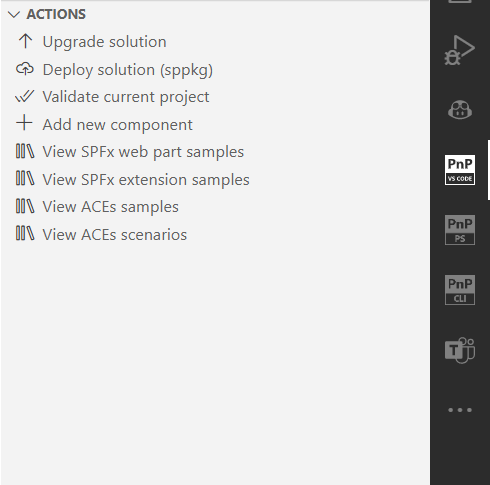
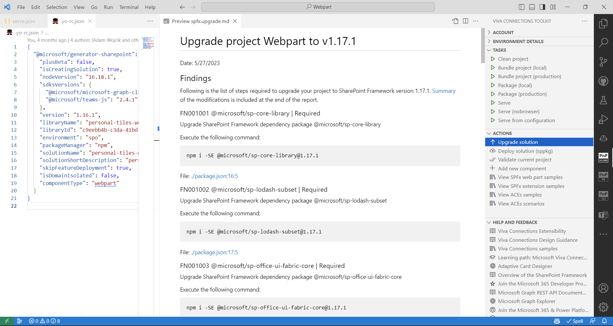
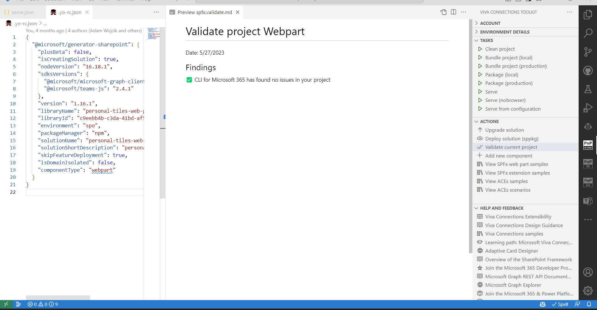
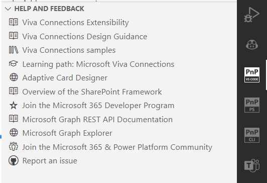

## TL;DR

>The TL;DR (and only this 😉) was AI generated and it's aim is to provide PnP Weekly team quick context of the article.
>Emoji count: 17

This article is about Viva Connections Toolkit which is a Visual Studio Code extension that helps boost productivity in developing and managing SharePoint Framework solutions. It provides a welcome experience to help set up your workspace and offers a step-by-step flow to create new projects. The extension also provides helpful tasks and actions, such as upgrading and validating your solution. You can also connect to your Microsoft 365 tenant and deploy solutions directly to the App Catalog. The extension is made possible by the work of the PnP community and is open to contributions.

## 🗒️ Quick intro

[Viva Connections Toolkit](https://marketplace.visualstudio.com/items?itemName=m365pnp.viva-connections-toolkit) is a Visual Studio Code extension that aims to boost your productivity in developing and managing [SharePoint Framework solutions](https://learn.microsoft.com/en-us/sharepoint/dev/spfx/sharepoint-framework-overview?WT.mc_id=m365-15744-cxa) helping at every stage of your development flow, from setting up your development workspace to deploying a solution straight to your tenant without the need to leave VS Code 🚀.

All of that is possible due to the awesome work done by the [PnP community](https://pnp.github.io/) which is visible in many functionalities of this extension: sample gallery filled with PnP samples, upgrading SPFx project using [CLI for Microsoft 365](https://pnp.github.io/cli-microsoft365/), and many more. It does not matter if you are starting your journey with SPFx development and Viva solutions or if you are already experienced in this area, this VS Code extension will have the features you need to kick off your work to the next level 💪.

## 🏠 Effortless start - welcome experience

Viva Connections Toolkit gets your back at the very beginning by providing a welcome experience that may be used before you even created your SPFx project 🤯! As we all know, everybody needs to set up their own workspace. When working with SharePoint framework you will need a proper Node version and NPM dependencies: Gulp, Yeoman, and [SharePoint generator](https://learn.microsoft.com/en-us/sharepoint/dev/spfx/yeoman-generator-for-spfx-intro). This may seem simple but for someone new to this technology it’s easy to make mistakes, like installing the latest version of Node instead of the required one. Viva Connections Toolkit comes to the rescue 🦸‍♂️ by providing a dependencies check action to validate your workspace and if something is missing there is even a dedicated install dependencies action as well. That’s right, it’s as simple as a single button click.

After you set up your workspace it’s start to create a new project. Here the Viva Connection Toolkit provides a guided step-by-step flow using VS Code UI, yep, no need to use the terminal.

Let’s go over creating a new SPFx extension to check it in action 😎.

Who wants to start from scratch if you may kick off a new solution based on an SPFx web part or extension, ACE sample, or ACE scenario? And you may do that without leaving the VS Code 🚀. The extension provides samples galleries that are populated with the awesome work done by the [PnP Community](https://pnp.github.io/) 🤩. You may browse and pick the sample you are interested in and create a new project based on it, all without the need to leave the context of your work and with a single click.

Check out how easy it is to create a new project based on a web part sample 👇.

## 🦾 Tasks and actions

When you open a SharePoint Framework solution the extension will provide a set of helpful tasks and actions.

The first one are the same tasks that are provided by Gulp which allow you to clean, build, package, and serve your SPFx project. With every task available at a click of a button you may forget about jumping between code and terminal.

What’s even cooler is the actions section 🤩. Here among many helpful features, like the possibility to show a scenario or sample gallery described before, some may provide extremely useful, even for someone experienced in SharePoint framework development.

Upgrade solution action will check your current SharePoint framework project and if it does not use the latest version it will create an upgrade report as markdown file with guidance on how to modify your solution to upgrade it to the latest version of SPFx 👍

The validate action detects the version of your project and runs checks and reports any issues in a markdown report.

## 🔌 Connect to your tenant

The extension also allows you to log in to your Microsoft 365 tenant using [CLI for Microsoft 365](https://pnp.github.io/cli-microsoft365/). Thanks to that the extension will retrieve helpful URLs from your tenant like the link to SharePoint and App Catalog.

Probably in the previous chapter you also noticed the deploy solution action, this will deploy the sppkg package to the App Catalog but this action will only work after you are logged in.

Additionally, when an SPFx project is opened the extension will check serve.json file and suggest updating it to set the initialPage property based on the currently logged-in tenant.

## 📚 All the help you need in single place

Last but not least, the extension has a section with additional resources that might be helpful in SPFx development. To name a few we may find links to the [Microsoft Sample Solutions gallery](https://adoption.microsoft.com/en-us/sample-solution-gallery/?sortby=creationDateTime-true&keyword=&product=Viva&action=ajax_plugin_call_sample_solution_gallery), [Adaptive Card Designer](https://adaptivecards.io/designer/), [Microsoft Graph Explorer](https://developer.microsoft.com/en-us/graph/graph-explorer), and many documentation resources, and of course to the best community in the world 😍.

## 🗺️ Roadmap

As you may see Viva Connections Toolkit provides many useful functionalities that are extremely helpful in every stage of developing and managing your SPFx solution. From setting up your local workspace and creating a new project to helping in development by providing build, package, and serve tasks, and maintenance thanks to actions that allow you to validate, extend and upgrade your solution. And all this is just the beginning! Soon we will include more functionalities that will allow you to easier manage your solution in the currently logged-in tenant or provide more support in developing the SPFx project. Intrigued? Check out the [issue list](https://github.com/pnp/vscode-viva/issues) to see what’s about to come and stay tuned for more.

## 👍 Power of the community

As it was already pointed out in many parts of this article, this extension would not have been possible if it weren’t for the awesome work done by the [Microsoft 365 & Power Platform Community](https://pnp.github.io/). Each sample gallery: SPFx web parts & extensions, and ACE samples & scenarios are all populated with the contributions done by the community. Many of the functionalities of the extension like upgrading, validating, and deploying your SPFx project, would not have been possible if it wasn’t for the [CLI for Microsoft 365](https://pnp.github.io/cli-microsoft365/) tool. I would like to sincerely thank all of our awesome contributors! Creating this extension would not have been possible if it weren’t for the enormous work done by the community. You all rock 🤩.

If you would like to participate, the community welcomes everybody that wants to build and share feedback around Microsoft 365 & Power Platform. Join one of our [community calls](https://pnp.github.io/#community) to get started and be sure to visit 👉 https://aka.ms/community/home.

## 🙋 Wanna help out?

Of course, we are open to contributions. If you would like to participate do not hesitate to visit our [GitHub repo](https://github.com/pnp/vscode-viva) and start a discussion or engage in one of many issues we have. Feedback (positive or negative) is also more than welcome.

## 🔗 Resources

- [Download Viva Connections Toolkit at VS Code Marketplace](https://marketplace.visualstudio.com/items?itemName=m365pnp.viva-connections-toolkit)
- [Viva Connections Toolkit GitHub repo](https://github.com/pnp/vscode-viva)
- [Microsoft 365 & Power Platform Community](https://pnp.github.io/#home)
- [CLI for Microsoft 365](https://pnp.github.io/cli-microsoft365/)
- [Overview of the SharePoint Framework](https://learn.microsoft.com/en-us/sharepoint/dev/spfx/sharepoint-framework-overview?WT.mc_id=m365-15744-cxa)
- [Overview of Viva Connections Extensibility](https://learn.microsoft.com/en-us/sharepoint/dev/spfx/viva/overview-viva-connections?WT.mc_id=m365-47395-cxa)
- [Microsoft Learn – Extend Microsoft Viva Connections](https://learn.microsoft.com/en-us/training/paths/m365-extend-viva-connections/?WT.mc_id=m365-47395-cxa)