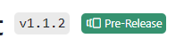

## 🗒️ Quick intro

[Viva Connections Toolkit](https://marketplace.visualstudio.com/items?itemName=m365pnp.viva-connections-toolkit) is a Visual Studio Code extension that aims to boost your productivity in developing and managing [SharePoint Framework solutions](https://learn.microsoft.com/sharepoint/dev/spfx/sharepoint-framework-overview?WT.mc_id=m365-15744-cxa) helping at every stage of your development flow, from setting up your development workspace to deploying your solution straight to your tenant without the need to leave VS Code 🚀.

All of that is possible due to the awesome work done by the [PnP community](https://pnp.github.io/) which is visible in many functionalities of this extension: sample gallery filled with [PnP samples](https://pnp.github.io/#samples), upgrading SPFx project using [CLI for Microsoft 365](https://pnp.github.io/cli-microsoft365/), and many more. It does not matter if you are starting your journey with SPFx development and Viva solutions or if you are already experienced in this area, this VS Code extension will have the features you need to kick off your work to the next level 💪.

After releasing the v1 we started our journey towards the next major with features that are going to support your SPFx development at every stage. From helping you with code to managing your solution and in the end setting up a CI/CD pipeline for your project. We are not there yet but we already implemented a couple of features you may already try in the latest pre-release 💪.
Check out the roadmap for the upcoming v2 and be sure to go over the details and test it out. Feedback is highly appreciated 👍

Roadmap for the v2​:

- 👨‍💻 Generating CI/CD pipeline for SPFx project using CLI for Microsoft 365 GitHub actions (in progress) ​
- ✅Code snippets for SPFx solutions (available in v1.1.2 pre-release)​
- ✅Action that will allow renaming a project (available in v1.1.2 pre-release)​
- ✅Deploying solution to the site app catalog (available in v1.1.2 pre-release)​
- ✅Extending environment details view (available in v1.1.2 pre-release)​
- Granting project permissions (not started)

## 🎁 How to download the pre-release

In order to try out the latest and greatest first you will need to install the [major version of the extension (currently v1.1.0)](https://marketplace.visualstudio.com/items?itemName=m365pnp.viva-connections-toolkit). You may do that directly from the VS code marketplace or by using the extension tab in VS Code.

After you successfully installed the extension you should see an additional option that will allow you to switch to the latest prerelease version of the extension, which currently is v1.1.2.

You may confirm that you are using the pre-release by the additional tag present next to the extension title.

## 👨‍💻 SPFx Coding snippets to boost your work

One of the first thing we focused on were coding snippets which will provide you the necessary kick when developing SPFx specific (but not only) features. We did not reinvent the wheel here. Open source and community effort are at the very core of this extension so also here we decided to add [SPFx Snippets](https://marketplace.visualstudio.com/items?itemName=eliostruyf.spfx-snippets) created by Elio Struyf, as one of the components which will be installed together with Viva Connections Toolkit.

That way we were able to quickly add this support and also commit our work to keep SPFx Snippets stable and up to date. The extensions provide many useful snippets which will save you a lot of time when implementing a new component to your project or some commonly used feature. No need to start the implementation from scratch if you may get a head start.

This is only the first step in one of the features we integrated to help you directly in code when creating your SPFx solution. We are already looking at the future ahead of us and investigating more ways that will boost that in the upcoming major releases.

## 🤩 Site App Catalog Support

Till now the Viva Connections Toolkit only supported tenant-level App Catalog. After successfully logging in to your tenant the extension presented you the link to the tenant-level app catalog in the environment section. Also the deploy action only allowed you to deploy you .sppkg file to the tenant level app catalog. So if you wanted to deploy your solution to the site-level app catalog you still needed to do that manually either using CLI for Microsoft 365 or PnP PowerShell or directly using a web browser making you switch the context and move outside of your work 🤦.
Now in the latest pre-release, we extended this functionality with the support of site-level app catalogs. The environment section will now present you both tenant and all site app catalogs. This will give you a quick overview of all the places you may deploy your app and additional navigation to quickly access one of the app catalogs.

Also when using the deploy action you will see an additional step to select which app catalog you want to use. This step is only present if there is at least more than one app catalog present in your tenant.

No more context switching and no more additional manual work. Just a single click and you are ready to go 🚀.
This is just the beginning of this feature. Soon we are thinking of adding more features that will allow you to quickly understand what solutions are deployed in each app catalog allowing you to move them between tenant and site-level app catalogs. Also, we are thinking of implementing a feature that will allow you to manage SPFx extensions deployed for the whole tenant. Those are just a few ideas we have on our list but should already give you a feeling of the functionalities we would like to add to the extension in the (I hope) near future.

## 📝 Rename your SPFx project

Remember when you created and presented your SPFx webpart and everything was ok but the name needed to be adjusted. Ever used the "test" prefix for your project name and then regrated it afterward 🤦. Or maybe you reused one of the PnP samples but now you needed to give it a different name and solution ID. In the end, you needed to search for all the places and correct them manually and there always was this one single place that you missed right🙂?
If you had one of those situations then you are going to love this new feature already present in the Viva Connections Toolkit pre-release. Now in the actions section, you will see an additional action that will allow you to quickly rename your currently opened solution with a couple of clicks.

Under the hood, the feature is using CLI for Microsoft 365 `spfx project rename` command which allows you to replace the existing name in the following places: package.json, .yo-rc.json, package-solution.json, deploy-azure-storage.json and README.md.

Reduce the amount of manual work and let Viva Connections Toolkit do them for you. Soon we are planning on extending actions with more features allowing you to manage your SPFx project with ease.

## 🦾 Set up you CI/CD pipeline with a couple of clicks

DevOps is an important part of each project and SPFx solutions are no different. Wouldn’t it be awesome if on every change and push to the repository to the main branch the solution would be automatically deployed to your tenant. Viva Connections Toolkit will help you with exactly that. This feature is not finished yet but the idea is to add an additional action that will generate a yaml pipeline that will prepare and deploy your solution using [CLI for Microsoft 365 GitHub actions](https://pnp.github.io/cli-microsoft365/user-guide/github-actions).
As Viva Connections Toolkit is all about community effort the team has decided to add this functionality as a new command in CLI for Microsoft 365 so that it may be leveraged in other scenarios not only in the VS Code extension 😍. Since CLI for Microsoft 365 is also used under the hood of Viva Connections Toolkit it will be then exposed as a new action in the extension sidebar.
As of now, the first step is to add support only for GitHub workflows but we are already looking ahead to extend this functionality by generating other pipelines compatible for example with Azure DevOps. Have a look out for this feature to come and be sure to give it a try when it’s released.
To track our progress on this feature check out the following issues:

- [New command: spfx project github workflow add](https://github.com/pnp/cli-microsoft365/issues/5209)
- [[Feature]: Add support to generate a CI/CD pipeline for your solution](https://github.com/pnp/vscode-viva/issues/44)

## 🧪 Grant Graph permissions without the need to deploy your app

Remember when you had to debug an SPFx solution that needed API permissions? Now instead of just serving it to your local workspace, you would need to bundle, package, deploy, go to that SharePoint admin center, and approve those permissions 🤦. What a waste of time.
That is why we are planning to add a new action in Viva Connections Toolkit which will do all that for you with a single click. Unfortunately, the work on this feature hasn’t started yet 😢 but the idea is to retrieve permissions requests from the current project defined in the package-solution.json, and grant permission to them for the user. All that work is done in an easy way so that you don’t need to worry about that and just focus on creating awesome stuff 👍.

## 🗺️ Roadmap

As you may see we already added a couple of features that we planned for the v2 major release and we hope to finish the last two ASAP. But the journey definitely doesn’t stop there. As already pointed out in this article we are constantly looking for features and improvements for future major releases which will give you more support and help in creating and managing your SPFx solution at every stage. From setting up a workspace to writing code, managing your project, and finally deploying and setting up a CI/CD pipeline for your project. The Viva Connections Toolkit VS Code extension is still quite young so be sure to give it a try, provide feedback, and be on the lookout for the awesome new things that are about to come in the future 🤩.

## 👍 Power of the community

As it was already pointed out in many parts of this article, this extension would not have been possible if it weren’t for the awesome work done by the [Microsoft 365 & Power Platform Community](https://pnp.github.io/). Each sample gallery: SPFx web parts & extensions, and ACE samples & scenarios are all populated with the contributions done by the community. Many of the functionalities of the extension like upgrading, validating, and deploying your SPFx project, would not have been possible if it wasn’t for the [CLI for Microsoft 365](https://pnp.github.io/cli-microsoft365/) tool. I would like to sincerely thank all of our awesome contributors! Creating this extension would not have been possible if it weren’t for the enormous work done by the community. You all rock 🤩.

If you would like to participate, the community welcomes everybody that wants to build and share feedback around Microsoft 365 & Power Platform. Join one of our [community calls](https://pnp.github.io/#community) to get started and be sure to visit 👉 https://aka.ms/community/home.

## 🙋 Wanna help out?

Of course, we are open to contributions. If you would like to participate do not hesitate to visit our [GitHub repo](https://github.com/pnp/vscode-viva) and start a discussion or engage in one of many issues we have. Feedback (positive or negative) is also more than welcome.

## 🔗 Resources

- [Use Viva Connections Toolkit for VS Code to boost your productivity with SharePoint Framework projects](https://pnp.github.io/blog/post/viva-connections-toolkit-vscode-general-intro/)
- [Download Viva Connections Toolkit at VS Code Marketplace](https://marketplace.visualstudio.com/items?itemName=m365pnp.viva-connections-toolkit)
- [Viva Connections Toolkit GitHub repo](https://github.com/pnp/vscode-viva)
- [Microsoft 365 & Power Platform Community](https://pnp.github.io/#home)
- [CLI for Microsoft 365](https://pnp.github.io/cli-microsoft365/)
- [Overview of the SharePoint Framework](https://learn.microsoft.com/sharepoint/dev/spfx/sharepoint-framework-overview?WT.mc_id=m365-15744-cxa)
- [Overview of Viva Connections Extensibility](https://learn.microsoft.com/sharepoint/dev/spfx/viva/overview-viva-connections?WT.mc_id=m365-47395-cxa)
- [Microsoft Learn – Extend Microsoft Viva Connections](https://learn.microsoft.com/training/paths/m365-extend-viva-connections/?WT.mc_id=m365-47395-cxa)
