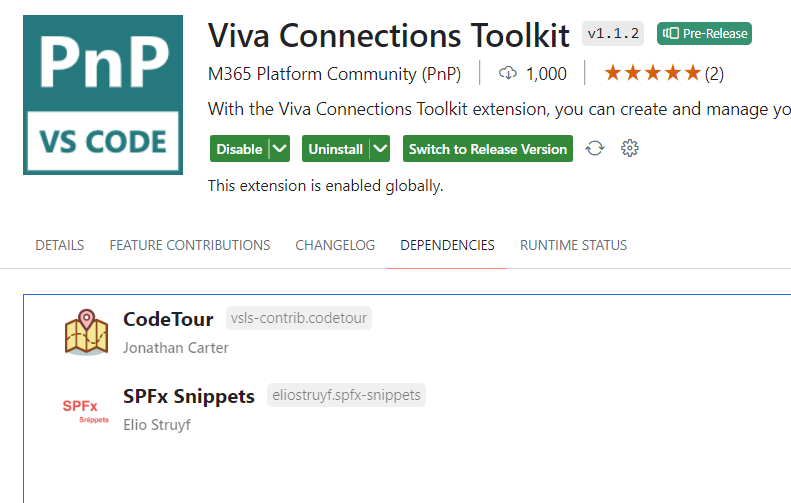
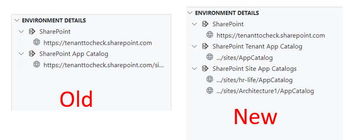
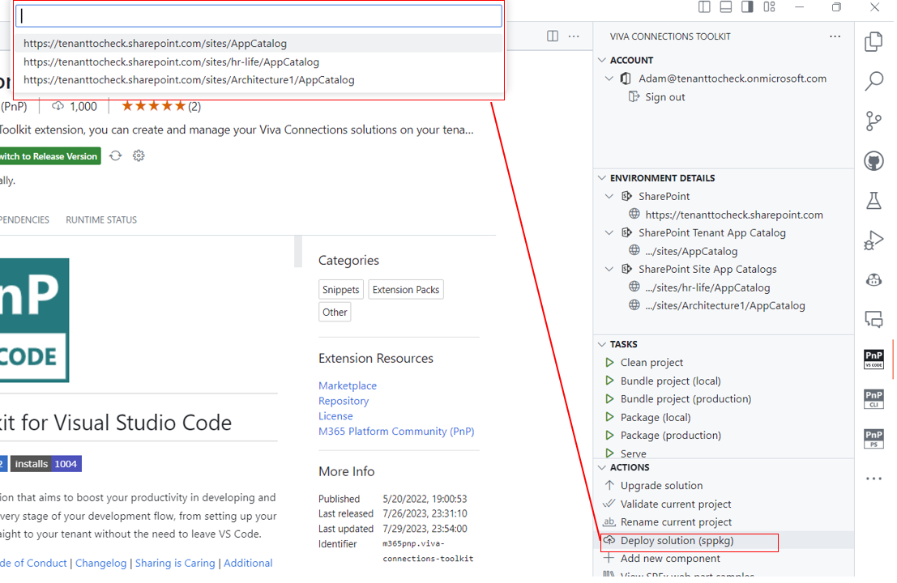
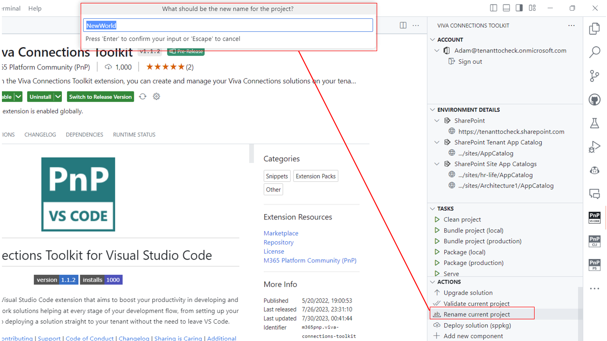
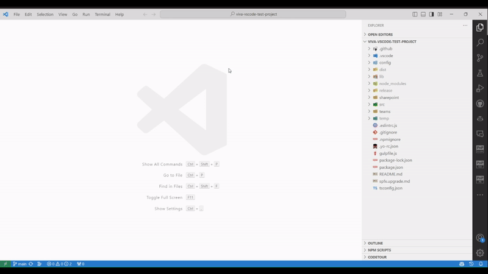
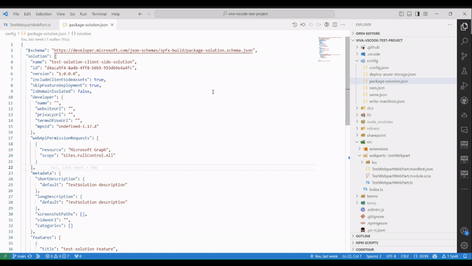

## 🗒️ Quick intro

[Viva Connections Toolkit](https://marketplace.visualstudio.com/items?itemName=m365pnp.viva-connections-toolkit) is a Visual Studio Code extension that aims to boost your productivity in developing and managing [SharePoint Framework solutions](https://learn.microsoft.com/en-us/sharepoint/dev/spfx/sharepoint-framework-overview?WT.mc_id=m365-15744-cxa) helping at every stage of your development flow, from setting up your development workspace to deploying a solution straight to your tenant without the need to leave VS Code and now even create a CI/CD pipeline to introduce automate deployment of your app 🚀.

All of that is possible due to the awesome work done by the [PnP community](https://pnp.github.io/) which is visible in many functionalities of this extension: sample gallery filled with [PnP samples](https://pnp.github.io/#samples), upgrading SPFx project using [CLI for Microsoft 365](https://pnp.github.io/cli-microsoft365/), and many more. It does not matter if you are starting your journey with SPFx development and Viva solutions or if you are already experienced in this area, this VS Code extension will have the features you need to kick off your work to the next level 💪.

After a couple of iterations, we are proud to announce the Viva Connections Toolkit next MAJOR RELEASE 👉 v2 🥳! 

Our aim was to extend and introduce functionalities that will help you in every aspect of developing and managing your SPFx project. In this release, we took the first steps in features that will help you code your project more quickly and effectively using code snippets, as well as introduce continuous integration and deployment using GitHub workflows and [CLI for Microsoft 365 GitHub actions](https://pnp.github.io/cli-microsoft365/user-guide/github-actions) with just a few clicks. We also introduced new actions that will take away the manual work that needs to be done when renaming an SPFx project or granting API permissions to your project needed to have. No more you need to package and deploy and then go to the SharePoint admin portal to consent API permissions required by the package, all of that may now be done with just a single click. 

Check out the full list of features added in this release 👇:

- 👉 Generating CI/CD pipeline for SPFx project using CLI for Microsoft 365 GitHub actions 
- 👉 Code snippets for SPFx solutions
- 👉 Action that will allow renaming a project
- 👉 Deploying solution to the site app catalog
- 👉 Extending environment details view
- 👉 Granting project permissions

Sounds cool 😎? Let’s have a deeper dive and check the features in a bit more detail 👇

## 🦾 CI/CD GitHub Workflow action

DevOps is an important part of each project and SPFx solutions are no different. But setting up continuous integration and deployment flows may not be easy, especially if you only just started your journey with SPFx and you have no previous experience with setting up pipelines and yaml 🤔. It’s also common for experienced developers to focus on coding and adding more and more features and improvements to the app and leaving the DevOps part at the very end of the project usually because setting it up takes time especially when you have to start from scratch. TBH I do (did) the same 😅, Since deploying my project to my dev tenant is as easy as clicking the deploy action why would I think about a pipeline for it 🤔. 

Well, this is especially beneficial when you work in a team and you would like to have your solution deployed and ready for testing whenever someone pushes a new feature to the main branch. Also, CI/CD is not only about deployment. You may extend the workflow with more steps that run tests or other checks along the way.

In this release, we took the first steps to allow you to set up a CI/CD flow in a matter of minutes. There is much guidance on the web that explains how to set up a new workflow and authentication but it turned out the biggest challenge was always to start, so creating your first yaml file with steps that will bundle, package, and deploy your project to the app catalog. Viva Connections Toolkit will do that for you even if you don’t have any experience with yaml. In the actions section, you will find a new 'CI/CD GitHub Workflow' button. Yes, currently Viva Connection Toolkit supports only creating pipelines for GitHub as those may use the [CLI for Microsoft 365 GitHub actions](https://pnp.github.io/cli-microsoft365/user-guide/github-actions) but this is only the beginning and we want to extend this functionality for more platforms like Azure DevOps in the upcoming future. Now let’s get back to what we have. 

After clicking on the action, Viva Connections Toolkit will guide you through a few questions before generating a new flow. What’s important to know is that you may leave everything as default and as a result, you will still get a perfectly working pipeline at the end. 

Check it out in action 👇

To go over all the details check out the [project wiki]( https://github.com/pnp/vscode-viva/wiki/4.6-Actions#cicd-github-workflow)

## 👨‍💻 SPFx Coding snippets to boost your work

An essential part of every project is… yep.. code 😉 and Viva Connections Toolkit will help you here as well. We did not reinvent the wheel here. Open source and community effort are at the very core of this extension so also here we decided to add [SPFx Snippets](https://marketplace.visualstudio.com/items?itemName=eliostruyf.spfx-snippets) created by Elio Struyf, as one of the components which will be installed together with Viva Connections Toolkit.

The extensions provide many useful snippets that will save you a lot of time when implementing a new component to your project or some commonly used features. No need to start the implementation from scratch if you get a head start.

Check it out in action 👇

This is only the first step in one of the features we integrated to help you directly in code when creating your SPFx solution. We are already looking at the future ahead of us and investigating more ways that will boost that in the upcoming major releases.

Check out [the wiki](https://github.com/pnp/vscode-viva/wiki/4.8-Coding-Snippets) to read more about this feature.

## 🤩 Site App Catalog Support 

Till now the Viva Connections Toolkit only supported tenant-level App Catalog. After successfully logging in to your tenant the extension presented you the link to the tenant-level app catalog in the environment section. Also, the deploy action only allowed you to deploy your .sppkg file to the tenant-level app catalog. So if you wanted to deploy your solution to the site-level app catalog you still needed to do that manually either using CLI for Microsoft 365 or PnP PowerShell or directly using a web browser making you switch the context and move outside of your work. 
Now in this release, we extended this functionality with the support of site-level app catalogs. The environment section will now present you both tenant and all site app catalogs. This will give you a quick overview of all the places you may deploy your app and an additional navigation to quickly access one of the app catalogs. 

Also when using the deploy action you will see an additional step to select which app catalog you want to use. This step is only present if there is at least more than one app catalog present in your tenant.

No more context switching and no more additional manual work. Just a single click and you are ready to go 🚀. 

Read more about this feature on our [project wiki]( https://github.com/pnp/vscode-viva/wiki/4.4-Login-to-your-tenant-&-retrieve-environment-details).

## 📝 Rename your SPFx project

Remember when you created and presented your SPFx webpart and everything was ok but the name needed to be adjusted. Ever used the 'test' prefix for your project name and then regrated it afterward 😜. Or maybe you reused one of the PnP samples but now you needed to give it a different name and project GUID. In the end, you needed to search for all the places and correct them manually and there always was this one single place that you missed right🙂?
If you had one of those situations then you are going to love this new feature. Now in the actions section, you will see an additional action that will allow you to quickly rename your currently opened solution with a couple of clicks. 

Under the hood, the feature is using CLI for Microsoft 365 `spfx project rename` command which allows you to replace the existing name in the following places: 

- package.json, 
- .yo-rc.json, 
- package-solution.json, 
- deploy-azure-storage.json,
- README.md.

Check it out in action 👇

Visit our [project wiki]( https://github.com/pnp/vscode-viva/wiki/4.6-Actions#rename-current-project) to read more about this feature.

Reduce the amount of manual work and let Viva Connections Toolkit do them for you. Soon we are planning on extending actions with more features allowing you to manage your SPFx project with ease.

## 🧪 Grant Graph permissions without the need to deploy your app

Remember when you had to debug an SPFx solution that needed API permissions? Now instead of just serving it to your local workspace, you would need to bundle, package, deploy, go to that SharePoint admin center, and approve those permissions 🤦. What a waste of time. What’s awesome is that Viva Connection Toolkit has a new action that does all that for you with a single click. The ‘Grant API permissions’ action will retrieve and grant all permissions specified in the package-solution.json file.

Check it out in action 👇

Read more about this feature in [project wiki](https://github.com/pnp/vscode-viva/wiki/4.6-Actions#grant-api-permissions).

## 🗺️ Future roadmap

From setting up workspace to writing code, managing your project and finally deploying and setting up a CI/CD pipeline for your project. Viva Connections Toolkit aims to boost your SPFx development to the next level 🚀. 

The VS Code extension is still quite young so be sure to give it a try, provide feedback, and be on the lookout for the awesome new things that are about to come in the future. We are constantly looking forward to and working on the backlog for the next major (v3.0) release. If you have a suggestion or idea you would like to share, then be sure to join the [discussion on GitHub]( https://github.com/pnp/vscode-viva/discussions/75) and leave a comment 👍.

## 👍 Power of the community

As was already pointed out in many parts of this article, this extension would not have been possible if it weren’t for the awesome work done by the [Microsoft 365 & Power Platform Community](https://pnp.github.io/). Each sample gallery: SPFx web parts & extensions, and ACE samples & scenarios are all populated with the contributions done by the community. Many of the functionalities of the extension like upgrading, validating, and deploying your SPFx project, would not have been possible if it wasn’t for the [CLI for Microsoft 365](https://pnp.github.io/cli-microsoft365/) tool. I would like to sincerely thank all of our awesome contributors! Creating this extension would not have been possible if it weren’t for the enormous work done by the community. You all rock 🤩.

If you would like to participate, the community welcomes everybody who wants to build and share feedback around Microsoft 365 & Power Platform. Join one of our [community calls](https://pnp.github.io/#community) to get started and be sure to visit 👉 https://aka.ms/community/home.

## 🙋 Wanna help out?

Of course, we are open to contributions. If you would like to participate do not hesitate to visit our [GitHub repo](https://github.com/pnp/vscode-viva) and start a discussion or engage in one of the many issues we have. Feedback (positive or negative) is also more than welcome.

## 🔗 Resources

- [Download Viva Connections Toolkit at VS Code Marketplace](https://marketplace.visualstudio.com/items?itemName=m365pnp.viva-connections-toolkit)
- [Viva Connections Toolkit GitHub repo](https://github.com/pnp/vscode-viva)
- [Microsoft 365 & Power Platform Community](https://pnp.github.io/#home)
- [Join the Microsoft 365 & Power Platform Community Discord Server]( https://aka.ms/community/discord)
- [Wiki]( https://github.com/pnp/vscode-viva/wiki)
- [Join the Microsoft 365 Developer Program]( https://developer.microsoft.com/en-us/microsoft-365/dev-program)
- [CLI for Microsoft 365](https://pnp.github.io/cli-microsoft365/)
- [Sample Solution Gallery]( https://adoption.microsoft.com/en-us/sample-solution-gallery/)
