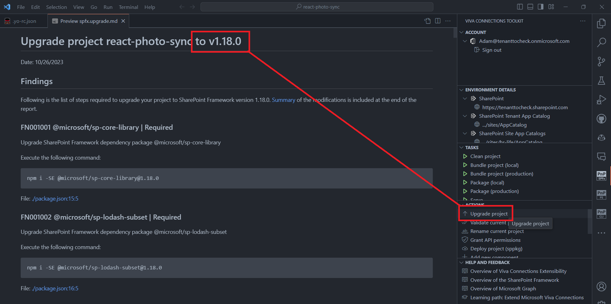
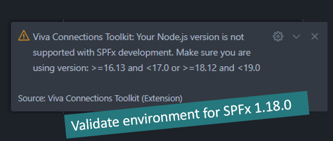
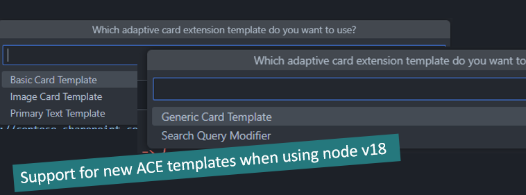
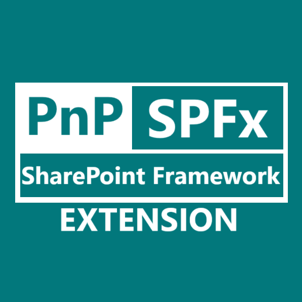

## 🗒️ Quick intro

[Viva Connections Toolkit](https://marketplace.visualstudio.com/items?itemName=m365pnp.viva-connections-toolkit) is a Visual Studio Code extension that aims to boost your productivity in developing and managing [SharePoint Framework solutions](https://learn.microsoft.com/en-us/sharepoint/dev/spfx/sharepoint-framework-overview?WT.mc_id=m365-15744-cxa) helping at every stage of your development flow, from setting up your development workspace to deploying a solution straight to your tenant without the need to leave VS Code and now even create a CI/CD pipeline to introduce automate deployment of your app 🚀.

All of that is possible due to the awesome work done by the [PnP community](https://pnp.github.io/) which is visible in many functionalities of this extension: sample gallery filled with [PnP samples](https://pnp.github.io/#samples), upgrading SPFx project using [CLI for Microsoft 365](https://pnp.github.io/cli-microsoft365/), and many more. It does not matter if you are starting your journey with SPFx development and Viva solutions or if you are already experienced in this area, this VS Code extension will have the features you need to kick off your work to the next level 💪.

In this minor release the team focused more on the technical aspects of the extension but we manged to improve the current features as well 💪.

Check out the full list of updates in this release 👇:

- 👉 Bug fix of Login after logout
- 👉 Bug fix to read sample data from main
- 👉 Adds support for SPFx 1.18.0 (upgrade)
- 👉 Validate environment will validate Node 16-18
- 👉 Update scaffolding process (different flow for Node 16 and 18, new
ACEs templates)
- 👉 Logo update - first steps in product rebranding
- 👉 Dependencies update
- 👉 Refactored pipelines to replace npm package with local cleaned-up
version of CLI
- 👉 Refactored pipelines to use node v18
- 👉 Adds new pipeline to create artifact with package
- 👉 Reduce extension size

Sounds cool 😎? Let’s have a deeper dive and check a couple of updates in a bit more detail 👇

## 🚀 Update support of SPFx to 1.18.0

It has already been a while since the SPFx 1.18.0 release, but due to technical issues it wasn't possible to 'just' update and include this support 😟. Fortunately, we managed to overcome this issue (more about that later) and now there is nothing stopping us from moving forward 🥳. 

In this minor release, we updated the upgrade and validate action to SPFx version 1.18.0. 

Since SPFx v1.18.0 adds the support for Node.js v18, Viva Connections Toolkit when validating your development setup now will also check for either Node v16 (for older SPFx projects) and Node v18.

Also, the latest release of SharePoint Framework introduces new ACE templates. Due to that when you are using Node v18 you will also see new templates to pick when creating a new ACE component/project.

## 🧑‍💻 Workaround for ES Modules for VS Code extensions

One of the biggest challenges in this release was the refactor of CLI for Microsoft 365 to ES modules. As this was a good decision for that product, in order to keep up to date with the latest tech, it wasn't the best option for Viva Connections Toolkit. Under the hood, this VS Code extension uses CLI for Microsoft 365 as and dependency to be its single API to M365 tenant 🤯.... Wait you didn't know it was possible? Check [this article](https://pnp.github.io/cli-microsoft365/user-guide/use-cli-api) to get more insights. 

Unfortunately, VS Code internally uses an older version of Electron which currently does not support ES Modules. More details may be found in [this issue](https://github.com/microsoft/vscode/issues/130367). Also, it is not yet clear when VS Code team will add this support, as there already is an Electron version that suports esm. So in order not to keep this product on hold the team has decided to make a local fork of the CLI for Microsoft 365 and revert it back to common js adding along the way all of the newest functionalities that were added 😮. Ye I know this was a looooooot of work but thanks to that we are able to continue adding new features to Viva Connections Toolkit. We hope this is a 'temporary' 😉 state and as soon as ESM is supported in VS Code we will jump back to using the official PnP CLI for Microsoft 365 package.

Thanks to this refactor the team has also noticed a possibility to reduce the extension size which will decrease the start-up and install time 🚀. We already made the first step in this direction and we hope to improve even more in this area in the upcoming minor releases.

## 🎨 Rebrading

Every good product needs to have a good name at some point right 😜? Since this extension's aim is to help you achieve more in everything related to SharePoint Framework development the name, Viva Connection Toolkit, may still indicate this is only Viva specific. In order to make it clear that the scope is not only Viva but everything where SharePoint Framework apps may be used, we took the first step and introduced a new logo for the extension. Let us know if you like it 👍.

## 🗺️ Future roadmap

In the near future, we are planning a next minor release (v2.2.0) in which we want to further improve on reducing the extension size and also update the CI/CD GitHub Workflow action to use Node.js v18 for SPFx v1.18.0 projects.

We are also looking at a longer distance, a marathon for sure 🏃‍♂️😜, which will be the new product major release (v3). We are still in the process of clarifying the scope and features we want to include. If you want to check out what we are considering or would like to leave your idea please feel free to join the [discussion](https://github.com/pnp/vscode-viva/discussions/75)

## 👍 Power of the community

This extension would not have been possible if it weren’t for the awesome work done by the [Microsoft 365 & Power Platform Community](https://pnp.github.io/). Each sample gallery: SPFx web parts & extensions, and ACE samples & scenarios are all populated with the contributions done by the community. Many of the functionalities of the extension like upgrading, validating, and deploying your SPFx project, would not have been possible if it wasn’t for the [CLI for Microsoft 365](https://pnp.github.io/cli-microsoft365/) tool. I would like to sincerely thank all of our awesome contributors! Creating this extension would not have been possible if it weren’t for the enormous work done by the community. You all rock 🤩.

If you would like to participate, the community welcomes everybody who wants to build and share feedback around Microsoft 365 & Power Platform. Join one of our [community calls](https://pnp.github.io/#community) to get started and be sure to visit 👉 https://aka.ms/community/home.

## 🙋 Wanna help out?

Of course, we are open to contributions. If you would like to participate do not hesitate to visit our [GitHub repo](https://github.com/pnp/vscode-viva) and start a discussion or engage in one of the many issues we have. Feedback (positive or negative) is also more than welcome.

## 🔗 Resources

- [Download Viva Connections Toolkit at VS Code Marketplace](https://marketplace.visualstudio.com/items?itemName=m365pnp.viva-connections-toolkit)
- [Viva Connections Toolkit GitHub repo](https://github.com/pnp/vscode-viva)
- [Microsoft 365 & Power Platform Community](https://pnp.github.io/#home)
- [Join the Microsoft 365 & Power Platform Community Discord Server]( https://aka.ms/community/discord)
- [Wiki]( https://github.com/pnp/vscode-viva/wiki)
- [Join the Microsoft 365 Developer Program]( https://developer.microsoft.com/en-us/microsoft-365/dev-program)
- [CLI for Microsoft 365](https://pnp.github.io/cli-microsoft365/)
- [Sample Solution Gallery]( https://adoption.microsoft.com/en-us/sample-solution-gallery/)
