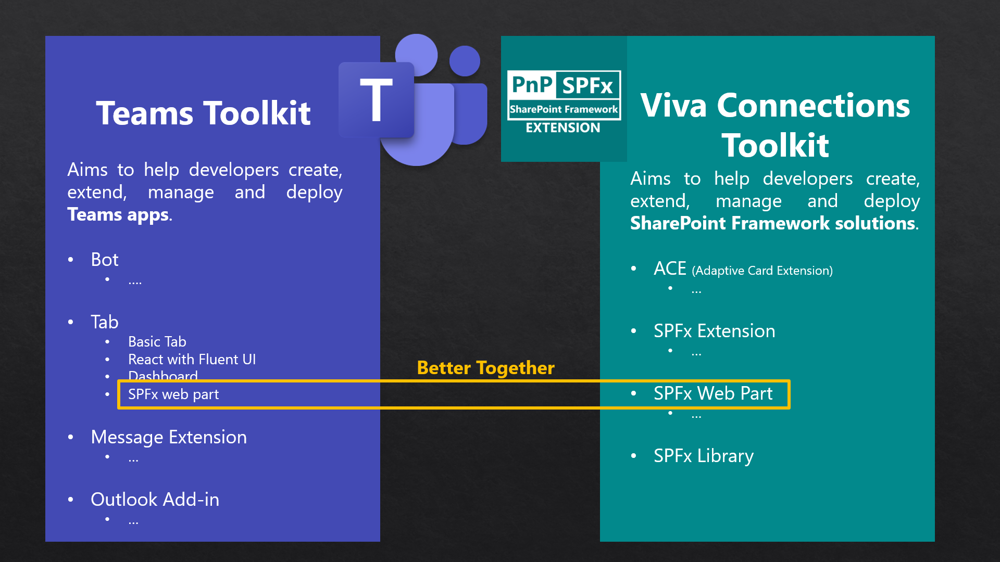
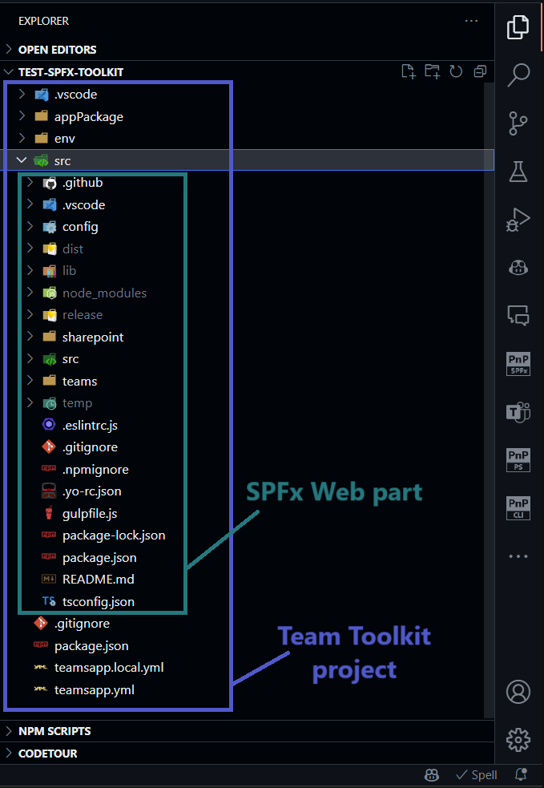
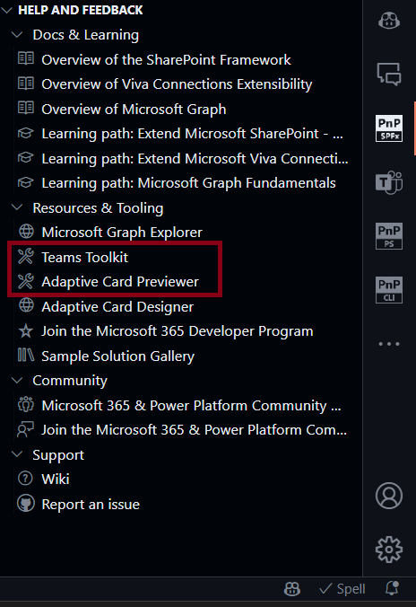

## 🗒️ Quick intro

[Viva Connections Toolkit](https://marketplace.visualstudio.com/items?itemName=m365pnp.viva-connections-toolkit) is a Visual Studio Code extension that aims to boost your productivity in developing and managing [SharePoint Framework solutions](https://learn.microsoft.com/en-us/sharepoint/dev/spfx/sharepoint-framework-overview?WT.mc_id=m365-15744-cxa) helping at every stage of your development flow, from setting up your development workspace to deploying a solution straight to your tenant without the need to leave VS Code and now even create a CI/CD pipeline to introduce automate deployment of your app 🚀.

All of that is possible due to the awesome work done by the [PnP community](https://pnp.github.io/) which is visible in many functionalities of this extension: sample gallery filled with [PnP samples](https://pnp.github.io/#samples), upgrading SPFx project using [CLI for Microsoft 365](https://pnp.github.io/cli-microsoft365/), and many more. It does not matter if you are starting your journey with SPFx development and Viva solutions or if you are already experienced in this area, this VS Code extension will have the features you need to kick off your work to the next level 💪.

In this minor release, the team focused on developing features that will allow seamless cooperation between Viva Connections Toolkit and with Teams Toolkit.

Check out the full list of updates in this release 👇:

- 👉 Added support for SPFx v1.18.2
- 👉 Added Teams Toolkit support
- 👉 Refactored help and feedback section to tree view adding new links to Teams Toolkit and ACE previewer
- 👉 Added ACE previewer checker to suggest this extension when ACE component is present in the project
- 👉 Modified CI/CD GitHub generate workflow action to present a list of site-level app catalogs
- 👉 Updated dependencies validation to check for the latest version of yo

Sounds cool 😎? Let’s have a deeper dive and check a couple of updates in a bit more detail 👇

## 🤝 Viva Connection Toolkit and Teams Toolkit - better together

[Teams Toolkit](https://marketplace.visualstudio.com/items?itemName=TeamsDevApp.ms-teams-vscode-extension) is a widely used VS Code extension that aims to help you develop solutions that will allow you to extend Microsoft Teams. Viva Connection Toolkit aim is to boost your productivity in SharePoint Framework solutions that may be used to extend SharePoint, Microsoft Teams, Microsoft Viva Connections, Outlook, and Microsoft365.com. Among many awesome functionalities, Teams Toolkit allows you to create a project to extend Teams Tab with SPFx project, and that's where both of those extensions may cooperate.

The team has refactored almost all extension functionalities allowing Viva Connections Toolkit to understand Teams Toolkit solution when an SPFx component is used. Viva Connections Toolkit will check the 'src' folder of a Teams Toolkit solution for an SPFx project and execute all of its checks, validation, and actions directly in that folder.

Thanks to that Viva Connections Toolkit may be used to validate the correctness of your SPFx webpart or generate upgrade guidance to the latest SPFx version. It may also be used to rename your SPFx project or to bundle, package, and deploy your SPFx project to an app catalog of your choice like any other SPFx project

## Help and Feedback section tree view

In this minor release, we also rebuild the help and feedback section to a tree view allowing you to expand and focus only on the content that you are interested in. The links are now grouped into four categories:
- Docs & Learning - which stores all the links to official Microsoft documentation and learning paths
- Resources & Tooling - where you may find links to additional tooling like Microsoft Graph Explorer or Adaptive Card Designer which might be helpful when developing SharePoint framework solutions. Also in this section, we added two more links as part of our 'better together' functionalities that point to Teams Toolkit and Adaptive Card Previewer VS Code extensions
- Community - with links that point to the Microsoft 365 and Power Platform Community and community Discord server to connect.
- Support - where you may find links related to Viva Connections Toolkit that will help you find additional guidance and manuals as well as report an issue or a new idea.

## 👀 Microsoft Adaptive Card Previewer

[Microsoft Adaptive Card Previewer](https://marketplace.visualstudio.com/items?itemName=TeamsDevApp.vscode-adaptive-cards) is a quite new VS Code extension that uses the latest rendering stack for Microsoft Teams to provide a more accurate preview of Adaptive Cards. Viva Connections Toolkit will now check if your SharePoint Framework project has an ACE component and if so it will show a notification to install Adaptive Card Previewer to boost your work with ACE development and allow you less context switching. 

## 🚀 Update support of SPFx to 1.18.2

Keeping you up to date and helping you upgrade your solution to the latest version of SPFx is one of the main functionalities of this extension. That's why as part of this minor release, we also updated the upgrade and validate action to SPFx v1.18.2. 
Gain confidence and upgrade guidance with ease to keep you going 🚀.

## 🗺️ Future roadmap

This release is just one of many awesome features we plan for the upcoming v3 release of this extension. We don't stop here and we already started working on more functionalities that will boost your SharePoint Framework development to the next level. Check out the [issue list for v3 release](https://github.com/pnp/vscode-viva/issues?q=is%3Aopen+is%3Aissue+milestone%3Av3.0) to find out more.

## 👍 Power of the community

This extension would not have been possible if it weren’t for the awesome work done by the [Microsoft 365 & Power Platform Community](https://pnp.github.io/). Each sample gallery: SPFx web parts & extensions, and ACE samples & scenarios are all populated with the contributions done by the community. Many of the functionalities of the extension like upgrading, validating, and deploying your SPFx project, would not have been possible if it wasn’t for the [CLI for Microsoft 365](https://pnp.github.io/cli-microsoft365/) tool. I would like to sincerely thank all of our awesome contributors! Creating this extension would not have been possible if it weren’t for the enormous work done by the community. You all rock 🤩.

If you would like to participate, the community welcomes everybody who wants to build and share feedback around Microsoft 365 & Power Platform. Join one of our [community calls](https://pnp.github.io/#community) to get started and be sure to visit 👉 https://aka.ms/community/home.

## 🙋 Wanna help out?

Of course, we are open to contributions. If you would like to participate do not hesitate to visit our [GitHub repo](https://github.com/pnp/vscode-viva) and start a discussion or engage in one of the many issues we have. Feedback (positive or negative) is also more than welcome.

## 🔗 Resources

- [Download Viva Connections Toolkit at VS Code Marketplace](https://marketplace.visualstudio.com/items?itemName=m365pnp.viva-connections-toolkit)
- [Viva Connections Toolkit GitHub repo](https://github.com/pnp/vscode-viva)
- [Microsoft 365 & Power Platform Community](https://pnp.github.io/#home)
- [Join the Microsoft 365 & Power Platform Community Discord Server]( https://aka.ms/community/discord)
- [Wiki]( https://github.com/pnp/vscode-viva/wiki)
- [Join the Microsoft 365 Developer Program]( https://developer.microsoft.com/en-us/microsoft-365/dev-program)
- [CLI for Microsoft 365](https://pnp.github.io/cli-microsoft365/)
- [Sample Solution Gallery]( https://adoption.microsoft.com/en-us/sample-solution-gallery/)
