## 🗒️ Quick intro

[Viva Connections Toolkit](https://marketplace.visualstudio.com/items?itemName=m365pnp.viva-connections-toolkit) is a Visual Studio Code extension that aims to boost your productivity in developing and managing [SharePoint Framework solutions](https://learn.microsoft.com/sharepoint/dev/spfx/sharepoint-framework-overview?WT.mc_id=m365-15744-cxa) helping at every stage of your development flow, from setting up your development workspace to deploying a solution straight to your tenant without the need to leave VS Code, it even allows you to create a CI/CD pipeline to introduce automate deployment of your app 🚀.

All of that is possible due to the awesome work done by the [PnP community](https://pnp.github.io/) which is visible in many functionalities of this extension: sample gallery filled with [PnP samples](https://pnp.github.io/#samples), upgrading SPFx project using [CLI for Microsoft 365](https://pnp.github.io/cli-microsoft365/), and many more. It does not matter if you are starting your journey with SPFx development and Viva solutions or if you are already experienced in this area, this VS Code extension will have the features you need to kick off your work to the next level 💪.

In this minor release, the team focused on refactoring the sample gallery feature to a single dynamic gallery with filters and a new way to scaffold a CI/CD pipeline that even allows you to create a certificate and Entra ID app registration needed when your workflow uses application for authentication.

Check out the full list of updates in this release 👇:

- 👉 Refactored sample galleries to a single sample gallery
- 👉 Added detail view for sample
- 👉 Added filters to the sample gallery
- 👉 Added list view to sample gallery
- 👉 Added SharePoint Embedded VS Code extension to help and feedback links
- 👉 Refactored CI/CD action to be form-based
- 👉 Added the possibility to generate a certificate and create an Entra ID app for the CI/CD pipeline

Sounds cool 😎? Let’s have a deeper dive and check a couple of updates in a bit more detail 👇

## 🚀 New way to create a CI/CD workflow with even more automated manual steps

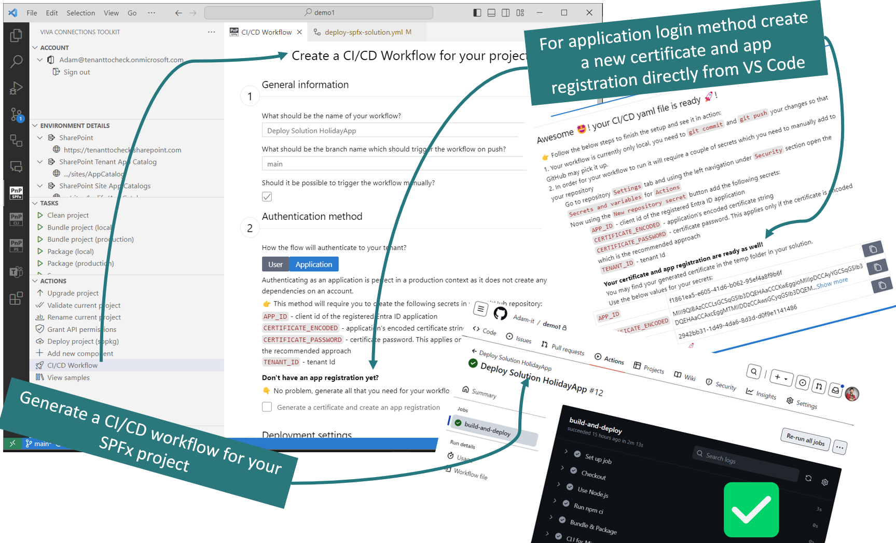

CI/CD workflow action allows you to quickly generate a YAML workflow file for GitHub (Azure DevOps support is on the way) which then may be merged to your repository and used to bundle, package, and deploy your SPFx app on every push (or manually if set to do so).

In this release, we did a total rebuild of the CI/CD workflow action. Previously the process of creating the workflow was based on answering questions presented by VS Code. 

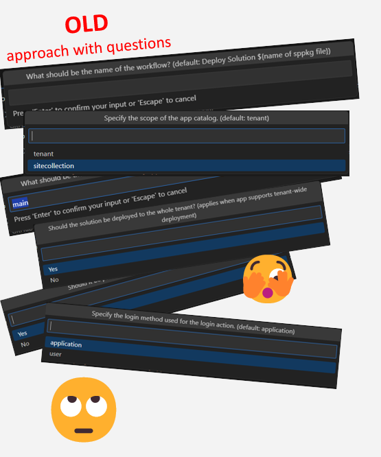

This approach was confusing as it was not clear how many steps there were and what information would need to be provided to create a workflow. 

We took this feature back to the whiteboard and reimagined this experience from scratch 🤩. Now the dev will see a clean form divided into 3 steps. Thanks to this it is easy to get a glance at all the possible options and required information needed for the workflow. At start the form is prefilled with default data based on our SPFx solution so it is even possible not to change any of the fields... yee, just click generate and that's enough to get a basic working YAML flow generated 🤯.

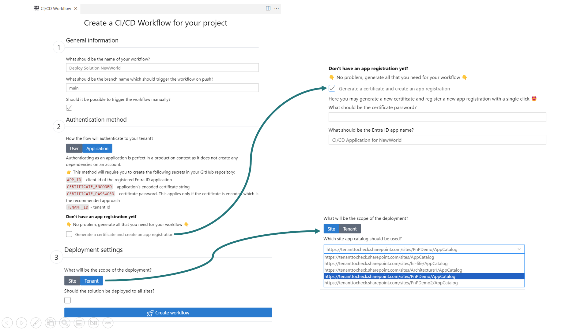

In the first step, we are required to provide some general info about the flow like the name of our pipeline or the name of the branch that will trigger the flow when we push new changes to it. Again all of those fields are already prefilled with defaults so we may just adjust what is needed.
In the second step, we need to decide how our workflow will authenticate to our tenant. We may pick between `user` and `application` login methods. The Second one is the default and preferable approach that should be used in production environments. The `user` login method is good for a dev environment and will not work with accounts that have MFA (multifactor authentication). 
Additionally, when we select the `application` login method we are given an option to generate a new certificate and create an Entra ID app registration with the required permissions. Previously this needed to be done manually by the dev and the guidance was present only in the extension wiki. Now not only do you get the guidance in the scaffolding form but you may even automate this step so you have less stuff to worry about 🚀.
In the last (third) step we need to decide if the .sppkg package will be deployed to a tenant or site-level app catalog. When the site-level app catalog is picked we are presented with an additional field to pick (yes pick not write) the URL of one of the site-level app catalogs we have on our tenant. This is really cool as Viva Connections Toolkit is aware of your tenant all app catalogs so you don't need to worry about getting, copying, and pasting the correct URL.

Check it out in action 👇

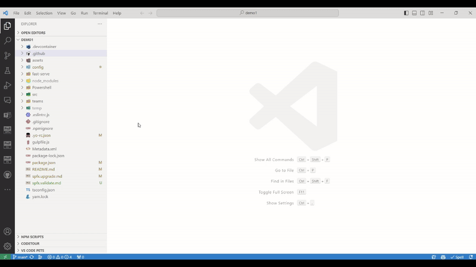

Last but not least it's worth mentioning that after you successfully generate the workflow you get additional guidance on what you need to do to see the YAML in action. It all goes down to two steps:

1. merge and push the YAML file to your repo
2. add the required secrets, and if you generated the application and certificate using the workflow options you even get the table with the values and copy buttons

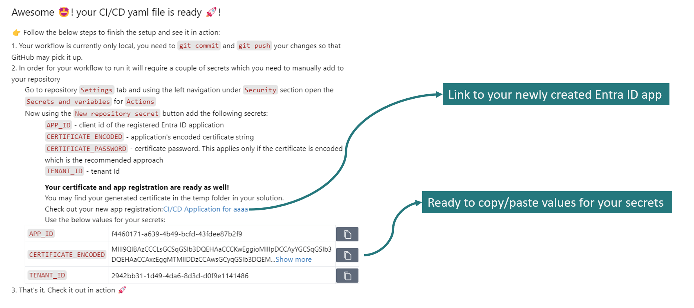

## 📄 Unified sample gallery

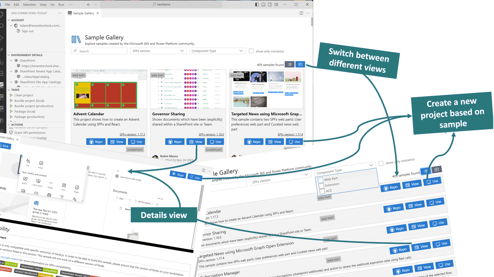

Previously Viva Connection Toolkit had 4 different sample galleries and we needed to know if we wanted a web part, extension, or ACE. In the real world that's not always the case. Usually, we are looking for the solution for our problem, inspiration, or a starting point to kick off our work. At the very start, it's not always important what kind of project it will be as long as it will get the job done. So we merged all of the sample galleries into one single, responsive, and dynamic gallery 💪.

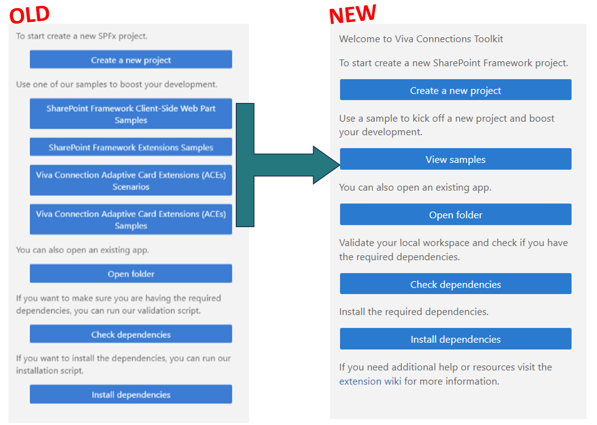

The new sample gallery allows you to browse all 400+ 🤯 samples from a single point all done by the Microsoft 365 and Power Platform community.

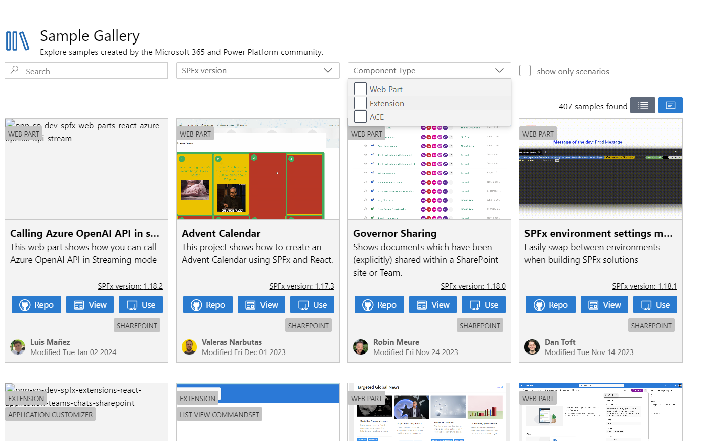

At the top of the gallery, you have additional filter fields which you may use to quickly find what you are looking for. Previously it was only possible to search by sample title. Now you may search by title, author, description, SPFx version, and component type. Additionally, you may set the view to show only scenarios. The scenario is a sample that has Code Tour guidance for the solution with step-by-step information on how to use the project.

If the card view produces too much 'noise' you may change the view to list to get the minimum information on the screen. 

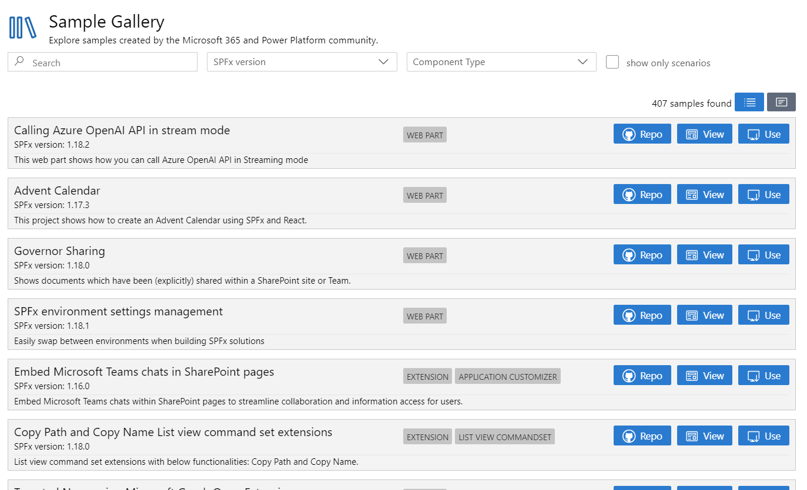

And the view is fully responsive to any size so don't worry about that 👍.

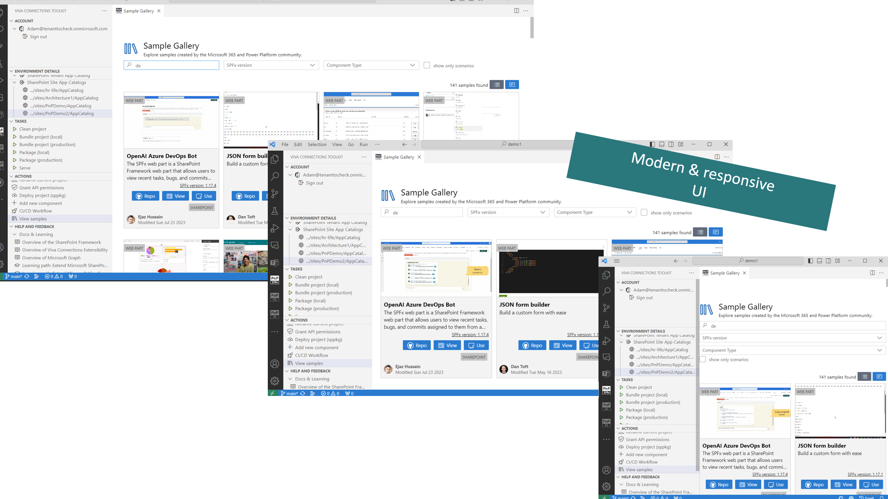

Previously if you wanted to get more details about the sample you needed to use the `Repo` button to get redirected to the sample repository and check the readme file. This experience produced much confusion and unnecessary context switching so we got rid of that and introduced a new `View` button which will the details view, the same as you have in the project readme file, directly in VS Code.

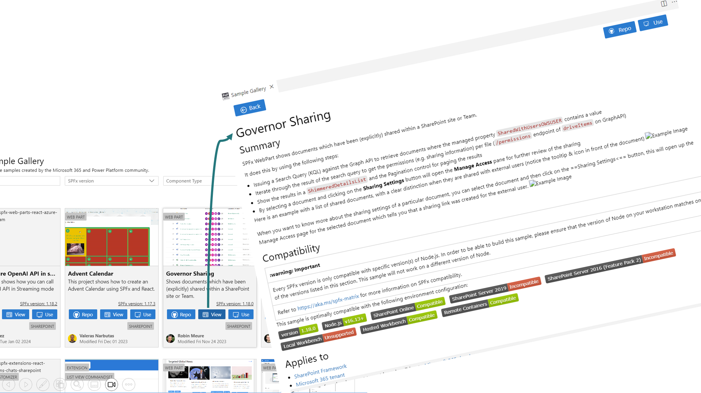

BTW if you don't know this already the `Use` button allows you to create a new local project with a new name based on this sample 🤯, with a single click 😎

Check it out in action 👇

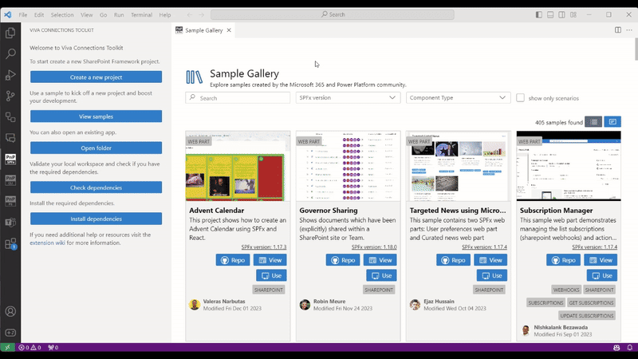

## 🗺️ Future roadmap

This release is just one of many awesome features we plan for the upcoming v3 release of this extension. We don't stop here and we already started working on more functionalities that will boost your SharePoint Framework development to the next level. Check out the [issue list for v3 release](https://github.com/pnp/vscode-viva/issues?q=is%3Aopen+is%3Aissue+milestone%3Av3.0) to find out more.

## 👍 Power of the community

This extension would not have been possible if it weren’t for the awesome work done by the [Microsoft 365 & Power Platform Community](https://pnp.github.io/). Each sample gallery: SPFx web parts & extensions, and ACE samples & scenarios are all populated with the contributions done by the community. Many of the functionalities of the extension like upgrading, validating, and deploying your SPFx project, would not have been possible if it wasn’t for the [CLI for Microsoft 365](https://pnp.github.io/cli-microsoft365/) tool. I would like to sincerely thank all of our awesome contributors! Creating this extension would not have been possible if it weren’t for the enormous work done by the community. You all rock 🤩.

If you would like to participate, the community welcomes everybody who wants to build and share feedback around Microsoft 365 & Power Platform. Join one of our [community calls](https://pnp.github.io/#community) to get started and be sure to visit 👉 https://aka.ms/community/home.

## 🙋 Wanna help out?

Of course, we are open to contributions. If you would like to participate do not hesitate to visit our [GitHub repo](https://github.com/pnp/vscode-viva) and start a discussion or engage in one of the many issues we have. Feedback (positive or negative) is also more than welcome.

## 🔗 Resources

- [Download Viva Connections Toolkit at VS Code Marketplace](https://marketplace.visualstudio.com/items?itemName=m365pnp.viva-connections-toolkit)
- [Viva Connections Toolkit GitHub repo](https://github.com/pnp/vscode-viva)
- [Microsoft 365 & Power Platform Community](https://pnp.github.io/#home)
- [Join the Microsoft 365 & Power Platform Community Discord Server]( https://aka.ms/community/discord)
- [Wiki]( https://github.com/pnp/vscode-viva/wiki)
- [Join the Microsoft 365 Developer Program]( https://developer.microsoft.com/en-us/microsoft-365/dev-program)
- [CLI for Microsoft 365](https://pnp.github.io/cli-microsoft365/)
- [Sample Solution Gallery]( https://adoption.microsoft.com/en-us/sample-solution-gallery/)
