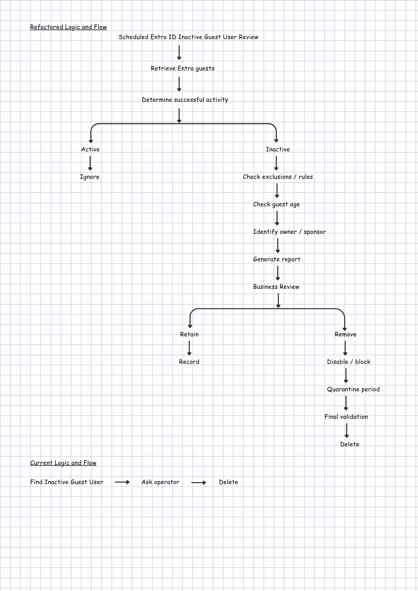
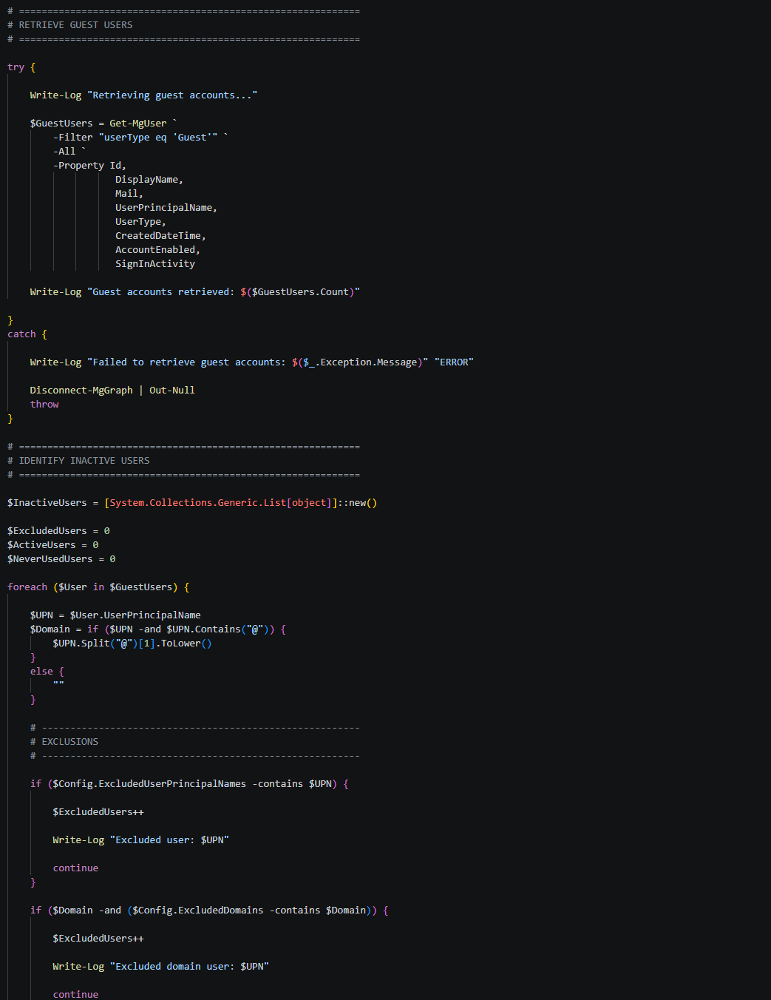
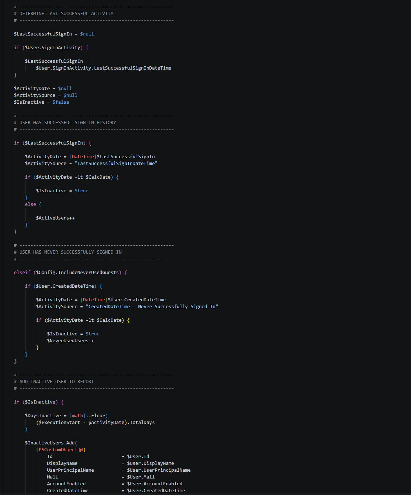
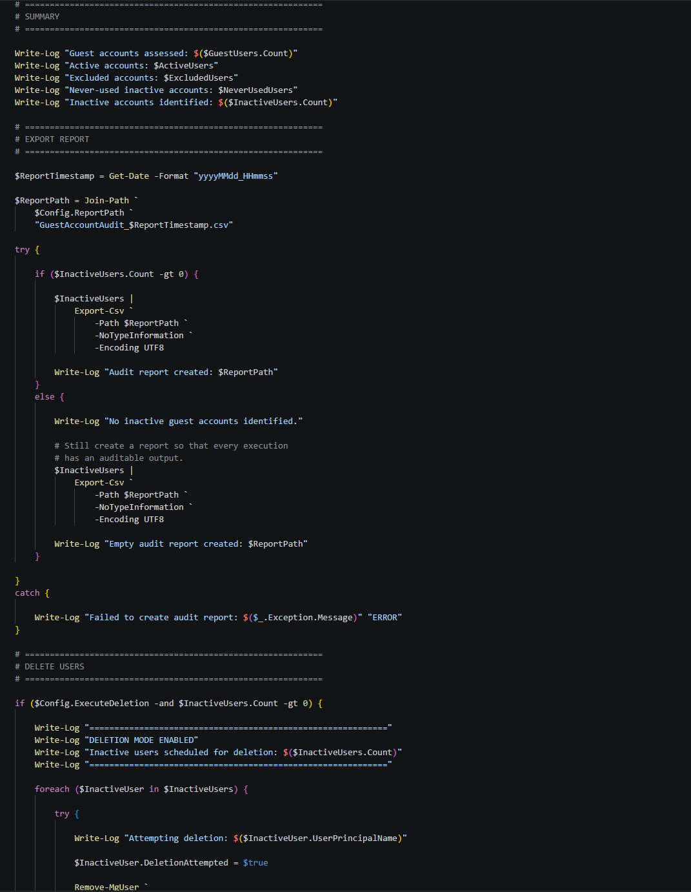

## The original idea

The starting point was a straightforward PowerShell script designed to identify Microsoft Entra ID guest accounts that had been inactive for a defined period, display them, and give an administrator the option to delete them - *Delete inactive Guest User by Peter Paul Kirschner*.

The full script is available on GitHub here: **[https://pnp.github.io/script-samples/aad-inactive-guest-delete/README.html?tabs=graphps](https://pnp.github.io/script-samples/aad-inactive-guest-delete/README.html?tabs=graphps)**

It is a sensible idea, particularly in environments where external users accumulate over time. The original creator deserves credit for keeping the first version simple: connect to Microsoft Graph, retrieve guest users, check their sign-in activity, and take action.

On paper, it does exactly what you would expect.

But I wanted to understand what would happen when that script moved from an interesting PowerShell exercise into something we might eventually depend on operationally.

## Why I was testing it and what I actually did

Guest account housekeeping is something that can become increasingly valuable in Microsoft 365 environments. External access is often created for perfectly good reasons, but projects finish, suppliers change and people move on. Without a defined lifecycle, yesterday's necessary access can become tomorrow's security and administration problem.

I was therefore testing the script as an auditor, rather than simply asking whether it ran successfully.

I looked at the assumptions behind it, tested the logic, considered how it would behave with real directory data, and asked a more important question:

> Would I be comfortable putting this into PROD and letting it delete accounts?

That changed the review completely.

Diagram showing *"Refactored Logic and Flow"* versus *"Current Logic and Flow"*:

## What happened

The first surprise was significant.

The inactivity comparison was backwards. The script used `-ge` when comparing the last sign-in date with the calculated cutoff. In practical terms, it could identify users who had signed in recently rather than users who had been inactive for the configured period.

That is the sort of issue that can be easy to miss when a script looks logical at first glance.

I also found several other gaps. It relied on `LastSignInDateTime` rather than `LastSuccessfulSignInDateTime`, did not explicitly handle guests who had never successfully signed in, had no persistent audit report, and had limited error handling.

Most importantly, deletion was only one confirmation away.

The script worked. That wasn't enough.

## What I changed

I kept the original purpose but changed the implementation and, more importantly, the operating model.

First, I corrected the inactivity comparison. An account is now considered inactive when the relevant activity date is older than the cutoff.

Second, I switched the assessment to `LastSuccessfulSignInDateTime`. That better answers the question we actually care about: when did this account successfully access the environment?

Third, I added handling for guests who have never successfully signed in. For those accounts, the creation date can provide a useful alternative reference point, subject to the organisation's agreed policy.

I also introduced a report-only mode, enabled by default. The script now produces a CSV containing the account, activity date, inactivity period, assessment method and recommended action.

Deletion is no longer the natural outcome of running the script.

I added exclusions, structured logging and error handling so that individual failures can be recorded without losing the overall execution history.

Diagram showing snippets of Refactored script:

### Original script - sample output

The original script is console-oriented, so its output would look something like this:

| Stage | Sample output |
|---|---|
| Inactive users found | `The following guest users have been inactive for 30 days or more:` |
| User 1 | `John Smith (john.smith_example.com#EXT#@contoso.onmicrosoft.com)` |
| User 2 | `Sarah Jones (sarah.jones_example.com#EXT#@contoso.onmicrosoft.com)` |
| User 3 | `David Brown (david.brown_example.com#EXT#@contoso.onmicrosoft.com)` |
| Action prompt | `Do you want to delete these users? (y/n)` |
| Administrator response | `y` |
| Deletion result | `Deleted user: John Smith (...)` |
| Deletion result | `Deleted user: Sarah Jones (...)` |
| Deletion result | `Deleted user: David Brown (...)` |

The output looks perfectly reasonable at first glance. That's part of what makes the underlying logic issue easy to miss.

The script presents a list of users and asks for confirmation, but it doesn't provide much context about **why** each user was classified as inactive.

### Refactored script - sample output

The refactored version produces a much richer audit record:

| Display Name | UPN | Created | Last Successful Sign-in | Activity Used | Days Inactive | Action | Deletion Attempted | Result |
|---|---|---|---|---|---:|---|---|---|
| John Smith | john.smith_example.com#EXT#@contoso.onmicrosoft.com | 01/01/2026 | 15/04/2026 | LastSuccessfulSignInDateTime | 130 | Review | No | Pending |
| Sarah Jones | sarah.jones_example.com#EXT#@contoso.onmicrosoft.com | 10/02/2026 | 20/05/2026 | LastSuccessfulSignInDateTime | 95 | Review | No | Pending |
| David Brown | david.brown_example.com#EXT#@contoso.onmicrosoft.com | 01/03/2026 | - | CreatedDateTime - Never Successfully Signed In | 175 | Review | No | Pending |
| Acme Auditor | auditor_acme.com#EXT#@contoso.onmicrosoft.com | 05/01/2026 | 10/08/2026 | LastSuccessfulSignInDateTime | 13 | Active | No | Not applicable |
| Partner User | partner_example.com#EXT#@contoso.onmicrosoft.com | 01/02/2026 | 01/03/2026 | LastSuccessfulSignInDateTime | 175 | Excluded | No | Not applicable |

The key difference is **context**.

The original script effectively tells an administrator:

> "Here are some users. Do you want to delete them?"

The refactored version can tell an administrator:

> "This is the account, this is when it was created, this is the last successful activity we found, this is how many days it has been inactive, and this is the reason it was classified this way."

That makes the output much more useful for **review, approval, troubleshooting and audit evidence**.

> **Note:** The examples above are illustrative and use fictional users and dates. They demonstrate the difference in output between the original and refactored approaches rather than representing actual tenant data for security and privacy reasons.

## What I learned

The biggest lesson was that code correctness and operational safety are different things.

A script can execute without errors and still implement the wrong business rule. It can identify stale accounts accurately and still be unsuitable for automated deletion.

For PROD, I would take this further: identify inactive guests, generate an auditable report, review the candidates, then consider disabling or quarantining accounts before eventual deletion.

Microsoft Entra governance features should also be considered alongside custom PowerShell. The right answer may not always be another script.

The useful part of this exercise wasn't producing a longer script. It was turning a simple automation idea into something that could be challenged, tested and supported.

## Community Discussion

How do you approach stale guest accounts in your Microsoft 365 environments?

Do you rely on PowerShell, Entra governance features, Access Reviews, or a combination?

And perhaps the bigger question:

> **What checks do you perform before allowing an automation script to move from "it works" to "we can safely put it into PROD"?**
