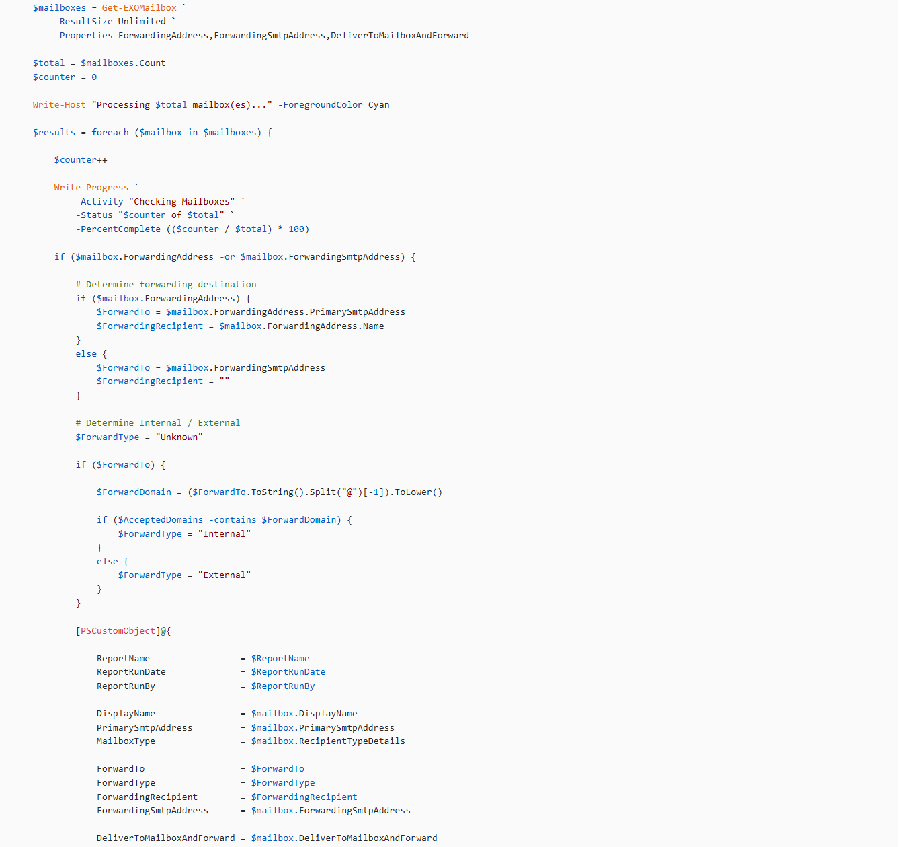
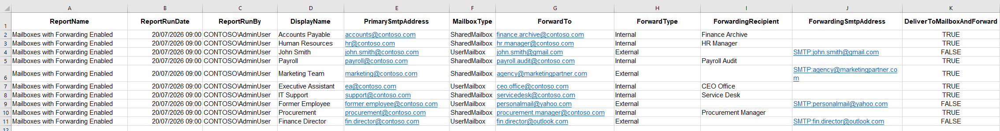

One report we review monthly as part of our governance meeting is the **Mailbox Forwarding Report**. It is one of the simplest ways we improve Microsoft 365 governance and reduce the risk of unnoticed data exfiltration.

In our environment, we have a scheduled script that runs monthly. We work with multiple stakeholders, projects begin and end, people move into new roles, staff leave, new employees join, shared mailboxes are repurposed, and some business processes rely on messages being forwarded between systems. Forwarding is not inherently a problem. In many cases, it is a legitimate business requirement. The challenge is ensuring those forwarding rules are still appropriate months later, when the original reason may no longer exist.

Microsoft 365 provides several ways to identify mailbox forwarding, but reviewing it consistently across the tenant isn't always part of routine administration. Without a structured audit process, it is easy for forwarding rules to remain in place long after they are needed or for malicious rules to go undetected.

This becomes even more important when reviewing:

- **Shared mailboxes** - often support business-critical processes and may continue forwarding long after the original business need has changed.
- **Executive mailboxes** - regularly contain commercially sensitive information, making unauthorised forwarding a significant business risk.
- **Finance and HR accounts** - naturally handle confidential financial and personnel data that requires additional oversight.
- **Former employee accounts** - forwarding rules may remain in place after an employee leaves, potentially exposing business information unnecessarily.
- **Privileged administrative accounts** - can contain sensitive operational and security-related communications that should be subject to closer scrutiny.

These mailboxes often contain sensitive information and should be monitored more closely than standard user mailboxes.

It's important to remember that not every mailbox with forwarding enabled represents a security issue. Automatic forwarding is a legitimate feature that is widely used to support business processes, delegate responsibilities, and manage shared workloads. The purpose of this report isn't to eliminate forwarding altogether, but to provide visibility into where it's being used so administrators can confirm it's still appropriate, authorised, and aligned with organisational policy. In many cases, the report simply validates that expected configurations remain in place while also helping identify the occasional forwarding rule that requires further investigation.

This is a snippet of the PowerShell script:

The full script is available on GitHub here:

**[https://pnp.github.io/script-samples/get-exo-mailboxes-with-forwarding/README.html?tabs=pnpps](https://pnp.github.io/script-samples/get-exo-mailboxes-with-forwarding/README.html?tabs=pnpps)**

## Prerequisites

- PowerShell 7.x or Windows PowerShell 5.1
- Exchange Online PowerShell module
- Microsoft Entra ID app registration configured for certificate-based authentication
- Exchange.ManageAsApp permission granted
- Exchange Administrator (or equivalent application permissions)

This is a sample of the timestamped CSV output generated by the script:

## Notes

- Only mailboxes with forwarding configured are included in the report.
- Internal versus external forwarding is determined using the tenant's accepted email domains.
- The script automatically disconnects from Exchange Online when processing is complete.
- The script is designed for unattended execution using certificate-based authentication and can be scheduled using Task Scheduler, Azure Automation, or similar orchestration platforms.

I'd be interested to hear how others are approaching mailbox forwarding reviews within their own organisations, or whether you have any suggestions for improving the script. It's one of those simple governance checks that's easy to overlook, but regular visibility can provide valuable operational and security insights.
