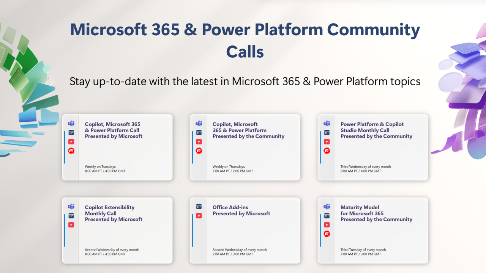

Microsoft 365 is constantly evolving. New features appear, existing tools change, and AI is transforming the way we work with technology. Keeping up can feel like a full-time job.

But you don't have to do it alone.

That's where Microsoft 365 community calls come in.

Whether you're a student taking your first steps into the world of Microsoft technologies, an IT professional managing Microsoft 365 every day, a developer building solutions, or a business stakeholder trying to understand what all these changes mean for your organisation, community calls offer something that documentation and online tutorials can't always provide: **people**.

## Learn from People Who Are Doing It

One of the biggest benefits of a community call is hearing from people with real-world experience. Speakers and attendees share what they've tried, what worked, what didn't, and what they wish they'd known earlier.

You can see practical demonstrations, discover new approaches, and pick up ideas that you can take straight back to your own work, studies, or projects.

I've often found that a community call provides a different perspective on a challenge I was already working on. Sometimes it's a governance discussion, sometimes it's a PowerShell technique, and sometimes it's simply hearing how another organisation approached a similar problem.

## Ask Questions, Share Ideas, Make Connections

Community is a two-way conversation.

You don't need to be an expert to participate. You might have a question that several others have been wondering about too. And as your experience grows, you may find yourself answering someone else's question or sharing something you've learned.

Those conversations can also lead to something equally valuable: **connections**.

Community calls bring together students, administrators, developers, consultants, educators, business leaders, and enthusiasts. You never know who you'll meet, or where that connection might lead.

> Some of the most valuable opportunities in technology start with a simple conversation.

## Keep Learning and Stay Curious

Technology doesn't stand still, and neither should our learning.

Community calls provide an easy way to stay curious, discover what's new, and understand where Microsoft 365 is heading. They can help you identify skills worth developing, technologies worth exploring, and opportunities you might otherwise overlook.

For students and people starting their careers, that exposure can be particularly valuable. For experienced professionals, it's an opportunity to challenge assumptions, exchange knowledge, and continue growing.

It's more than a call

The real value of a Microsoft 365 community isn't just the hour you spend in a meeting. It's what happens afterwards: the idea you try, the problem you solve, the person you connect with, the skill you develop or the question that sparks your next discovery.

> So, if you've never joined a Microsoft 365 community call, why not give one a try?

**Come to learn. Come to ask questions. Come to share what you know.**

Most importantly, come and be part of the community.

## Resources

- **[https://pnp.github.io/#events](https://pnp.github.io/#events)**
