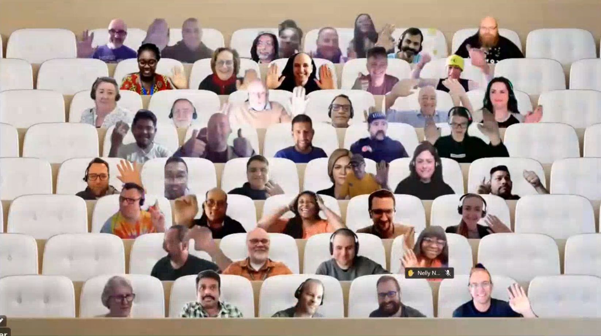

## Call summary

Latest updates and news on Power Platform including community events and training opportunities.

Two demos delivered: With Great Power (Apps) Comes Great Reusability and Copilot is the coworker you never knew you always needed

Activities: 3 articles, 3 documents, 4 connectors, 1 sample, 4 Power Platform related video conversations recently delivered.

This call was hosted by [David Warner II](http://twitter.com/DavidWarnerII) (Microsoft) \| @DavidWarnerII and recorded on April 19, 2023. Questions addressed in chat throughout the call.

### New this month

* News and Documents
    * Article – [Build an app using natural language using Copilot for Power Apps](https://powerapps.microsoft.com/blog/announcing-a-next-generation-ai-copilot-in-microsoft-power-apps-that-will-transform-low-code-development/)
    * Article – [Modern controls coming to canvas apps](https://powerapps.microsoft.com/blog/modern-controls-coming-to-canvas-apps/)
    * Article – [Add comments in model-driven apps with Power Apps](https://learn.microsoft.com/power-apps/maker/model-driven-apps/comments)
    * Documentation – [Modern, refreshed look in model-driven apps](https://learn.microsoft.com/power-apps/user/modern-fluent-design?WT.mc_id=powerapps_community_productblog)
    * Documentation – [Controls and properties in cards](https://learn.microsoft.com/power-apps/cards/controls/control-reference?WT.mc_id=powerapps_community_productblog)
    * Documentation – [Automatic deletion of inactive Microsoft Dataverse for Teams environments](https://learn.microsoft.com/power-platform/admin/inactive-teams-environment)
* [Power Platform Samples](https://pnp.github.io/powerplatform-samples/)
    * New Power App - [Employee Engagement Survey - Modern Controls](https://github.com/pnp/powerapps-samples/tree/main/samples/employee-survey-modern-control)  
        [Angelo Gulisano](https://twitter.com/angelog1908) \| @angelog1908
* Power Platform - [Independent Publisher Connectors](https://github.com/microsoft/PowerPlatformConnectors/tree/dev/independent-publisher-connectors)
    * Microsoft Search
    * OpenAI-GPT3
    * Cisco Webex
    * [WhatsApp](https://github.com/microsoft/PowerPlatformConnectors/tree/dev/independent-publisher-connectors/WhatsApp) - Zakariya Fakira, Satbir Virdi, Oscar Hui, Chaohui Wang
    * 997 total connectors now!
    * [Top Connector Asks](https://github.com/microsoft/PowerPlatformConnectors/wiki/Top-Connector-Asks)
    * Good Flow story? Tell us. [FlowOfTheWeek](https://aka.ms/FlowOfTheWeekForm) – aka.ms/FlowOfTheWeekForm
* Shows and Events
    * New Episodes - The [Low Code Revolution Show](https://learn.microsoft.com/shows/the-low-code-revolution/) with [April Dunnam](https://twitter.com/aprildunnam) (Microsoft) \| @aprildunnam and Daniel Laskewitz (Microsoft) \| @laskewitz \| aka.ms/LowCodeRevolutionShow
        * [Responsible AI Principles for Power Platform Developers](https://learn.microsoft.com/shows/the-low-code-revolution/responsible-ai-principles-for-power-platform-developers) (April 5)
        * [Pipelines for Power Platform: Security Deep Dive](https://learn.microsoft.com/shows/the-low-code-revolution/pipelines-for-power-platform-security-deep-dive) (April 5)
        * [Power Platform CLI Exposed: Pipelines](https://learn.microsoft.com/shows/the-low-code-revolution/power-platform-cli-exposed-pipelines) (March 29)
        * [Power BI Quick Reports feature in Model-Driven Power Apps](https://learn.microsoft.com/shows/the-low-code-revolution/power-bi-quick-reports-feature-in-model-driven-power-apps) (March 27)
    * European Collaboration Summit 2023 - Düsseldorf, Germany, 24-36 May. Save 15% with “PowerPlatformRocks” voucher.
    * ACT NOW – save 17% until March 17th on tickets for the [European Power Platform Conference](https://www.sharepointeurope.com/european-power-platform-conference) – Dublin, 20-23 June
    * 365 EduCon - Use promo code “Community” to save 25% off any pass type.
        * [Washington DC](http://www.365educon.com/dc) – June 12-16, 2023
        * [Seattle](http://www.365educon.com/seattle) – August 21-25, 2023 & PWR EduCon
        * [Chicago](http://www.365educon.com/chicago) – October 30 – November 3, 2023
    * Upcoming [Community Days](https://communitydays.org/) Events - aka.ms/communitydays

### Demo summaries

* **With Great Power (Apps) Comes Great Reusability** – practical tips/benefits of reuse. UI reuse options (gallery control, Canvas components and component libraries, element grouping, container control, duplication of elements, responsive and dynamic layouts in Canvas apps, customized controls) and code reuse options (constants, named formulas, environment variables, Power Apps Component Framework (PCF)). Upcoming features and resources supporting reuse - drag drop to build responsive pages, device preview, user defined functions. aka.ms/Apr19-Demo1
* **Copilot is the coworker you never knew you always needed** – step through Copilot (for Builders). Define what your app should do, hit return, view results – table of AI suggested fields and data. Now add additional data, fields, dropdown menu options. Next press the Create (Canvas) app (and Dataverse table) button. Great tips on communicating with Copilot (prompt engineering), Learn about the 3 different Copilots/functionalities for Builders, Users and Makers. Action: Register for Copilot preview now. aka.ms/Apr19-Demo2



## Agenda items

[00:00](https://youtu.be/5ecCCyQSEsE?t=0) – Intro

[01:46](https://youtu.be/5ecCCyQSEsE?t=106) – Power Platform News & Learn Updates – [April Dunnam](http://twitter.com/aprildunnam) (Microsoft) \| @aprildunnam

[02:35](https://youtu.be/5ecCCyQSEsE?t=155) – Latest Power Apps Samples – [April Dunnam](http://twitter.com/aprildunnam) (Microsoft) \| @aprildunnam

[03:19](https://youtu.be/5ecCCyQSEsE?t=199) – Independent Publisher Connectors - [Jocelyn Panchal](https://twitter.com/JocelynP_PM) (Microsoft) \| @JocelynP_PM

[08:08](https://youtu.be/5ecCCyQSEsE?t=488) – Power Platform Community Shows & Events - [April Dunnam](http://twitter.com/aprildunnam) (Microsoft) \| @aprildunnam & [David Warner II](http://twitter.com/DavidWarnerII) (Microsoft) \| @DavidWarnerII

[10:13](https://youtu.be/5ecCCyQSEsE?t=613) – Together mode picture

[11:27](https://youtu.be/5ecCCyQSEsE?t=687) – Demo - With Great Power (Apps) Comes Great Reusability - [Keith Atherton](https://twitter.com/MrKeithAtherton) \| @MrKeithAtherton

[25:13](https://youtu.be/5ecCCyQSEsE?t=1513) – Demo - Copilot is the coworker you never knew you always needed - [Shane Young](https://twitter.com/ShanesCows) (PowerApps911) \| @ShanesCows

[56:59](https://youtu.be/5ecCCyQSEsE?t=3419) – Resources

[57:52](https://youtu.be/5ecCCyQSEsE?t=3472) – Closing

## Together mode

Great seeing everyone today. Welcome to all who are in Seattle this week for the MVP Summit.  Thank you for joining the community call today.

## Actions

* Give us feedback about this call – aka.ms/community/calls/feedback
* Opt into the [PnP Community Recognition Program](https://aka.ms/m365pnp-recognition) \| [aka.ms/community/recognition](https://aka.ms/m365pnp-recognition)
* Request to present a demo during this call - aka.ms/PPCCDemoRequest
* [Share your Community Quick Tips](https://customervoice.microsoft.com/Pages/ResponsePage.aspx?id=v4j5cvGGr0GRqy180BHbR02h_1H9_XFFp4etSzu5JxFUN0JZTFNDSDRJVVJGTkxHVzcxRDJWM01RWi4u) \| aka.ms/PPCCDemoRequest
* Questions, comments, ideas, about a demo? Do share in “Community Calls Conversations” – see link with each demo.
* Connect to other makers in your organization via chatbot, now in public preview - aka.ms/makermatch.
* Register for upcoming [Sharing is Caring](https://pnp.github.io/sharing-is-caring/) events:
    * Maturity Model Practitioners \| Tuesday, May 16th, 7am PST – [Download reoccurring invite](https://aka.ms/mm4m365/invite)
    * PnP Office Hours – 1:1 session \| [Register](https://outlook.office365.com/owa/calendar/PnPSharingisCaring@warner.digital/bookings/)
    * PnP Buddy System \| [Request a Buddy](https://forms.office.com/Pages/ResponsePage.aspx?id=KtIy2vgLW0SOgZbwvQuRaXDXyCl9DkBHq4A2OG7uLpdUMjRRUVg4NElZUUJLTEY1TVVSVDJFRFpLRS4u)
* [PnP Samples](https://aka.ms/powerplatform-samples) - We welcome your Power Platform samples!
* [View](https://aka.ms/LowCodeRevolutionShow) or be a [Guest](https://aka.ms/LowCodeRevolutionGuest) on **The Low Code Revolution** show \| aka.ms/LowCodeRevolutionShow
* Request to deliver a demo or a Monthly Community Quick Tip (90 – 120 seconds) during this monthly community call - aka.ms/PPCCDemoRequest
* Mark your calendar for our next call April 19th at 08:00am PT \| <https://aka.ms/powerappscommunitycall>
* Register for the [Microsoft 365 Developer Program](https://aka.ms/m365/devprogram) and get a free developer tenant
* Get started with [free training modules](https://aka.ms/m365/dev/learn) covering Microsoft 365 platform capabilities.
* Visit the [Microsoft 365 Unified Sample Solution Gallery](https://adoption.microsoft.com/sample-solution-gallery) from Microsoft and community.

## Demo references

* **With Great Power (Apps) Comes Great Reusability**
    * Documentation – [Gallery control in Power Apps](https://learn.microsoft.com/power-apps/maker/canvas-apps/controls/control-gallery) \| <https://learn.microsoft.com/power-apps/maker/canvas-apps/controls/control-gallery>
    * Documentation – [Canvas component overview](https://learn.microsoft.com/power-apps/maker/canvas-apps/create-component) \| <https://learn.microsoft.com/power-apps/maker/canvas-apps/create-component>
    * Documentation – [Container control in Power Apps](https://learn.microsoft.com/power-apps/maker/canvas-apps/controls/control-container) \| <https://learn.microsoft.com/power-apps/maker/canvas-apps/controls/control-container>
    * Documentation – [Create responsive layouts in canvas apps](https://learn.microsoft.com/power-apps/maker/canvas-apps/create-responsive-layout) \| <https://learn.microsoft.com/power-apps/maker/canvas-apps/create-responsive-layout>
    * Documentation – [Building responsive canvas apps](https://learn.microsoft.com/power-apps/maker/canvas-apps/build-responsive-apps) \| <https://learn.microsoft.com/power-apps/maker/canvas-apps/build-responsive-apps>
    * Article – [Create A Power Apps Custom Theme – Colors, Fonts, Icons & Controls](https://www.matthewdevaney.com/create-a-power-apps-custom-theme-colors-fonts-icons-controls/) \| <https://www.matthewdevaney.com/create-a-power-apps-custom-theme-colors-fonts-icons-controls/>
    * Article – [Power Fx: Introducing Named Formulas](https://powerapps.microsoft.com/blog/power-fx-introducing-named-formulas/) \| <https://powerapps.microsoft.com/blog/power-fx-introducing-named-formulas/>
    * Documentation – [Environment variables overview](https://learn.microsoft.com/power-apps/maker/data-platform/environmentvariables) \| <https://learn.microsoft.com/power-apps/maker/data-platform/environmentvariables>
    * Documentation – [Power Apps component framework overview](https://learn.microsoft.com/power-apps/developer/component-framework/overview) \| <https://learn.microsoft.com/power-apps/developer/component-framework/overview>
    * Release Planner [– Power Apps – Efficient maker experiences](https://experience.dynamics.com/releaseplans/?app=Power+Apps&planID=82210ccf-529c-ed11-aad0-00224827e5da) \| <https://experience.dynamics.com/releaseplans/?app=Power+Apps&planID=82210ccf-529c-ed11-aad0-00224827e5da>
    * Documentation – [Simulate mobile devices with Device Mode](https://developer.chrome.com/docs/devtools/device-mode/) \| <https://developer.chrome.com/docs/devtools/device-mode/>
    * Release Planner – [Power Apps – Modern user experiences](https://experience.dynamics.com/releaseplans/?app=Power+Apps&status=planned) \| <https://experience.dynamics.com/releaseplans/?app=Power+Apps&status=planned>
    * Blog – [Microsoft Power Platform Blog](https://cloudblogs.microsoft.com/powerplatform/) \| <https://cloudblogs.microsoft.com/powerplatform/>
    * Conference – [Microsoft Power Platform empower everyone – Las Vegas, October 2023](https://powerplatformconf.com/) \| <https://powerplatformconf.com/>
* **Copilot is the coworker you never knew you always needed**
    * Article - [Introducing Microsoft 365 Copilot—A whole new way to work](https://www.microsoft.com/microsoft-365/blog/2023/03/16/introducing-microsoft-365-copilot-a-whole-new-way-to-work/) \| <https://www.microsoft.com/microsoft-365/blog/2023/03/16/introducing-microsoft-365-copilot-a-whole-new-way-to-work/>
    * Documentation - [AI Copilot overview (preview)](https://learn.microsoft.com/power-apps/maker/canvas-apps/ai-overview) \| <https://learn.microsoft.com/power-apps/maker/canvas-apps/ai-overview>
    * Article - [Introducing Microsoft Dynamics 365 Copilot, bringing next-generation AI to every line of business](https://cloudblogs.microsoft.com/dynamics365/bdm/2023/03/06/introducing-microsoft-dynamics-365-copilot-bringing-next-generation-ai-to-every-line-of-business/) \| <https://cloudblogs.microsoft.com/dynamics365/bdm/2023/03/06/introducing-microsoft-dynamics-365-copilot-bringing-next-generation-ai-to-every-line-of-business/>
    * [A discussion about Microsoft 365 Copilot](https://regarding365.com/a-discussion-about-microsoft-365-copilot-ff5784a1bb24) - [Sarah Haase](https://twitter.com/sarahhaase) \| @sarahhaase, [Antonio Maio](https://twitter.com/AntonioMaio2) \| @AntonioMaio2 and [Mike Maadarani](https://twitter.com/mikemaadarani) \| @mikemaadarani
    * YouTube channel – [Shane Young](https://www.youtube.com/ShaneYoungCloud) \| <https://www.youtube.com/ShaneYoungCloud>
    * Website – [PowerApps911](https://www.PowerApps911.com) \| [https://www.PowerApps911.com](https://www.powerapps911.com/)
    * Mail to: [Share Young](mailto:Shane@PowerApps911.com) \| [Shane@PowerApps911.com](mailto:Shane@PowerApps911.com)

## Links in this call

* Power Platform Community Call Recurring Invite - aka.ms/powerplatformcommunitycall
* Request to Present - aka.ms/community/request/demo
* Power Platform Samples - aka.ms/powerplatform-samples
* Microsoft 365 & Power Platform sample gallery - aka.ms/community/samples
* Power Platform Connectors -
* Top Connector Asks - github.com/microsoft/PowerPlatformConnectors/wiki/Top-Connector-Asks
* Learn how to get started in the open-source PnP community! – aka.ms/sharing-is-caring
* Community Recognition Program - aka.ms/community/recognition
* Low Code Revolution Show
* Episodes – aka.ms/LowCodeRevolutionShow
    * Guest application – aka.ms/LowCodeRevolutionGuest
    * Upcoming Events - aka.ms/communitydays
* Conversations - Power Platform Connections – aka.ms/powerplatform-connections
* Community Call Conversations - <https://powerusers.microsoft.com/t5/Community-Calls-Conversations/bd-p/pa_community_calls>
* Microsoft 365 & Power Platform community videos - aka.ms/community/videos
* Microsoft 365 & Power Platform community calls - aka.ms/community/calls
* Community call agendas - aka.ms/community/meetup
* Feedback on this call - aka.ms/community/calls/feedback

## General resources

* Power Platform Community Front Door – [aka.ms/jointhecommunity](https://aka.ms/jointhecommunity)
* Power Platform Videos – [aka.ms/powerplatform-videos](https://aka.ms/powerplatform-videos)
* Power Platform Samples – [aka.ms/powerplatform-samples](https://aka.ms/powerplatform-samples)
* Power Apps Community – [aka.ms/powerapps-community](https://aka.ms/powerapps-community)
* Power Automate Community – [aka.ms/power-automate-community](https://aka.ms/power-automate-community)
* Power Pages Community – [aka.ms/power-pages-community](https://aka.ms/power-pages-community)
* Power Virtual Agents Community – [aka.ms/power-virtual-agents-community](https://aka.ms/power-virtual-agents-community)

## Additional resources

* Power Addicts Hangout \|
    [https://wearepoweraddicts.com](https://wearepoweraddicts.com/)
* \#LessCodeMorePower Video Series \|
    <https://www.youtube.com/playlist?list=PL8IYfXypsj2Cr4DUqMKYkGM-Wejfim2QX>
* [Powerful Devs Video Series](https://aka.ms/PowerfulDevsYouTube) \|
    <https://aka.ms/PowerfulDevsYouTube>
* Twitter -
    [https://twitter.com/microsoft365dev](https://www.youtube.com/redirect?event=video_description&redir_token=QUFFLUhqbkdvcDJHcGdzM2VIUkwzU3lOYkJaVFEzM0Q2QXxBQ3Jtc0ttM1NyaTQ2RjFSOFh3a0l4c1pralBRQVI1bDNSQ2RaVm9OdzJrRkdtV1Z1SW5VdmdwamNNLTBEaFdaSmZMc0lQNzdRZ2dDYV9WZVF1ZVIwc2dPQTZBRUZ3b3hoWUVJdDJoQWZUcWdCR2JKdmwtUU43RQ&q=https%3A%2F%2Ftwitter.com%2Fmicrosoft365dev)​
* Twitter: <https://twitter.com/MSPowerPlat>
* Call attention to your great work by using
    [\#PowerAppsCC](https://twitter.com/hashtag/PowerAppsCC?src=hashtag_click)
    and [\#PnPWeekly](https://twitter.com/hashtag/PnPWeekly?src=hashtag_click)
    on Twitter.
* Microsoft 365 Unified Sample gallery - <https://aka.ms/community/samples>
* Microsoft 365 Platform Community in YouTube - <https://aka.ms/community/videos>
* Microsoft 365 Platform Community - <https://aka.ms/community/home>

