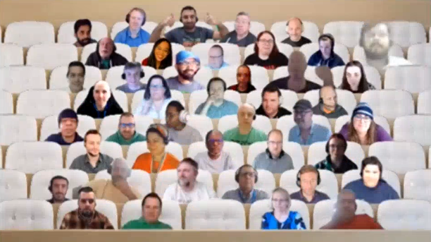

## Call summary

Latest updates and news on Power Platform including community events, training opportunities and the Monthly Community Tip.

Three demos delivered: Developing a personal wellness app to prevent burnout using Power Apps and SharePoint, Power Platform Release Planner - your new superpower!, and How to use "when an action is performed" trigger in Power Automate.

Activities: 4 articles, 3 documents, 1 landing page, 3 samples, 4 connectors, and 2 Power Platform related conversations recently delivered.

This call was hosted by [David Warner II](http://twitter.com/DavidWarnerII) (Microsoft) \| @DavidWarnerII and recorded on February 15, 2023. Questions addressed in chat throughout the call.

### New this month

* News and Documents
    * Article – [2023 release wave 1 plans for Microsoft Dynamics 365 and Power Platform now available](https://cloudblogs.microsoft.com/dynamics365/bdm/2023/01/25/2023-release-wave-1-plans-for-microsoft-dynamics-365-and-power-platform-now-available/) - [Mo Osborne](https://www.linkedin.com/in/mgosborne/) (Microsoft)
    * Article – [Making Dataverse available for all makers](https://powerapps.microsoft.com/blog/making-it-easier-to-work-with-dataverse/) - [Mankirat Kaur Bajwa](https://www.linkedin.com/in/mk-bajwa/) (Microsoft)
    * Article – [Power Pages Data workspace is now solution aware](https://powerpages.microsoft.com/blog/power-pages-data-workspace-is-now-solution-aware/) - [Pranita Padalwar](https://www.linkedin.com/in/pranita225/) (Microsoft)
    * Article – [Create native mobile apps with wrap for Power Apps wizard (Public Preview)](https://powerapps.microsoft.com/blog/create-native-mobile-apps-with-wrap-for-power-apps-wizard-public-preview/) - [Marina Kolomiets](https://www.linkedin.com/in/marinakolomiets) (Microsoft)
    * Documentation – [Overview of pipelines in Power Platform (preview)](https://learn.microsoft.com/power-platform/alm/pipelines)
    * Documentation – [Build large and complex canvas apps](https://learn.microsoft.com/power-apps/maker/canvas-apps/working-with-large-apps)
    * Documentation – [Use sample app templates in Microsoft Teams](https://learn.microsoft.com/power-apps/teams/use-sample-apps)
    * Documentation – [Microsoft Power Platform developer documentation](https://learn.microsoft.com/power-platform/developer/) (enhanced landing page for developers)
* [Power Platform Samples](https://pnp.github.io/powerplatform-samples/)
    * New - App Login - [Seth Addo](https://github.com/seths10) \| seths10
    * New - Search Movies - [Aaryan Arora](https://github.com/aaryan2134) \| aaryan2134
    * New - [Student Application Process](https://github.com/pnp/powerapps-samples/commit/4273e53196e955369c341f3671c83c44aab7ff50) - [Samia Sohail Azim](https://github.com/sam-404) \| sam-404
* Power Platform - [Independent Publisher Connectors](https://github.com/microsoft/PowerPlatformConnectors/tree/dev/independent-publisher-connectors)
    * New - MongoDB
    * New - [WhatsApp](https://github.com/microsoft/PowerPlatformConnectors/tree/dev/independent-publisher-connectors/WhatsApp) - [Zakariya Fakira](https://github.com/zak0807)
    * New - IBM Watson
    * Updated – [OpenAI](https://github.com/microsoft/PowerPlatformConnectors/tree/dev/independent-publisher-connectors/OpenAI) (now supports DALLE2) – [PowerRobin](https://github.com/PowerRobin)
    * [Top Connector Asks](https://github.com/microsoft/PowerPlatformConnectors/wiki/Top-Connector-Asks)
    * Good Flow story? Tell us. [FlowOfTheWeek](https://aka.ms/FlowOfTheWeekForm) – aka.ms/FlowOfTheWeekForm
* Shows and Events
    * New Episodes - The [Low Code Revolution Show](https://learn.microsoft.com/shows/the-low-code-revolution/) with [April Dunnam](https://twitter.com/aprildunnam) (Microsoft) \| @aprildunnam and Daniel Laskewitz (Microsoft) \| @laskewitz \| aka.ms/LowCodeRevolutionShow
        * Power Platform CLI Exposed: [PAC CLI Overview](https://learn.microsoft.com/shows/the-low-code-revolution/power-platform-cli-exposed-pac-cli-overview) (Jan 3)
        * Power Platform CLI Exposed: [Solutions](https://learn.microsoft.com/shows/the-low-code-revolution/power-platform-cli-exposed-solutions) (Jan 10)
        * Power Platform CLI Exposed: [Power Pages](https://learn.microsoft.com/shows/the-low-code-revolution/power-platform-cli-exposed-power-pages) (Jan 20)
        * Power Platform CLI Exposed: [Data & Tool](https://learn.microsoft.com/Shows/the-low-code-revolution/power-platform-cli-exposed-data-and-tool) (Feb 2)
    * [It’s Low Code February!](https://microsoft.github.io/Low-Code/) - aka.ms/lowcode-february
    * Global [POWER PLATFORM BOOTCAMP \#2023](http://WWW.POWERPLATFORMBOOTCAMP.COM) – Feb 24 - 25
    * ACT NOW – save €300 on tickets for the [European Power Platform Conference](https://www.sharepointeurope.com/european-power-platform-conference) – Dublin, 20-23 June
    * 365 EduCon - Use promo code “Community” to save 25% off any pass type.
        * [Washington DC](http://www.365educon.com/dc) – June 12-16, 2023
        * [Seattle](http://www.365educon.com/seattle) – August 21-25, 2023 & PWR EduCon
        * [Chicago](http://www.365educon.com/chicago) – October 30 – November 3, 2023
    * Upcoming [Community Days](https://communitydays.org/) Events - aka.ms/communitydays
    * Microsoft Power Platform Connectors - 948 connectors! – Build new or improve existing Independent Publisher Connector – [visit our wiki!](https://github.com/microsoft/PowerPlatformConnectors/wiki), Communicate with Jocelyn Panchal \| @JocelynP_PM \|\| linkedin.com/in/jocepan00/

### Demo summaries

* **Developing a personal wellness app to prevent burnout using Power Apps and SharePoint** – a Power Apps app that addresses job burnout using 2 approaches - actions that lead to positive developments and refocusing after reflecting. Uses SharePoint Lists, Power Apps and Power Automate (for reminders). Randomly delivered cards explore the user’s wellbeing and prompts for actions/reflections. SharePoint stores tips, prompts and reflections. Step through the logic for presenting information based on person’s energy level – pre and post reflection. [aka.ms/Feb15-Demo1](https://aka.ms/Feb15-Demo1)
* **Power Platform Release Planner - your new superpower!** – key features include feature search, my release planner, collaboration through notes, filtering (by date or functionality), use the API to retrieve release plans and ability to share release plans. Tool walkthrough. Power Platform and Dynamics products organized by what is Planned, Coming soon and Try now. For selected feature, - see when last updated, public preview date, and share button. Release wave notes and documentation. [aka.ms/Feb15-Demo2](https://aka.ms/Feb15-Demo2)
* **How to use "when an action is performed" trigger in Power Automate** – a practical introduction to event driven architecture. Structure your flow so that other people in your tenant can plug their own logic (child flows?) into it. Learn about the Plugin Registration Tool. Step through Registering a Custom API and adding it to your Power Automate trigger. Essentially, you are splitting the flow logic into separate components that others can hook without impacting the core flow/app. [aka.ms/Feb15-Demo3](https://aka.ms/Feb15-Demo3)



## Agenda items

[00:00](https://youtu.be/MQyRjD1nVRQ?t=0) – Intro

[01:25](https://youtu.be/MQyRjD1nVRQ?t=85) – Power Platform News & Learn Updates – [Daniel Laskewitz](https://twitter.com/laskewitz) (Microsoft) \| @laskewitz

[03:23](https://youtu.be/MQyRjD1nVRQ?t=203) – Latest Power Apps Samples – [Daniel Laskewitz](https://twitter.com/laskewitz) (Microsoft) \| @laskewitz

[06:44](https://youtu.be/MQyRjD1nVRQ?t=404) – Power Platform Community Shows & Events - [April Dunnam](http://twitter.com/aprildunnam) (Microsoft) \| @aprildunnam & [David Warner II](http://twitter.com/DavidWarnerII) (Microsoft) \| @DavidWarnerII

[10:59](https://youtu.be/MQyRjD1nVRQ?t=659) – Independent Publisher Connectors - [Jocelyn Panchal](https://twitter.com/JocelynP_PM) (Microsoft) \| @JocelynP_PM

[13:02](https://youtu.be/MQyRjD1nVRQ?t=782) – Together mode picture

[14:21](https://youtu.be/MQyRjD1nVRQ?t=861) – Demo - Developing a personal wellness app to prevent burnout using Power Apps and SharePoint – [Carlos Solís](https://twitter.com/CarlosBKSolis1) (Texas State University) \| @CarlosBKSolis1 \| [aka.ms/Feb15-Demo1](https://aka.ms/Feb15-Demo1)

[23:57](https://youtu.be/MQyRjD1nVRQ?t=1437) – Demo - Power Platform Release Planner - your new superpower! – [Vivian Voss](https://twitter.com/VivianTiiman) (Avanade) \| @VivianTiiman \| [aka.ms/Feb15-Demo2](https://aka.ms/Feb15-Demo2)

[34:35](https://youtu.be/MQyRjD1nVRQ?t=2075) – Demo - How to use "when an action is performed" trigger in Power Automate – [Yannick Reekmans](https://twitter.com/YannickReekmans) (Qubix) \| @YannickReekmans \| [aka.ms/Feb15-Demo3](https://aka.ms/Feb15-Demo3)

[48:14](https://youtu.be/MQyRjD1nVRQ?t=2894) – Resources

[50:02](https://youtu.be/MQyRjD1nVRQ?t=3002) – Closing

## Together mode

While picture quality is not so good today, participant quality cannot be beat! Hope to see you again soon.

## Actions

* Opt into the [PnP Community Recognition Program](https://aka.ms/m365pnp-recognition) \| [aka.ms/community/recognition](https://aka.ms/m365pnp-recognition)
* Request to Present – aka.ms/community/request/demo
* [Share your Community Quick Tips](https://customervoice.microsoft.com/Pages/ResponsePage.aspx?id=v4j5cvGGr0GRqy180BHbR02h_1H9_XFFp4etSzu5JxFUN0JZTFNDSDRJVVJGTkxHVzcxRDJWM01RWi4u) \| aka.ms/PPCCDemoRequest
* Questions, comments, ideas, about a demo? Do share in “Community Calls Conversations” – see link with each demo.
* Connect to other makers in your organization via chatbot, now in public preview - aka.ms/makermatch.
* Register for upcoming [Sharing is Caring](https://pnp.github.io/sharing-is-caring/) events:
    * Maturity Model Practitioners \| Tuesday, February 21st, 7am PST – [Download reoccurring invite](https://aka.ms/mm4m365/invite)
    * Power Platform Samples Contributor \| Thursday, February 23rd, 9:00am PT \| 12:00pm ET - [Register](https://forms.office.com/pages/responsepage.aspx?id=KtIy2vgLW0SOgZbwvQuRaXDXyCl9DkBHq4A2OG7uLpdUN0hMNTRPWVVWTkhFTk9QQzhFSTRIS1JLSC4u)
    * PnP Office Hours – 1:1 session \| [Register](https://outlook.office365.com/owa/calendar/PnPSharingisCaring@warner.digital/bookings/)
    * PnP Buddy System \| [Request a Buddy](https://forms.office.com/Pages/ResponsePage.aspx?id=KtIy2vgLW0SOgZbwvQuRaXDXyCl9DkBHq4A2OG7uLpdUMjRRUVg4NElZUUJLTEY1TVVSVDJFRFpLRS4u)
* [PnP Samples](https://aka.ms/powerplatform-samples) - We welcome your Power Platform samples!
* [View](https://aka.ms/LowCodeRevolutionShow) or be a [Guest](https://aka.ms/LowCodeRevolutionGuest) on **The Low Code Revolution** show \| aka.ms/LowCodeRevolutionShow
* Request to deliver a demo or a Monthly Community Quick Tip (90 – 120 seconds) during this monthly community call - aka.ms/PPCCDemoRequest
* Mark your calendar for our next call February 15th at 08:00am PT \| <https://aka.ms/powerappscommunitycall>
* Register for the [Microsoft 365 Developer Program](https://aka.ms/m365/devprogram) and get a free developer tenant
* Get started with [free training modules](https://aka.ms/m365/dev/learn) covering Microsoft 365 platform capabilities.
* Visit the [Microsoft 365 Unified Sample Solution Gallery](https://adoption.microsoft.com/sample-solution-gallery) from Microsoft and community.

## Demo references

* **Developing a personal wellness app to prevent burnout using Power Apps and SharePoint**
    * Website - [Technology Innovation Office – Texas State University](https://www.tio.txst.edu/)
* **Power Platform Release Planner - your new superpower!**
    * Release Planner - [Dynamics 365 and Microsoft Power Platform](https://experience.dynamics.com/releaseplans/?app=Marketing)
* **How to use "when an action is performed" trigger in Power Automate**
    * Documentation - [Create and use Custom APIs](https://learn.microsoft.com/power-apps/developer/data-platform/custom-api)

Request to present a demo during this call - aka.ms/PPCCDemoRequest

## General resources

* Power Apps Training Resources - <https://aka.ms/PowerAppsTraining>
* Power Apps Community -
    [https://Community.PowerApps.com](https://community.powerapps.com/)
* Power Apps Community Samples -
    [aka.ms/PowerAppsCommunitySamples](https://aka.ms/PowerAppsCommunitySamples)
* Power Apps Community Videos -
    [aka.ms/PowerAppsCommunityVideos](https://aka.ms/PowerAppsCommunityVideos)
* PowerPlatformLearn Resources -
    [https://www.powerplatformlearn.academy](https://www.powerplatformlearn.academy/)
* PnP Power Platform Samples -
    [aks.ms/powerplatform-samples](https://www.aks.ms/powerplatform-samples)
* Create SharePoint List - <https://bit.ly/CreateSharePointList>
* Microsoft’s [Power Platform website](https://powerplatform.microsoft.com/)

## Additional resources

* Power Addicts Hangout \|
    [https://wearepoweraddicts.com](https://wearepoweraddicts.com/)
* \#LessCodeMorePower Video Series \|
    <https://www.youtube.com/playlist?list=PL8IYfXypsj2Cr4DUqMKYkGM-Wejfim2QX>
* [Powerful Devs Video Series](https://aka.ms/PowerfulDevsYouTube) \|
    <https://aka.ms/PowerfulDevsYouTube>
* Twitter -
    [https://twitter.com/microsoft365dev](https://www.youtube.com/redirect?event=video_description&redir_token=QUFFLUhqbkdvcDJHcGdzM2VIUkwzU3lOYkJaVFEzM0Q2QXxBQ3Jtc0ttM1NyaTQ2RjFSOFh3a0l4c1pralBRQVI1bDNSQ2RaVm9OdzJrRkdtV1Z1SW5VdmdwamNNLTBEaFdaSmZMc0lQNzdRZ2dDYV9WZVF1ZVIwc2dPQTZBRUZ3b3hoWUVJdDJoQWZUcWdCR2JKdmwtUU43RQ&q=https%3A%2F%2Ftwitter.com%2Fmicrosoft365dev)​
* Twitter: <https://twitter.com/MSPowerPlat>
* Call attention to your great work by using
    [\#PowerAppsCC](https://twitter.com/hashtag/PowerAppsCC?src=hashtag_click)
    and [\#PnPWeekly](https://twitter.com/hashtag/PnPWeekly?src=hashtag_click)
    on Twitter.
* Microsoft 365 Unified Sample gallery - <https://aka.ms/community/samples>
* Microsoft 365 Platform Community in YouTube - <https://aka.ms/community/videos>
* Microsoft 365 Platform Community - <https://aka.ms/community/home>


