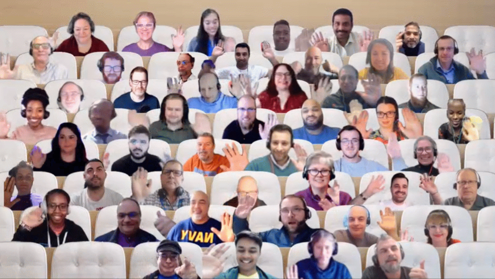

## Call summary

Latest updates and news on Power Platform including community events, training opportunities and the Monthly Community Tip.

Three demos delivered – Building a Name Pronunciation Database with Power Apps and Power Automate, Mention a bot from a Power Automate flow, and Effortlessly showing grids of data in your Power Apps using the Creator Kit.

This call was hosted by [David Warner II](http://twitter.com/DavidWarnerII) (Microsoft) \| @DavidWarnerII and recorded on January 18, 2022. Questions addressed in chat throughout the call.

### New this month

* [Power Platform Samples](https://pnp.github.io/powerplatform-samples/)
    * [PDF Reader Creator Kit](https://angelogulisano.com/creator-kit-introduction/) - [Angelo Gulisano](https://twitter.com/angelog1908) \| @angelog1908
* News, Shows and Events
    * New Episodes - The [Low Code Revolution Show](https://learn.microsoft.com/shows/the-low-code-revolution/) with [April Dunnam](https://twitter.com/aprildunnam) (Microsoft) \| @aprildunnam \| aka.ms/LowCodeRevolutionShow
        * [Azure App Modernization with Power Apps](https://learn.microsoft.com/shows/the-low-code-revolution/azure-app-modernization-with-power-apps)
        * [Power Platform CLI Exposed: PAC CLI Overview](https://learn.microsoft.com/shows/the-low-code-revolution/power-platform-cli-exposed-pac-cli-overview)
        * [Power Platform CLI Exposed: Solutions](https://learn.microsoft.com/shows/the-low-code-revolution/power-platform-cli-exposed-solutions)
    * [Powerful Devs 2023](https://learn.microsoft.com/events/learn-events/Powerful-Devs-2023/) conference – February 15, 9am PT - aka.ms/PowerfulDevsConf2023
    * [It’s Low Code February!](https://microsoft.github.io/Low-Code/) Join un on January 31, 2023, as we kick off the Low Code journey - aka.ms/lowcode-february
    * ACT NOW – save 30% on tickets until January 24th for the [European Power Platform Conference](https://www.sharepointeurope.com/european-power-platform-conference) – Dublin, 20-23 June – use code: HugoRocks30
    * Upcoming [Community Days](https://communitydays.org/) Events - aka.ms/communitydays
        * [M365 Twin Cities](https://communitydays.org/event/2023-01-21/m365-twin-cities#home) (US), Saturday, January 21, 2023 - [Register](https://www.eventbrite.com/e/m365-twin-cities-winter-2023-tickets-471566266397)
        * [aMS Sophia Antipolis](https://communitydays.org/event/2023-02-07/ams-sophia-antipolis) (France), February 7, 2023 - [Register](https://sessionize.com/ams-sophia-2023/)
        * [WorkplaceDudes Summit](https://communitydays.org/event/2023-02-24/workplacedudes-summit) (Netherlands), February 24, 2023 - [Register](https://communitydays.org/event/2023-02-24/workplacedudes-summit)
    * Microsoft Power Platform Connectors: 924! – Build new or improve existing Independent Publisher Connector – [visit our wiki!](https://github.com/microsoft/PowerPlatformConnectors/wiki), Communicate with Jocelyn Panchal \| @JocelynP_PM \|\| linkedin.com/in/jocepan00/
* Community Calls Conversations – continue the conversation - chat about demos anytime.  See links to chat pages in demo details.  

### Demo summaries

* **Building a Name Pronunciation Database with Power Apps and Power Automate** – embrace global diversity with this solution. A Power App with a Power Automate flow sitting on a SharePoint page and a document library. See the app in action – recording name and pronouns, listing to the recording, then going behind UI to see the Power App elements used. Step through capturing and transferring 3 variables from Power App into flow actions. Sample available.
* **Mention a bot from a Power Automate flow** – see how to mention a bot in a flow from Teams. Use these building blocks – Power Virtual Agent, Microsoft List, Microsoft Team and channel, and a Power Automate cloud flow that triggers on a key word (\#FAQ) and posts a message with a bot mention. @mention bot from Teams Channel. Flow monitors the channel. The Power Virtual Agent is published to Teams as an app.
* **Effortlessly showing grids of data in your Power Apps using the Creator Kit** – that’s basically, a Fluent UI style set of controls. In this demo, see specifically how to show data in tabular format using a control and template from the kit. An alternative to galleries - the DetailsList control is a responsive, Fluent styled control optimized for grids of data. Create table, add columns, import data, display, sort, tab, resize, etc.



## Agenda items

[00:00](https://youtu.be/KkUmMXjA7UA?t=0) – Intro

[02:06](https://youtu.be/KkUmMXjA7UA?t=126) – Latest Power Apps Samples – [April Dunnam](http://twitter.com/aprildunnam) (Microsoft) \| @aprildunnam

[05:37](https://youtu.be/KkUmMXjA7UA?t=337) – Power Platform Community Shows & Events - [April Dunnam](http://twitter.com/aprildunnam) (Microsoft) \| @aprildunnam & [David Warner II](http://twitter.com/DavidWarnerII) (Microsoft) \| @DavidWarnerII

[10:15](https://youtu.be/KkUmMXjA7UA?t=615) – Independent Publisher Connectors - [Jocelyn Panchal](https://twitter.com/JocelynP_PM) (Microsoft) \| @JocelynP_PM

[12:21](https://youtu.be/KkUmMXjA7UA?t=741) – Together mode picture

[13:30](https://youtu.be/KkUmMXjA7UA?t=810) – Demo - Building a Name Pronunciation Database with Power Apps and Power Automate – [Lindsay Shelton](https://twitter.com/LShelton_Tech) \| @LShelton_Tech \| aka.ms/Jan18-Demo1

[26:33](https://youtu.be/KkUmMXjA7UA?t=1593) – Demo - Mention a bot from a Power Automate flow – [Dennis Goedegebuure](https://twitter.com/expiscornovus) \| @expiscornovus \| aka.ms/Jan18-Demo2

[39:51](https://youtu.be/KkUmMXjA7UA?t=2391)– Demo - Effortlessly showing grids of data in your Power Apps using the Creator Kit – [Scott Durow](https://twitter.com/ScottDurow) \| @ScottDurow \| aka.ms/Jan18-Demo3

[1:00:50](https://youtu.be/KkUmMXjA7UA?t=3650) – Closing

## Together mode

Thank you for sharing your amazing and fantastic faces. You are what powers our community. Looking forward to an amazing year with all of you.

## Actions

* Opt into the [PnP Community Recognition Program](https://aka.ms/m365pnp-recognition) \| [aka.ms/community/recognition](https://aka.ms/m365pnp-recognition)
* [Share your Community Quick Tips](https://customervoice.microsoft.com/Pages/ResponsePage.aspx?id=v4j5cvGGr0GRqy180BHbR02h_1H9_XFFp4etSzu5JxFUN0JZTFNDSDRJVVJGTkxHVzcxRDJWM01RWi4u) \| aka.ms/PPCCDemoRequest
* Connect to other makers in your organization via chatbot, now in public preview - aka.ms/makermatch.
* Register for upcoming [Sharing is Caring](https://pnp.github.io/sharing-is-caring/) events:
    * Writing for the Web \| Monday, January 23rd, 10am PT \| 1pm ET \| 7:00pm CET - [Register](https://forms.office.com/pages/responsepage.aspx?id=KtIy2vgLW0SOgZbwvQuRaXDXyCl9DkBHq4A2OG7uLpdUMFNPNFMyUk9CNFROUjJWTFFGSzdJV0czVC4u)
    * PnP SPFx Samples w/NVM \| Wednesday, January 25th, 9am PT \| 12pm ET - [Register](https://forms.office.com/pages/responsepage.aspx?id=KtIy2vgLW0SOgZbwvQuRaXDXyCl9DkBHq4A2OG7uLpdUNEE2SUdTOU1UOEtCTFU3MlM1SERDMlNVNi4u)
    * Maturity Model Practitioners \| Tuesday, February 21st, 7am PST – [Download reoccurring invite](https://aka.ms/mm4m365/invite)
    * Power Platform Samples Contributor \| Thursday, February 23rd, 9:00am PT \| 12:00pm ET - [Register](https://forms.office.com/pages/responsepage.aspx?id=KtIy2vgLW0SOgZbwvQuRaXDXyCl9DkBHq4A2OG7uLpdUN0hMNTRPWVVWTkhFTk9QQzhFSTRIS1JLSC4u)
    * PnP Office Hours – 1:1 session \| [Register](https://outlook.office365.com/owa/calendar/PnPSharingisCaring@warner.digital/bookings/)
    * PnP Buddy System \| [Request a Buddy](https://forms.office.com/Pages/ResponsePage.aspx?id=KtIy2vgLW0SOgZbwvQuRaXDXyCl9DkBHq4A2OG7uLpdUMjRRUVg4NElZUUJLTEY1TVVSVDJFRFpLRS4u)
* [PnP Samples](https://aka.ms/powerplatform-samples) - We welcome your Power Platform samples!
* [View](https://aka.ms/LowCodeRevolutionShow) or be a [Guest](https://aka.ms/LowCodeRevolutionGuest) on **The Low Code Revolution** show \| aka.ms/LowCodeRevolutionShow
* Request to deliver a demo or a Monthly Community Quick Tip (90 – 120 seconds) during this monthly community call - aka.ms/PPCCDemoRequest
* Mark your calendar for our next call February 15th at 08:00am PT \| <https://aka.ms/powerappscommunitycall>
* Register for the [Microsoft 365 Developer Program](https://aka.ms/m365/devprogram) and get a free developer tenant
* Get started with [free training modules](https://aka.ms/m365/dev/learn) covering Microsoft 365 platform capabilities.
* Visit the [Microsoft 365 Unified Sample Solution Gallery](https://adoption.microsoft.com/sample-solution-gallery) from Microsoft and community.

## Demo references

* **Building a Name Pronunciation Database with Power Apps and Power Automate**
    * YouTube Channel - [Daniel Christian](https://www.youtube.com/@DanielChristian19)
    * Article - [Building beautiful buttons in Canvas Apps part 1 - neumorphic buttons](https://www.kristinekolodziejski.com/blog/building-beautiful-buttons-in-canvas-apps-part-1-neumorphic-buttons)
* **Mention a bot from a Power Automate flow**
    * Article - [Call a Teams Chatbot via a Power Automate Flow](https://powerusers.microsoft.com/t5/Building-PVA-chatbots-in/Call-a-Teams-Chatbot-via-a-Power-Automate-Flow/m-p/1614413)
    * Documentation - [Reply to a message in a channel](https://learn.microsoft.com/graph/api/channel-post-messagereply)
    * Blog – [Expiscornovus](https://www.expiscornovus.com/)
    * Samples – [List Formatting Samples](https://pnp.github.io/List-Formatting/)
* **Effortlessly showing grids of data in your Power Apps using the Creator Kit**
    * Documentation - [Creator kit](https://learn.microsoft.com/power-platform/guidance/creator-kit/overview) \| aka.ms/creatorkit
    * Documentation - [Install the Creator Kit](https://learn.microsoft.com/power-platform/guidance/creator-kit/setup)
    * Documentation – [DetailsList control](https://learn.microsoft.com/power-platform/guidance/creator-kit/detailslist)
    * Playlist – [Creator Kit videos](https://www.youtube.com/playlist?list=PLhgOm-Jpmt83NAtZ8DC97fxpjWfeWmgJJ) \| bit.ly/creatorkit-playlist
    * Tool – [Ribbon Workbench](https://www.xrmtoolbox.com/plugins/RibbonWorkbench2016/)

Request to present a demo during this call - aka.ms/PPCCDemoRequest

## General resources

* Power Apps Training Resources - <https://aka.ms/PowerAppsTraining>
* Power Apps Community -
    [https://Community.PowerApps.com](https://community.powerapps.com/)
* Power Apps Community Samples -
    [aka.ms/PowerAppsCommunitySamples](https://aka.ms/PowerAppsCommunitySamples)
* Power Apps Community Videos -
    [aka.ms/PowerAppsCommunityVideos](https://aka.ms/PowerAppsCommunityVideos)
* PowerPlatformLearn Resources -
    [https://www.powerplatformlearn.academy](https://www.powerplatformlearn.academy/)
* PnP Power Platform Samples -
    [aks.ms/powerplatform-samples](https://www.aks.ms/powerplatform-samples)
* Create SharePoint List - <https://bit.ly/CreateSharePointList>
* Microsoft’s [Power Platform website](https://powerplatform.microsoft.com/)

## Additional resources

* Power Addicts Hangout \|
    [https://wearepoweraddicts.com](https://wearepoweraddicts.com/)
* \#LessCodeMorePower Video Series \|
    <https://www.youtube.com/playlist?list=PL8IYfXypsj2Cr4DUqMKYkGM-Wejfim2QX>
* [Powerful Devs Video Series](https://aka.ms/PowerfulDevsYouTube) \|
    <https://aka.ms/PowerfulDevsYouTube>
* Twitter -
    [https://twitter.com/microsoft365dev](https://www.youtube.com/redirect?event=video_description&redir_token=QUFFLUhqbkdvcDJHcGdzM2VIUkwzU3lOYkJaVFEzM0Q2QXxBQ3Jtc0ttM1NyaTQ2RjFSOFh3a0l4c1pralBRQVI1bDNSQ2RaVm9OdzJrRkdtV1Z1SW5VdmdwamNNLTBEaFdaSmZMc0lQNzdRZ2dDYV9WZVF1ZVIwc2dPQTZBRUZ3b3hoWUVJdDJoQWZUcWdCR2JKdmwtUU43RQ&q=https%3A%2F%2Ftwitter.com%2Fmicrosoft365dev)​
* Twitter: <https://twitter.com/MSPowerPlat>
* Call attention to your great work by using
    [\#PowerAppsCC](https://twitter.com/hashtag/PowerAppsCC?src=hashtag_click)
    and [\#PnPWeekly](https://twitter.com/hashtag/PnPWeekly?src=hashtag_click)
    on Twitter.
* Microsoft 365 Unified Sample gallery - <https://aka.ms/m365/samples>
* Microsoft 365 Platform Community in YouTube - <https://aka.ms/m365/videos>
* Microsoft 365 Platform Community - <https://aka.ms/m365pnp>


