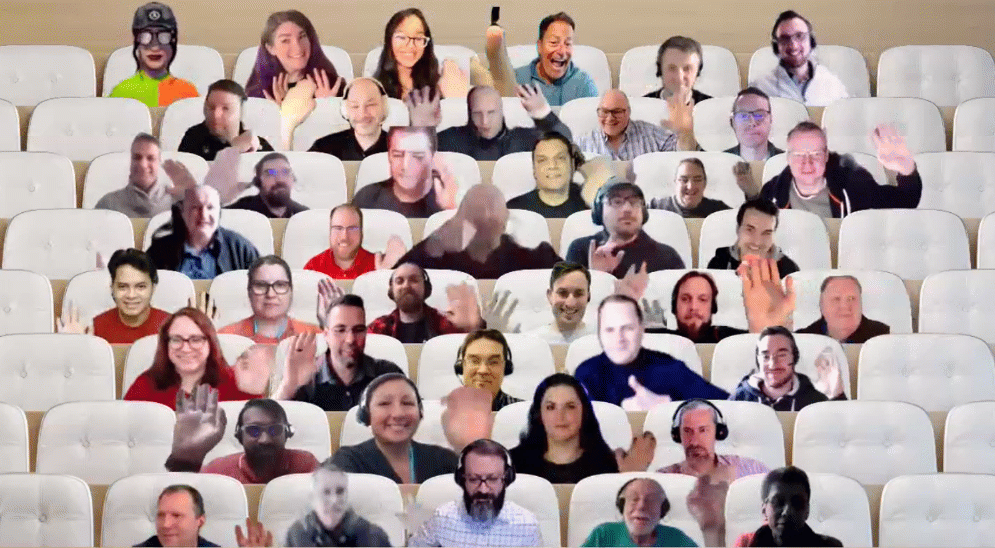

## Call summary

Latest updates and news on Power Platform including community events, training opportunities and the Monthly Community Tip.

Three demos: From Epilepsy to MVP - Empowerment using the Power Platform, Igniting a Power Automate Revolution: What Happens When Salespeople like to Click Buttons? and Quality Assurance with Power Platform Pipelines using Power Apps.

Activities: 3 articles, 3 documents, 3 samples, 21 connectors, 6 Power Platform related video conversations recently delivered.

This call was hosted by [David Warner II](http://twitter.com/DavidWarnerII) (Microsoft) \| @DavidWarnerII and recorded on March 15, 2023. Questions addressed in chat throughout the call.

### New this month

* News and Documents
    * Article – [Build solutions faster with Microsoft Power Platform and next-generation AI](https://cloudblogs.microsoft.com/powerplatform/2023/03/06/build-solutions-faster-with-microsoft-power-platform-and-next-generation-ai/) - Richard Riley (Microsoft)
    * Article – [Pipelines in Power Platform is Generally Available (GA)](https://powerapps.microsoft.com/blog/pipelines-in-power-platform-is-generally-available-ga/) – Casey Burke (Microsoft)
    * Article – [Easily design and automatically send actionable, data-driven cards in Teams](https://powerapps.microsoft.com/blog/easily-design-and-automatically-send-actionable-data-driven-cards-in-teams/) - Anthony Uitz (Microsoft)
    * Documentation – [Boost conversations (preview)](https://learn.microsoft.com/power-virtual-agents/nlu-boost-conversations) - Microsoft
    * Documentation – [Azure OpenAI Service model overview (preview)](https://learn.microsoft.com/ai-builder/prebuilt-azure-openai) - Microsoft
    * Documentation – [Send a card automatically with a flow (preview)](https://learn.microsoft.com/power-apps/cards/send-a-card/send-card-with-flow) – Microsoft
    * New Sharing Is Caring training date announced. Power Platform Samples Contributor \| Monday, April 10th, 11:00am PT \| 2:00pm ET - [Register](https://forms.office.com/pages/responsepage.aspx?id=KtIy2vgLW0SOgZbwvQuRaXDXyCl9DkBHq4A2OG7uLpdUN0hMNTRPWVVWTkhFTk9QQzhFSTRIS1JLSC4u)
* [Power Platform Samples](https://pnp.github.io/powerplatform-samples/)
    * New Power App - [Quality Assurance Assessment Solution](https://github.com/NatiTurts/PowerApps_Quality_Assurance_Assessment) - [Nati Turtledove](https://twitter.com/NatiTurts) \| @NatiTurts
    * New Power App - [Power Happening](https://github.com/pnp/powerapps-samples/pull/188) - [Wilmer Alcivar](https://github.com/walcivar) & [Ben den Blanken](https://twitter.com/BenDenBlanken) \| @BenDenBlanken
    * Updated Power App - [Name Pronunciation Recorder](https://github.com/pnp/powerapps-samples/tree/main/samples/name-pronunciation-recorder) - [Lindsay Shelton](https://twitter.com/lshelton_tech) \| @lshelton_tech
* Power Platform - [Independent Publisher Connectors](https://github.com/microsoft/PowerPlatformConnectors/tree/dev/independent-publisher-connectors)
    * 21 Connectors since the call last month
    * [Top Connector Asks](https://github.com/microsoft/PowerPlatformConnectors/wiki/Top-Connector-Asks)
    * Good Flow story? Tell us. [FlowOfTheWeek](https://aka.ms/FlowOfTheWeekForm) – aka.ms/FlowOfTheWeekForm
* Shows and Events
    * New Episodes - The [Low Code Revolution Show](https://learn.microsoft.com/shows/the-low-code-revolution/) with [April Dunnam](https://twitter.com/aprildunnam) (Microsoft) \| @aprildunnam and Daniel Laskewitz (Microsoft) \| @laskewitz \| aka.ms/LowCodeRevolutionShow
        * [Display IoT Data in a Power Apps using Azure Functions and Customer Connectors](https://learn.microsoft.com/shows/the-low-code-revolution/display-iot-data-in-power-apps-using-azure-functions-and-custom-connectors) (Mar 13)
        * [Unleash the Power of Azure OpenAI Service with AI Builder](https://learn.microsoft.com/shows/the-low-code-revolution/unleash-the-power-of-azure-openai-service-with-ai-builder) (Mar 6)
        * [Pipelines for Power Platform 101](https://learn.microsoft.com/shows/the-low-code-revolution/pipelines-for-power-platform-101) (Mar 2)
        * [Add OpenAI Capabilities to your Power Platform](https://learn.microsoft.com/shows/the-low-code-revolution/add-openai-capabilities-to-your-power-platform-solutions) (Feb 22)
        * [Integrating Azure Communications Services with Power Platform](https://learn.microsoft.com/shows/the-low-code-revolution/integrating-azure-communications-services-with-power-platform) (Feb 20)
        * [Real World Use Cases for Database for Teams](https://learn.microsoft.com/shows/the-low-code-revolution/real-world-use-cases-for-dataverse-for-teams) (Feb 17)
    * European Collaboration Summit 2023 - Düsseldorf, Germany, 24-36 May. Save 15% with “PowerPlatformRocks” voucher.
    * ACT NOW – save 17% until March 17th on tickets for the [European Power Platform Conference](https://www.sharepointeurope.com/european-power-platform-conference) – Dublin, 20-23 June
    * 365 EduCon - Use promo code “Community” to save 25% off any pass type.
        * [Washington DC](http://www.365educon.com/dc) – June 12-16, 2023
        * [Seattle](http://www.365educon.com/seattle) – August 21-25, 2023 & PWR EduCon
        * [Chicago](http://www.365educon.com/chicago) – October 30 – November 3, 2023
    * Upcoming [Community Days](https://communitydays.org/) Events - aka.ms/communitydays

### Demo summaries

* **From Epilepsy to MVP - Empowerment using the Power Platform** – a personal story meant to inspire viewers. This story begins with a mystery and no cure. After 26 years there is a diagnosis and cure. The message: By learning how to live with a disability, Daniel developed the skills (writing, speaking, teaching, connecting) to be a great MVP. Let disability not define you. As for the link to Power Platform? Enjoy the story. [aka.ms/Mar15-Demo1](https://aka.ms/Mar15-Demo1)
* **Igniting a Power Automate Revolution: What Happens When Salespeople like to Click Buttons?** – a development journey prompted by necessity, a passing awareness of Power Automate and a supportive employer. The journey starts with a single time saving flow, value recognition, and peer adoption. Then blooms with learning and growth, community support, technology challenges overcome, and the full embrace of leadership for both the Maker and Power Platform. This is a practical and implementable journey. [aka.ms/Mar15-Demo2](https://aka.ms/Mar15-Demo2)
* **Quality Assurance with Power Platform Pipelines using Power Apps** – a QA Assessment tool using Power apps built on the Power Platform Pipeline (ALM Accelerator for Power Platform, built by the Power CAT team). The tool (simple canvas app) facilitates the successful transition from Development to QA to UAT after criteria satisfied. App includes pre-built list of checks (assessment items) to perform, by product topic. QA submission closes QA session and allows deployment into UAT environment. [aka.ms/Mar15-Demo3](https://aka.ms/Mar15-Demo3)



## Agenda items

[00:00](https://youtu.be/jkPRm4gzxv0?t=0) – Intro

[01:33](https://youtu.be/jkPRm4gzxv0?t=93) – Power Platform News & Learn Updates – [Daniel Laskewitz](https://twitter.com/laskewitz) (Microsoft) \| @laskewitz

[03:04](https://youtu.be/jkPRm4gzxv0?t=184) – Latest Power Apps Samples – [April Dunnam](http://twitter.com/aprildunnam) (Microsoft) \| @aprildunnam

[04:19](https://youtu.be/jkPRm4gzxv0?t=259) – Independent Publisher Connectors - [Jocelyn Panchal](https://twitter.com/JocelynP_PM) (Microsoft) \| @JocelynP_PM

[08:22](https://youtu.be/jkPRm4gzxv0?t=502) – Power Platform Community Shows & Events - [April Dunnam](http://twitter.com/aprildunnam) (Microsoft) \| @aprildunnam & [David Warner II](http://twitter.com/DavidWarnerII) (Microsoft) \| @DavidWarnerII

[11:33](https://youtu.be/jkPRm4gzxv0?t=693) – Together mode picture

[12:42](https://youtu.be/jkPRm4gzxv0?t=762) – Demo - From Epilepsy to MVP - Empowerment using the Power Platform – [Daniel Christian](https://twitter.com/dchristian19) \| @dchristian19

[29:11](https://youtu.be/jkPRm4gzxv0?t=1751) – Demo - Igniting a Power Automate Revolution: What Happens When Salespeople like to Click Buttons? – [Gizzelle Akin](https://twitter.com/gizzelleakin) \| @gizzelleakin

[43:44](https://youtu.be/jkPRm4gzxv0?t=2624) – Demo - Quality Assurance with Power Platform Pipelines using Power Apps – [Nati Turtledove](https://twitter.com/NatiTurts) (Cloud2) \| @NatiTurts

[55:21](https://youtu.be/jkPRm4gzxv0?t=3321) – Resources

[56:41](https://youtu.be/jkPRm4gzxv0?t=3360) – Closing

## Together mode

You all look awesome. Thank you for joining your community call today. This Community is special because of you. Perhaps we will meet up at an upcoming in-person event.

## Actions

* Opt into the [PnP Community Recognition Program](https://aka.ms/m365pnp-recognition) \| [aka.ms/community/recognition](https://aka.ms/m365pnp-recognition)
* Request to Present – aka.ms/community/request/demo
* [Share your Community Quick Tips](https://customervoice.microsoft.com/Pages/ResponsePage.aspx?id=v4j5cvGGr0GRqy180BHbR02h_1H9_XFFp4etSzu5JxFUN0JZTFNDSDRJVVJGTkxHVzcxRDJWM01RWi4u) \| aka.ms/PPCCDemoRequest
* Questions, comments, ideas, about a demo? Do share in “Community Calls Conversations” – see link with each demo.
* Connect to other makers in your organization via chatbot, now in public preview - aka.ms/makermatch.
* Register for upcoming [Sharing is Caring](https://pnp.github.io/sharing-is-caring/) events:
    * Maturity Model Practitioners \| Tuesday, March 21st, 7am PST – [Download reoccurring invite](https://aka.ms/mm4m365/invite)
    * Power Platform Samples Contributor \| Monday, April 10th, 11:00am PT \| 2:00pm ET - [Register](https://forms.office.com/pages/responsepage.aspx?id=KtIy2vgLW0SOgZbwvQuRaXDXyCl9DkBHq4A2OG7uLpdUN0hMNTRPWVVWTkhFTk9QQzhFSTRIS1JLSC4u)
    * PnP Office Hours – 1:1 session \| [Register](https://outlook.office365.com/owa/calendar/PnPSharingisCaring@warner.digital/bookings/)
    * PnP Buddy System \| [Request a Buddy](https://forms.office.com/Pages/ResponsePage.aspx?id=KtIy2vgLW0SOgZbwvQuRaXDXyCl9DkBHq4A2OG7uLpdUMjRRUVg4NElZUUJLTEY1TVVSVDJFRFpLRS4u)
* [PnP Samples](https://aka.ms/powerplatform-samples) - We welcome your Power Platform samples!
* [View](https://aka.ms/LowCodeRevolutionShow) or be a [Guest](https://aka.ms/LowCodeRevolutionGuest) on **The Low Code Revolution** show \| aka.ms/LowCodeRevolutionShow
* Request to deliver a demo or a Monthly Community Quick Tip (90 – 120 seconds) during this monthly community call - aka.ms/PPCCDemoRequest
* Mark your calendar for our next call April 19th at 08:00am PT \| <https://aka.ms/powerappscommunitycall>
* Register for the [Microsoft 365 Developer Program](https://aka.ms/m365/devprogram) and get a free developer tenant
* Get started with [free training modules](https://aka.ms/m365/dev/learn) covering Microsoft 365 platform capabilities.
* Visit the [Microsoft 365 Unified Sample Solution Gallery](https://adoption.microsoft.com/sample-solution-gallery) from Microsoft and community.

## Demo references

* **From Epilepsy to MVP - Empowerment using the Power Platform**
    * YouTube channel - [Daniel Christian](https://www.youtube.com/@DanielChristian19)
* **Igniting a Power Automate Revolution: What Happens When Salespeople like to Click Buttons?**
    * Website – [Gizzelle Blog Posts](https://gizzelleakin.com/blog)
* **Quality Assurance with Power Platform Pipelines using Power Apps**
    * Article - [Quality Assurance Assessment Solution](https://www.nati-turtledove.com/2023/02/28/quality-assurance-assessment-solution/)
    * Sample - [PowerApps Quality Assurance Assessment Solution](https://github.com/NatiTurts/PowerApps_Quality_Assurance_Assessment)
    * Article - [Introducing the ALM Accelerator for Power Platform](https://powerapps.microsoft.com/blog/introducing-the-alm-accelerator-for-power-platform/)
    * Article - [Overview of pipelines in Power Platform](https://learn.microsoft.com/power-platform/alm/pipelines)
    * Article - [Pipelines in Power Platform is Generally Available (GA)](https://powerapps.microsoft.com/blog/pipelines-in-power-platform-is-generally-available-ga/)

Request to present a demo during this call - aka.ms/PPCCDemoRequest

## General resources

* Power Platform Community Front Door – [aka.ms/jointhecommunity](https://aka.ms/jointhecommunity)
* Power Platform Videos – [aka.ms/powerplatform-videos](https://aka.ms/powerplatform-videos)
* Power Platform Samples – [aka.ms/powerplatform-samples](https://aka.ms/powerplatform-samples)
* Power Apps Community – [aka.ms/powerapps-community](https://aka.ms/powerapps-community)
* Power Automate Community – [aka.ms/power-automate-community](https://aka.ms/power-automate-community)
* Power Pages Community – [aka.ms/power-pages-community](https://aka.ms/power-pages-community)
* Power Virtual Agents Community – [aka.ms/power-virtual-agents-community](https://aka.ms/power-virtual-agents-community)

## Additional resources

* Power Addicts Hangout \|
    [https://wearepoweraddicts.com](https://wearepoweraddicts.com/)
* \#LessCodeMorePower Video Series \|
    <https://www.youtube.com/playlist?list=PL8IYfXypsj2Cr4DUqMKYkGM-Wejfim2QX>
* [Powerful Devs Video Series](https://aka.ms/PowerfulDevsYouTube) \|
    <https://aka.ms/PowerfulDevsYouTube>
* Twitter -
    [https://twitter.com/microsoft365dev](https://www.youtube.com/redirect?event=video_description&redir_token=QUFFLUhqbkdvcDJHcGdzM2VIUkwzU3lOYkJaVFEzM0Q2QXxBQ3Jtc0ttM1NyaTQ2RjFSOFh3a0l4c1pralBRQVI1bDNSQ2RaVm9OdzJrRkdtV1Z1SW5VdmdwamNNLTBEaFdaSmZMc0lQNzdRZ2dDYV9WZVF1ZVIwc2dPQTZBRUZ3b3hoWUVJdDJoQWZUcWdCR2JKdmwtUU43RQ&q=https%3A%2F%2Ftwitter.com%2Fmicrosoft365dev)​
* Twitter: <https://twitter.com/MSPowerPlat>
* Call attention to your great work by using
    [\#PowerAppsCC](https://twitter.com/hashtag/PowerAppsCC?src=hashtag_click)
    and [\#PnPWeekly](https://twitter.com/hashtag/PnPWeekly?src=hashtag_click)
    on Twitter.
* Microsoft 365 Unified Sample gallery - <https://aka.ms/community/samples>
* Microsoft 365 Platform Community in YouTube - <https://aka.ms/community/videos>
* Microsoft 365 Platform Community - <https://aka.ms/community/home>


