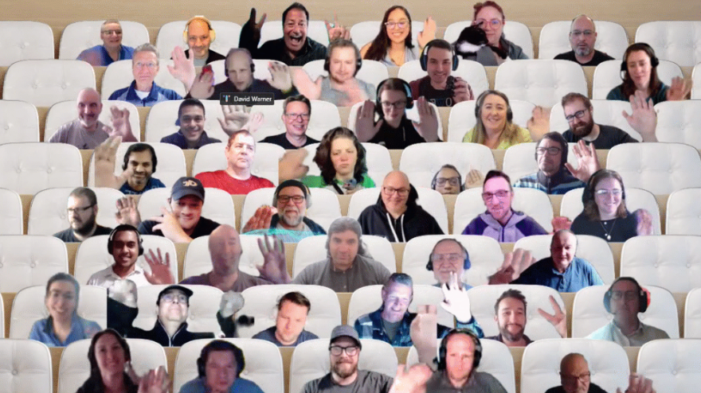

## Call summary

Latest updates and news on Power Platform including community events and training opportunities.

3 demos - Integrating Power Apps with Azure Machine Learning & Open AI using Power Automate, ChatGPT - but with YOUR data in Power Apps, and Low code tips for fields in Power Pages.

Activities: 5 articles, 3 documents, 3 samples, 3 Power Platform related video conversations delivered.

This call was hosted by [David Warner II](http://twitter.com/DavidWarnerII) (Microsoft) \| @DavidWarnerII and recorded on May 17, 2023. Questions addressed in chat throughout the call.

### New this month

* News and Documents
    * Article – [Improved variables and collections experience in Canvas Designer](https://powerapps.microsoft.com/blog/improved-variables-and-collections-experience-in-canvas-designer/) – Jessica Lo (Microsoft)
    * Article – [Recent improvements to the Modern App Designer](https://powerapps.microsoft.com/blog/recent-improvements-to-the-modern-app-designer/) – Jessica Lo (Microsoft)
    * Article – [Create Custom Connector from within Visual Studio](https://powerapps.microsoft.com/blog/create-a-custom-connector-for-your-web-api-from-within-visual-studio/) – Marcel Ferreira (Microsoft)
    * Article – [Welcome to the Power Platform Developer Blog](https://devblogs.microsoft.com/powerplatform/welcome-to-the-power-platform-developer-blog/) – April Dunnam (Microsoft) \| @aprildunnam
    * Article – [Introducing our Power Platform Prompt Samples Repository!](https://devblogs.microsoft.com/powerplatform/fueling-creativity-introducing-our-power-platform-prompt-samples-repository/) – April Dunnam (Microsoft) \| @aprildunnam
    * Documentation – [Security roles and the new, modern UI (preview)](https://learn.microsoft.com/power-platform/admin/security-roles-privileges)
    * Documentation – [Get your developer environment (preview)](https://learn.microsoft.com/power-apps/maker/maker-create-environment)
    * Documentation – [Visual Studio connected service (preview)](https://learn.microsoft.com/power-apps/cards/controls/control-reference?WT.mc_id=powerapps_community_productblog)
* [Power Platform Samples](https://pnp.github.io/powerplatform-samples/)
    * New Power App – Instagram Basic Display - [Reshmee Auckloo](https://twitter.com/ReshmeeAuckloo) \| @ReshmeeAuckloo
    * New Power App – Teams Team Request Form - [Katerina Chernevskaya](https://linkedin.com/in/katerinachernevskaya) \| Katerina-Chernevskaya
    * New Power App – KPI Sample - [Nathalie Leenders](https://twitter.com/@NathLeenders) \| @NathLeenders
* Power Platform - [Independent Publisher Connectors](https://github.com/microsoft/PowerPlatformConnectors/tree/dev/independent-publisher-connectors)
    * Over 1000 Certified Microsoft Power Platform Connectors!
    * [Top Connector Asks](https://github.com/microsoft/PowerPlatformConnectors/wiki/Top-Connector-Asks)
    * Good Flow story? Tell us. [FlowOfTheWeek](https://aka.ms/FlowOfTheWeekForm) – aka.ms/FlowOfTheWeekForm
* Shows and Events
    * New Episodes - The [Low Code Revolution Show](https://learn.microsoft.com/shows/the-low-code-revolution/) with [April Dunnam](https://twitter.com/aprildunnam) (Microsoft) \| @aprildunnam and Daniel Laskewitz (Microsoft) \| @laskewitz \| aka.ms/LowCodeRevolutionShow
        * [Create a Custom Connector for your Web API from within Visual Studio](https://learn.microsoft.com/shows/the-low-code-revolution/create-a-custom-connector-for-your-web-api-from-within-visual-studio) (May 15)
        * [Use API Management Authorizations and Power Platform to integrate with third party services faster](https://learn.microsoft.com/shows/the-low-code-revolution/use-api-management-authorizations-and-power-platform-to-integrate-with-third-party-services-faster) (April 26)
        * [New Model View in Power BI](https://learn.microsoft.com/shows/the-low-code-revolution/new-model-view-in-power-bi) (April 21)
    * Dynamics 265 and Power Platform Community Conference, Portorož, Slovenia, May 22 -24. Special voucher for 30% discount: mss144spc
    * [European Collaboration Summit 2023](https://www.collabsummit.eu/) - Düsseldorf, Germany, 24-36 May. Save 15% with “POWERPLATFORMROCKS” voucher
    * [European Power Platform Conference](https://www.sharepointeurope.com/european-power-platform-conference) – Dublin, 20-23 June. EarlyBird ticket.s
    * 365 EduCon - Use promo code “Community” to save 25% off any pass type.
        * [Washington DC](http://www.365educon.com/dc) – June 12-16, 2023
        * [Seattle](http://www.365educon.com/seattle) – August 21-25, 2023 & PWR EduCon
        * [Chicago](http://www.365educon.com/chicago) – October 30 – November 3, 2023
    * Upcoming [Community Days](https://communitydays.org/) Events - aka.ms/communitydays

### Demo summaries

* **Integrating Power Apps with Azure Machine Learning & Open AI using Power Automate** – predict Health Expense using a Machine Learning Model and get savings tips to fund expenses. Uses a custom-built Azure Auto ML model integrated to Power Apps using Power Automate Flow, health expenses based on inputs and the result of the model using Open AI's API. Solution components - HealthExpense (Canvas app), Azure Auto ML Flow (Power Automate flow), Azure Auto ML Model for predictions. Community call conversation [aka.ms/May17-Demo1](https://aka.ms/May17-Demo1)
* **ChatGPT - but with YOUR data in Power Apps** – get better factual information from CharGPT by injecting curated information from an internal datasource. How create that data source? Vecrtorize data by calling OpenAI Embeddings endpoint. See how to call ChatGPT (via a connector) and add context (your data) to the query. ChatGPT goes beyond standard search return with clear recommendations – it’s math! You will understand the math behind the scenes after seeing this demo. Community call conversation [aka.ms/May17-Demo2](https://aka.ms/May17-Demo2)
* **Low code tips for fields in Power Pages** – tips for using Power Automate to streamline repetitive tasks on Power Pages including formatting the site date and time (create new site setting), making a lookup column appear as a dropdown (Basic Forms), prepopulating a field (Form Metadata), formatting a phone number field using Regex (Form Metadata with validation and message), adding helper text (Form Metadata – Description/Instructions) and more. Community call conversation [aka.ms/May17-Demo3](https://aka.ms/May17-Demo3)



## Agenda items

[00:00](https://youtu.be/VmebEiL_kv8?t=0) – Intro

[01:37](https://youtu.be/VmebEiL_kv8?t=97) – Power Platform News & Learn Updates – [Daniel Laskewitz](https://twitter.com/laskewitz) (Microsoft) \| @laskewitz

[04:12](https://youtu.be/VmebEiL_kv8?t=252) – Latest Power Apps Samples – [Daniel Laskewitz](https://twitter.com/laskewitz) (Microsoft) \| @laskewitz

[05:26](https://youtu.be/VmebEiL_kv8?t=326) – Independent Publisher Connectors - [Jocelyn Panchal](https://twitter.com/JocelynP_PM) (Microsoft) \| @JocelynP_PM

[09:27](https://youtu.be/VmebEiL_kv8?t=567) – Power Platform Community Shows & Events - [Daniel Laskewitz](https://twitter.com/laskewitz) (Microsoft) \| @laskewitz & [David Warner II](http://twitter.com/DavidWarnerII) (Microsoft) \| @DavidWarnerII

[11:34](https://youtu.be/VmebEiL_kv8?t=694) – Together mode picture

[12:47](https://youtu.be/VmebEiL_kv8?t=767) – Demo - Integrating Power Apps with Azure Machine Learning & Open AI using Power Automate – Aaryan Arora

[21:20](https://youtu.be/VmebEiL_kv8?t=1280) – Demo - ChatGPT - but with YOUR data in Power Apps – [Robin Rosengrün](https://twitter.com/power_r2) (EnBW) \| @power_r2

[35:01](https://youtu.be/VmebEiL_kv8?t=2101) – Demo - Low code tips for fields in Power Pages – Elaiza Benitez

[56:23](https://youtu.be/VmebEiL_kv8?t=3383) – Resources

[57:17](https://youtu.be/VmebEiL_kv8?t=3437) – Closing

## Together mode

Thank you for joining the community call today. I hope you agree the three demos were great! Looking forward to seeing many of you in-person at an event near or far from your home base.

## Actions

* Please give us feedback about this call – aka.ms/community/calls/feedback
* Opt into the [PnP Community Recognition Program](https://aka.ms/m365pnp-recognition) \| [aka.ms/community/recognition](https://aka.ms/m365pnp-recognition)
* Request to Present – aka.ms/community/request/demo
* [Share your Community Quick Tips](https://customervoice.microsoft.com/Pages/ResponsePage.aspx?id=v4j5cvGGr0GRqy180BHbR02h_1H9_XFFp4etSzu5JxFUN0JZTFNDSDRJVVJGTkxHVzcxRDJWM01RWi4u) \| aka.ms/PPCCDemoRequest
* Questions, comments, ideas, about a demo? Do share in “Community Calls Conversations” – see link with each demo.
* Register for upcoming [Sharing is Caring](https://pnp.github.io/sharing-is-caring/) events:
    * Maturity Model Practitioners \| Tuesday, June 20th, 7am PST – [Download reoccurring invite](https://aka.ms/mm4m365/invite)
    * PnP Office Hours – 1:1 session \| [Register](https://outlook.office365.com/owa/calendar/PnPSharingisCaring@warner.digital/bookings/)
    * PnP Buddy System \| [Request a Buddy](https://forms.office.com/Pages/ResponsePage.aspx?id=KtIy2vgLW0SOgZbwvQuRaXDXyCl9DkBHq4A2OG7uLpdUMjRRUVg4NElZUUJLTEY1TVVSVDJFRFpLRS4u)
* [PnP Samples](https://aka.ms/powerplatform-samples) - We welcome your Power Platform samples!
* [View](https://aka.ms/LowCodeRevolutionShow) or be a [Guest](https://aka.ms/LowCodeRevolutionGuest) on **The Low Code Revolution** show \| aka.ms/LowCodeRevolutionShow
* Register for the [Microsoft 365 Developer Program](https://aka.ms/m365/devprogram) and get a free developer tenant
* Get started with [free training modules](https://aka.ms/m365/dev/learn) covering Microsoft 365 platform capabilities.
* Visit the [Microsoft 365 Unified Sample Solution Gallery](https://adoption.microsoft.com/sample-solution-gallery) from Microsoft and community.

## Demo references

* **Integrating Power Apps with Azure Machine Learning & Open AI using Power Automate**
    * Dataset - [Medical Insurance Payout](https://www.kaggle.com/datasets/harshsingh2209/medical-insurance-payout/code)
* **ChatGPT - but with YOUR data in Power Apps**
    * Connector - [OpenAI (Independent Publisher) (Preview)](https://learn.microsoft.com/connectors/openaiip/)
    * Connector - [Azure OpenAI Service](https://github.com/microsoft/PowerPlatformConnectors/tree/dev/custom-connectors/AzureOpenAIService)
    * Documentation – [Embeddings](https://platform.openai.com/docs/guides/embeddings)
    * Tool - [Long-term Memory for AI - The Pinecone vector database](https://www.pinecone.io/)
    * Linktree - [Robin Rosengrün](https://linktr.ee/r2power)
* **Low code tips for fields in Power Pages**
    * Tool - [Regex Generator](https://codepal.ai/regex-generator)
    * Training – [Power Pages Training (on-line course)](https://www.engineeredcode.com/microsoft-power-pages)
    * YouTube channel - [Elaiza Benitez](https://www.youtube.com/@ElaizaBenitez)
    * Blog - [Benitez Here.](https://benitezhere.blogspot.com)
    * Podcast - [Power Platform Boost Podcast](https://powerplatformboost.buzzsprout.com/)

## Links in this call

* Power Platform Community Call Recurring Invite - aka.ms/powerplatformcommunitycall
* Request to Present - aka.ms/community/request/demo
* Power Platform Samples - aka.ms/powerplatform-samples
* Microsoft 365 & Power Platform sample gallery - aka.ms/community/samples
* Power Platform Connectors -
* Top Connector Asks - github.com/microsoft/PowerPlatformConnectors/wiki/Top-Connector-Asks
* Learn how to get started in the open-source PnP community! – aka.ms/sharing-is-caring
* Community Recognition Program - aka.ms/community/recognition
* Low Code Revolution Show
* Episodes – aka.ms/LowCodeRevolutionShow
    * Guest application – aka.ms/LowCodeRevolutionGuest
    * Upcoming Events - aka.ms/communitydays
* Conversations - Power Platform Connections – aka.ms/powerplatform-connections
* Community Call Conversations - <https://powerusers.microsoft.com/t5/Community-Calls-Conversations/bd-p/pa_community_calls>
* Microsoft 365 & Power Platform community videos - aka.ms/community/videos
* Microsoft 365 & Power Platform community calls - aka.ms/community/calls
* Community call agendas - aka.ms/community/meetup
* Feedback on this call - aka.ms/community/calls/feedback

## General resources

* Power Platform Community Front Door – [aka.ms/jointhecommunity](https://aka.ms/jointhecommunity)
* Power Platform Videos – [aka.ms/powerplatform-videos](https://aka.ms/powerplatform-videos)
* Power Platform Samples – [aka.ms/powerplatform-samples](https://aka.ms/powerplatform-samples)
* Power Apps Community – [aka.ms/powerapps-community](https://aka.ms/powerapps-community)
* Power Automate Community – [aka.ms/power-automate-community](https://aka.ms/power-automate-community)
* Power Pages Community – [aka.ms/power-pages-community](https://aka.ms/power-pages-community)
* Power Virtual Agents Community – [aka.ms/power-virtual-agents-community](https://aka.ms/power-virtual-agents-community)

## Additional resources

* Power Addicts Hangout \|
    [https://wearepoweraddicts.com](https://wearepoweraddicts.com/)
* \#LessCodeMorePower Video Series \|
    <https://www.youtube.com/playlist?list=PL8IYfXypsj2Cr4DUqMKYkGM-Wejfim2QX>
* [Powerful Devs Video Series](https://aka.ms/PowerfulDevsYouTube) \|
    <https://aka.ms/PowerfulDevsYouTube>
* Twitter -
    [https://twitter.com/microsoft365dev](https://www.youtube.com/redirect?event=video_description&redir_token=QUFFLUhqbkdvcDJHcGdzM2VIUkwzU3lOYkJaVFEzM0Q2QXxBQ3Jtc0ttM1NyaTQ2RjFSOFh3a0l4c1pralBRQVI1bDNSQ2RaVm9OdzJrRkdtV1Z1SW5VdmdwamNNLTBEaFdaSmZMc0lQNzdRZ2dDYV9WZVF1ZVIwc2dPQTZBRUZ3b3hoWUVJdDJoQWZUcWdCR2JKdmwtUU43RQ&q=https%3A%2F%2Ftwitter.com%2Fmicrosoft365dev)​
* Twitter: <https://twitter.com/MSPowerPlat>
* Call attention to your great work by using
    [\#PowerAppsCC](https://twitter.com/hashtag/PowerAppsCC?src=hashtag_click)
    and [\#PnPWeekly](https://twitter.com/hashtag/PnPWeekly?src=hashtag_click)
    on Twitter.
* Microsoft 365 Unified Sample gallery - <https://aka.ms/community/samples>
* Microsoft 365 Platform Community in YouTube - <https://aka.ms/community/videos>
* Microsoft 365 Platform Community - <https://aka.ms/community/home>

