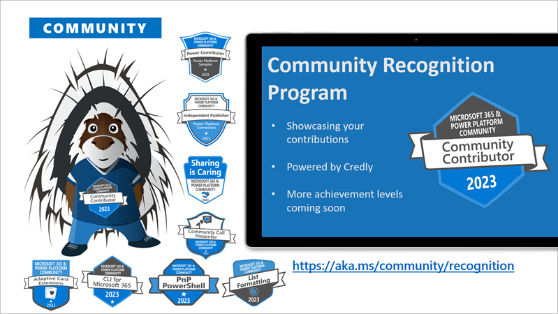

We want to give you a better overview on what's happening each week. This is a summary blog post of all the community activities such as community calls and presenters, newly uploaded videos, upcoming events and more 🚀

Get involved by joining a call! We host a variety of [community calls](https://aka.ms/community/calls) each week, where we demo solutions, announce new features and where you can connect with like-minded people. These calls are for everyone to join, simply download the recurrent invite and get involved.

This is the agenda for the following week:

### Microsoft 365 & Power Platform weekly call - 16th of May

* Tuesday, 16th of May 2023, 8:00 AM PT / 3:00 PM GMT
* Download the [recurring invite](https://aka.ms/m365-dev-call) or [join the call](https://aka.ms/m365-dev-call-join) we'd love to see you in the call!
* If you can't make it this time, you can read the summary blog post including call recording here: [Microsoft 365 & Power Platform Community blog - Microsoft 365 & Power Platform calls](https://pnp.github.io/blog/categories/microsoft-365-platform-call/)

Demos this time

* Supriti Bhan (Microsoft) - Introduction to Live Share SDK for Microsoft Teams apps
* [Srinivas Varukala](https://twitter.com/svarukala) (Microsoft) | @svarukala & Rick Shire (Microsoft) - Building a Microsoft Teams Call queue scheduler solution for customers
* [Vesa Juvonen](https://twitter.com/vesajuvonen) (Microsoft) | @Vesajuvonen- Latest on building Microsoft Viva extensibility with SPFx

**Interested on doing a demo here?** - [Let us know](https://aka.ms/community/request/demo) and we'll get you scheduled!

### Power Platform monthly Community Call - 17th of May

* Wednesday, 17th of May, 8:00 AM PT / 4:00 PM GMT
* Download the [recurring invite](https://aka.ms/powerplatformcommunitycall) or [join the call](https://aka.ms/PowerPlatformMonthlyCall) we'd love to see you in the call!
* If you can't make it this time, you can read the summary blog post including call recording here: [Microsoft 365 Community blog - Power Platform calls](https://pnp.github.io/blog/categories/power-apps-community-call/)

Demos: 

* Aaryan Arora - Integrating Power Apps with Azure Machine Learning & Open AI using Power Automate
* [Robin Rosengrün](https://twitter.com/power_r2) (EnBw) | @power_r2 - ChatGPT - but with YOUR data in Power Apps
* [Elaiza Benitez](https://twitter.com/benitezhere) | @benitezhere - Low code tips for fields in Power Pages

Also: 📷 Picture Time with community in Together Mode!

**Interested on doing a demo here?** - [Let us know](https://aka.ms/community/request/demo) and we'll get you scheduled!

### Viva Connections & SharePoint Framework Community Call - 18th of May

* Thursday, 18th of May 7:00 AM PT / 2:00 PM GMT
* Download the [recurring invite](https://aka.ms/spdev-sig-call) or [join the call](https://aka.ms/spdev-sig-call-join) we'd love to see you in the call!
* If you can't make it this time, you can read the summary blog post including call recording here: [Microsoft 365 Community blog - Microsoft 365 & Power Platform Development](https://pnp.github.io/blog/categories/microsoft-365-and-power-platform-development-community-call/)

Demos: 

* [Eric Overfield](https://twitter.com/EricOverfield) (Creospark) | @EricOverfield - Introduction to update SharePoint Starter Kit v3
* [Jethro Seghers](https://twitter.com/jseghers) (Microsoft) | @seghers - Creating custom SPFx components for Microsoft Viva Connections for Education
* Daniel Turley (Avanade) - SPFx framework at Microsoft - Accelerator Domain Models

### Microsoft identity platform community call - 18th of May

* Thursday, 18th of May, 2023, 9:00 AM PT / 4:00 PM GMT
* Download the [recurring invite](https://aka.ms/IDDEVCommunityCall) or [join the call](https://aka.ms/IDDEVCommunityCall-join) we'd love to see you in the call!
* If you can't make it this time, you can read the summary blog post including call recording here: [Microsoft identity platform community call](https://pnp.github.io/blog/categories/microsoft-identity-platform-community-call/)

Topic:

* To be defined

**Interested on doing a demo here?** - [Let us know](https://aka.ms/m365pnp/request/demo) and we'll get you scheduled!

## New videos 

Update of the newly published videos in our YouTube channel [Microsoft 365 & Power Platform Community](https://www.youtube.com/channel/UC_mKdhw-V6CeCM7gTo_Iy7w) - Subscribe today! ✅

* [Using Microsoft Graph and Azure Form Recognizer for optimizing productivity](https://www.youtube.com/watch?v=OLKfkeXtlCE) by  Houssem Ayadi and Aziz Gassara 
* [Latest on the Microsoft Graph Connectors](https://www.youtube.com/watch?v=V2v6-PL4_Vo) by Rajdeep Chanda (Microsoft)
* [A SharePoint document generator as Microsoft 365 app with SPFxz](https://www.youtube.com/watch?v=P5DolLyE3E8) by [Markus Möller](https://twitter.com/Moeller2_0) (Avanade) | @Moeller2_0
* [Copilot is the coworker you never knew you always needed](https://www.youtube.com/watch?v=QtEyV0p709U) by [Shane Young](https://twitter.com/ShanesCows) (PowerApps911) | @ShanesCows
* [Companies House Independent Publisher Connector - How API integration adds value](https://www.youtube.com/watch?v=kECkEBVkIAM) by [Matt Collins-Jones](https://twitter.com/D365Geek) (Capgemini) \| @D365Geek

Update of the newly published videos in [Power Platform YouTube channel](https://www.youtube.com/@mspowerplatform) - Subscribe today! ✅

* [David Warner - Power Platform Connections Ep 13](https://www.youtube.com/watch?v=Gn1mP04t1SY)
* [SAP – Power Platform, SAP and the User Experience](https://www.youtube.com/watch?v=E4xb5wWpdgg)

Update of the newly published videos in [Microsoft 365 Developer YouTube channel](https://www.youtube.com/@Microsoft365Developer) - Subscribe today! ✅

* [Join the Microsoft #TeamsGlobalHack](https://www.youtube.com/shorts/TCjWqcQkj7w)

---

## New Microsoft 365 Developer Blog posts

All the latest updates on the Microsoft 365 platform are shared from the [Microsoft 365 Developer blog](https://devblogs.microsoft.com/microsoft365dev/). Here are the updates from last week.

* [Join us for HackTogether: The Microsoft Teams Global Hack](https://devblogs.microsoft.com/microsoft365dev/join-us-for-hacktogether-the-microsoft-teams-global-hack/) by [Garry Trinder](https://twitter.com/garrytrinder) (Microsoft) | @Garrytrinder and [Waldek Mastykarz](https://twitter.com/waldekm) (Microsoft) | @Waldekm
* [Building Go applications with the Microsoft Graph Go SDK, now generally available](https://devblogs.microsoft.com/microsoft365dev/building-go-applications-with-the-microsoft-graph-go-sdk/) by [Maisa Rissi](https://twitter.com/maisarissi_msft) (Microsoft) | @maisarissi_msft
* [Microsoft Teams apps now available in public preview in the Microsoft 365 iOS app](https://devblogs.microsoft.com/microsoft365dev/microsoft-teams-apps-now-available-in-public-preview-in-the-microsoft-365-ios-app/) by Sheena Makker (Microsoft)
* [Announcing SharePoint Framework 1.17.2 for Microsoft 365 extensibility](https://devblogs.microsoft.com/microsoft365dev/announcing-sharepoint-framework-1-17-2-for-microsoft-365-extensibility/)
* [Streamline your SharePoint experience with the new Microsoft Graph SharePoint Admin API](https://devblogs.microsoft.com/microsoft365dev/streamline-your-sharepoint-experience-with-the-new-microsoft-graph-sharepoint-admin-api/)

## New Microsoft 365 and Power Platform Community Blog posts

All the latest updates on the Microsoft 365 platform are shared from the [Microsoft 365 and Power Platform Community Blog](https://pnp.github.io/blog/). Here are the updates from last week.

* [Microsoft 365 & Power Platform Community (PnP) - April 2023 update](https://pnp.github.io/blog/microsoft-365-platform-community-update/23-05-10/) by [Vesa Juvonen](https://twitter.com/vesajuvonen) (Microsoft) | @Vesajuvonen
* [Microsoft 365 PnP Weekly - Episode 209](https://pnp.github.io/blog/microsoft-365-pnp-weekly/episode-209/) with [Milan Holemans](https://github.com/milanholemans) (VanRoey.be) | milanholeman

---

## Last week's community call recordings

Here are the last week's community call recordings. You can download recurrent invites to the community calls from https://aka.ms/m365/calls.

* [Microsoft 365 & Power Platform Development Community call - 11th of May, 2023](https://pnp.github.io/blog/microsoft-365-and-power-platform-development-community-call/2023-05-11/)
* [Microsoft 365 & Power Platform Community Call - 9th of May, 2023](https://pnp.github.io/blog/microsoft-365-platform-community-call/2023-05-09/)

---

## Sharing is Caring sessions

If you are looking to learn how to use the Microsoft 365 & Power Platform Community resources or contribute back to the community and not sure where to start, we are here for you! Please join the [Sharing Is Caring program](https://pnp.github.io/sharing-is-caring/).

* [Maturity Model Practitioners - monthly meeting](https://aka.ms/mm4m365/invite)

---

## Recognition

You already contributed? Great, we want to celebrate and recognize you! Opt in for our [community recognition program](https://pnp.github.io/recognitionprogram/) and earn badges from our various initiatives! 

---

## Upcoming events

Please take the opportunity to join these great conferences organized by the best community in tech across the world. There are online and in-person options. See more from [CommunityDays.org](https://www.communitydays.org/).

* [Techorama Belgium](https://www.techorama.be/) - May 15 - 17, 2023 - Antwerp, Belgium
* [MN M365 User Group Spring 2023 In-Person Workshop Day Conference](https://www.communitydays.org/event/2023-05-19/mn-m365-10th-bi-annual-spring-workshop-day) - May 19, 2023 - Edina, MN, USA
* [Power Automate Bootcamp](https://www.communitydays.org/event/2023-05-19/power-automate-bootcamp-2023) - May 19-20, 2023 - London, United Kingdom
* [Power Apps Developer Bootcamp](https://www.communitydays.org/event/2023-05-20/power-apps-developer-bootcamp) - May 20, 2023 - Manchester, United Kingdom
* [CollabDays Italy](https://www.collabdays.org/2023-italy/) - May 20, 2023 - Milan, Italy
* [European Collaboration Summit](https://www.collabsummit.eu/) - May 22-24, 2023 - Duesseldorf, Germany
* [Expters Live](https://www.communitydays.org/event/2023-05-25/experts-live-netherlands) - May 25, 2023 - Hertogenbosch, Netherlands
* [DYNUG Spring Conference](https://www.communitydays.org/event/2023-05-31/dynug-spring-conference) - May 31, 2023 - Oslo, Norway
* [CollabDays Netherlands](https://www.communitydays.org/event/2023-06-10/collabdays-netherlands-2023) - June 10, 2023 - Utrecht, Netherlands
* [365 EduCon DC](https://365educon.com/DC/) - June 12-16, 2023 - Washington, D.C., USA
* [AMS Berlin 2023](https://www.communitydays.org/event/2023-06-15/amsberlin-2023) - June 15, 2023 - Berlin, Germany
* [CollabDays Central Europe](https://www.collabdays.org/2023-ce/) - June 17, 2023 - Zurich, Switzerland
* [European Power Platform conference](https://www.sharepointeurope.com/european-power-platform-conference/), June 20-22, 2023 - Dublin, Ireland
* [365 EduCon Seattle](https://365educon.com/Seattle/) – August 21-25, 2023 - Seattle, WA, USA
* [Metaverse One 2023](https://www.communitydays.org/event/2023-09-20/metaverse-one-2023) - September 20, 2023 - Virtual
* [South Coast Summit 2023](https://www.southcoastsummit.com/) - October 13-14, 2023 - Farnborough, United Kingdom
* [Microsoft Ignite 2023](https://ignite.microsoft.com/) - November 15-16, 2023
* [CollabDays Lisbon 2023](https://www.collabdays.org/2023-lisbon/) - November 25, 2023 - Lisbon, Portugal
* [European SharePoint, Office 365 & Azure Conference 2023](https://www.sharepointeurope.com/) - November 27-30 - Amsterdam, Netherlands
* [AMS Aachen](https://www.communitydays.org/event/2023-11-28/ams-aachen) - November 28, 2023 - Aachen, Germany
* [European Cloud Summit](https://www.cloudsummit.eu/) - December 4-6, 2023 - Wiesbaden, Germany

We hope to see you around!

_Sharing is caring 🧡_
