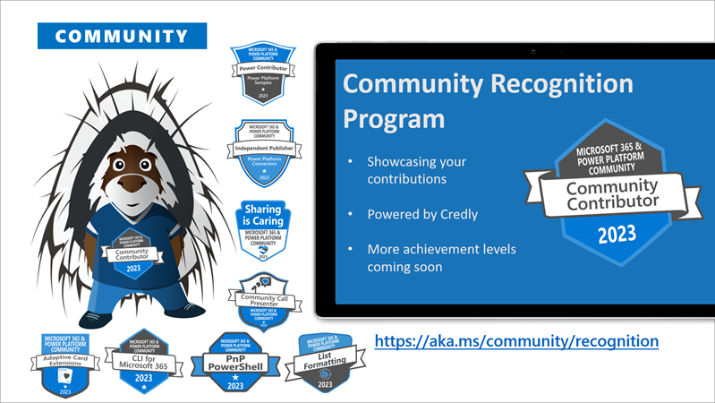

We want to give you a better overview on what's happening each week. This is a summary blog post of all the community activities such as community calls and presenters, newly uploaded videos, upcoming events and more 🚀

Get involved by joining a call! We host a variety of [community calls](https://aka.ms/community/calls) each week, where we demo solutions, announce new features and where you can connect with like-minded people. These calls are for everyone to join, simply download the recurrent invite and get involved.

This is the agenda for the following week:

### Microsoft 365 & Power Platform weekly call - 21st of May

* Tuesday, 21st of May 2023, 8:00 AM PT / 3:00 PM GMT
* Download the [recurring invite](https://aka.ms/m365-dev-call) or [join the call](https://aka.ms/m365-dev-call-join) we'd love to see you in the call!
* If you can't make it this time, you can read the summary blog post including call recording here: [Microsoft 365 & Power Platform Community blog - Microsoft 365 & Power Platform calls](https://pnp.github.io/blog/categories/microsoft-365-platform-call/)

Demos this time

* [DC Padur](https://twitter.com/dcpadur) (Microsoft) | @cdpadur and Hanbing Wang (Microsoft) - Updates to the Microsoft Graph beta API for SharePoint Pages
* Diksha Upadhyay (Microsoft) - Multi-geo support for site discovery with Microsoft Graph
* Sheena Makker (Microsoft) and [Sanjay Joshi](https://twitter.com/sanjoshi) (Microsoft) | @sanjoshi - Reach millions of mobile users by extending your Teams app to Microsoft 365 (Office) app on Android and iOS

**Interested on doing a demo here?** - [Let us know](https://aka.ms/community/request/demo) and we'll get you scheduled!

### Microsoft 365 & Power Platform weekly call - 25th of May

* Tuesday, 25th of May 2023, 8:00 AM PT / 3:00 PM GMT
* Download the [recurring invite](https://aka.ms/m365-dev-call) or [join the call](https://aka.ms/m365-dev-call-join) we'd love to see you in the call!
* If you can't make it this time, you can read the summary blog post including call recording here: [Microsoft 365 & Power Platform Community blog - Microsoft 365 & Power Platform calls](https://pnp.github.io/blog/categories/microsoft-365-platform-call/)

Demos this time

* [Eswar Prakash](https://twitter.com/eswaratwork) (Resonate) | @eswaratwork - Pi Flows: PowerFx for IoT
* [Martin Heusser](https://twitter.com/mozzeph) (Houlihan Lokey) | @mozzeph - Microsoft Teams Phone Number Management on a budget with SharePoint Lists and Azure Automation
* [Mohammed Ashiq Faleel](https://twitter.com/AshiqFaleel) (Avanade) | @ashiqfaleel – Automating DLP Policy Creation in Power Platform from an Existing Policy

**Interested on doing a demo here?** - [Let us know](https://aka.ms/community/request/demo) and we'll get you scheduled!

## New videos 

Update of the newly published videos in our YouTube channel [Microsoft 365 & Power Platform Community](https://www.youtube.com/channel/UC_mKdhw-V6CeCM7gTo_Iy7w) - Subscribe today! ✅

* [Exploring the depths of undocumented admin REST API through an SPFx solution](https://www.youtube.com/watch?v=zljDrizd6ZM) by [Michaël Maillot](https://twitter.com/@michael_maillot) (onepoint) | @michael_maillot 
* [Microsoft Learn Independent Publisher Power Platform Connector](https://www.youtube.com/watch?v=r2pv7b9fssw) by [Sean Kelly](https://twitter.com/@SeanKe11y) (HCLTech) |@SeanKe11y
* [Using dynamic SVGs with List Formatting for SharePoint and Microsoft Lists](https://www.youtube.com/watch?v=2mxoa9gZ-5E) by [Chris Kent](https://twitter.com/theChrisKent) (Takeda) | @TheChrisKent
* [Application Lifecycle Management (ALM) for Cloud Flows](https://www.youtube.com/watch?v=YOpOaNxeaFI) by Chris Garty (Microsoft) 
* [Building Feedback Sidebar with SharePoint Framework](https://www.youtube.com/watch?v=o2ZIb2jnttY) by [Matteo Serpi](https://github.com/srpmtt) (Avanade) | srpmtt
* [Task management and Timeboxing within the Microsoft ecosystem, driven by a Power Automate flow](https://www.youtube.com/watch?v=zqUeQ2I_9lc) by [Tobias Fenster](https://twitter.com/tobiasfenster) (4PS Germany) | @tobiasfenster
* [Simplify your SPFx code with react-query](https://www.youtube.com/watch?v=0rCOEjZhEbs) by [Marcin Wojciechowski](https://twitter.com/mgwojciech) (Staffbase) | @mgwojciech
* [Azure AD App Security: Safeguarding Service Principals for Smooth & Secure Automation – April 2023](https://www.youtube.com/watch?v=KCaXHRb4_4g) by Marcus Carvalho (Microsoft)  

Update of the newly published videos in [Power Platform YouTube channel](https://www.youtube.com/@mspowerplatform) - Subscribe today! ✅

* [Jocelyn Panchal - Power Platform Connections Ep 14](https://www.youtube.com/watch?v=zFFTeYiKFTw)
* [SAP – Power Platform, SAP and the ERP Connector](https://www.youtube.com/watch?v=kBZWRrJ4lvg)

Update of the newly published videos in [Microsoft 365 Developer YouTube channel](https://www.youtube.com/@Microsoft365Developer) - Subscribe today! ✅

* [Join the Microsoft #TeamsGlobalHack](https://www.youtube.com/shorts/TCjWqcQkj7w)

---

## New Microsoft 365 Developer Blog posts

All the latest updates on the Microsoft 365 platform are shared from the [Microsoft 365 Developer blog](https://devblogs.microsoft.com/microsoft365dev/). Here are the updates from last week.

* [Teams Toolkit for Visual Studio Code 5 now available](https://devblogs.microsoft.com/microsoft365dev/teams-toolkit-for-visual-studio-code-v5-0-now-available/) by Ji Dong (Microsoft) and [John Miller](https://twitter.com/jmillerdev)  (Microsoft)| @jmillerdev
* [OneNote Webhooks API deprecation](https://devblogs.microsoft.com/microsoft365dev/onenote-webhooks-api-deprecation/) by Bea Villanueva (Microsoft) and Zack Runner (Microsoft)

## New Microsoft 365 and Power Platform Community Blog posts

All the latest updates on the Microsoft 365 platform are shared from the [Microsoft 365 and Power Platform Community Blog](https://pnp.github.io/blog/). Here are the updates from last week.

* [Microsoft 365 PnP Weekly - Episode 210](https://pnp.github.io/blog/microsoft-365-pnp-weekly/episode-210/) with [Garry Trinder](https://twitter.com/garrytrinder) (Microsoft) | @Garrytrinder

---

## Last week's community call recordings

Here are the last week's community call recordings. You can download recurrent invites to the community calls from https://aka.ms/m365/calls.

* [Viva Connections & SharePoint Framework Community Call – 18th of May, 2023](https://pnp.github.io/blog/microsoft-viva-and-spfx-community-call/2023-05-18/)
* [Power Platform Community Call – May 2023](https://pnp.github.io/blog/power-platform-community-call/power-apps-community-call-may-2023/)
* [Microsoft 365 & Power Platform Community Call - 16th of May, 2023](https://pnp.github.io/blog/microsoft-365-platform-community-call/2023-05-16/)

---

## Sharing is Caring sessions

If you are looking to learn how to use the Microsoft 365 & Power Platform Community resources or contribute back to the community and not sure where to start, we are here for you! Please join the [Sharing Is Caring program](https://pnp.github.io/sharing-is-caring/).

* [Maturity Model Practitioners - monthly meeting](https://aka.ms/mm4m365/invite)

---

## Recognition

You already contributed? Great, we want to celebrate and recognize you! Opt in for our [community recognition program](https://pnp.github.io/recognitionprogram/) and earn badges from our various initiatives! 

---

## Upcoming events

Please take the opportunity to join these great conferences organized by the best community in tech across the world. There are online and in-person options. See more from [CommunityDays.org](https://www.communitydays.org/).

* [European Collaboration Summit](https://www.collabsummit.eu/) - May 22-24, 2023 - Duesseldorf, Germany
* [Expters Live](https://www.communitydays.org/event/2023-05-25/experts-live-netherlands) - May 25, 2023 - Hertogenbosch, Netherlands
* [DYNUG Spring Conference](https://www.communitydays.org/event/2023-05-31/dynug-spring-conference) - May 31, 2023 - Oslo, Norway
* [CollabDays Netherlands](https://www.communitydays.org/event/2023-06-10/collabdays-netherlands-2023) - June 10, 2023 - Utrecht, Netherlands
* [365 EduCon DC](https://365educon.com/DC/) - June 12-16, 2023 - Washington, D.C., USA
* [AMS Berlin 2023](https://www.communitydays.org/event/2023-06-15/amsberlin-2023) - June 15, 2023 - Berlin, Germany
* [CollabDays Central Europe](https://www.collabdays.org/2023-ce/) - June 17, 2023 - Zurich, Switzerland
* [European Power Platform conference](https://www.sharepointeurope.com/european-power-platform-conference/), June 20-22, 2023 - Dublin, Ireland
* [365 EduCon Seattle](https://365educon.com/Seattle/) – August 21-25, 2023 - Seattle, WA, USA
* [Metaverse One 2023](https://www.communitydays.org/event/2023-09-20/metaverse-one-2023) - September 20, 2023 - Virtual
* [South Coast Summit 2023](https://www.southcoastsummit.com/) - October 13-14, 2023 - Farnborough, United Kingdom
* [Microsoft Ignite 2023](https://ignite.microsoft.com/) - November 15-16, 2023
* [CollabDays Lisbon 2023](https://www.collabdays.org/2023-lisbon/) - November 25, 2023 - Lisbon, Portugal
* [European SharePoint, Office 365 & Azure Conference 2023](https://www.sharepointeurope.com/) - November 27-30 - Amsterdam, Netherlands
* [AMS Aachen](https://www.communitydays.org/event/2023-11-16/ams-aachen) - November 16, 2023 - Aachen, Germany
* [European Cloud Summit](https://www.cloudsummit.eu/) - December 4-6, 2023 - Wiesbaden, Germany

We hope to see you around!

_Sharing is caring 🧡_
