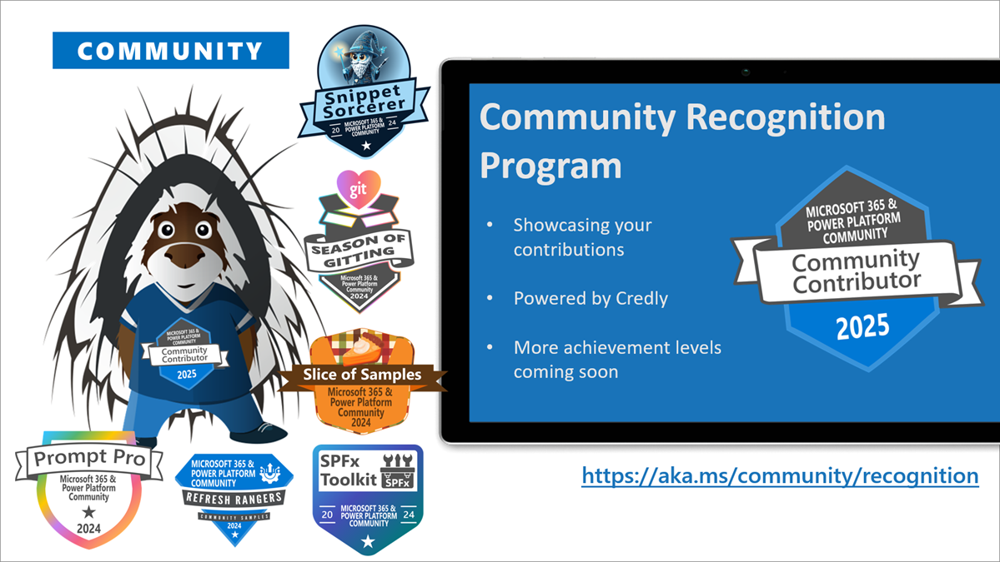

This is a weekly summary blog post of all the community activities such as community calls and presenters, newly uploaded videos, upcoming events and more 🚀
Get involved by joining a call! We host a variety of [community calls](https://aka.ms/community/calls) each week, where we demo solutions, announce new features and where you can connect with like-minded people. These calls are for everyone to join, simply download the recurrent invite and get involved. 

Want to demo on what you have created or figured out with the out-of-the-box features? - absolutely welcome. [Volunteer for a demo spot](https://aka.ms/community/request/demo).

This is the agenda for the upcoming week:

### Microsoft 365 & Power Platform weekly call - 20th of May

* Tuesday, 20th of May 2025, 8:00 AM PT / 4:00 PM GMT
* Download the [recurring invite](https://aka.ms/m365-dev-call) or [join the call](https://aka.ms/m365-dev-call-join) we'd love to see you in the call!
* If you can't make it this time, you see the recording of the call from the [Microsoft Community Learning YouTube channel](https://www.youtube.com/playlist?list=PLR9nK3mnD-OUQOW86tT5dkCRQAVGY7DlH)

Demos: 

* [Ayça Baş](https://www.linkedin.com/in/aycabas/) (Microsoft) –  Add Actions to Custom Engine Agents
* [Sudipta Kumar Basu](https://www.linkedin.com/in/sudipta-k-8787a027/) (Capgemini) – An Insurance Company's Process Streamline Through SharePoint Agents (SharePoint Hackathon Winner)

---

### Power Platform monthly Community Call - 21st of May

Typically demos here are from the community by the community. You are welcome to demo here 👋

* Wednesday, 21st of May, 8:00 AM PT / 4:00 PM GMT
* Download the [recurring invite](https://aka.ms/powerplatformcommunitycall) or [join the call](https://aka.ms/PowerPlatformMonthlyCall) we'd love to see you in the call!
* If you can't make it this time, you can watch the recording recording from here: [Microsoft 365 & Power Platform Community - Power Platform calls](https://www.youtube.com/watch?v=qLM6MChvrOk&list=PLR9nK3mnD-OVHNx67Q2Uxe7wodTnjHguz)

Demos this time:

* Power Apps Git Integration – [Ryan Perry](https://www.linkedin.com/in/ryanperrymba/) (Planet Technologies)
* Extending Model-Driven Apps with Custom Pages – [Cathrine Bruvold](https://www.linkedin.com/in/cathrine-bruvold-b91b92113/)​ (Point Taken AS)
* Power Apps Tips and Tricks – [David Warner](https://www.linkedin.com/in/davidwarnerii/)​ (Quisitive)

Also: 📷 Picture Time with community in Together Mode!

**Interested on doing a demo here?** - [Let us know](https://aka.ms/community/request/demo) and we'll get you scheduled!

---

### Microsoft 365 & Power Platform bi-weekly community Call - 22nd of May

This call will be broadcasted live from the [Microsoft 365 Community Conference](https://m365conf.com/) at Las Vegas! 🚀

* Thursday, 22nd of May, 7:00 AM PT / 3:00 PM GMT
* Download the [recurring invite](https://aka.ms/spdev-sig-call) or [join the call](https://aka.ms/spdev-sig-call-join) we'd love to see you in the call!
* If you can't make it this time, you see the recording of the call from the [Microsoft 365 & Power Platform Community YouTube channel](https://www.youtube.com/watch?v=gAqUr9wa2_0&list=PLR9nK3mnD-OURfm5Ypu-wK52cxBv_gXCA)

Demos this time:

* [Michael Greth ](https://www.linkedin.com/in/mgreth/)– How SharePoint Agents help extract AI knowledge
* [Karen Dredske](https://www.linkedin.com/in/karendredske/) (NRI North America) – Building employee support with SharePoint Agents in Teams and SharePoint
* [Chris Kent](https://www.linkedin.com/in/thechriskent/) (Takeda) – List Formatting Tips and Tricks

Also: 📷 Picture Time with community in Together Mode!

**Interested on doing a demo here?** - [Let us know](https://aka.ms/community/request/demo) and we'll get you scheduled!

* [Michael Greth](https://www.linkedin.com/in/mgreth/) – How SharePoint Agents help extract AI knowledge
* [Karen Dredske ](https://www.linkedin.com/in/karendredske/)(NRI North America) – Building employee support with SharePoint Agents in Teams and SharePoint
* [Chris Kent](https://www.linkedin.com/in/thechriskent/) (Takeda) – List Formatting Tips and Tricks

---

## New videos 

Update of the newly published videos in our YouTube channel 

[Microsoft Community Learning](https://www.youtube.com/@MicrosoftCommunityLearning) - Subscribe today! ✅

* [Making your first Copilot Agent in SharePoint](https://www.youtube.com/watch?v=hFQhRTuOAak) by [Todd Klindt](https://www.linkedin.com/in/toddklindt) (Sympraxis)
* [Exclusive Interview with Jeff Teper | Community News Desk LIVE at the M365 Community Conference 2025](https://www.youtube.com/watch?v=nB4ZMkK0HD8) by [Jeff Teper](https://www.linkedin.com/in/jeffteper) (Microsoft) and [Karuana Gatimu](https://www.linkedin.com/in/karuanagatimu) (Microsoft)
* [Keynote: Microsoft 365 Innovation in the Era of AI | Microsoft 365 Community Conference 2025](https://www.youtube.com/watch?v=AxT2klYz9Lo) by [Jeff Teper](https://www.linkedin.com/in/jeffteper) (Microsoft)
* [Add Authentication to your Custom Engine Agents](https://www.youtube.com/watch?v=5oyftU9PRpM) by [Ayça Baş](https://www.linkedin.com/in/aycabas) (Microsoft)
* [Building a Document AI Assistant with OpenAI Assistant API and SPFx](https://www.youtube.com/watch?v=rCy2TarOlp0) by [Ejaz Hussain](https://www.linkedin.com/in/hussaine) (Advania UK)
* [Empowering Communities with Copilot Studio: Innovation and Collaboration](https://www.youtube.com/watch?v=bdWj2aYS2vo) by [David Abu](https://www.linkedin.com/in/davidabu) (Microsoft)

[Get Stuff Done | Modern Work](https://www.youtube.com/playlist?list=PLR9nK3mnD-OXZO4ahCxSoZNl1pwXMA65_) new playlist:

* [Starting my day with Microsoft 365 Copilot | Get Stuff Done](https://www.youtube.com/watch?v=X-fYPjQlL5g&list=PLR9nK3mnD-OXZO4ahCxSoZNl1pwXMA65_&index=1) with [Karuana Gatimu](https://www.linkedin.com/in/karuanagatimu) (Microsoft)
* [Using Microsoft 365 Copilot Pages to catch up on messages | Get Stuff Done](https://www.youtube.com/watch?v=sqJLWHFol6g&list=PLR9nK3mnD-OXZO4ahCxSoZNl1pwXMA65_&index=2) with [Karuana Gatimu](https://www.linkedin.com/in/karuanagatimu) (Microsoft)
* [Using Copilot in Outlook to summarize email threads | Get Stuff Done](https://www.youtube.com/watch?v=fo8ALaLSyZQ&list=PLR9nK3mnD-OXZO4ahCxSoZNl1pwXMA65_&index=3) with [Karuana Gatimu](https://www.linkedin.com/in/karuanagatimu) (Microsoft)
* [Using Copilot in Word and dictation to ideate quickly | Get Stuff Done](https://www.youtube.com/watch?v=jvglNoBEr64&list=PLR9nK3mnD-OXZO4ahCxSoZNl1pwXMA65_&index=4) with [Karuana Gatimu](https://www.linkedin.com/in/karuanagatimu) (Microsoft)
* [Starting my day with Microsoft 365 | Get Stuff Done](https://www.youtube.com/watch?v=nDGzKSLcVgI&list=PLR9nK3mnD-OXZO4ahCxSoZNl1pwXMA65_&index=5) with [Karuana Gatimu](https://www.linkedin.com/in/karuanagatimu) (Microsoft)

[Get Stuff Done | Security](https://www.youtube.com/playlist?list=PLR9nK3mnD-OWe2Xad1l9rQX31x3GIq8KZ) new playlist:

* [Registering my phone for MFA with Authenticator | Get Stuff Done](https://www.youtube.com/watch?v=-x_dIsIZW2Y&list=PLR9nK3mnD-OWe2Xad1l9rQX31x3GIq8KZ&index=1) with [Sarah Young](https://www.linkedin.com/in/sarahyo16/) (Microsoft)
* [Preventing AI oversharing in Microsoft 365 Copilot | Get Stuff Done](https://www.youtube.com/watch?v=TXnCUA5HieQ&list=PLR9nK3mnD-OWe2Xad1l9rQX31x3GIq8KZ&index=2) with [Sarah Young](https://www.linkedin.com/in/sarahyo16/) (Microsoft)
* [Enabling secure external access in Microsoft Teams | Get Stuff Done](https://www.youtube.com/watch?v=AxgFZ1549tA&list=PLR9nK3mnD-OWe2Xad1l9rQX31x3GIq8KZ&index=3) with [Sarah Young](https://www.linkedin.com/in/sarahyo16/) (Microsoft)

[SharePoint Hackathon](https://aka.ms/sharepoint/hackathon) live stream recordings:

* [Kickoff to Innovation: SharePoint Hackathon Launch](https://www.youtube.com/watch?v=XtpB1bEH5oo) with [CJ Tan](https://www.linkedin.com/in/c-j-tan/) (Microsoft), [Ed Averett](https://www.linkedin.com/in/edaverett/) (Microsoft), [Kripal Kavi](https://www.linkedin.com/in/kripalkavi/) (Microsoft), [Mark Kashman](https://www.linkedin.com/in/mark-kashman/) (Microsoft) & [Vesa Juvonen](https://www.linkedin.com/in/vesajuvonen/) (Microsoft)
* [Building Beautiful SharePoint Portals: Latest Features in Action | SharePoint Hackathon](https://www.youtube.com/watch?v=0Lf66EUEieE) with [Melissa Torres](https://www.linkedin.com/in/melissa-torres-177b0814/) (Microsoft), [Katelyn Helms](https://www.linkedin.com/in/katelynhelms/) (Microsoft), [Mark Kashman](https://www.linkedin.com/in/mark-kashman/) (Microsoft) & [Vesa Juvonen](https://www.linkedin.com/in/vesajuvonen/) (Microsoft) 
* [Unlocking Efficiency: SharePoint Agents in Action | SharePoint Hackathon](https://www.youtube.com/watch?v=bQ4wsx-6mms) with [Eric Gradel](https://www.linkedin.com/in/ericgradel/) (Microsoft), [Mark Kashman](https://www.linkedin.com/in/mark-kashman/) (Microsoft) & [Vesa Juvonen](https://www.linkedin.com/in/vesajuvonen/) (Microsoft)
* [Transforming Employee Experiences w/ Stunning Dashboards in Viva Connections | SharePoint Hackathon](https://www.youtube.com/watch?v=xI-V-BG5OCs) with [Catherine Chuaga](https://www.linkedin.com/in/wanjiru-chuaga) (Microsoft), [Pooja Gulati](https://www.linkedin.com/in/pooja-gulati-0ba25b1/) (Microsoft), [Tejas Mehta](https://www.linkedin.com/in/tejas-mehta-4b1454/) (Microsoft), [Mark Kashman](https://www.linkedin.com/in/mark-kashman/) (Microsoft) & [Vesa Juvonen](https://www.linkedin.com/in/vesajuvonen/) (Microsoft)
* [Using SharePoint Framework (SPFx) to elevate SharePoint portal UX | SharePoint Hackathon](https://www.youtube.com/watch?v=3U-pKN0-ikc) with [Alex Terentiev](https://www.linkedin.com/in/alekseiterentiev/) (Microsoft), [John Nguyen](https://www.linkedin.com/in/msjonguy/) (Microsoft), [Luca Bandinelli](https://www.linkedin.com/in/luca-bandinelli-37b209/) (Microsoft), [Mark Kashman](https://www.linkedin.com/in/mark-kashman/) (Microsoft) & [Vesa Juvonen](https://www.linkedin.com/in/vesajuvonen/) (Microsoft)
* [Celebrating Creativity: SharePoint Hackathon Awards Ceremony | SharePoint Hackathon](https://www.youtube.com/watch?v=lnO8gsIO2Zk) with [Mark Kashman](https://www.linkedin.com/in/mark-kashman/) (Microsoft) & [Vesa Juvonen](https://www.linkedin.com/in/vesajuvonen/) (Microsoft)

Update of the newly published videos in [Power Platform YouTube channel](https://www.youtube.com/@mspowerplatform) - Subscribe today! ✅

* [Demo of an Incident Triage autonomous agent | EP05](https://www.youtube.com/watch?v=unPrqi0e3iA)
* [What is Copilot Studio and why you need it? | EP02](https://www.youtube.com/watch?v=H9cJ147Rs8g)
* [Wrapping up the demos | EP07](https://www.youtube.com/watch?v=N2v7xZjovs8)
* [Copilot Studio for Power Platform Makers | Course Intro](https://www.youtube.com/watch?v=LGvutTGw5zc)
* [Demo of Deep Reasoning | EP06](https://www.youtube.com/watch?v=Glsulc2KmSM)
* [Demo of an IT support conversational agent | EP04](https://www.youtube.com/watch?v=64WnaNsxBlU)
* [Your Microsoft Power Platform skills are key | EP03](https://www.youtube.com/watch?v=2pMucbo9jVo)
* [Final call for the Power Apps AMA - May 14 at 10am PST!](https://www.youtube.com/watch?v=O4jX55fqS0E)
* [Understanding Microsoft Agents | Community Call](https://www.youtube.com/watch?v=FT-C0ESc7n4)
* [Unlocking the Potential of AI with Copilot Studio: Power CAT AI Webinars](https://www.youtube.com/watch?v=_h3HVIueS68)
* [Data Foundations for AI: Power CAT AI Webinars](https://www.youtube.com/watch?v=Ixxe106OHxs)
* [Power Apps Ask Me Anything - May 14 at 10am PST!](https://www.youtube.com/watch?v=dtD6tD_TVRg)

Update of the newly published videos in [Microsoft 365 Developer YouTube channel](https://www.youtube.com/@Microsoft365Developer) - Subscribe today!

* [Real-time email tracking and event grid viewer with Azure Communication Services](https://www.youtube.com/watch?v=-5OiXMbeXp8)
* [Virtual appointments with Azure Communication Services](https://www.youtube.com/watch?v=oYufdHbGJhA)

## New Microsoft 365 Developer Blog posts

All the latest updates on the Microsoft 365 platform are shared from the [Microsoft 365 Developer blog](https://devblogs.microsoft.com/microsoft365dev/). Here are the updates from last week.

* [Exchange Web Services code analyzer and usage report](https://devblogs.microsoft.com/microsoft365dev/exchange-web-services-code-analyzer-and-usage-report/) by Thomas Mechelke

## New Microsoft 365 and Power Platform Community Blog posts

All the latest updates on the Microsoft 365 platform are shared from the [Microsoft 365 and Power Platform Community Blog](https://pnp.github.io/blog/). Here are the updates from last week.

* [SharePoint and Microsoft Lists: Send Approval Requests with Quick Steps](https://pnp.github.io/blog/post/send-approval-requests-with-quick-steps/) by [Tetsuya Kawahara](https://www.linkedin.com/in/tetsuya-kawahara-730498180/)
* [The Microsoft 365 Community Conference and how you (still) owe it to yourself going to the next one](https://pnp.github.io/blog/post/m365-conference-2025-recap/) by [Diego Domingos da Silva](https://www.linkedin.com/in/diegodasilva/) 
* [SharePoint and Microsoft Lists: Set Values with Rules](https://pnp.github.io/blog/post/set-values-with-rules/) by [Tetsuya Kawahara](https://www.linkedin.com/in/tetsuya-kawahara-730498180/)
* [Can AI help make SharePoint development easier?](https://pnp.github.io/blog/post/can-ai-help-make-sharepoint-development-easier/) by [Henry Amm](https://www.linkedin.com/in/henryamm/) (adenin)

---

## Last community call recordings published last week

Here are the last week's community call recordings. You can download recurrent invites to the community calls from https://aka.ms/community/calls.

* [Microsoft 365 & Power Platform weekly call – 13th of June, 2025](https://www.youtube.com/watch?v=2Zj35_OgVm0)

If you are looking to learn how to use the Microsoft 365 & Power Platform Community resources or contribute back to the community and not sure where to start, we are here for you! Please join the [Sharing Is Caring program](https://pnp.github.io/sharing-is-caring/).

* [Maturity Model Practitioners - Monthly meeting](https://aka.ms/mm4m365/invite)

---

## Recognition

You already contributed? Great, we want to celebrate and recognize you! Opt in for our [community recognition program](https://pnp.github.io/recognitionprogram/) and earn badges from our various initiatives! 

---

## Upcoming events

These are the main big ones for this and next semester - Do not miss out, it will be epic!

* [Microsoft Build](https://build.microsoft.com/) - May 19-22 - Seattle, Washinhton, USA
* [European Collaboration Summit 2025](https://collabsummit.eu/) - May 26-28, 2025 - Düsseldorf, Germany
* [TechCon 365 - Seattle](https://www.techcon365.com/Seattle/) - June 23-27, 2025 - Seattle, Washington, USA
* [TechCon 365 - Atlanta](https://techcon365.com/Atlanta/) - August 11-15, 2025 - Atlanta, Georgia, USA
* [Power Platform Community Conference](https://powerplatformconf.com/) - October 28-30, 2025 - Las Vegas, Nevada, USA
* [Microsoft Ignite](https://ignite.microsoft.com/) - November 18-20, 2025 - San Francisco, California, USA
* [ESPC 2025](https://www.sharepointeurope.com/) - December 1-4, 2025 - Dublin, Ireland

Please take the opportunity to join these great conferences organized by the best community in tech across the world. There are online and in-person options. See more from [CommunityDays.org](https://www.communitydays.org/).

* [DynUG Spring Festival](https://www.dynug.no/arrangementer/dynug-varfestival/), May 26, 2025 - Oslo, Norway
* [DynamicsMinds](https://www.communitydays.org/event/2025-05-26/dynamicsminds-2025),  May 26-28, 2025 - Portoroz, Slovenia
* [Microsoft Community Days Madrid](https://www.communitydays.org/event/2025-05-29/microsoft-community-days-madrid), May 29, 2025 - Madrid, Spain
* [Experts Live Netherlands](https://www.communitydays.org/event/2025-06-03/experts-live-netherlands), June 3, 2025 - Nieuwegein, Netherlands
* [aMP Boston - Healthtech Leadership Summit](https://www.communitydays.org/event/2025-06-04/amp-boston-healthtech-leadership-summit), June 4, 2025  - Burlington, Massachusetts, United States
* [Workplace Ninjas Norway](https://www.communitydays.org/event/2025-06-11/workplace-ninjas-norway), June 11, 2025 - Oslo, Norway
* [Workplace Ninjas UK 2025](https://www.communitydays.org/event/2025-06-16/workplace-ninjas-uk-2025), June 16 - 17, 2025 - Edinburgh, Scotland
* [European Power Platform Conference](https://www.communitydays.org/event/2025-06-16/european-power-platform-conference), June 16 - 19, 2025 - Vienna, Austria
* [Canadian Cloud Summit - June 2025](https://www.communitydays.org/event/2025-06-19/canadian-cloud-summit-june-2025), June 19 - 20, 2025 - Virtual
* [CollabDays Netherlands 2025](https://www.communitydays.org/event/2025-06-21/collabdays-netherlands-2025), June 21, 2025 - Vianen, Netherlands
* [TechCon365 and PWRCON Seattle 2025](https://www.communitydays.org/event/2025-06-23/techcon365-and-pwrcon-seattle-2025), June 23 -28, 2025 - Seattle, Washington, United States
* [CollabDays Hamburg 2025](https://www.communitydays.org/event/2025-06-28/collabdays-hamburg-2025), June 28, 2025 - Hamburg, Germany
* [M365 Community Days NYC](https://www.communitydays.org/event/2025-07-25/m365-community-days-nyc), July 25 - 26, 2025 - New York, New York, United States
* [TechCon 365 Atlanta 2025](https://www.communitydays.org/event/2025-08-11/techcon-365-atlanta-2025), August 11 - 16, 2025, Atlanta, Georgia, United States
* [North American Cloud and Collaboration Summit](https://www.communitydays.org/event/2025-09-07/north-american-cloud-and-collaboration-summit), September 7 - 10, 2025, Branson, Missouri, United States
* [CollabDays Finland 2025](https://www.communitydays.org/event/2025-09-11/collabdays-finland-2025), September 11, 2025 - Helsinki, Finland
* [Future Data Driven Summit 2025](https://www.communitydays.org/event/2025-09-24/future-data-driven-summit-2025), September 24 - 25, 2025, Virtual
* [Microsoft 365 Ottawa 2025](https://www.communitydays.org/event/2025-10-03/microsoft-365-ottawa-2025), October 3, 2025 - Ottawa, Canada
* [Community Summit North America 2025](https://www.communitydays.org/event/2025-10-19/community-summit-north-america-2025), October 19 - 23, 2025, Kissimmee, Florida, United States
* [DynUG Autumn Conference 2025](https://www.communitydays.org/event/2025-11-25/dynug-autumn-conference-2025), November 25 - 26, 2025 - Oslo, Norway

We hope to see you around!
