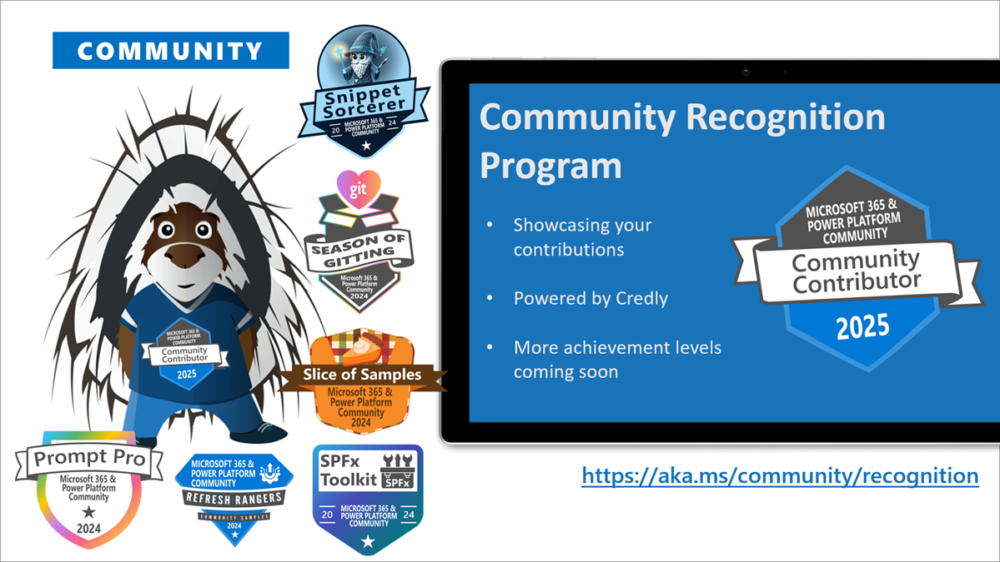

This is a weekly summary blog post of all the community activities such as community calls and presenters, newly uploaded videos, upcoming events and more 🚀

Get involved by joining a call! We host a variety of [community calls](https://aka.ms/community/calls) each week, where we demo solutions, announce new features and where you can connect with like-minded people. These calls are for everyone to join, simply download the recurrent invite and get involved. 

Want to demo on what you have created or figured out with the out-of-the-box features? - absolutely welcome. [Volunteer for a demo spot](https://aka.ms/community/request/demo).

This is the agenda for the upcoming week:

### Microsoft 365 & Power Platform product updates - 9th of December

* Tuesday, 9th of December 2025, 8:00 AM PT / 4:00 PM GMT
* Download the [recurring invite](https://aka.ms/m365-dev-call) or [join the call](https://aka.ms/m365-dev-call-join) we'd love to see you in the call!
* If you can't make it this time, you can watch the recording of the call from the [Microsoft Community Learning YouTube channel](https://www.youtube.com/playlist?list=PLR9nK3mnD-OUQOW86tT5dkCRQAVGY7DlH)

Demos this time:

* [Steve Pucelik](https://www.linkedin.com/in/stevepucelik/) – Latest on SharePoint Embedded
* [Paolo Pialorsi](https://www.linkedin.com/in/paolopialorsi/) (Microsoft) – Leveraging Copilot APIs in SPFx

---

### Microsoft 365 & Power Platform community demos call - 11th of December

* Thursday, 11th of December, 7:00 AM PT / 3:00 PM GMT
* Download the [recurring invite](https://aka.ms/community/m365-powerplat-call-invite) or [join the call](https://aka.ms/spdev-sig-call-join) we'd love to see you in the call!
* If you can't make it this time, you see the recording of the call from the [Microsoft 365 & Power Platform Community YouTube channel](https://www.youtube.com/watch?v=gAqUr9wa2_0&list=PLR9nK3mnD-OURfm5Ypu-wK52cxBv_gXCA)

Demos this time:

* [Aimery Thomas](https://www.linkedin.com/in/aimery-thomas/) (Avanade) – SP Shortcuts - Quick access to SharePoint setting pages
* [Elio Struyf](https://www.linkedin.com/in/estruyf/) (Struyf Consulting) – Bringing Intelligence to PnP Search with Microsoft Foundry
* [Hugo Bernier](https://www.linkedin.com/in/bernierh/) (Takeda) – AI powered layout creation - Building AI integrated SPFx web part

Also: 📷 Picture Time with community in Together Mode!

**Interested on doing a demo here?** - [Let us know](https://aka.ms/community/request/demo) and we'll get you scheduled!

---

## New videos 

Update of the newly published videos in our YouTube channel 

[Microsoft Community Learning](https://www.youtube.com/@MicrosoftCommunityLearning) - Subscribe today! ✅

* [Introducing MCP Server for the Community Sample Gallery](https://www.youtube.com/watch?v=dSXeFKyBwiY) by [Paolo Pialorsi](https://www.linkedin.com/in/paolopialorsi/) (Microsoft)
* [Introduction to Knowledge Agent’s improve this site feature](https://www.youtube.com/watch?v=ytx3bVeNXrY) by [Judith Yaaqoubi](https://www.linkedin.com/in/judithyaaqoubi/) (Microsoft)
* [Women in Power interview with Danielle Moon - LIVE from Microsoft Ignite 2025 | Change Needs Makers](https://www.youtube.com/watch?v=k3W06xsT5GE)
* [Creating AI powered adaptive card web part - Building AI integrated SPFx web part](https://www.youtube.com/watch?v=IzJfisCMY2s) by [Hugo Bernier](https://www.linkedin.com/in/bernierh/)
* [Controlling font size for powerful graphics in list formatting JSON](https://www.youtube.com/watch?v=mXTo5_iZxoE&pp=0gcJCSMKAYcqIYzv) by [Chris Kent](https://www.linkedin.com/in/thechriskent/) (Takeda)
* [Introduction to Knowledge Agent in SharePoint](https://www.youtube.com/watch?v=FyK6JtrxUrM) by [Cory Newton](https://www.linkedin.com/in/coryns/)
* [Handling legacy user's settings in SharePoint Framework](https://www.youtube.com/watch?v=9zcP0-N7YQQ) by [Paolo Pialorsi](https://www.linkedin.com/in/paolopialorsi/) (Microsoft)
* [Building my first SPFx ACE - with ideas and vibes](https://www.youtube.com/watch?v=526ney-YcDA) by [Lukas Bänsch](https://www.linkedin.com/in/lukas-b/) (Communardo)
* [Building a Seamless Power Platform Experience: SPFx, Hilly Billy Webpart, & List Form Customization](https://www.youtube.com/watch?v=YfGVgCPQff4) by [Vipul Jain (Bosch Global)​](https://www.linkedin.com/in/vipul0309/)

[Power Platform](https://www.youtube.com/@mspowerplatform) - Subscribe today! ✅

* [Analyst for Data | EP14 | Power Up Minute](https://www.youtube.com/watch?v=GpBJUW7ZP8o&pp=0gcJCSMKAYcqIYzv)
* [How JP Espeña builds accessible HR and safety Power Apps | Keeping it Real | EP01](https://www.youtube.com/watch?v=P6RNw4wk5TM)
* [BWT Alpine Formula One team hits the accelerator with Microsoft Power Platform](https://www.youtube.com/watch?v=Uzcoiu6QpVY)
* [Episode One of "Keeping it Real with Power Platform" drops this week!](https://www.youtube.com/watch?v=5_6HcT9QRtw)
* [Create in the new Vibe.PowerApps experience](https://www.youtube.com/watch?v=GN4mY_U0D68)
* [Unleashing the power of business data with Dataverse SDK for Python](https://www.youtube.com/watch?v=3wb2i1iDtso)

[Microsoft 365 Developer](https://www.youtube.com/@Microsoft365Developer) - Subscribe today! ✅

* [Zero Trust, Full Power: End-to-End Security for Agents and Apps with Agent 365](https://www.youtube.com/watch?v=Xqij7FDcPrE)

## New Microsoft 365 Developer Blog posts

* no new posts this week

## New Microsoft 365 and Power Platform Community Blog posts

* [Weekly Agenda - 24th of November week](https://pnp.github.io/blog/weekly-agenda/25-11-24/) by [Vesa Juvonen](https://linkedin.com/in/VesaJuvonen/)

---

## Last community call recordings published last week

Here are the last week's community call recordings. You can download recurrent invites to the community calls from https://aka.ms/community/calls.

* [CLI for Microsoft 365 v11.2](https://pnp.github.io/blog/cli-for-microsoft-365/cli-for-microsoft-365-v11-2/) by [Jasey Waegebaert](https://github.com/jwaegebaert/)
* [Weekly Agenda - 1st of December week](https://pnp.github.io/blog/weekly-agenda/25-12-01/) by [Vesa Juvonen](https://github.com/VesaJuvonen/)

---

## Recognition

You already contributed? Great, we want to celebrate and recognize you! Opt in for our [community recognition program](https://pnp.github.io/recognitionprogram/) and earn badges from our various initiatives! 

---

## Upcoming events

These are the main big ones for this and next semester - Do not miss out, it will be epic!

* [Microsoft 365 Conference](https://m365conf.com/) - April 21-23 - Orlando, United States
* [ECS 2026](https://ecs.events/) - May 5-7, 2026 - Cologne, Germany
* [European Power Platform Conference 2026](https://www.sharepointeurope.com/european-power-platform-conference/) - June 1-4, 2026 - Copenhagen, Denmark
* [TechCon - Chicago](https://techcon365.com/Chicago/) - June 15-19, 2026 - Chicago, United States

Please take the opportunity to join these great conferences organized by the best community in tech across the world. There are online and in-person options. See more from [CommunityDays.org](https://www.communitydays.org/).

* [Workplace Ninjas US](https://www.communitydays.org/event/2025-12-09/workplace-ninjas-us), December 9, 2025 – Dallas, TX, United States
* [SOLD OUT: Convergence 2025 | AI + ERP](https://www.communitydays.org/event/2025-12-09/sold-out-convergence-2025-or-ai-plus-erp), December 9, 2025 – Miami Beach, FL, United States
* [AI Community Conference - AICO Dubai](https://www.communitydays.org/event/2025-12-10/ai-community-conference-aico-dubai), December 10, 2025 – Dubai, United Arab Emirates
* [AI COMMUNITY CONFERENCE - AICO TUNISIA](https://www.communitydays.org/event/2025-12-18/ai-community-conference-aico-tunisia), December 18, 2025 – Yasmine Hammamet, Hammamet, Tunisia
* [AlohAI - Power Platform + AI](https://www.communitydays.org/event/2025-12-30/alohai-power-platform-plus-ai), December 30, 2025 – Honolulu, HI, United States
* [DynamicsCon Regional: Southeast](https://www.communitydays.org/event/2026-01-14/dynamicscon-regional-southeast), January 14, 2026 – Riverview, FL, United States
* [AI Community Conference - AICO Singapore](https://www.communitydays.org/event/2026-01-20/ai-community-conference-aico-singapore), January 20, 2026 – Singapore, Singapore
* [CollabDays Bremen](https://www.communitydays.org/event/2026-01-23/collabdays-bremen), January 23, 2026 – Bremen, Germany, Germany
* [Vibe 2026](https://www.communitydays.org/event/2026-01-28/vibe-2026), January 28, 2026 – South Padre Island, TX, United States
* [Cloud Tech Tallinn 2026](https://www.communitydays.org/event/2026-01-29/cloud-tech-tallinn-2026), January 29, 2026 – Tallinn, Harju, Estonia
* [aMP Lyon](https://www.communitydays.org/event/2026-01-29/amp-lyon), January 29, 2026 – Lyon, France
* [M365 Community Days DC 2026](https://www.communitydays.org/event/2026-01-29/m365-community-days-dc-2026), January 29, 2026 – Arlington, Virginia, United States
* [M365 Miami](https://www.communitydays.org/event/2026-02-06/m365-miami), February 6, 2026 – Miami, Florida, United States
* [aMP Dubai 2026](https://www.communitydays.org/event/2026-02-07/amp-dubai-2026), February 7, 2026 – Dubai, United Arab Emirates
* [Exchange Summit 2026](https://www.communitydays.org/event/2026-02-24/exchange-summit-2026), February 24, 2026 – Würzburg, BY, Germany
* [Knoxville Microsoft Community Days](https://www.communitydays.org/event/2026-02-26/knoxville-microsoft-community-days), February 26, 2026 – Maryville, TN, United States
* [Experts Live Germany 2026](https://www.communitydays.org/event/2026-03-03/experts-live-germany-2026), March 3, 2026 – Leipzig, Saxony, Germany
* [The WIT Network Igniting Excellence Leadership Conference](https://www.communitydays.org/event/2026-03-10/the-wit-network-igniting-excellence-leadership-conference), March 10, 2026 – North San Diego, CA, United States
* [Microsoft Fabric Community Conference](https://www.communitydays.org/event/2026-03-16/microsoft-fabric-community-conference), March 16, 2026 – Atlanta, GA, United States
* [ColorCloud 2026](https://www.communitydays.org/event/2026-04-15/colorcloud-2026), April 15, 2026 – Hamburg, Germany
* [DynamicsMinds 2026](https://www.communitydays.org/event/2026-05-25/dynamicsminds-2026), May 25, 2026 – Portorož, Slovenia, Slovenia
* [European Power Platform Conference 2026](https://www.communitydays.org/event/2026-06-01/european-power-platform-conference-2026), June 1, 2026 – Copenhagen, Denmark
* [CollabDays Netherlands 2026](https://www.communitydays.org/event/2026-06-13/collabdays-netherlands-2026), June 13, 2026 – Vijfheerenlanden, Utrecht, Netherlands
* [CollabDays Hamburg 2026](https://www.communitydays.org/event/2026-06-27/collabdays-hamburg-2026), June 27, 2026 – Hamburg, Germany
* [European Microsoft Fabric Community Conference 2026](https://www.communitydays.org/event/2026-09-28/european-microsoft-fabric-community-conference-2026), September 28, 2026 – Rubí, Catalonia, Spain
* [CollabDays New England 2026](https://www.communitydays.org/event/2026-10-16/collabdays-new-england-2026), October 16, 2026 – Burlington, MA, United States
