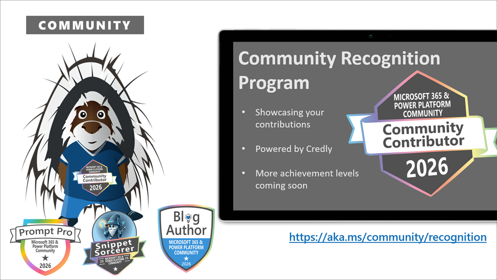
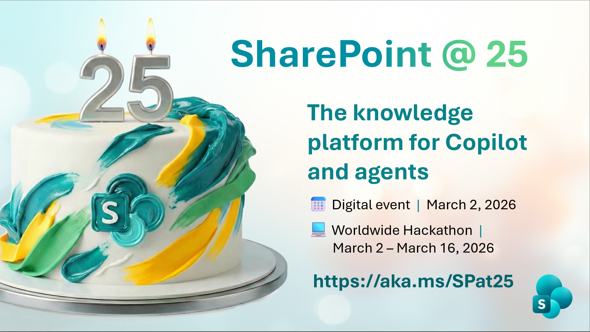

This is a weekly summary blog post of all the community activities such as community calls and presenters, newly uploaded videos, upcoming events and more 🚀

Get involved by joining a call! We host a variety of [community calls](https://aka.ms/community/calls) each week, where we demo solutions, announce new features and where you can connect with like-minded people. These calls are for everyone to join, simply download the recurrent invite and get involved. 

Want to demo on what you have created or figured out with the out-of-the-box features? - absolutely welcome. [Volunteer for a demo spot](https://aka.ms/community/request/demo).

This is the agenda for the upcoming week:

### Microsoft 365 & Power Platform product updates - 17th of February

* Tuesday, 17th of February 2026, 8:00 AM PT / 4:00 PM GMT
* Download the [recurring invite](https://aka.ms/m365-dev-call) or [join the call](https://aka.ms/m365-dev-call-join) we'd love to see you in the call!
* If you can't make it this time, you can watch the recording of the call from the [Microsoft Community Learning YouTube channel](https://www.youtube.com/playlist?list=PLR9nK3mnD-OUQOW86tT5dkCRQAVGY7DlH)

Demos this time:

* [Arnav Gupta](https://www.linkedin.com/in/g-arnav/) – Introduction to new frontline worker pilot deployment experience in Microsoft Teams
* [Fiza Musthafa](https://www.linkedin.com/in/fiza-musthafa-3a5a15236/) – Add AI capabilities to your SharePoint Embedded app
* [Vesa Juvonen](https://www.linkedin.com/in/vesajuvonen/) – Controlling SPFx extension command visibility in document libraries

---

### Microsoft Power Platform community call  - 18th of February

Typically demos here are from the community by the community. You are welcome to demo here 👋

* Wednesday, 18th of February, 8:00 AM PT / 3:00 PM GMT
* Download the [recurring invite](https://aka.ms/powerplatformcommunitycall) or [join the call](https://aka.ms/PowerPlatformMonthlyCall) we'd love to see you in the call!
* If you can't make it this time, you can watch the recording recording from here: [Microsoft 365 & Power Platform Community - Power Platform calls](https://www.youtube.com/watch?v=qLM6MChvrOk&list=PLR9nK3mnD-OVHNx67Q2Uxe7wodTnjHguz)

Demos this time

* [Arjan Rijsdijk](https://www.linkedin.com/in/arjanrijsdijk/) (Royal Schiphol Group) - SVG images to Canvas apps made easy
* [Benny Ifeanyi Iheagwara](https://www.linkedin.com/in/ifeanyi-iheagwara) (Moniepoint Group) & [Olumayowa Oyaleke](https://www.linkedin.com/in/olumayowaoyaleke/) (ARM HoldCo) - Building a Low-code AI Powered Email Assistant for Customer Support
*  [Elliot Margot](https://www.linkedin.com/in/elliot-margot-52742a156/)- Feature Driven Development - Vibe Coding with VSCode Extension for Copilot Studio

---

### Microsoft 365 & Power Platform community demos call - 19th of February

* Thursday, 19th of February, 7:00 AM PT / 3:00 PM GMT
* Download the [recurring invite](https://aka.ms/community/m365-powerplat-call-invite) or [join the call](https://aka.ms/spdev-sig-call-join) we'd love to see you in the call!
* If you can't make it this time, you see the recording of the call from the [Microsoft 365 & Power Platform Community YouTube channel](https://www.youtube.com/watch?v=gAqUr9wa2_0&list=PLR9nK3mnD-OURfm5Ypu-wK52cxBv_gXCA)

Demos this time:

* [Nicolas Kheirallah](https://www.linkedin.com/in/nicolas-kheirallah/) (Exobe) – Announcement Banner Extension
* [Michał Kornet](https://www.linkedin.com/in/micha%C5%82-kornet-sharepoint-dev/) (Accelerator 365 by Reply) – Power Automate Actions Browser Extension Updates
* [Hugo Bernier](https://www.linkedin.com/in/bernierh/) (Takeda) – Multimodality - Building AI integrated SPFx web part

**Interested on doing a demo?** - [Let us know](https://aka.ms/community/request/demo) and we'll get you scheduled!

---

## New videos 

Update of the newly published videos in our YouTube channel 

[Microsoft Community Learning](https://www.youtube.com/@MicrosoftCommunityLearning) - Subscribe today! ✅

* [Building a WeatherNow SPFx Web Part](https://www.youtube.com/watch?v=9oTY972YmKA)
* [Viva Engage Masterclass Season 2: Week 2 AI Enablement](https://www.youtube.com/watch?v=VWWj0wGEmoE)
* [Bringing Intelligence to Enterprise Search with Microsoft Foundry and SPFx](https://www.youtube.com/watch?v=PDGEsBTO8hg) by [Elio Struyf](https://www.linkedin.com/in/eliostruyf/) (EngageTime)
* [Live from Microsoft Studio | SharePoint at 25 with John Mighell & Karuana Gatimu](https://www.youtube.com/watch?v=b_erHfTJUwU)
* [Introduction to SharePoint Pages Agent in Microsoft 365 Copilot](https://www.youtube.com/watch?v=dyWQHLaE5W8) by [Vesa Juvonen](https://www.linkedin.com/in/vesajuvonen/) (Microsoft)
* [Move Over, Copilot: Building Your Own AI in Office](https://www.youtube.com/watch?v=jbCfs7VQY3A) by [Beau Cameron](https://www.linkedin.com/in/beaucamerondotnet/) (TrnDigital)
* [Hello Python Kind Regards, Power Automate Flow](https://www.youtube.com/watch?v=Fu9S90K6bS4) by [Mike Givens](https://www.linkedin.com/in/mikegivens/) (CACI International Inc)
* [Copilot Studio × MCP: From Zero to Shipping a Real Event Agent](https://www.youtube.com/watch?v=4LKtLRZlCyE) by [Fabian Williams](https://www.linkedin.com/in/fabiangwilliams/) (Microsoft)
* [First Fridays: Empowering Global Communicators: AI, Alignment, and Learning in the GEEC Community](https://www.youtube.com/watch?v=gx-0-MlYByI)
* [Mastering Mermaid: Automating the Creation of Process Diagrams with Copilot Studio](https://www.youtube.com/watch?v=8rMsYOORdKc)
* [Your first look at M365 Community Conference 2026 with Vasu Jakkal!](https://www.youtube.com/watch?v=uRcAYIuA_zs)
* [Building engaging forms with SharePoint - Plumsail - SharePoint Partner Showcase](https://www.youtube.com/watch?v=AMtafN4fal4)

[Power Platform](https://www.youtube.com/@mspowerplatform) - Subscribe today! ✅

* [Who’s Using Copilot Studio? | Dunaway Transforms AEC Workflows with AI Agents](https://www.youtube.com/watch?v=1_LwbR135Yc)
* [Add enterprise knowledge using Prompt Builder connectors | Power Platform Shorts](https://www.youtube.com/watch?v=itbGB13eL20)
* [Episode 7 of Keeping It Real with Diane Fligiel coming soon!](https://www.youtube.com/watch?v=TD_ZxzsHijY)
* [Thomas Rice | EP02 | Community Spotlight](https://www.youtube.com/watch?v=1yM-3NFdarM)
* [Bryan Goode presents AI in Action: How State Farm Is Reimagining Work with AI Agents](https://www.youtube.com/watch?v=5q1lIsI0DBs)
* [Building a long-lasting Canvas app with Savio Fernandes | EP06 | Keeping It Real](https://www.youtube.com/watch?v=Rw2hk2PgiOw)

[Microsoft 365 Developer](https://www.youtube.com/@Microsoft365Developer) - Subscribe today! ✅

* no new videos this week

## New Microsoft 365 Developer Blog posts

* no new blog posts this week

## New Microsoft 365 and Power Platform Community Blog posts

* [Weekly Agenda - 9th of February week](https://pnp.github.io/blog/weekly-agenda/26-02-09/) by [Vesa Juvonen](https://github.com/VesaJuvonen/)

---

## Last community call recordings published last week

Here are the last week's community call recordings. You can download recurrent invites to the community calls from https://aka.ms/community/calls.

* [Microsoft 365 & Power Platform weekly call – 10th of February, 2026](https://www.youtube.com/watch?v=owuWUdApSFo)
* [Microsoft 365 & Power Platform community call - 5th of February 2026](https://www.youtube.com/watch?v=agMtaAuAO4M&pp=0gcJCZQKAYcqIYzv)

---

## Recognition

You already contributed? Great, we want to celebrate and recognize you! Opt in for our [community recognition program](https://pnp.github.io/recognitionprogram/) and earn badges from our various initiatives! 

---

## 25th anniversary of SharePoint

You don't want to miss out this great community powered celebration! SharePoint is having it's 25th anniversary on 2nd of March and we are hosting an exclusive [online event](https://aka.ms/SPat25) for everyone to join. We will be also running a [SharePoint Hackathon 2026](https://aka.ms/sharepoint/hackathon) between 2nd of March and 16th of March. Join others in the community to create SharePoint powered experiences. Everyone is welcome on this one from end users, designers, developers and more.

---

## Upcoming events

These are the main big ones for this and next semester - Do not miss out, it will be epic!

* [Microsoft 365 Conference](https://m365conf.com/) - April 21-23 - Orlando, United States
* [ECS 2026](https://ecs.events/) - May 5-7, 2026 - Cologne, Germany
* [TechCon - Chicago](https://techcon365.com/Chicago/) - June 15-19, 2026 - Chicago, United States
* [European Power Platform Conference 2026](https://www.sharepointeurope.com/european-power-platform-conference/) - June 29 - July 2, 2026 - Copenhagen, Denmark
* [ESPC 2026](https://www.sharepointeurope.com/) - November 30 - December 3, 2026 - Amsterdam, Netherlands

Please take the opportunity to join these great conferences organized by the best community in tech across the world. There are online and in-person options. See more from [CommunityDays.org](https://www.communitydays.org/).

* [Global Power Platform Bootcamp Polish Edition](https://www.communitydays.org/event/2026-02-20/global-power-platform-bootcamp-polish-edition), February 20, 2026 – 
* [Exchange Summit 2026](https://www.communitydays.org/event/2026-02-24/exchange-summit-2026), February 24, 2026 – Würzburg, BY, Germany
* [Knoxville Microsoft Community Days](https://www.communitydays.org/event/2026-02-26/knoxville-microsoft-community-days), February 26, 2026 – Maryville, TN, United States
* [Experts Live Germany 2026](https://www.communitydays.org/event/2026-03-03/experts-live-germany-2026), March 3, 2026 – Leipzig, Saxony, Germany
* [The WIT Network Igniting Excellence Leadership Conference](https://www.communitydays.org/event/2026-03-10/the-wit-network-igniting-excellence-leadership-conference), March 10, 2026 – North San Diego, CA, United States
* [Microsoft Fabric Community Conference](https://www.communitydays.org/event/2026-03-16/microsoft-fabric-community-conference), March 16, 2026 – Atlanta, GA, United States
* [West Michigan M365 Community Day](https://www.communitydays.org/event/2026-03-19/west-michigan-m365-community-day), March 19, 2026 – Grand Rapids, MI, United States
* [DynamicsCon Regional: Pacific Northwest](https://www.communitydays.org/event/2026-03-20/dynamicscon-regional-pacific-northwest), March 20, 2026 – Vancouver, BC, Canada
* [AICD SHANGAI](https://www.communitydays.org/event/2026-03-21/aicd-shangai), March 21, 2026 – Shanghai, China
* [AI Maitri - Dubai 2026](https://www.communitydays.org/event/2026-04-09/ai-maitri-dubai-2026), April 9, 2026 – Dubai, United Arab Emirates
* [ZTDays Tunis 2026](https://www.communitydays.org/event/2026-04-11/ztdays-tunis-2026), April 11, 2026 – Tunis, Tunisia
* [ColorCloud 2026](https://www.communitydays.org/event/2026-04-15/colorcloud-2026), April 15, 2026 – Hamburg, Germany
* [Global Azure Tunisia 2026](https://www.communitydays.org/event/2026-04-18/global-azure-tunisia-2026), April 18, 2026 – Tunis , Tunis, Tunisia
* [Microsoft 365 Community Conference](https://www.communitydays.org/event/2026-04-19/microsoft-365-community-conference), April 19, 2026 – Orlando, FL, United States
* [Modern Endpoint Management Summit 2026 EMEA EDITION](https://www.communitydays.org/event/2026-04-22/modern-endpoint-management-summit-2026-emea-edition), April 22, 2026 – Paris, Île-de-France, France
* [AICD PARIS](https://www.communitydays.org/event/2026-04-22/aicd-paris), April 22, 2026 – PARIS, France
* [Dynamics User Group Sweden - 22 april 2026](https://www.communitydays.org/event/2026-04-22/dynamics-user-group-sweden-22-april-2026), April 22, 2026 – Stockholm, Sweden
* [AgentCon London](https://www.communitydays.org/event/2026-04-22/agentcon-london), April 22, 2026 – London, United Kingdom
* [AICD BRUSSELS](https://www.communitydays.org/event/2026-04-27/aicd-brussels), April 27, 2026 – Zaventem, Belgium
* [European  Collaboration Summit 2026](https://www.communitydays.org/event/2026-05-05/european-collaboration-summit-2026), May 5, 2026 – Cologne, North Rhine-Westphalia, Germany
* [European BizApps Summit 2026](https://www.communitydays.org/event/2026-05-05/european-bizapps-summit-2026), May 5, 2026 – Cologne, North Rhine-Westphalia, Germany
* [European AI and Cloud Summit 2026](https://www.communitydays.org/event/2026-05-05/european-ai-and-cloud-summit-2026), May 5, 2026 – Cologne, North Rhine-Westphalia, Germany
* [CognitionX  - Tunis](https://www.communitydays.org/event/2026-05-08/cognitionx-tunis), May 8, 2026 – Tunis, Tunisia
* [AICD TUNIS](https://www.communitydays.org/event/2026-05-08/aicd-tunis), May 8, 2026 – Tunis, Tunisia
* [M365 Philly 2026](https://www.communitydays.org/event/2026-05-08/m365-philly-2026), May 8, 2026 – Malvern, PA, United States
* [M365 Community Days DC 2026](https://www.communitydays.org/event/2026-05-14/m365-community-days-dc-2026), May 14, 2026 – Arlington, VA, United States
* [SWOOP Analytics SharePoint Intranet Festival 2026 | EMEA](https://www.communitydays.org/event/2026-05-20/swoop-analytics-sharepoint-intranet-festival-2026-emea), May 20, 2026 – 
* [SWOOP Analytics SharePoint Intranet Festival 2026 | AMER](https://www.communitydays.org/event/2026-05-20/swoop-analytics-sharepoint-intranet-festival-2026-amer), May 20, 2026 – 
* [SWOOP Analytics SharePoint Intranet Festival 2026 | APAC](https://www.communitydays.org/event/2026-05-20/swoop-analytics-sharepoint-intranet-festival-2026-apac), May 20, 2026 – 
* [DynamicsMinds 2026](https://www.communitydays.org/event/2026-05-25/dynamicsminds-2026), May 25, 2026 – Portorož, Slovenia, Slovenia
* [Update Conference Krakow 2026](https://www.communitydays.org/event/2026-05-27/update-conference-krakow-2026), May 27, 2026 – Krakow, Lesser Poland, Poland
* [CollabDays Madrid 2026](https://www.communitydays.org/event/2026-06-04/collabdays-madrid-2026), June 4, 2026 – Pozuelo de Alarcón, Madrid, Spain
* [CollabDays Netherlands 2026](https://www.communitydays.org/event/2026-06-13/collabdays-netherlands-2026), June 13, 2026 – Vijfheerenlanden, Utrecht, Netherlands
* [POSETTE: An Event for Postgres 2026](https://www.communitydays.org/event/2026-06-16/posette-an-event-for-postgres-2026), June 16, 2026 – 
* [CollabDays Hamburg 2026](https://www.communitydays.org/event/2026-06-27/collabdays-hamburg-2026), June 27, 2026 – Hamburg, Germany
* [The AI-Native Workplace Summit 2026](https://www.communitydays.org/event/2026-09-16/the-ai-native-workplace-summit-2026), September 16, 2026 – 
* [CollabDays Portugal 2026 - Porto Edition](https://www.communitydays.org/event/2026-10-16/collabdays-portugal-2026-porto-edition), October 16, 2026 – Porto, Portugal
* [CollabDays New England 2026](https://www.communitydays.org/event/2026-10-16/collabdays-new-england-2026), October 16, 2026 – Burlington, MA, United States
