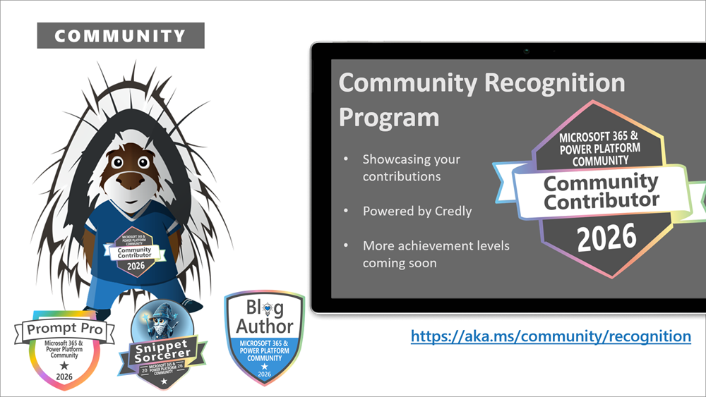
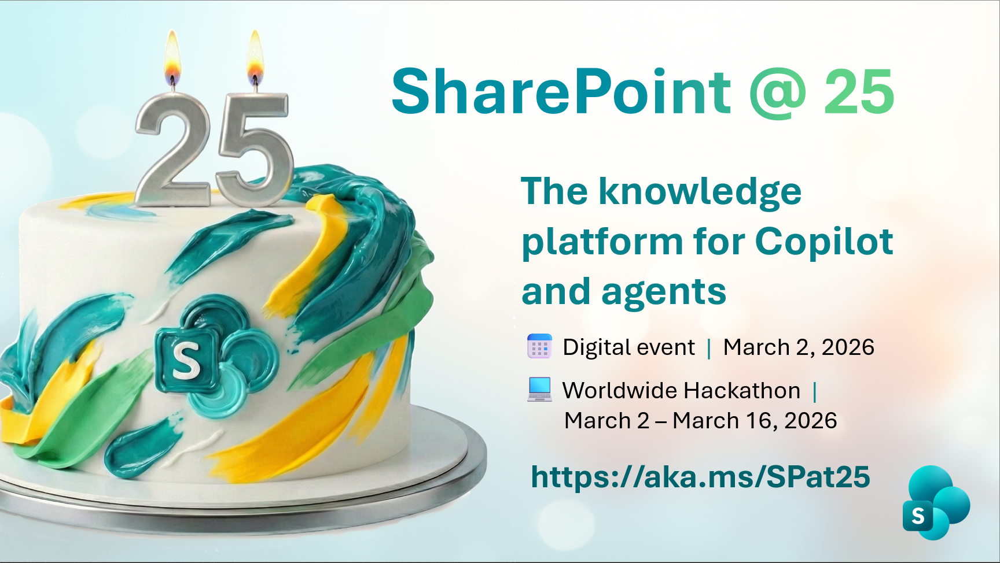

This is a weekly summary blog post of all the community activities such as community calls and presenters, newly uploaded videos, upcoming events and more 🚀

Get involved by joining a call! We host a variety of [community calls](https://aka.ms/community/calls) each week, where we demo solutions, announce new features and where you can connect with like-minded people. These calls are for everyone to join, simply download the recurrent invite and get involved. 

Want to demo on what you have created or figured out with the out-of-the-box features? - absolutely welcome. [Volunteer for a demo spot](https://aka.ms/community/request/demo).

This is the agenda for the upcoming week:

### Microsoft 365 & Power Platform product updates - 10th of March

* Tuesday, 10th of March 2026, 8:00 AM PT / 4:00 PM GMT
* Download the [recurring invite](https://aka.ms/m365-dev-call) or [join the call](https://aka.ms/m365-dev-call-join) we'd love to see you in the call!
* If you can't make it this time, you can watch the recording of the call from the [Microsoft Community Learning YouTube channel](https://www.youtube.com/playlist?list=PLR9nK3mnD-OUQOW86tT5dkCRQAVGY7DlH)

Demos this time:

* [Sébastien Levert](https://www.linkedin.com/in/sebastienlevert/) – Configuring your Copilot Chat declarative agent capabilities
* [Steve Pucelik](https://www.linkedin.com/in/stevepucelik/) & [Marc Windle](https://www.linkedin.com/in/marc-windle-908b3055/) – Compliance in SharePoint Embedded - Use what you already own
* [Fiza Musthafa](https://www.linkedin.com/in/fiza-musthafa-3a5a15236/) – Building AI Agents with Agent 365 SDK: MCP Tooling & Observability

---

### Microsoft 365 & Power Platform community demos call - 12th of March

* Thursday, 12th of March, 7:00 AM PT / 3:00 PM GMT
* Download the [recurring invite](https://aka.ms/community/m365-powerplat-call-invite) or [join the call](https://aka.ms/spdev-sig-call-join) we'd love to see you in the call!
* If you can't make it this time, you see the recording of the call from the [Microsoft 365 & Power Platform Community YouTube channel](https://www.youtube.com/watch?v=gAqUr9wa2_0&list=PLR9nK3mnD-OURfm5Ypu-wK52cxBv_gXCA)

Demos this time:

* [Shiv Sharma](https://www.linkedin.com/in/shiv-sharma%E2%9C%85-b07050162/?lipi=urn%3Ali%3Apage%3Ad_flagship3_profile_view_base%3BZwGHYk0MSOKQMfPepWf%2F9A%3D%3D) (Ameriprise Financial Services) – Build a Modern Power Apps Gallery with Tabbed Filters for Speaker Management
* [Darshan Magdum](https://www.linkedin.com/in/darshan-magdum-%C2%AE-61764b113/) (Nihilent) – Compare 2 PDF files - Get Summary using Copilot Studio
* [David Warner](https://www.linkedin.com/in/davidwarnerii/) (Quisitive) –  Introduction to Copilot Component Collections

**Interested on doing a demo?** - [Let us know](https://aka.ms/community/request/demo) and we'll get you scheduled!

---

## New videos 

Update of the newly published videos in our YouTube channel 

[Microsoft Community Learning](https://www.youtube.com/@MicrosoftCommunityLearning) - Subscribe today! ✅

* [Creating a SPFx solution to present Document Library File Types Distribution in a site](https://www.youtube.com/watch?v=L1oH2nx_u2E) by [Harminder Singh](https://www.linkedin.com/in/harminder-sethi/) (Nagarro)
* [Product suite on top of SharePoint - Intelligent Decisioning - SharePoint Partner Showcase](https://www.youtube.com/watch?v=BMgk8An5BR0)
* [Announcing Frontline Agent in Microsoft 365 Copilot](https://www.youtube.com/watch?v=Y-sqC_EvRLQ) by [Natalie Pienkowska](https://www.linkedin.com/in/natalie-pienkowska/) (Microsoft)
* [Data connectivity - Building AI integrated SPFx web part](https://www.youtube.com/watch?v=bsqr23TLcAg) by [Hugo Bernier](https://www.linkedin.com/in/bernierh/)
* [Blooper reel | SharePoint at 25 digital event](https://www.youtube.com/watch?v=jzKqJswblX0)
* [Resiliency in the age of AI with Microsoft 365 Backup](https://www.youtube.com/watch?v=3U7YSr7qUzw&pp=0gcJCa4KAYcqIYzv)
* [Experience the New SharePoint Home Site Experience – Exclusive Hackathon Preview](https://www.youtube.com/watch?v=7BabkWGAr8A)
* [Accelerate Microsoft 365 Copilot adoption with intelligent and company specific AI automation](https://www.youtube.com/watch?v=4xtaUt3Kep8) by [Sofia Virgos](https://www.linkedin.com/in/sofiavirgos/) (Microsoft) and [Sam Betts](https://www.linkedin.com/in/sambettscv/) (Microsoft)
* [The new SharePoint experience](https://www.youtube.com/watch?v=tO3A8VKYV80)
* [How M-Files transforms content management | SharePoint customer story](https://www.youtube.com/watch?v=k7O0OtDpcXQ&pp=0gcJCa4KAYcqIYzv)
* [Connecting Microsoft Copilot Studio to SharePoint](https://www.youtube.com/watch?v=iCLOavFc750)
* [Content creation with AI in SharePoint](https://www.youtube.com/watch?v=QaQA3-YZzYc)
* [A tour of the new SharePoint experience](https://www.youtube.com/watch?v=pvxXnC6VESw)
* [How Wortell drive AI innovation | SharePoint customer story](https://www.youtube.com/watch?v=B9MNMf_cIic)
* [Introducing SharePoint Admin Agent: Governing and securing SharePoint in the agentic era](https://www.youtube.com/watch?v=4C4B2ckF3zA)
* [AI in SharePoint: Build and organize content faster with natural language](https://www.youtube.com/watch?v=2nAgJq471x0&pp=0gcJCa4KAYcqIYzv)
* [New file sharing experience for Microsoft 365](https://www.youtube.com/watch?v=3RpE0KrQmcA)

[Power Platform](https://www.youtube.com/@mspowerplatform) - Subscribe today! ✅

* [Stay tuned for more Keeping It Real with Power Platform!](https://www.youtube.com/watch?v=jtxDt11N8z4)
* [Add event triggers to act autonomously | Mission 4 | Agent Operative](https://www.youtube.com/watch?v=lXdlj4DjR28&pp=0gcJCa4KAYcqIYzv)
* [Extracting resume contents with multi-modal prompts | Mission 7 | Agent Operative](https://www.youtube.com/watch?v=icP_qH8LFK8)
* [Understanding agent models and response formatting | Mission 5 | Agent Operative](https://www.youtube.com/watch?v=c5rqNQt2Mmc)
* [AI safety and content moderation | Mission 6 | Agent Operative](https://www.youtube.com/watch?v=2IjDV_D3Jb0)
* [Add tools to your agent in Copilot Studio](https://www.youtube.com/watch?v=940EmjVuj2I)
* [Daniel Christian | EP01 | Ask a Community Pro](https://www.youtube.com/watch?v=Bs_JPbGbNPk)
* [Building intelligent agents with knowledge sources | EP07 | Understanding Microsoft Agents](https://www.youtube.com/watch?v=_fAn3J3DS_A)
* [Make your agent multi-agent ready with connected agents | Mission 3 | Agent Operative](https://www.youtube.com/watch?v=X-nyqdk6tcc)
* [Authoring Agent Instructions | Mission 2 | Agent Operative](https://www.youtube.com/watch?v=h_pgKSKHlIU)
* [Get started with the Hiring Agent | Mission 1 | Agent Operative](https://www.youtube.com/watch?v=VaEy6ux2sQs)

[Microsoft 365 Developer](https://www.youtube.com/@Microsoft365Developer) - Subscribe today! ✅

* no new videos this week

## New Microsoft 365 Developer Blog posts

* no new blog posts this week

## New Microsoft 365 and Power Platform Community Blog posts

* [CLI for Microsoft 365 v11.5](https://pnp.github.io/blog/cli-for-microsoft-365/cli-for-microsoft-365-v11-5/) by [Jasey Waegebaert](https://github.com/jwaegebaert/)
* [Using MCP Servers in a React Application — A Real-World Example with Microsoft Graph](https://pnp.github.io/blog/post/use-mcp-servers-in-react-application/) by [João Mendes](https://github.com/joaojmendes/)
* [Weekly Agenda - 2nd of March week](https://pnp.github.io/blog/weekly-agenda/26-03-02/) by [Vesa Juvonen](https://github.com/VesaJuvonen/)
* [Dataverse ERD Visualize - My Top 10](https://pnp.github.io/blog/post/dataverse-erd-visualizer-top-ten/) by [Alex McLachlan](https://github.com/alex-mcla/)

---

## Last community call recordings published last week

Here are the last week's community call recordings. You can download recurrent invites to the community calls from https://aka.ms/community/calls.

* [Microsoft 365 & Power Platform community call - 5th of March 2026](https://www.youtube.com/watch?v=65E8HB7B7i4)
* [Microsoft 365 Champion Community Call | February 2026](https://www.youtube.com/watch?v=1_sIZMpviHQ)
* [Microsoft 365 & Power Platform weekly call – 3rd of March, 2026](https://www.youtube.com/watch?v=J-HQ1s-HS50)
* [Microsoft Agents Community Call | 03-04-26](https://www.youtube.com/watch?v=tFCMAvzxHhw)

---

## Recognition

You already contributed? Great, we want to celebrate and recognize you! Opt in for our [community recognition program](https://pnp.github.io/recognitionprogram/) and earn badges from our various initiatives! 

---

## 25th anniversary of SharePoint

You don't want to miss out this great community powered celebration! SharePoint is having it's 25th anniversary on 2nd of March and we are hosting an exclusive [online event](https://aka.ms/SPat25) for everyone to join. We will be also running a [SharePoint Hackathon 2026](https://aka.ms/sharepoint/hackathon) between 2nd of March and 16th of March. Join others in the community to create SharePoint powered experiences. Everyone is welcome on this one from end users, designers, developers and more.

---

## Upcoming events

These are the main big ones for this and next semester - Do not miss out, it will be epic!

* [Microsoft 365 Conference](https://m365conf.com/) - April 21-23 - Orlando, United States
* [ECS 2026](https://ecs.events/) - May 5-7, 2026 - Cologne, Germany
* [TechCon - Chicago](https://techcon365.com/Chicago/) - June 15-19, 2026 - Chicago, United States
* [European Power Platform Conference 2026](https://www.sharepointeurope.com/european-power-platform-conference/) - June 29 - July 2, 2026 - Copenhagen, Denmark
* [ESPC 2026](https://www.sharepointeurope.com/) - November 30 - December 3, 2026 - Amsterdam, Netherlands

Please take the opportunity to join these great conferences organized by the best community in tech across the world. There are online and in-person options. See more from [CommunityDays.org](https://www.communitydays.org/).

* [Experts Live Germany 2026](https://www.communitydays.org/event/2026-03-03/experts-live-germany-2026), March 3, 2026 – Leipzig, Saxony, Germany
* [The WIT Network Igniting Excellence Leadership Conference](https://www.communitydays.org/event/2026-03-10/the-wit-network-igniting-excellence-leadership-conference), March 10, 2026 – North San Diego, CA, United States
* [Microsoft Fabric Community Conference](https://www.communitydays.org/event/2026-03-16/microsoft-fabric-community-conference), March 16, 2026 – Atlanta, GA, United States
* [West Michigan M365 Community Day](https://www.communitydays.org/event/2026-03-19/west-michigan-m365-community-day), March 19, 2026 – Grand Rapids, MI, United States
* [DynamicsCon Regional: Pacific Northwest](https://www.communitydays.org/event/2026-03-20/dynamicscon-regional-pacific-northwest), March 20, 2026 – Vancouver, BC, Canada
* [AICD SHANGAI](https://www.communitydays.org/event/2026-03-21/aicd-shangai), March 21, 2026 – Shanghai, China
* [M365 COMMUNITY DAYS QUEBEC 2026](https://www.communitydays.org/event/2026-04-01/m365-community-days-quebec-2026), April 1, 2026 – Québec, QC, Canada
* [AI Maitri - Dubai 2026](https://www.communitydays.org/event/2026-04-09/ai-maitri-dubai-2026), April 9, 2026 – Dubai, United Arab Emirates
* [ZTDays Tunis 2026](https://www.communitydays.org/event/2026-04-11/ztdays-tunis-2026), April 11, 2026 – Tunis, Tunisia
* [AgentCon Hong Kong](https://www.communitydays.org/event/2026-04-11/agentcon-hong-kong), April 11, 2026 – Tsing Yi Island, New Territories, Hong Kong
* [ColorCloud 2026](https://www.communitydays.org/event/2026-04-15/colorcloud-2026), April 15, 2026 – Hamburg, Germany
* [Global Azure Tunisia 2026](https://www.communitydays.org/event/2026-04-18/global-azure-tunisia-2026), April 18, 2026 – Tunis , Tunis, Tunisia
* [Microsoft 365 Community Conference](https://www.communitydays.org/event/2026-04-19/microsoft-365-community-conference), April 19, 2026 – Orlando, FL, United States
* [Modern Endpoint Management Summit 2026 EMEA EDITION](https://www.communitydays.org/event/2026-04-22/modern-endpoint-management-summit-2026-emea-edition), April 22, 2026 – Paris, Île-de-France, France
* [AICD PARIS](https://www.communitydays.org/event/2026-04-22/aicd-paris), April 22, 2026 – PARIS, France
* [Dynamics User Group Sweden - 22 april 2026](https://www.communitydays.org/event/2026-04-22/dynamics-user-group-sweden-22-april-2026), April 22, 2026 – Stockholm, Sweden
* [AgentCon London](https://www.communitydays.org/event/2026-04-22/agentcon-london), April 22, 2026 – London, United Kingdom
* [AICD BRUSSELS](https://www.communitydays.org/event/2026-04-27/aicd-brussels), April 27, 2026 – Zaventem, Belgium
* [European  Collaboration Summit 2026](https://www.communitydays.org/event/2026-05-05/european-collaboration-summit-2026), May 5, 2026 – Cologne, North Rhine-Westphalia, Germany
* [European BizApps Summit 2026](https://www.communitydays.org/event/2026-05-05/european-bizapps-summit-2026), May 5, 2026 – Cologne, North Rhine-Westphalia, Germany
* [European AI and Cloud Summit 2026](https://www.communitydays.org/event/2026-05-05/european-ai-and-cloud-summit-2026), May 5, 2026 – Cologne, North Rhine-Westphalia, Germany
* [CognitionX  - Tunis](https://www.communitydays.org/event/2026-05-08/cognitionx-tunis), May 8, 2026 – Tunis, Tunisia
* [AICD TUNIS](https://www.communitydays.org/event/2026-05-08/aicd-tunis), May 8, 2026 – Tunis, Tunisia
* [M365 Philly 2026](https://www.communitydays.org/event/2026-05-08/m365-philly-2026), May 8, 2026 – Malvern, PA, United States
* [M365 Community Days DC 2026](https://www.communitydays.org/event/2026-05-14/m365-community-days-dc-2026), May 14, 2026 – Arlington, VA, United States
* [MN M365 16TH BI-ANNUAL SPRING WORKSHOP DAY](https://www.communitydays.org/event/2026-05-15/mn-m365-16th-bi-annual-spring-workshop-day), May 15, 2026 – Edina, MN, United States
* [SWOOP Analytics SharePoint Intranet Festival 2026 | EMEA](https://www.communitydays.org/event/2026-05-20/swoop-analytics-sharepoint-intranet-festival-2026-emea), May 20, 2026 – 
* [SWOOP Analytics SharePoint Intranet Festival 2026 | AMER](https://www.communitydays.org/event/2026-05-20/swoop-analytics-sharepoint-intranet-festival-2026-amer), May 20, 2026 – 
* [SWOOP Analytics SharePoint Intranet Festival 2026 | APAC](https://www.communitydays.org/event/2026-05-20/swoop-analytics-sharepoint-intranet-festival-2026-apac), May 20, 2026 – 
* [DynamicsMinds 2026](https://www.communitydays.org/event/2026-05-25/dynamicsminds-2026), May 25, 2026 – Portorož, Slovenia, Slovenia
* [Update Conference Krakow 2026](https://www.communitydays.org/event/2026-05-27/update-conference-krakow-2026), May 27, 2026 – Krakow, Lesser Poland, Poland
* [CollabDays Madrid 2026](https://www.communitydays.org/event/2026-06-04/collabdays-madrid-2026), June 4, 2026 – Pozuelo de Alarcón, Madrid, Spain
* [CollabDays Poland 2026](https://www.communitydays.org/event/2026-06-11/collabdays-poland-2026), June 11, 2026 – Warsaw, Mazovia, Poland
* [CollabDays Netherlands 2026](https://www.communitydays.org/event/2026-06-13/collabdays-netherlands-2026), June 13, 2026 – Vijfheerenlanden, Utrecht, Netherlands
* [TechCon 365 Chicago](https://www.communitydays.org/event/2026-06-15/techcon-365-chicago), June 15, 2026 – Chicago, IL, United States
* [POSETTE: An Event for Postgres 2026](https://www.communitydays.org/event/2026-06-16/posette-an-event-for-postgres-2026), June 16, 2026 – 
* [CollabDays Hamburg 2026](https://www.communitydays.org/event/2026-06-27/collabdays-hamburg-2026), June 27, 2026 – Hamburg, Germany
* [The AI-Native Workplace Summit 2026](https://www.communitydays.org/event/2026-09-16/the-ai-native-workplace-summit-2026), September 16, 2026 – 
* [Baltic Summit 2026](https://www.communitydays.org/event/2026-09-24/baltic-summit-2026), September 24, 2026 – Gdynia, Pomerania, Poland
* [CollabDays Portugal 2026 - Porto Edition](https://www.communitydays.org/event/2026-10-16/collabdays-portugal-2026-porto-edition), October 16, 2026 – Porto, Portugal
* [CollabDays New England 2026](https://www.communitydays.org/event/2026-10-16/collabdays-new-england-2026), October 16, 2026 – Burlington, MA, United States
* [M365 Community Days Montréal #4-2026 – Sans gouvernance, pas d’IA](https://www.communitydays.org/event/2027-01-27/m365-community-days-montral-4-2026-sans-gouvernance-pas-dia), January 27, 2027 – Montreal, QC, Canada
