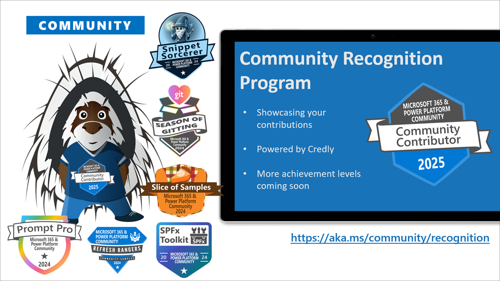

This is a weekly summary blog post of all the community activities such as community calls and presenters, newly uploaded videos, upcoming events and more 🚀
Get involved by joining a call! We host a variety of [community calls](https://aka.ms/community/calls) each week, where we demo solutions, announce new features and where you can connect with like-minded people. These calls are for everyone to join, simply download the recurrent invite and get involved. 

Want to demo on what you have created or figured out with the out-of-the-box features? - absolutely welcome. [Volunteer for a demo spot](https://aka.ms/community/request/demo).

This is the agenda for the upcoming week:

### Copilot, Microsoft 365 & Power Platform product updates call - 7th of July

* Tuesday, 7th of July 2026, 8:00 AM PT / 4:00 PM GMT
* Download the [recurring invite](https://aka.ms/community/ms-speakers-call-invite) or [join the call](https://aka.ms/m365-dev-call-join) we'd love to see you in the call!
* If you can't make it this time, you can watch the recording of the call from the [Microsoft Community Learning YouTube channel](https://www.youtube.com/playlist?list=PLR9nK3mnD-OUQOW86tT5dkCRQAVGY7DlH)

Demos this time:

* [Aimery Thomas](https://www.linkedin.com/in/aimery-thomas) (Avanade) - Creating custom Copilot integrated search results UX for enterprise search
* [Michael Greth](https://www.linkedin.com/in/mgreth) - My SharePoint Hackathon Agent, Rebuilt with Microsoft Cowork
* [Paolo Pialorsi](https://www.linkedin.com/in/paolopialorsi/) - Understanding Work IQ MCP and Work IQ CLI

### Microsoft 365 & Power Platform community call - 9th of July

* Thursday, 9th of July 2026, 7:00 AM PT / 3:00 PM GMT
* Download the [recurring invite](https://aka.ms/community/m365-powerplat-call-invite) or [join the call](https://aka.ms/spdev-sig-call-join) we'd love to see you in the call!
* If you can't make it this time, you see the recording of the call from the [Microsoft 365 & Power Platform Community YouTube channel](https://www.youtube.com/watch?v=gAqUr9wa2_0&list=PLR9nK3mnD-OURfm5Ypu-wK52cxBv_gXCA)

Demos this time:

* [Charlie Vaughn](https://www.linkedin.com/in/charliehvaughn/) (County of Calaveras) – Breaking Free from Proprietary Systems: Power Platform in Government
* [David Warner](https://www.linkedin.com/in/davidwarnerii/) (Quisitive) & [Hugo Bernier](https://www.linkedin.com/in/bernierh/) (Takeda) – Streamline presentation demos with the new Slicinator community tool

**Interested on doing a demo here?** - [Let us know](https://aka.ms/community/request/demo) and we'll get you scheduled!

---

## New videos 

Update of the newly published videos in our YouTube channel 
Update of the newly published videos in our YouTube channel 

[Microsoft Community Learning](https://www.youtube.com/@MicrosoftCommunityLearning) - Subscribe today! ✅

* [Vision Analysis and Policy Search in Custom Engine Agents](https://www.youtube.com/watch?v=ZYjatMM6sI0&pp=0gcJCUwLAYcqIYzv) by [Ayca Bas](https://www.linkedin.com/in/aycabas/)
* [Manage your SharePoint Online tenant and SPFx projects using SPFx Toolkit Language Model Tools](https://www.youtube.com/watch?v=5yJZmUkSDJk) by [Adam Wójcik](https://www.linkedin.com/in/adam-w/) (Hitachi)
* [What’s new and next in Engage: June 2026](https://www.youtube.com/watch?v=miOaf3vxkRY)
* [How to Find and Select Speakers: MGCI event organizer training - June 2026](https://www.youtube.com/watch?v=pf78QJoBi2E)
* [Build UX components for your Copilot agent - My Day scenario - SharePoint Copilot Apps](https://www.youtube.com/watch?v=VCkoAucaodw) by [object Object]
* [Work together with AI using Copilot Cowork](https://www.youtube.com/watch?v=qWNizu_4HRA) by [Daniel Laskewitz](https://www.linkedin.com/in/laskewitz/)
* [Communication Capabilities in Custom Engine Agents](https://www.youtube.com/watch?v=UUdjpfz6FAg) by [Paolo Pialorsi](https://www.linkedin.com/in/paolopialorsi/)
* [An Intro to the Power Platform ToolBox](https://www.youtube.com/watch?v=WS379Mm1olw) by [Carl Cookson](https://www.linkedin.com/in/carlcookson/) (LinkeD365 Consulting)
* [Business Applications Built for Microsoft 365 - Cubic Logics - SharePoint Partner Showcase](https://www.youtube.com/watch?v=evI0CvuIEBE) by [object Object]
* [Using coding agents to build your Copilot Chat declarative agent](https://www.youtube.com/watch?v=dnvANgnongc) by [Sébastien Levert](https://www.linkedin.com/in/sebastienlevert/)

[Power Platform](https://www.youtube.com/@mspowerplatform) - Subscribe today! ✅

* [Proactive field service coordination with Microsoft Power Platform](https://www.youtube.com/watch?v=tAC2ID4quvo)
* [Analyze your agent with custom metrics | Power Platform Shorts](https://www.youtube.com/watch?v=v7skRSn1ktk)
* [Asado and Keeping it Real with Leon Welicki | EP03 | The Next Big Bite](https://www.youtube.com/watch?v=MtC3gePmTq8)
* [Agents know your existing business](https://www.youtube.com/watch?v=s5kImn_UBbI)
* [The MCP Catalog: Built for the Enterprise](https://www.youtube.com/watch?v=mLKq7hSuUD8)
* [Building a community one level at a time | Hammed Abdulazeez | Community Spotlight](https://www.youtube.com/watch?v=TOzZ74tq35I&pp=0gcJCUwLAYcqIYzv)
* [The Power Platform story that every CIO needs to hear | EP13 | Keeping It Real](https://www.youtube.com/watch?v=ItBkSJLt4hU)

[Microsoft 365 Developer](https://www.youtube.com/@Microsoft365Developer) - Subscribe today! ✅

* no new videos this week

## New Microsoft 365 Developer Blog posts

* [SharePoint Framework (SPFx) roadmap update – July 2026](https://devblogs.microsoft.com/microsoft365dev/sharepoint-framework-spfx-roadmap-update-july-2026/) by Vesa Juvonen
* [Mailbox requirement set 1.16 now available for Outlook add-ins](https://devblogs.microsoft.com/microsoft365dev/mailbox-requirement-set-1-16-now-available-for-outlook-add-ins/) by Office Extensibility team
* [Remote Event Receivers are retiring: move to SharePoint webhooks before July 1, 2027](https://devblogs.microsoft.com/microsoft365dev/remote-event-receivers-are-retiring-move-to-sharepoint-webhooks-before-july-1-2027/) by SharePoint team

## New Microsoft 365 and Power Platform Community Blog posts

* [CLI for Microsoft 365 v11.9](https://pnp.github.io/blog/cli-for-microsoft-365/cli-for-microsoft-365-v11-9/) by [Adam Wójcik](https://github.com/adam-it/)

---

## Last community call recordings published last week

Here are the last week's community call recordings. You can download recurrent invites to the community calls from https://aka.ms/community/calls.

* [Copilot, Microsoft 365 & Power Platform community call – 2nd of July, 2026](https://www.youtube.com/watch?v=AJgCmMk7URI)
* [Calling Power Automate flow from declarative agent](https://www.youtube.com/watch?v=p15xw8zpBcc) by [Reshmee Auckloo](https://www.linkedin.com/in/reshmee-auckloo-98a23619/) (Avanade)
* [Copilot, Microsoft 365 & Power Platform weekly call – 30th of June, 2026](https://www.youtube.com/watch?v=JnpQ2zh-zrM)
* [Microsoft 365 Copilot Cowork | Microsoft 365 Champion Call - June 2026](https://www.youtube.com/watch?v=arqHiu-rJnc)
* [Copilot, Microsoft 365 & Power Platform community call – 25th of June, 2026 1 hour,](https://www.youtube.com/watch?v=V4tmvz9GdMk)

---

## Recognition

You already contributed? Great, we want to celebrate and recognize you! Opt in for our [community recognition program](https://pnp.github.io/recognitionprogram/) and earn badges from our various initiatives! 

---

## Upcoming events

These are the main big ones for this and next semester - Do not miss out, it will be epic!

* [TechCon 365 - Atlanta](https://techcon365.com/Atlanta/) - August 11-15, 2025 - Atlanta, Georgia, USA
* [Power Platform Community Conference](https://powerplatformconf.com/) - October 28-30, 2025 - Las Vegas, Nevada, USA
* [Microsoft Ignite](https://ignite.microsoft.com/) - November 18-20, 2025 - San Francisco, California, USA
* [ESPC 2025](https://www.sharepointeurope.com/) - December 1-4, 2025 - Dublin, Ireland

Please take the opportunity to join these great conferences organized by the best community in tech across the world. There are online and in-person options. See more from [CommunityDays.org](https://www.communitydays.org/).

* [Data Days 2026Live](https://communitydays.org/event/2026-06-15/data-days-2026) - August 8, 2026
* [M365 Community Days Montréal #2-2026 – Automatiser le travail réel5 Days](https://communitydays.org/event/2026-07-08/m365-community-days-montreal-hash2-2026-automatiser-le-travail-reel) - July 8, 2026
* [AI Agents Bootcamp Washington DC 2026Updated](https://communitydays.org/event/2026-07-17/ai-agents-bootcamp-washington-dc-2026) - July 17, 2026
* [AI Business Solutions Partner Executive Summit](https://communitydays.org/event/2026-07-27/ai-business-solutions-partner-executive-summit) - July 28, 2026
* [M365 Community Days NYC](https://communitydays.org/event/2026-07-31/m365-community-days-nyc) - August 1, 2026
* [Data Start - Comunidad LATAM 2026 Capítulo 2](https://communitydays.org/event/2026-08-01/data-start-comunidad-latam-2026-capitulo-2) - August 1, 2026
* [Community Summit Roadshow Minneapolis](https://communitydays.org/event/2026-08-06/community-summit-roadshow-minneapolis) - August 6, 2026
* [BI FOR HER HUB Microsoft Community](https://communitydays.org/event/2026-08-08/bi-for-her-hub-microsoft-community) - August 26, 2028
* [Community Summit Roadshow TorontoUpdated](https://communitydays.org/event/2026-08-11/community-summit-roadshow-toronto) - August 11, 2026
* [Microsoft Community Days Montreal](https://communitydays.org/event/2026-08-21/microsoft-community-days-montreal) - August 21, 2026
* [Seattle TechCon 365 | DATACON | PWRCON](https://communitydays.org/event/2026-08-24/seattle-techcon-365-or-datacon-or-pwrcon) - August 24, 2026
* [Vancouver Microsoft 365 Summit](https://communitydays.org/event/2026-09-03/vancouver-microsoft-365-summit) - September 3, 2026
* [Shift Enter Summit 2026](https://communitydays.org/event/2026-09-04/shift-enter-summit-2026) - September 4, 2026
* [Nashville Microsoft Community Day](https://communitydays.org/event/2026-09-11/nashville-microsoft-community-day) - September 11, 2026
* [M365 Con - DACH](https://communitydays.org/event/2026-09-14/m365-con-dach) - September 14, 2026
* [The AI-Native Workplace Summit 2026](https://communitydays.org/event/2026-09-16/the-ai-native-workplace-summit-2026) - September 16, 2026
* [HELish Summit](https://communitydays.org/event/2026-09-17/helish-summit) - September 17, 2026
* [M365 Twin Cities](https://communitydays.org/event/2026-09-18/m365-twin-cities) - September 18, 2026
* [Partner Vibe 2.0](https://communitydays.org/event/2026-09-21/partner-vibe-20) - September 21, 2026
* [CollabDays Bletchley Park 2026](https://communitydays.org/event/2026-09-23/collabdays-bletchley-park-2026) - September 23, 2026
* [Baltic Summit 2026](https://communitydays.org/event/2026-09-24/baltic-summit-2026) - September 24, 2026
* [Microsoft 365 Ottawa 2026](https://communitydays.org/event/2026-09-25/microsoft-365-ottawa-2026) - September 25, 2026
* [European Microsoft Fabric + SQL Community Conference 2026](https://communitydays.org/event/2026-09-28/european-microsoft-fabric-plus-sql-community-conference-2026) - October 1, 2026
* [Cloud and Datacenter Conference Germany](https://communitydays.org/event/2026-09-30/cloud-and-datacenter-conference-germany) - October 1, 2026
* [Devoxx](https://communitydays.orghttps://devoxx.be) - October 5, 2026
* [M365 Community Days Montréal #3-2026 – Microsoft 365 Copilot](https://communitydays.org/event/2026-10-07/m365-community-days-montreal-hash3-2026-microsoft-365-copilot) - October 7, 2026
* [Community Summit North America 2026](https://communitydays.org/event/2026-10-11/community-summit-north-america-2026) - October 11, 2026
* [AI Copilot Studio Agent Bootcamp](https://communitydays.org/event/2026-10-11/ai-copilot-studio-agent-bootcamp) - October 11, 2026
* [D365 + AI Governance & Access Control Summit NA Preconference](https://communitydays.org/event/2026-10-11/d365-plus-ai-governance-and-access-control-summit-na-preconference) - October 11, 2026
* [TechBash 2026](https://communitydays.org/event/2026-10-13/techbash-2026) - October 13, 2026
* [Fabric Day](https://communitydays.org/event/2026-10-14/fabric-day) - October 14, 2026
* [CognitionX Emirates 2026](https://communitydays.org/event/2026-10-14/cognitionx-emirates-2026) - October 14, 2026
* [CollabDays Portugal 2026 - Porto Edition](https://communitydays.org/event/2026-10-16/collabdays-portugal-2026-porto-edition) - October 16, 2026
* [CollabDays New England 2026](https://communitydays.org/event/2026-10-16/collabdays-new-england-2026) - October 16, 2026
* [Dynamics User Group Sweden - 20 October 2026](https://communitydays.org/event/2026-10-20/dynamics-user-group-sweden-20-october-2026) - October 20, 2026
* [CollabDays Belgium 2026](https://communitydays.org/event/2026-10-24/collabdays-belgium-2026) - October 24, 2026
* [TechCon 365 Dallas](https://communitydays.org/event/2026-11-02/techcon-365-dallas) - November 2, 2026
* [Update Conference Prague 2026](https://communitydays.org/event/2026-11-12/update-conference-prague-2026) - November 12, 2026
* [Community Summit Roadshow Denver](https://communitydays.org/event/2026-11-17/community-summit-roadshow-denver) - November 17, 2026
* [ESPC26](https://communitydays.org/event/2026-11-30/espc26) - December 3, 2026
* [Community Summit Roadshow Ft. LauderdaleUpdated](https://communitydays.org/event/2026-12-01/community-summit-roadshow-ft-lauderdale) - December 1, 2026
* [Workplace Ninjas US 2027](https://communitydays.org/event/2027-01-11/workplace-ninjas-us-2027) - January 11, 2027
* [M365 Community Days Montréal #4-2026 – Sans gouvernance, pas d’IA](https://communitydays.org/event/2027-01-27/m365-community-days-montreal-hash4-2026-sans-gouvernance-pas-dia) - January 27, 2027
* [Knoxville Microsoft Community Days](https://communitydays.org/event/2027-02-25/knoxville-microsoft-community-days) - February 25, 2027
* [AI Agent and Copilot Summit NA 2027](https://communitydays.org/event/2027-03-30/ai-agent-and-copilot-summit-na-2027) - April 2, 2027
