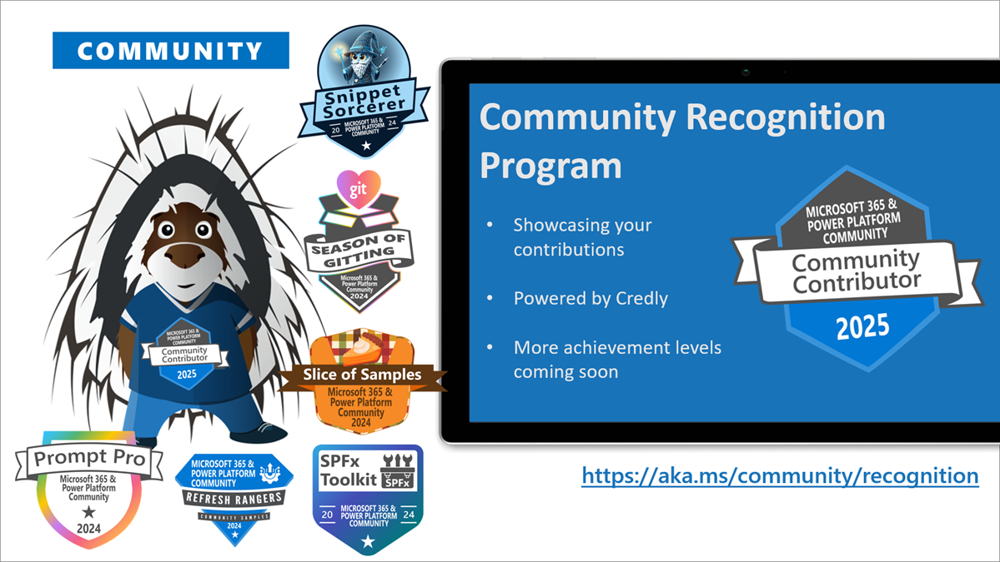

This is a weekly summary blog post of all the community activities such as community calls and presenters, newly uploaded videos, upcoming events and more 🚀
Get involved by joining a call! We host a variety of [community calls](https://aka.ms/community/calls) each week, where we demo solutions, announce new features and where you can connect with like-minded people. These calls are for everyone to join, simply download the recurrent invite and get involved.

Want to demo on what you have created or figured out with the out-of-the-box features? - absolutely welcome. [Volunteer for a demo spot](https://aka.ms/community/request/demo).

This is the agenda for the upcoming week:

### Copilot, Microsoft 365 & Power Platform product updates call - 11th of August

* Tuesday, 11th of August 2026, 8:00 AM PT / 4:00 PM GMT
* Download the [recurring invite](https://aka.ms/community/ms-speakers-call-invite) or [join the call](https://aka.ms/m365-dev-call-join) we'd love to see you in the call!
* If you can't make it this time, you can watch the recording of the call from the [Microsoft Community Learning YouTube channel](https://www.youtube.com/playlist?list=PLR9nK3mnD-OUQOW86tT5dkCRQAVGY7DlH)

Demos this time:

* [Joseph Jang](https://www.linkedin.com/in/joseph-jang-4975a5239/) - SharePointTemplates.com - One-Click SharePoint Site Provisioning with Sprocket 365
* [Vesa Juvonen](https://www.linkedin.com/in/vesajuvonen/) (Microsoft) - Building SharePoint Copilot Apps - My Day scenario

### Copilot, Microsoft 365 & Power Platform Community call - 13th of August

* Thursday, 13th of August 2026, 7:00 AM PT / 3:00 PM GMT
* Download the [recurring invite](https://aka.ms/community/m365-powerplat-call-invite) or [join the call](https://aka.ms/spdev-sig-call-join) we'd love to see you in the call!
* If you can't make it this time, you see the recording of the call from the [Microsoft 365 & Power Platform Community YouTube channel](https://www.youtube.com/watch?v=gAqUr9wa2_0&list=PLR9nK3mnD-OURfm5Ypu-wK52cxBv_gXCA)

Demos this time:

* [Sandeep PS](https://www.linkedin.com/in/sandeepps1299/) - A Curated Open-Source Resource Hub for the SharePoint Community
* [Tomi Tavela](https://www.linkedin.com/in/tomitavela/) - Introducing the AI Assistant in SP Editor
* [Ramin Ahmadi](https://www.linkedin.com/in/ahmadiramin/) - Bringing Work IQ to Viva Connections: An AI-Grounded Dashboard Card

**Interested on doing a demo?** - [Let us know](https://aka.ms/community/request/demo) and we'll get you scheduled!

---

## New videos

Update of the newly published videos in our YouTube channel

* [Get inspired with SharePoint Skills - the art of possible](https://www.youtube.com/watch?v=vQU_LWH1k1Y&pp=0gcJCaMLAYcqIYzv) by [Joe Komban](https://www.linkedin.com/in/kjoefrancis/)
* [Live-Linked Reports in SharePoint](https://www.youtube.com/watch?v=HkvFObyRr-w)
* [How I design reusable HTML reports in SharePoint with AI](https://www.youtube.com/watch?v=OJoOPsqvlvs&pp=0gcJCaMLAYcqIYzv)
* [Tips for working with EXTREMELY large files](https://www.youtube.com/watch?v=691OKCxIVIo)
* [Review Content Like a Panel of Experts with Copilot in SharePoint](https://www.youtube.com/watch?v=LWEPghw8zzk)
* [3 hidden Copilot in SharePoint tricks you should try](https://www.youtube.com/watch?v=KP1QIUwiwfg)
* [Generating page-grounded images in SharePoint with Microsoft Foundry's MAI-Image-2](https://www.youtube.com/watch?v=C1qHiLPQNgQ) by [Nello d'Andrea](https://www.linkedin.com/in/nello-d-andrea/) (die Mobiliar)
* [Introduction on extending Copilot Cowork](https://www.youtube.com/watch?v=EBohc3edEFU) by [April Dunnam](https://www.linkedin.com/in/aprildunnam/)
* [Building personalized widgets with SPFx for SharePoint Pages](https://www.youtube.com/watch?v=zYwKH0pgk04) by [Mike Fortgens](https://www.linkedin.com/in/mikefortgens/) (Ichicraft)
* [AI-Powered Compliance Document Management on SharePoint- SharePoint Hackathon](https://www.youtube.com/watch?v=Z3N9lmcOmrU) by [Zanda Pemba](https://www.linkedin.com/in/alexanderpemba/) (MATANGA)

[Power Platform](https://www.youtube.com/@mspowerplatform) - Subscribe today! ✅

* [Technical deep dive on modern agents and workflows in Copilot Studio](https://www.youtube.com/watch?v=CRBPxSzPc2c)
* [State Farm scales responsible AI with 3,000+ agents | Who’s Using Copilot Studio?](https://www.youtube.com/watch?v=y8n81AKUnXA)
* [How organizations are using AI agents featuring Almirall and LTM | Real-world agent case studies](https://www.youtube.com/watch?v=_QKUihHOmgk&pp=0gcJCaMLAYcqIYzv)
* [Inside the new agent and workflow harness | Copilot Studio Updates August 2026](https://www.youtube.com/watch?v=v7IA56HJU2E)
* [Optimize Power Automate flows for large data sets | Ask A Community Pro](https://www.youtube.com/watch?v=Q2UurR0nGDs)
* [G&J Pepsi-Cola bottlers empowers frontline sales with AI | Who’s Using Copilot Studio?](https://www.youtube.com/watch?v=KEGahzmOIvE&pp=0gcJCaMLAYcqIYzv)

[Microsoft 365 Developer](https://www.youtube.com/@Microsoft365Developer) - Subscribe today! ✅

* no new videos this week

## New Microsoft 365 Developer Blog posts

* no new blog posts this week

## New Microsoft 365 and Power Platform Community Blog posts

* [Why Every Microsoft 365 Tenant Should Review Mailbox Forwarding](https://pnp.github.io/blog/post/why-every-microsoft-365-tenant-should-review-mailbox-forwarding/) by [Josiah Opiyo](https://github.com/ojopiyo/)
* [Weekly Agenda - 3rd of August week](https://pnp.github.io/blog/weekly-agenda/26-08-03/) by [Luise Freese](https://github.com/LuiseFrees/)

---

## Last community call recordings published last week

Here are the last week's community call recordings. You can download recurrent invites to the community calls from https://aka.ms/community/calls.

* [Copilot, Microsoft 365 & Power Platform weekly call – 4th of August, 2026](https://www.youtube.com/watch?v=mMdhXrM3Ygk)
* [FOOD! Meals, Snacks, and Beverages: MGCI Community Call Event Training and Office Hours | July 2026](https://www.youtube.com/watch?v=aOJU9m2I9e4)
* [Copilot, Microsoft 365 & Power Platform community call – 30th of July, 2026](https://www.youtube.com/watch?v=9lhKvy5kHYc&pp=0gcJCaMLAYcqIYzv)

---

## Recognition

You already contributed? Great, we want to celebrate and recognize you! Opt in for our [community recognition program](https://pnp.github.io/recognitionprogram/) and earn badges from our various initiatives!

---

## Upcoming events

These are the main big ones for this and next semester - Do not miss out, it will be epic!

* [TechCon 365 - Atlanta](https://techcon365.com/Atlanta/) - August 11-15, 2025 - Atlanta, Georgia, USA
* [Power Platform Community Conference](https://powerplatformconf.com/) - October 28-30, 2025 - Las Vegas, Nevada, USA
* [Microsoft Ignite](https://ignite.microsoft.com/) - November 18-20, 2025 - San Francisco, California, USA
* [ESPC 2025](https://www.sharepointeurope.com/) - December 1-4, 2025 - Dublin, Ireland

Please take the opportunity to join these great conferences organized by the best community in tech across the world. There are online and in-person options. See more from [CommunityDays.org](https://www.communitydays.org/).

* [Community Summit Roadshow Toronto5 Days](https://communitydays.org/event/2026-08-11/community-summit-roadshow-toronto) - August 11, 2026
* [Microsoft Community Days Montreal](https://communitydays.org/event/2026-08-21/microsoft-community-days-montreal) - August 21, 2026
* [Global Security Bootcamp Adelaide 2026](https://communitydays.org/event/2026-08-22/global-security-bootcamp-adelaide-2026) - August 22, 2026
* [Seattle TechCon 365 | DATACON | PWRCON](https://communitydays.org/event/2026-08-24/seattle-techcon-365-or-datacon-or-pwrcon) - August 24, 2026
* [DynamicsCon Regional - Ohio Valley](https://communitydays.org/event/2026-08-25/dynamicscon-regional-ohio-valley) - August 25, 2026
* [Vancouver Microsoft 365 Summit](https://communitydays.org/event/2026-09-03/vancouver-microsoft-365-summit) - September 3, 2026
* [Shift Enter Summit 2026](https://communitydays.org/event/2026-09-04/shift-enter-summit-2026) - September 4, 2026
* [AI Community Conference - Hong Kong](https://communitydays.org/event/2026-09-04/ai-community-conference-hong-kong) - September 4, 2026
* [AICD - Shanghai](https://communitydays.org/event/2026-09-05/aicd-shanghai) - September 5, 2026
* [Nashville Microsoft Community Day](https://communitydays.org/event/2026-09-11/nashville-microsoft-community-day) - September 11, 2026
* [AI Community Conference - AICO DC](https://communitydays.org/event/2026-09-11/ai-community-conference-aico-dc) - September 11, 2026
* [M365 Con - DACH](https://communitydays.org/event/2026-09-14/m365-con-dach) - September 14, 2026
* [The AI-Native Workplace Summit 2026](https://communitydays.org/event/2026-09-16/the-ai-native-workplace-summit-2026) - September 16, 2026
* [London Tech Community Days - September 2026 In-person Skills WorkshopCancelled](https://communitydays.org/event/2026-09-16/london-tech-community-days-september-2026-in-person-skills-workshop) - September 16, 2026
* [HELish Summit](https://communitydays.org/event/2026-09-17/helish-summit) - September 17, 2026
* [M365 Twin Cities](https://communitydays.org/event/2026-09-18/m365-twin-cities) - September 18, 2026
* [Partner Vibe 2.0](https://communitydays.org/event/2026-09-21/partner-vibe-20) - September 21, 2026
* [CollabDays Bletchley Park 2026](https://communitydays.org/event/2026-09-23/collabdays-bletchley-park-2026) - September 23, 2026
* [aMP Day Montpellier 2026](https://communitydays.org/event/2026-09-24/amp-day-montpellier-2026) - September 24, 2026
* [Baltic Summit 2026](https://communitydays.org/event/2026-09-24/baltic-summit-2026) - September 24, 2026
* [AI Community Days Cebu](https://communitydays.org/event/2026-09-24/ai-community-days-cebu) - September 24, 2026
* [CollabDays Zagreb 2026](https://communitydays.org/event/2026-09-25/collabdays-zagreb-2026) - September 25, 2026
* [Microsoft 365 Ottawa 2026](https://communitydays.org/event/2026-09-25/microsoft-365-ottawa-2026) - September 25, 2026
* [AI Community Conference - AICO New Jersey](https://communitydays.org/event/2026-09-25/ai-community-conference-aico-new-jersey) - September 25, 2026
* [European Microsoft Fabric + SQL Community Conference 2026](https://communitydays.org/event/2026-09-28/european-microsoft-fabric-plus-sql-community-conference-2026) - October 1, 2026
* [Modern Work Conference Manila 2026](https://communitydays.org/event/2026-09-29/modern-work-conference-manila-2026) - September 29, 2026
* [Cloud and Datacenter Conference Germany](https://communitydays.org/event/2026-09-30/cloud-and-datacenter-conference-germany) - October 1, 2026
* [M365 TORONTO 2026](https://communitydays.org/event/2026-10-02/m365-toronto-2026) - October 2, 2026
* [North American Cloud & Collaboration Summit 2026](https://communitydays.org/event/2026-10-04/north-american-cloud-and-collaboration-summit-2026) - October 4, 2026
* [Devoxx](https://communitydays.orghttps://devoxx.be) - October 5, 2026
* [M365 Community Days Montréal #3-2026 – Microsoft 365 Copilot](https://communitydays.org/event/2026-10-07/m365-community-days-montreal-hash3-2026-microsoft-365-copilot) - October 7, 2026
* [Community Summit North America 2026](https://communitydays.org/event/2026-10-11/community-summit-north-america-2026) - October 11, 2026
* [AI Copilot Studio Agent Bootcamp](https://communitydays.org/event/2026-10-11/ai-copilot-studio-agent-bootcamp) - October 11, 2026
* [D365 + AI Governance & Access Control Summit NA Preconference](https://communitydays.org/event/2026-10-11/d365-plus-ai-governance-and-access-control-summit-na-preconference) - October 11, 2026
* [TechBash 2026](https://communitydays.org/event/2026-10-13/techbash-2026) - October 13, 2026
* [Fabric Day](https://communitydays.org/event/2026-10-14/fabric-day) - October 14, 2026
* [CognitionX Emirates 2026](https://communitydays.org/event/2026-10-14/cognitionx-emirates-2026) - October 14, 2026
* [CollabDays Portugal 2026 - Porto Edition](https://communitydays.org/event/2026-10-16/collabdays-portugal-2026-porto-edition) - October 16, 2026
* [CollabDays New England 2026](https://communitydays.org/event/2026-10-16/collabdays-new-england-2026) - October 16, 2026
* [Dynamics User Group Sweden - 20 October 2026](https://communitydays.org/event/2026-10-20/dynamics-user-group-sweden-20-october-2026) - October 20, 2026
* [AI Maitri Global Summit 2026](https://communitydays.org/event/2026-10-24/ai-maitri-global-summit-2026) - October 24, 2026
* [CollabDays Belgium 2026](https://communitydays.org/event/2026-10-24/collabdays-belgium-2026) - October 24, 2026
* [Power Platform Community Conference](https://communitydays.org/event/2026-10-27/power-platform-community-conference) - October 27, 2026
* [TechCon 365 Dallas](https://communitydays.org/event/2026-11-02/techcon-365-dallas) - November 2, 2026
* [AICD - Mumbai](https://communitydays.org/event/2026-11-07/aicd-mumbai) - November 7, 2026
* [Azure and Github Community Day](https://communitydays.org/event/2026-11-10/azure-and-github-community-day) - November 10, 2026
* [Update Conference Prague 2026](https://communitydays.org/event/2026-11-12/update-conference-prague-2026) - November 12, 2026
* [M365 Community Days Atlanta '26](https://communitydays.org/event/2026-11-14/m365-community-days-atlanta-26) - November 14, 2026
* [aMP Day Lyon 2026](https://communitydays.org/event/2026-11-17/amp-day-lyon-2026) - November 17, 2026
* [Community Summit Roadshow Denver](https://communitydays.org/event/2026-11-17/community-summit-roadshow-denver) - November 17, 2026
* [Workplace Ninjas India](https://communitydays.org/event/2026-11-27/workplace-ninjas-india) - November 27, 2026
* [ESPC26](https://communitydays.org/event/2026-11-30/espc26) - December 3, 2026
* [Community Summit Roadshow Ft. Lauderdale](https://communitydays.org/event/2026-12-01/community-summit-roadshow-ft-lauderdale) - December 1, 2026
* [Workplace Ninjas US 2027](https://communitydays.org/event/2027-01-11/workplace-ninjas-us-2027) - January 11, 2027
* [M365 Community Days Montréal #4-2026 – Sans gouvernance, pas d’IA](https://communitydays.org/event/2027-01-27/m365-community-days-montreal-hash4-2026-sans-gouvernance-pas-dia) - January 27, 2027
* [Knoxville Microsoft Community Days](https://communitydays.org/event/2027-02-25/knoxville-microsoft-community-days) - February 25, 2027
* [AI Agent and Copilot Summit NA 2027](https://communitydays.org/event/2027-03-30/ai-agent-and-copilot-summit-na-2027) - April 2, 2027
* [Microsoft 365 Community Conference](https://communitydays.org/event/2027-05-04/microsoft-365-community-conference) - May 4, 2027

