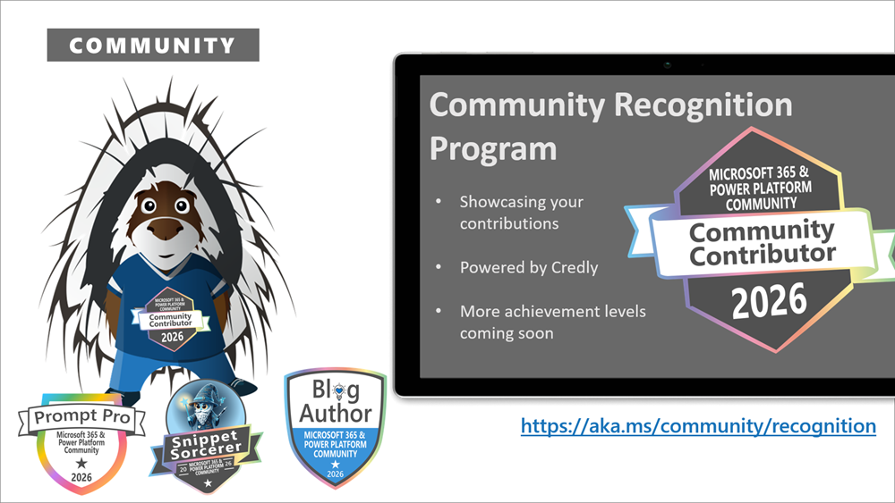

This is a weekly summary blog post of all the community activities such as community calls and presenters, newly uploaded videos, upcoming events and more 🚀
Get involved by joining a call! We host a variety of [community calls](https://aka.ms/community/calls) each week, where we demo solutions, announce new features and where you can connect with like-minded people. These calls are for everyone to join, simply download the recurrent invite and get involved.

Want to demo on what you have created or figured out with the out-of-the-box features? - absolutely welcome. [Volunteer for a demo spot](https://aka.ms/community/request/demo).

This is the agenda for the upcoming week:

### Copilot, Microsoft 365 & Power Platform product updates call - 8th of September

* Tuesday, 8th of September 2026, 8:00 AM PT / 4:00 PM GMT
* Download the [recurring invite](https://aka.ms/community/ms-speakers-call-invite) or [join the call](https://aka.ms/m365-dev-call-join) we'd love to see you in the call!
* If you can't make it this time, you can watch the recording of the call from the [Microsoft Community Learning YouTube channel](https://www.youtube.com/playlist?list=PLR9nK3mnD-OUQOW86tT5dkCRQAVGY7DlH)

Demos this time:

* [Rémi Dyon](https://www.linkedin.com/in/remidyon/) - Building Skills in the new Copilot studio experience
* [Fabian Williams](https://www.linkedin.com/in/fabiangwilliams/) - Ask Copilot how your agents are being used - Introduction to Insights Agent
* [Vesa Juvonen](https://www.linkedin.com/in/vesajuvonen/) - Creating Copilot Components with SPFx: How Does It Actually Work?

### Copilot, Microsoft 365 & Power Platform Community call - 10th of September

* Thursday, 10th of September 2026, 7:00 AM PT / 3:00 PM GMT
* Download the [recurring invite](https://aka.ms/community/m365-powerplat-call-invite) or [join the call](https://aka.ms/spdev-sig-call-join) we'd love to see you in the call!
* If you can't make it this time, you see the recording of the call from the [Microsoft 365 & Power Platform Community YouTube channel](https://www.youtube.com/watch?v=gAqUr9wa2_0&list=PLR9nK3mnD-OURfm5Ypu-wK52cxBv_gXCA)

Demos this time:

* [Marlon König](https://www.linkedin.com/in/marlon-koenig/) - Document Analysis in Practice: AI Builder vs. Content Understanding in a Real-World Customer Project
* [Sankalp Saoji](https://www.linkedin.com/in/sankalpsaoji98/) - From Insights to Action: Building a Power BI AI Agent with Microsoft Copilot Studio
* [Peter Paul Kirschner](https://www.linkedin.com/in/petkir/) - Integrating UI elements into Copilot with SPFx

**Interested on doing a demo?** - [Let us know](https://aka.ms/community/request/demo) and we'll get you scheduled!

---

## New videos

Videos published August 30 - September 5, 2026, including Shorts and livestream recordings.

[Microsoft Community Learning](https://www.youtube.com/@MicrosoftCommunityLearning) - Subscribe today! ✅

* [Transform Classic SharePoint Pages with Agents | SharePoint Modernization Demo](https://www.youtube.com/watch?v=palCQ7CQ8tw)
* [Creating a beautiful AI & Research Workspace Hub with out-of-box SharePoint](https://www.youtube.com/watch?v=UFYqLWBlRwY) by [Ezekiel Ibegbunam](https://www.linkedin.com/in/ezekiel-ibegbunam/)
* [Copilot, Microsoft 365 & Power Platform community call – 3rd of September, 2026](https://www.youtube.com/watch?v=pJjt48qvtP0) by [Ian Tweedie](https://www.linkedin.com/in/iantweedie/), [Katrina Frolkina](https://www.linkedin.com/in/katrinafrolkina) and [Elio Struyf](https://www.linkedin.com/in/estruyf/)
* [First Fridays AI for Communicators - How Microsoft Orchestrates Executive Social at Scale](https://www.youtube.com/watch?v=B0hNqEt0CRY) by [Joshua Luebke](https://www.linkedin.com/in/joshualuebke/) (Microsoft)
* [SharePoint + Viva Engage Just Got Better: One Post, Every Channel](https://www.youtube.com/watch?v=KVTcNSIvKBg) by [Reetik Chandra](https://www.linkedin.com/in/reetik-chandra/) (Microsoft) and [Vesa Juvonen](https://www.linkedin.com/in/vesajuvonen/) (Microsoft)
* [Process Mining + Copilot Studio: Stop Reading Dashboards, Start Asking Questions](https://www.youtube.com/watch?v=wsLrT2jzvOw) by [Elliot Margot](https://www.linkedin.com/in/elliot-margot-52742a156/) (Witivio)
* [Powerful Animations - VS Code Extension Updates for M365 and Power Apps](https://www.youtube.com/watch?v=leONo90-5us) by [David Warner](https://www.linkedin.com/in/davidwarnerii/) (Warner Digital)
* [Copilot, Microsoft 365 & Power Platform weekly call – 1st of September, 2026](https://www.youtube.com/watch?v=7BNIeQg06Tc) by [Remi Dyon](https://www.linkedin.com/in/remidyon/), [Scott Durow](https://www.linkedin.com/in/scottdurow/) and [Vesa Juvonen](https://www.linkedin.com/in/vesajuvonen/)
* [Announcing Copilot Apps - Build UX directly for Copilot canvas](https://www.youtube.com/watch?v=yTAux_FHklQ) by [Vesa Juvonen](https://www.linkedin.com/in/vesajuvonen) and [Bert Jansen](https://www.linkedin.com/in/bertjansen/)
* [SharePoint Flexible Sections just got better - Layout guides, grids & instant conversion](https://www.youtube.com/watch?v=93UqBZAeFo8) by [Katelyn Seemakurti](https://www.linkedin.com/in/katelynhelms/) (Microsoft) and [Vesa Juvonen](https://www.linkedin.com/in/vesajuvonen/) (Microsoft)
* [F1 to Copilot: What's next at Microsoft | Mondays at Microsoft (Episode 86)](https://www.youtube.com/watch?v=d8mS0_Aq4zE) by Heather Cook, Jonathan Jones and Michael Holste
* [Beyond Chat: How Copilot Components Bring Dynamic UX to Copilot Canvas (Project Portfolio Scenario)](https://www.youtube.com/watch?v=P5ByiiJ0W88) by [Vesa Juvonen](https://www.linkedin.com/in/vesajuvonen/) (Microsoft)
* [Using Copilot Cowork with MCP to build Power Automate flows](https://www.youtube.com/watch?v=FVlyxblMINw) by [John Liu](https://www.linkedin.com/in/johnnliu/) (Rapid Circle)

[Power Platform](https://www.youtube.com/@mspowerplatform) - Subscribe today! ✅

* [#CopilotStudio agent security 101](https://www.youtube.com/watch?v=FydaxyxxJpE)
* [Get ready for PPCC26 with Shane Young!](https://www.youtube.com/watch?v=JxTKj0aWh8A) by Shane Young
* [How IT can secure agents across the full lifecycle | EP03 | Agents Under Control](https://www.youtube.com/watch?v=jUSUyeK_Tqg) by Thomas Zou and Justin Tung
* [Power Apps | Product Weeks | PPCC26](https://www.youtube.com/watch?v=dPY4jJsw77I) by Leon Welicki and Tiffany Treacy
* [Power Apps gallery data with Keith Atherton | Ask a Community Pro](https://www.youtube.com/watch?v=gfp53eoWS0o) by [Keith Atherton](https://www.linkedin.com/in/keith-atherton/)

[Microsoft 365 Developer](https://www.youtube.com/@Microsoft365Developer) - Subscribe today! ✅

* [Microsoft Agent 365 - Governance #ai #agent #m365](https://www.youtube.com/watch?v=cfBEWskoHSA)
* [Microsoft Agent 365 - Observability #ai #agent #m365 #copilot](https://www.youtube.com/watch?v=etHFqle2SDs)
* [A2A (Agent-to-Agent) - one way to connect Work IQ #a2a #protocol #ai #agent](https://www.youtube.com/watch?v=s8QHR9JnjPQ)

## New Microsoft 365 Developer Blog posts

* [Building Agents for Teams: Managing the noise of collaboration](https://devblogs.microsoft.com/microsoft365dev/building-agents-for-teams-managing-the-noise-of-collaboration/) by Lily Du

## New Microsoft 365 and Power Platform Community Blog posts

* [SharePoint Advanced Management: Governance Before the Copilot Conversation](https://pnp.github.io/blog/post/sharepoint-advanced-management-governance-before-the-copilot-conversation/) by [Josiah Opiyo](https://github.com/ojopiyo/)
* [Taking Control of 'Add Shortcut to OneDrive' in SharePoint Online](https://pnp.github.io/blog/post/taking-control-of-add-shortcut-to-onedrive-in-sharepoint-online/) by [Josiah Opiyo](https://github.com/ojopiyo/)
* [CLI for Microsoft 365 v11.11](https://pnp.github.io/blog/cli-for-microsoft-365/cli-for-microsoft-365-v11-11/) by [Adam Wójcik](https://github.com/adam-it/)
* [Weekly Agenda - 31st of August week](https://pnp.github.io/blog/weekly-agenda/26-08-31/) by [Vesa Juvonen](https://github.com/VesaJuvonen/)
* [When a Simple Guest Account Cleanup Script Needed More Than a Code Review](https://pnp.github.io/blog/post/when-a-simple-guest-account-clean-up-script-needed-more-than-a-code-review/) by [Josiah Opiyo](https://github.com/ojopiyo/)

---

## Last community call recordings published last week

Here are the last week's community call recordings. You can download recurrent invites to the community calls from https://aka.ms/community/calls.

* [Copilot, Microsoft 365 & Power Platform community call – 3rd of September, 2026](https://www.youtube.com/watch?v=pJjt48qvtP0)
* [Copilot, Microsoft 365 & Power Platform weekly call – 1st of September, 2026](https://www.youtube.com/watch?v=7BNIeQg06Tc)

---

## Recognition

You already contributed? Great, we want to celebrate and recognize you! Opt in for our [community recognition program](https://pnp.github.io/recognitionprogram/) and earn badges from our various initiatives! 

---

## Upcoming events

These are the main big ones for this and next semester - Do not miss out, it will be epic!

* [Power Platform Community Conference](https://powerplatformconf.com/) - October 28-30, 2025 - Las Vegas, Nevada, USA
* [Microsoft Ignite](https://ignite.microsoft.com/) - November 18-20, 2025 - San Francisco, California, USA
* [ESPC 2025](https://www.sharepointeurope.com/) - December 1-4, 2025 - Dublin, Ireland

Please take the opportunity to join these great conferences organized by the best community in tech across the world. There are online and in-person options. See more from [CommunityDays.org](https://www.communitydays.org/).

* [Dev Days | Mumbai, India](https://communitydays.org/event/2026-09-05/dev-days-or-mumbai-india) - September 5, 2026
* [Orchard Harvest 2026 Online Conference](https://communitydays.org/event/2026-09-10/orchard-harvest-2026-online-conference) - September 10 - 11, 2026
* [Nashville Microsoft Community Day](https://communitydays.org/event/2026-09-11/nashville-microsoft-community-day) - September 11, 2026
* [AI Community Conference - AICO DC](https://communitydays.org/event/2026-09-11/ai-community-conference-aico-dc) - September 11, 2026
* [M365 Con - DACH](https://communitydays.org/event/2026-09-14/m365-con-dach) - September 14 - 18, 2026
* [The AI-Native Workplace Summit 2026](https://communitydays.org/event/2026-09-16/the-ai-native-workplace-summit-2026) - September 16, 2026
* [London Tech Community Days - September 2026 In-person Skills Workshop](https://communitydays.org/event/2026-09-16/london-tech-community-days-september-2026-in-person-skills-workshop) - September 16, 2026 - Cancelled
* [HELish Summit](https://communitydays.org/event/2026-09-17/helish-summit) - September 17, 2026
* [M365 Twin Cities](https://communitydays.org/event/2026-09-18/m365-twin-cities) - September 18, 2026
* [Partner Vibe 2.0](https://communitydays.org/event/2026-09-21/partner-vibe-20) - September 21 - 23, 2026
* [CollabDays Bletchley Park 2026](https://communitydays.org/event/2026-09-23/collabdays-bletchley-park-2026) - September 23, 2026
* [MCT Africa Tech Summit](https://communitydays.org/event/2026-09-24/mct-africa-tech-summit) - September 24 - 25, 2026
* [aMP Day Montpellier 2026](https://communitydays.org/event/2026-09-24/amp-day-montpellier-2026) - September 24, 2026
* [Baltic Summit 2026](https://communitydays.org/event/2026-09-24/baltic-summit-2026) - September 24 - 26, 2026
* [AI Community Days Cebu](https://communitydays.org/event/2026-09-24/ai-community-days-cebu) - September 24, 2026
* [CollabDays Zagreb 2026](https://communitydays.org/event/2026-09-25/collabdays-zagreb-2026) - September 25, 2026
* [Microsoft 365 Ottawa 2026](https://communitydays.org/event/2026-09-25/microsoft-365-ottawa-2026) - September 25, 2026
* [AI Community Conference - AICO New Jersey](https://communitydays.org/event/2026-09-25/ai-community-conference-aico-new-jersey) - September 25, 2026
* [European Microsoft Fabric + SQL Community Conference 2026](https://communitydays.org/event/2026-09-28/european-microsoft-fabric-plus-sql-community-conference-2026) - September 28 - October 1, 2026
* [Modern Work Conference Manila 2026](https://communitydays.org/event/2026-09-29/modern-work-conference-manila-2026) - September 29, 2026
* [Cloud and Datacenter Conference Germany](https://communitydays.org/event/2026-09-30/cloud-and-datacenter-conference-germany) - September 30 - October 1, 2026
* [M365 TORONTO 2026](https://communitydays.org/event/2026-10-02/m365-toronto-2026) - October 2, 2026
* [North American Cloud & Collaboration Summit 2026](https://communitydays.org/event/2026-10-04/north-american-cloud-and-collaboration-summit-2026) - October 4 - 6, 2026
* [M365 Community Days Montréal #3-2026 – Microsoft 365 Copilot](https://communitydays.org/event/2026-10-07/m365-community-days-montreal-hash3-2026-microsoft-365-copilot) - October 7, 2026
* [Community Summit North America 2026](https://communitydays.org/event/2026-10-11/community-summit-north-america-2026) - October 11 - 15, 2026
* [AI Copilot Studio Agent Bootcamp](https://communitydays.org/event/2026-10-11/ai-copilot-studio-agent-bootcamp) - October 11, 2026
* [D365 + AI Governance & Access Control Summit NA Preconference](https://communitydays.org/event/2026-10-11/d365-plus-ai-governance-and-access-control-summit-na-preconference) - October 11, 2026
* [TechBash 2026](https://communitydays.org/event/2026-10-13/techbash-2026) - October 13 - 16, 2026
* [Fabric Day](https://communitydays.org/event/2026-10-14/fabric-day) - October 14, 2026
* [CognitionX Emirates 2026](https://communitydays.org/event/2026-10-14/cognitionx-emirates-2026) - October 14 - 15, 2026
* [CollabDays Portugal 2026 - Porto Edition](https://communitydays.org/event/2026-10-16/collabdays-portugal-2026-porto-edition) - October 16, 2026
* [CollabDays New England 2026](https://communitydays.org/event/2026-10-16/collabdays-new-england-2026) - October 16, 2026
* [Dynamics User Group Sweden - 20 October 2026](https://communitydays.org/event/2026-10-20/dynamics-user-group-sweden-20-october-2026) - October 20, 2026
* [Austrian Power Platform Enthusiasts Community Day 2026](https://communitydays.org/event/2026-10-23/austrian-power-platform-enthusiasts-community-day-2026) - October 23, 2026
* [AI Maitri Global Summit 2026](https://communitydays.org/event/2026-10-24/ai-maitri-global-summit-2026) - October 24 - 25, 2026
* [CollabDays Belgium 2026](https://communitydays.org/event/2026-10-24/collabdays-belgium-2026) - October 24, 2026
* [Power Platform Community Conference](https://communitydays.org/event/2026-10-27/power-platform-community-conference) - October 27 - 30, 2026
* [TechCon 365 Dallas](https://communitydays.org/event/2026-11-02/techcon-365-dallas) - November 2 - 6, 2026
* [Microsoft 365 Live](https://communitydays.org/event/2026-11-04/microsoft-365-live) - November 4 - 7, 2026
* [Azure and Github Community Day](https://communitydays.org/event/2026-11-10/azure-and-github-community-day) - November 10, 2026
* [Update Conference Prague 2026](https://communitydays.org/event/2026-11-12/update-conference-prague-2026) - November 12 - 13, 2026
* [AI Community Conference - Toronto 2026](https://communitydays.org/event/2026-11-13/ai-community-conference-toronto-2026) - November 13, 2026
* [AI Community Conference - Boston 2026](https://communitydays.org/event/2026-11-13/ai-community-conference-boston-2026) - November 13, 2026
* [M365 Community Days Atlanta '26](https://communitydays.org/event/2026-11-14/m365-community-days-atlanta-26) - November 14, 2026
* [aMP Day Lyon 2026](https://communitydays.org/event/2026-11-17/amp-day-lyon-2026) - November 17, 2026
* [Community Summit Roadshow Denver](https://communitydays.org/event/2026-11-17/community-summit-roadshow-denver) - November 17, 2026
* [AICD - Mumbai](https://communitydays.org/event/2026-11-21/aicd-mumbai) - November 21, 2026
* [.NET Africa Conference 2026](https://communitydays.org/event/2026-11-24/dotnet-africa-conference-2026) - November 24 - 26, 2026
* [Workplace Ninjas India](https://communitydays.org/event/2026-11-27/workplace-ninjas-india) - November 27 - 28, 2026
* [ESPC26](https://communitydays.org/event/2026-11-30/espc26) - November 30 - December 3, 2026
* [Community Summit Roadshow Ft. Lauderdale](https://communitydays.org/event/2026-12-01/community-summit-roadshow-ft-lauderdale) - December 1, 2026
* [Workplace Ninjas US 2027](https://communitydays.org/event/2027-01-11/workplace-ninjas-us-2027) - January 11 - 13, 2027
* [M365 Community Days Montréal #4-2026 – Sans gouvernance, pas d’IA](https://communitydays.org/event/2027-01-27/m365-community-days-montreal-hash4-2026-sans-gouvernance-pas-dia) - January 27, 2027
* [Knoxville Microsoft Community Days](https://communitydays.org/event/2027-02-25/knoxville-microsoft-community-days) - February 25 - 26, 2027
* [AI Agent and Copilot Summit NA 2027](https://communitydays.org/event/2027-03-30/ai-agent-and-copilot-summit-na-2027) - March 30 - April 1, 2027
* [Exchange & Security Summit 2027](https://communitydays.org/event/2027-04-13/exchange-and-security-summit-2027) - April 13 - 14, 2027
* [Microsoft 365 Community Conference](https://communitydays.org/event/2027-05-04/microsoft-365-community-conference) - May 4 - 6, 2027
