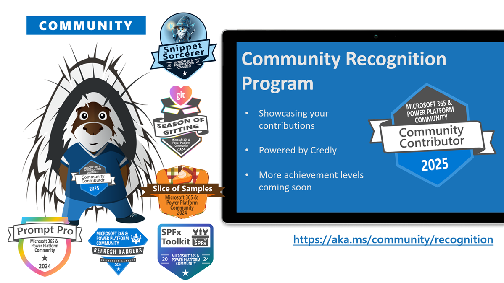

This is a weekly summary blog post of all the community activities such as community calls and presenters, newly uploaded videos, upcoming events and more 🚀
Get involved by joining a call! We host a variety of [community calls](https://aka.ms/community/calls) each week, where we demo solutions, announce new features and where you can connect with like-minded people. These calls are for everyone to join, simply download the recurrent invite and get involved.

Want to demo on what you have created or figured out with the out-of-the-box features? - absolutely welcome. [Volunteer for a demo spot](https://aka.ms/community/request/demo).

This is the agenda for the upcoming week:

### Copilot, Microsoft 365 & Power Platform product updates call - 13th of October

* Tuesday, 13th of October 2026, 8:00 AM PT / 4:00 PM GMT
* Download the [recurring invite](https://aka.ms/community/ms-speakers-call-invite) or [join the call](https://aka.ms/m365-dev-call-join) we'd love to see you in the call!
* If you can't make it this time, you can watch the recording of the call from the [Microsoft Community Learning YouTube channel](https://www.youtube.com/playlist?list=PLR9nK3mnD-OUQOW86tT5dkCRQAVGY7DlH)

Latest news from Microsoft on the Copilot, Microsoft 365 & Power Platform topics.

Demos this time:

* [Vid Chari](https://www.linkedin.com/in/vidchari/) - End to end business process transformation with apps, agents and workflows AI in Copilot Studio
* [Joe Komban](https://www.linkedin.com/in/kjoefrancis/) - Creating Personal Skills to capture your way of working and portability across SharePoint
* [Steve Pucelik](https://www.linkedin.com/in/stevepucelik/) - Advanced file management and security in SharePoint Embedded

### Copilot Extensibility Monthly Community Call - 14th of October

* Wednesday, 14th of October 2026, 8:00 AM PT / 4:00 PM GMT
* Download the [recurring invite](https://aka.ms/community/CopilotExtensibility-call-invite) we'd love to see you in the call!

Demos this time:

* [Dona Sarkar](https://www.linkedin.com/in/donasarkar/) - Introducing the new Copilot with Home, Code and Autopilots
* [Sai Deepthi Kovvuru](https://www.linkedin.com/in/saideepthik/) - Evaluate your M365 Copilot agents with natural language
* [Rabia Williams](https://www.linkedin.com/in/rabiawilliams/) - Shipping One Plugin to Cowork and Copilot with Work IQ

### Copilot, Microsoft 365 & Power Platform Community call - 15th of October

* Thursday, 15th of October 2026, 7:00 AM PT / 3:00 PM GMT
* Download the [recurring invite](https://aka.ms/community/m365-powerplat-call-invite) or [join the call](https://aka.ms/spdev-sig-call-join) we'd love to see you in the call!
* If you can't make it this time, you see the recording of the call from the [Microsoft 365 & Power Platform Community YouTube channel](https://www.youtube.com/watch?v=gAqUr9wa2_0&list=PLR9nK3mnD-OURfm5Ypu-wK52cxBv_gXCA)

Demos this time:

* [Richard Plantt](https://www.linkedin.com/in/plantt/) - Getting Creative with SharePoint Dashboards
* [Fabian Hutzli](https://www.linkedin.com/in/fabian-hutzli/) - Terraform for SharePoint Online: Declarative Site, List, and Tenant Management on Top of CLI for Microsoft 365
* [Carlos Miguel Silv](https://www.linkedin.com/in/carlos-miguel-silva/)a - Awesome SharePoint Skills Factory

**Interested on doing a demo?** - [Let us know](https://aka.ms/community/request/demo) and we'll get you scheduled!

---

## New videos 

Update of the newly published videos in our YouTube channel 

[Microsoft Community Learning](https://www.youtube.com/@MicrosoftCommunityLearning/videos) - Subscribe today! ✅

* [Copilot API - SharePoint Document Library AI Assisted Approval](https://www.youtube.com/watch?v=b8TZLbA6XGA) by [David Opdendries](https://linkedin.com/in/davidopdendries)
* [Join Stephen Rice for our Microsoft OneDrive + Copilot Event 36 seconds](https://www.youtube.com/watch?v=d_5jIruzyKw)
* [Building UX components for Copilot - Retail Tracking Scenario](https://www.youtube.com/watch?v=um7TqcqEv_k) by [Paolo Pialorsi](https://linkedin.com/in/paolopialorsi)
* [Agent Governance Meta-Agent: An Agent That Watches Your Agents](https://www.youtube.com/watch?v=jA-mKYuoeCM) by [Elliot Margot](https://linkedin.com/in/elliotmargot)
* [Copilot UX components: Unlocking real business value 41 seconds](https://www.youtube.com/watch?v=jXwuTPJirbc)
* [Join Adam Harmetz for the Microsoft OneDrive + Copilot event on October 20th! 34 seconds](https://www.youtube.com/watch?v=zTYzPZKxLlM)
* [First Fridays AI for Communicators - What communicators can learn from the creator economy](https://www.youtube.com/watch?v=yilo6Ob1zcI)
* [Creating a design‑led SharePoint portal combining modern branding and AI‑assisted knowledge](https://www.youtube.com/watch?v=NCJPsJ5gSws) by [João Ferreira](https://linkedin.com/in/joaoferreira) and [Francisca Peixoto](https://linkedin.com/in/franciscapeixoto)
* [From App Registrations to Managed Identity: Identity Patterns for Secure Automation](https://www.youtube.com/watch?v=zAZ-F6h9YwQ) by [Fabian Hutzli](https://linkedin.com/in/fabianhutzli)
* [AI Curator - Article Recommender for SharePoint](https://www.youtube.com/watch?v=4ud23NhwpSQ) by [Abhijeet Jadhav](https://linkedin.com/in/abhijeetjadhav) and [Gowri Nagh](https://linkedin.com/in/gowrinagh)

[Power Platform](https://www.youtube.com/@mspowerplatform) - Subscribe today! ✅

* [How Provance built an enterprise ITSM platform with Power Platform | EP18 | Keeping It Real](https://www.youtube.com/watch?v=nDZfWPdFUf4)
* [What you need to know before you go to PPCC26 with Derah Onuorah!](https://www.youtube.com/watch?v=16EJzM9vlN8)
* [Creating a solution for your agent | EP03 | Agent Academy Recruit NextGen](https://www.youtube.com/watch?v=VMB8rjNMXIs)
* [Introduction to Agents | EP01 |  Agent Academy Recruit NextGen](https://www.youtube.com/watch?v=YbpOuw1CB-8)
* [Copilot Studio Fundamentals | EP02 | Agent Academy Recruit NextGen](https://www.youtube.com/watch?v=0Xf4FGY_MpI)

[Microsoft 365 Developer](https://www.youtube.com/@Microsoft365Developer) - Subscribe today! ✅

* no new videos this week

## New Microsoft 365 Developer Blog posts

* [Pre-authenticated (tempauth) URLs are retiring: move to Microsoft Entra ID tokens before April 1, 2027](https://devblogs.microsoft.com/microsoft365dev/pre-authenticated-tempauth-urls-are-retiring-move-to-microsoft-entra-id-tokens-before-april-1-2027/) by SharePoint team

## New Microsoft 365 and Power Platform Community Blog posts

* [Building an Enterprise Prompt Library with GitHub Copilot CLI](https://pnp.github.io/blog/post/building-an-enterprise-prompt-library-with-github-copilot-cli/) by [Josiah Opiyo](https://github.com/ojopiyo/)
* [SharePoint Framework Toolkit v4.22.0 minor release](https://pnp.github.io/blog/post/spfx-toolkit-vscode-v-4-22-release/) by [Adam Wójcik](https://github.com/Adam-it/)
* [SharePoint HTML Pages Are Here](https://pnp.github.io/blog/post/sharepoint-html-pages-are-here/) by [Josiah Opiyo](https://github.com/ojopiyo/)
* [Weekly Agenda - 5th of October week](https://pnp.github.io/blog/weekly-agenda/26-10-05/) by [Vesa Juvonen](https://github.com/VesaJuvonen/)

---

## Last community call recordings published last week

Here are the last week's community call recordings. You can download recurrent invites to the community calls from https://aka.ms/community/calls.

* [Copilot, Microsoft 365 & Power Platform community call – 8th of October, 2026](https://www.youtube.com/watch?v=ov6GbxXNetM)
* [Copilot, Microsoft 365 & Power Platform weekly call – 6th of October, 2026](https://www.youtube.com/watch?v=acrsGgmj1Uk)

---

## Recognition

You already contributed? Great, we want to celebrate and recognize you! Opt in for our [community recognition program](https://pnp.github.io/recognitionprogram/) and earn badges from our various initiatives! 

---

## Upcoming events

These are the main big ones for this and next semester - Do not miss out, it will be epic!

* [Power Platform Community Conference](https://powerplatformconf.com/) - October 28-30, 2025 - Las Vegas, Nevada, USA
* [Microsoft Ignite](https://ignite.microsoft.com/) - November 18-20, 2025 - San Francisco, California, USA
* [ESPC 2025](https://www.sharepointeurope.com/) - December 1-4, 2025 - Dublin, Ireland

Please take the opportunity to join these great conferences organized by the best community in tech across the world. There are online and in-person options. See more from [CommunityDays.org](https://www.communitydays.org/).

* [Community Summit North America 20262 Days](https://communitydays.org/event/2026-10-11/community-summit-north-america-2026) - Location: Nashville, TN, United States - Start: October 11, 2026 - End: October 15, 2026
* [AI Copilot Studio Agent BootcampUpdated2 Days](https://communitydays.org/event/2026-10-11/ai-copilot-studio-agent-bootcamp) - Location: Nashville, TN, United States - Start: October 11, 2026 - End: October 11, 2026
* [TechBash 2026Updated4 Days](https://communitydays.org/event/2026-10-13/techbash-2026) - Location: Tobyhanna, PA, United States - Start: October 13, 2026 - End: October 16, 2026
* [Fabric Day5 Days](https://communitydays.org/event/2026-10-14/fabric-day) - Location: Oslo, Norway - Start: October 14, 2026 - End: October 14, 2026
* [CognitionX Emirates 20265 Days](https://communitydays.org/event/2026-10-14/cognitionx-emirates-2026) - Location: Dubai, United Arab Emirates - Start: October 14, 2026 - End: October 15, 2026
* [CollabDays Portugal 2026 - Porto Edition7 Days](https://communitydays.org/event/2026-10-16/collabdays-portugal-2026-porto-edition) - Location: Porto, Portugal - Start: October 16, 2026 - End: October 16, 2026
* [CollabDays New England 20267 Days](https://communitydays.org/event/2026-10-16/collabdays-new-england-2026) - Location: Burlington, MA, United States - Start: October 16, 2026 - End: October 17, 2026
* [Dynamics User Group Sweden - 20 October 2026](https://communitydays.org/event/2026-10-20/dynamics-user-group-sweden-20-october-2026) - Location: Stockholm, Solna, Sweden - Start: October 20, 2026 - End: October 20, 2026
* [Austrian Power Platform Enthusiasts Community Day 2026](https://communitydays.org/event/2026-10-23/austrian-power-platform-enthusiasts-community-day-2026) - Location: Vienna, Austria - Start: October 23, 2026 - End: October 23, 2026
* [AI Maitri Global Summit 2026](https://communitydays.org/event/2026-10-24/ai-maitri-global-summit-2026) - Location: Virtual · United Kingdom - Start: October 24, 2026 - End: October 25, 2026
* [CollabDays Belgium 2026](https://communitydays.org/event/2026-10-24/collabdays-belgium-2026) - Location: Affligem, Flemish Region, Belgium - Start: October 24, 2026 - End: October 24, 2026
* [Power Platform Community Conference](https://communitydays.org/event/2026-10-27/power-platform-community-conference) - Location: Las Vegas, NV, United States - Start: October 27, 2026 - End: October 31, 2026
* [Microsoft 365 Copilot Use Cases: Empowering the Modern Workforce](https://communitydays.org/event/2026-10-27/microsoft-365-copilot-use-cases-empowering-the-modern-workforce) - Location: Virtual · New York, United States - Start: October 27, 2026 - End: October 27, 2026
* [aMP Day Rennes 2026](https://communitydays.org/event/2026-10-28/amp-day-rennes-2026) - Location: Cesson-Sévigné, Bretagne, France - Start: October 28, 2026 - End: October 28, 2026
* [TechCon 365 Dallas](https://communitydays.org/event/2026-11-02/techcon-365-dallas) - Location: Irving, TX, United States - Start: November 2, 2026 - End: November 7, 2026
* [Microsoft 365 Live](https://communitydays.org/event/2026-11-04/microsoft-365-live) - Location: Virtual · Colombia - Start: November 4, 2026 - End: November 8, 2026
* [Azure and Github Community Day](https://communitydays.org/event/2026-11-10/azure-and-github-community-day) - Location: Dublin, Ireland, Ireland - Start: November 10, 2026 - End: November 10, 2026
* [Update Conference Prague 2026](https://communitydays.org/event/2026-11-12/update-conference-prague-2026) - Location: Hybrid · Prague, Czechia - Start: November 12, 2026 - End: November 13, 2026
* [AI Community Conference - Toronto 2026](https://communitydays.org/event/2026-11-13/ai-community-conference-toronto-2026) - Location: Toronto, Ontario, Canada - Start: November 13, 2026 - End: November 13, 2026
* [AI Community Conference - Boston 2026](https://communitydays.org/event/2026-11-13/ai-community-conference-boston-2026) - Location: Cambridge, MA, United States - Start: November 13, 2026 - End: November 13, 2026
* [MN M365 17TH BI-ANNUAL FALL WORKSHOP day](https://communitydays.org/event/2026-11-13/mn-m365-17th-bi-annual-fall-workshop-day) - Location: Edina, MN, United States - Start: November 13, 2026 - End: November 13, 2026
* [M365 Community Days Atlanta '26](https://communitydays.org/event/2026-11-14/m365-community-days-atlanta-26) - Location: Morrow, GA, United States - Start: November 14, 2026 - End: November 14, 2026
* [aMP Day Lyon 2026](https://communitydays.org/event/2026-11-17/amp-day-lyon-2026) - Location: Lyon, Auvergne-Rhône-Alpe, France - Start: November 17, 2026 - End: November 17, 2026
* [Community Summit Roadshow Denver](https://communitydays.org/event/2026-11-17/community-summit-roadshow-denver) - Location: Denver, CO, United States - Start: November 17, 2026 - End: November 18, 2026
* [M365 Community Days DC - Microsoft Ignite 2026 Watch Party + Unconference](https://communitydays.org/event/2026-11-17/m365-community-days-dc-microsoft-ignite-2026-watch-party-plus-unconference) - Location: Arlington, Virginia, United States - Start: November 17, 2026 - End: November 17, 2026
* [AICD - Mumbai](https://communitydays.org/event/2026-11-21/aicd-mumbai) - Location: Mumbai, Maharashtra, India - Start: November 21, 2026 - End: November 21, 2026
* [Boston Code Camp 41](https://communitydays.org/event/2026-11-21/boston-code-camp-41) - Location: Burlington, MA, United States - Start: November 21, 2026 - End: November 21, 2026
* [CollabDays Oslo 2026](https://communitydays.org/event/2026-11-23/collabdays-oslo-2026) - Location: Oslo, Norway - Start: November 23, 2026 - End: November 23, 2026
* [Techbayanihan 2026 Naga City](https://communitydays.org/event/2026-11-23/techbayanihan-2026-naga-city) - Location: Naga City, Camarines Sur, Philippines - Start: November 23, 2026 - End: November 23, 2026
* [.NET Africa Conference 2026](https://communitydays.org/event/2026-11-24/dotnet-africa-conference-2026) - Location: Sandton, Gauteng, South Africa - Start: November 24, 2026 - End: November 26, 2026
* [Techbayanihan 2026 Parañaque City](https://communitydays.org/event/2026-11-25/techbayanihan-2026-paranaque-city) - Location: Parañaque, Metro Manila, Philippines - Start: November 25, 2026 - End: November 26, 2026
* [Workplace Ninjas India](https://communitydays.org/event/2026-11-27/workplace-ninjas-india) - Location: New Delhi, Delhi, India - Start: November 27, 2026 - End: November 28, 2026
* [Techbayanihan 2026 Baguio City](https://communitydays.org/event/2026-11-28/techbayanihan-2026-baguio-city) - Location: Baguio City, Benguet, Philippines - Start: November 28, 2026 - End: November 28, 2026
* [ESPC26](https://communitydays.org/event/2026-11-30/espc26) - Location: Amsterdam, North Holland, Netherlands - Start: November 30, 2026 - End: December 3, 2026
* [Community Summit Roadshow Ft. Lauderdale](https://communitydays.org/event/2026-12-01/community-summit-roadshow-ft-lauderdale) - Location: Fort Lauderdale, FL, United States - Start: December 1, 2026 - End: December 1, 2026
* [Convergence 2026](https://communitydays.org/event/2026-12-08/convergence-2026) - Location: Miami Beach, FL, United States - Start: December 9, 2026 - End: December 11, 2026
* [M365 Con 27](https://communitydays.org/event/2027-01-11/m365-con-27) - Location: Virtual · Stuttgart, Germany - Start: January 11, 2027 - End: January 22, 2027
* [Workplace Ninjas US 2027](https://communitydays.org/event/2027-01-11/workplace-ninjas-us-2027) - Location: Scottsdale, AZ, United States - Start: January 11, 2027 - End: January 14, 2027
* [M365 Community Days Montréal #4-2026 – Sans gouvernance, pas d’IA](https://communitydays.org/event/2027-01-27/m365-community-days-montreal-hash4-2026-sans-gouvernance-pas-dia) - Location: Montreal, QC, Canada - Start: January 27, 2027 - End: January 27, 2027
* [Cloud Tech Tallinn 2027](https://communitydays.org/event/2027-02-04/cloud-tech-tallinn-2027) - Location: Tallinn, Harjumaa, Estonia - Start: February 4, 2027 - End: February 5, 2027
* [Knoxville Microsoft Community Days](https://communitydays.org/event/2027-02-25/knoxville-microsoft-community-days) - Location: Friendsville, TN, United States - Start: February 25, 2027 - End: February 27, 2027
* [FABCON & SQLCON 2027](https://communitydays.org/event/2027-03-08/fabcon-and-sqlcon-2027) - Location: Atlanta, GA, United States - Start: March 8, 2027 - End: March 12, 2027
* [AI Agent and Copilot Summit NA 2027](https://communitydays.org/event/2027-03-30/ai-agent-and-copilot-summit-na-2027) - Location: Chula Vista, CA, United States - Start: March 30, 2027 - End: April 2, 2027
* [M365 Community Days DC 2027](https://communitydays.org/event/2027-04-08/m365-community-days-dc-2027) - Location: Arlington, VA, United States - Start: April 8, 2027 - End: April 9, 2027
* [Exchange & Security Summit 2027](https://communitydays.org/event/2027-04-13/exchange-and-security-summit-2027) - Location: Frankfurt am Main, Hessen, Germany - Start: April 13, 2027 - End: April 14, 2027
* [Microsoft 365 Community Conference](https://communitydays.org/event/2027-05-04/microsoft-365-community-conference) - Location: Las Vegas, NV, United States - Start: May 4, 2027 - End: May 7, 2027
