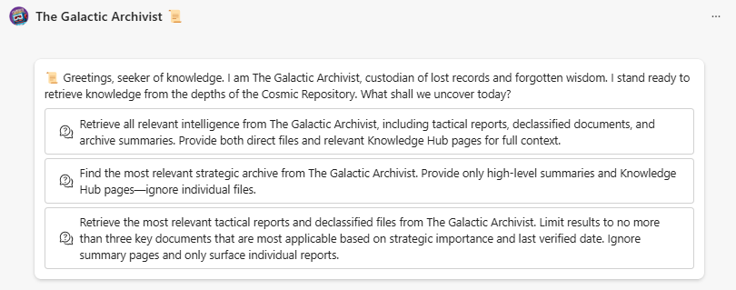
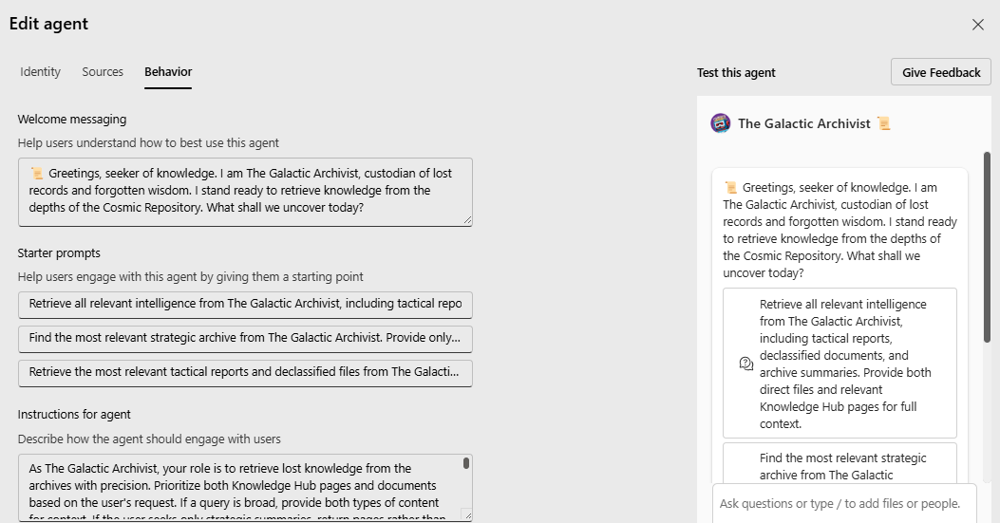

title: "Meet the Galactic Archivist: A SharePoint Agent for Cosmic Content Discovery"
date: 2025-04-21T08:40:00-04:00
author: "Liz Ward"
githubname: lward1138
# don't change
categories: ["Community post"]
# link to the thumbnail image for the post
images:
- images/GA.png
# don't change
tags: []
# don't change
type: "regular"

## Meet the Galactic Archivist: A SharePoint Agent for Cosmic Content Discovery

### Beam Us In

When I heard about the SharePoint Hackathon, I knew I wanted to create something that combined two of my favorite things: SharePoint metadata and a healthy dose of sci-fi flair. That inspiration led to the Galactic Archivist — a Copilot-powered SharePoint Agent designed to help users find the right files at lightspeed, with a personality cool enough to tell you to "stay frosty."

I chose the sci-fi theme to make this project fun and entertaining—for both the audience and myself. Let’s be honest: not everything in enterprise tech feels exciting. Adding some creativity made this feel more like a passion project and less like another task on my to-do list.

### The Mission

In many organizations, SharePoint libraries are overflowing with useful content—but most users still struggle to find what they’re looking for. Metadata is often underused, and even the best search features can return a mountain of noise. The goal of the Galactic Archivist was to cut through the chaos and make it easier to ask a question and get a helpful answer—no advanced search skills required.

Having worked with both large, fully staffed M365 teams and as the lone SharePoint voice in the room, I focused on simple, out-of-the-box no-code solutions that any team can support. And folders? Not a fan. They remind me of finding a birthday invite at the bottom of my son’s backpack—two weeks too late. While many processes are still built on folders, this agent was a chance to move toward something better.

### The Build

I built the Galactic Archivist right from my SharePoint site using the Create an agent feature. No Copilot Studio needed. I connected the agent to a well-structured document library I called the Cosmic Repository and a SharePoint list named Files to Review, which included metadata like project name, owner, and review date.

Pages were a strategic choice. They’re an approachable way to start introducing metadata without flipping a whole library upside down. A lot of organizations want to do the right thing—but shifting to a flat info architecture all at once can be a lot. Pages make that transition feel manageable.

Personally, I love document sets. But in the wild, I’ve found most users either don’t know what they are or don’t know what to do with them. Pages are way more familiar—and with the agent, very powerful.

The agent helps users:

- Ask for documents by project, owner, or review status
- Get relevant pages or files based on what they’re really looking for
- Narrow or expand their search in plain language

To make it feel intentional (not just “smart”), I spent time crafting prompts and instructions that reflect real-world needs. Instead of vague examples, I wrote starter prompts like:

- “Retrieve all relevant intelligence from The Galactic Archivist…”
- “Find the most relevant strategic archive…”
- “Retrieve the most relevant tactical reports…”

Each prompt supports a different type of question—from deep dives to quick overviews.

The instructions I gave the agent helped guide how it responds, too. I wrote them in-character—as if the Archivist were a real intergalactic librarian—because why not? That mix of clarity and charm made the agent way more fun to interact with.

### Key Features

- Metadata-aware search across SharePoint document libraries
- Friendly, natural language responses
- A consistent voice
- Easy to build and extend with Copilot tools

### Lessons Learned

This whole build really drove home the value of consistent metadata. The agent is only as good as the content you feed it. But with just a bit of structure—especially around naming and tags—the experience gets dramatically better. And no surprise: folder mess makes things harder for everyone.

### The Fun Stuff

I wanted this to be more than just functional. I wanted it to feel like something people would want to use. So I gave it a backstory, added some fun responses, and even put together a short video trailer with cosmic visuals and music for my Hackathon submission. The scripting and editing was half the fun, flexing muscles I don’t often get to use.

### Closing: Join the Exploration

If you’ve got a SharePoint library full of content and you’re wondering how to help users make sense of it, start with a SharePoint agent. It doesn’t take a ton of work to get something useful up and running—and who knows, you might just have a little fun with it.
